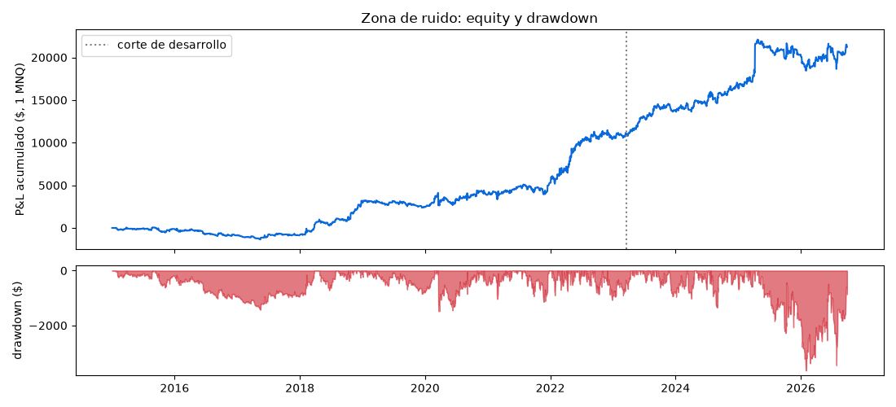
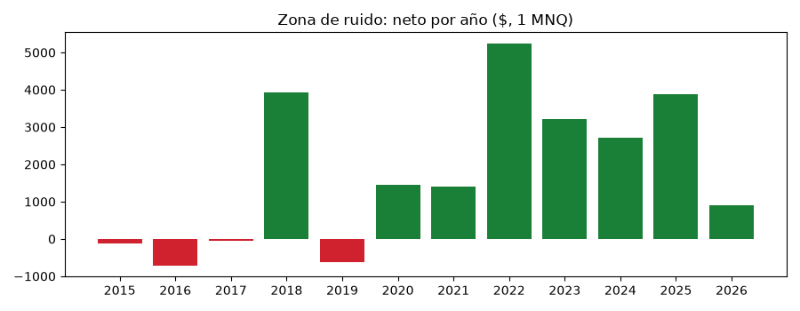
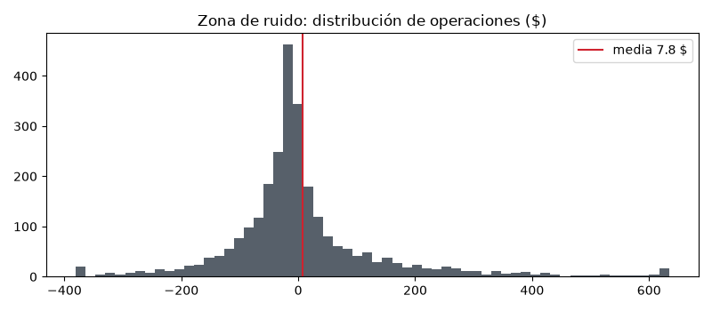
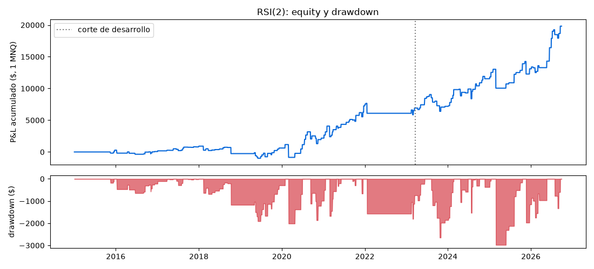
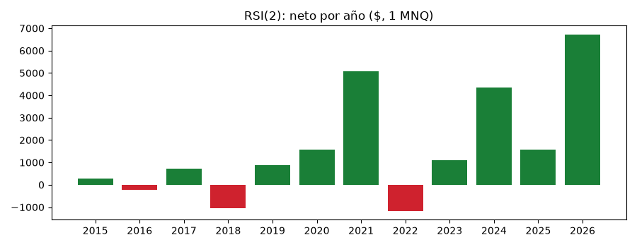
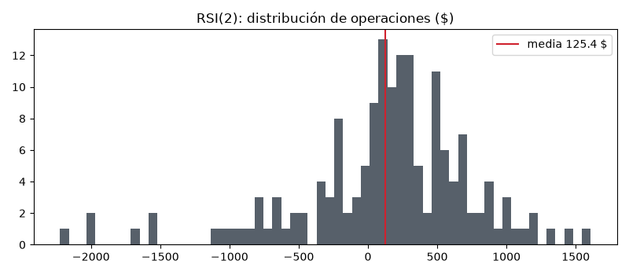
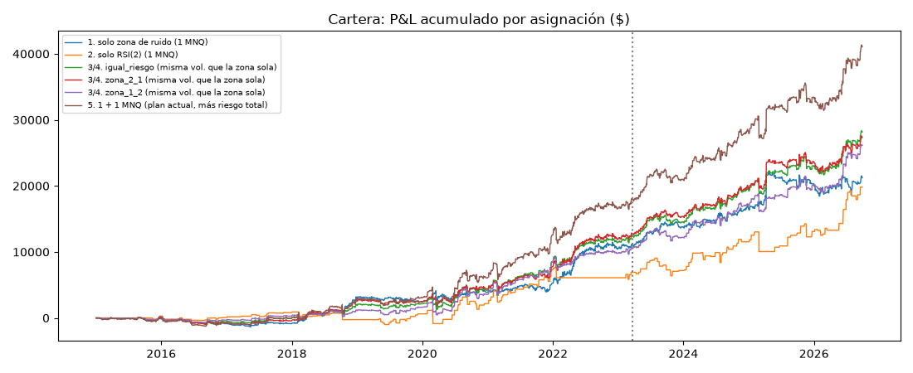

# Informe final — auditoría, validación y cartera

*Experimento `20260930_0633` · commit `e457b48b09` · Python 3.11.15, pandas 3.0.6, numpy 2.4.6 · semilla 20260930 · 27 archivos de datos con SHA-1 en `manifiesto.json`. Reproducible con `python -m auditoria.run_auditoria` y `python -m auditoria.generar_informe <carpeta>`. Criterios registrados antes en `auditoria/CRITERIOS.md`; auditoría de código en `auditoria/AUDITORIA_CODIGO.md`.*

## A. Resumen ejecutivo

| estrategia                    | mercado                                  | periodo           |   operaciones |    PF |   expectativa_$ | IC95_bloques_$     |   max_dd_$ | posterior (ya visto)   | costes ×2   | estado                                        |
|:------------------------------|:-----------------------------------------|:------------------|--------------:|------:|----------------:|:-------------------|-----------:|:-----------------------|:------------|:----------------------------------------------|
| Zona de ruido intradía        | NQ (1 MNQ)                               | 2015-01 → 2026-09 |          2725 | 1.2   |            7.79 | (3.14, 12.87)      |      -3645 | PF 1.209, 12.73 $/op   | 4.79 $/op   | Validación adicional respaldada por los datos |
| RSI(2) swing                  | NQ (1 MNQ)                               | 2015-01 → 2026-09 |           158 | 1.688 |          125.45 | (20.62, 226.93)    |      -2977 | PF 1.929, 211.51 $/op  | 121.45 $/op | Validación adicional respaldada por los datos |
| SMC/ICT A_original_0930_1530  | NQ (1 MNQ)                               | 2015 → 2026       |            31 | 0.405 |          -36.73 | (-72.28, -3.02)    |      -1248 | PF 0.181, -72.79 $/op  | —           | Evidencia insuficiente (muestra pequeña)      |
| SMC/ICT B_london_kz_0200_0500 | NQ (1 MNQ)                               | 2015 → 2026       |            14 | 0.827 |           -3.39 | (-28.47, 26.65)    |       -177 | PF 0.65, -15.12 $/op   | —           | Evidencia insuficiente (muestra pequeña)      |
| SMC/ICT C_ny_kz_0700_1000     | NQ (1 MNQ)                               | 2015 → 2026       |            20 | 0.397 |          -41.95 | (-91.05, 14.22)    |       -878 | PF 0.409, -54.54 $/op  | —           | Evidencia insuficiente (muestra pequeña)      |
| Rango 30 min + London + VWAP  | NQ (1 MNQ)                               | 2015 → 2026       |          2637 | 1.072 |            4.4  | (-1.71, 10.52)     |      -5772 | PF 1.052, 4.98 $/op    | —           | Evidencia insuficiente (IC incluye 0)         |
| Cruce VWAP 15m 1:2            | NQ (1 MNQ)                               | 2015 → 2026       |          4645 | 1.022 |            0.97 | (-2.67, 4.75)      |      -7240 | PF 1.024, 1.59 $/op    | —           | Evidencia insuficiente (IC incluye 0)         |
| Zona de ruido en oro          | GC (1 MGC)                               | 2015 → 2026       |          2784 | 0.91  |           -2.03 | (-5.29, 1.59)      |     -10493 | PF 1.077, 2.99 $/op    | —           | Evidencia negativa en las pruebas realizadas  |
| RSI(2) en oro                 | GC (1 MGC)                               | 2015 → 2026       |           150 | 1.235 |           38.73 | (-66.55, 139.33)   |      -8615 | PF 1.292, 72.28 $/op   | —           | Evidencia insuficiente (IC incluye 0)         |
| Pares oro/plata               | GC+SI diario (1 MGC + 1 SIL)             | 2010 → 2026       |            84 | 1.199 |          164.16 | (-499.97, 1096.17) |     -26388 | PF 2.269, 1123.77 $/op | —           | Evidencia insuficiente (muestra pequeña)      |
| Bot oferta/demanda (oro)      | GC ajustado H1 (costes XAUUSD, en onzas) | 2015 → 2026       |          1275 | 0.978 |           -3.37 | (-25.3, 19.59)     |     -15332 | PF 1.028, 3.9 $/op     | —           | Evidencia insuficiente (IC incluye 0)         |
| VWAP direccional (baseline)   | NQ→MNQ (riesgo 0,5 %)                    | 2015 → 2026       |          3794 | 0.85  |           -5.7  | (-9.08, -2.12)     |     -24363 | PF 1.018, 0.6 $/op     | —           | Evidencia negativa en las pruebas realizadas  |
| VWAP+EMAs modelo A (MNQ)      | MNQ (riesgo 0,5 %, velas 15m)            | 2015 → 2026       |          7007 | 0.96  |           -1.92 | (-5.15, 1.44)      |     -29074 | PF 1.072, 3.74 $/op    | —           | Evidencia insuficiente (IC incluye 0)         |
| VWAP+EMAs modelo B (MNQ)      | MNQ (riesgo 0,5 %, velas 15m)            | 2015 → 2026       |          5141 | 0.967 |           -2.02 | (-5.92, 2.19)      |     -17760 | PF 0.953, -2.97 $/op   | —           | Evidencia insuficiente (IC incluye 0)         |
| VWAP+EMAs modelo C (MNQ)      | MNQ (riesgo 0,5 %, velas 15m)            | 2015 → 2026       |          4078 | 0.898 |           -5.37 | (-9.07, -1.4)      |     -22264 | PF 0.884, -5.26 $/op   | —           | Evidencia negativa en las pruebas realizadas  |
| VWAP+EMAs modelo D (MNQ)      | MNQ (riesgo 0,5 %, velas 15m)            | 2015 → 2026       |          3610 | 0.89  |           -6.1  | (-10.31, -1.71)    |     -22456 | PF 0.863, -6.24 $/op   | —           | Evidencia negativa en las pruebas realizadas  |
| VWAP+EMAs modelo A (MGC)      | MGC (riesgo 0,5 %, velas 15m)            | 2015 → 2026       |          4311 | 0.676 |          -10.8  | (-15.18, -6.11)    |     -50260 | —                      | —           | Evidencia negativa en las pruebas realizadas  |
| VWAP+EMAs modelo B (MGC)      | MGC (riesgo 0,5 %, velas 15m)            | 2015 → 2026       |          4295 | 0.777 |          -10.36 | (-15.6, -4.68)     |     -50987 | PF 0.21, -16.33 $/op   | —           | Evidencia negativa en las pruebas realizadas  |
| VWAP+EMAs modelo C (MGC)      | MGC (riesgo 0,5 %, velas 15m)            | 2015 → 2026       |          4588 | 0.801 |           -9.47 | (-15.18, -3.47)    |     -52734 | PF 0.381, -13.39 $/op  | —           | Evidencia negativa en las pruebas realizadas  |
| VWAP+EMAs modelo D (MGC)      | MGC (riesgo 0,5 %, velas 15m)            | 2015 → 2026       |          4259 | 0.806 |          -10.22 | (-16.81, -3.27)    |     -53157 | PF 0.411, -13.54 $/op  | —           | Evidencia negativa en las pruebas realizadas  |

*Estados descriptivos según `CRITERIOS.md` (no son un ranking). "Posterior (ya visto)" = desde el corte de desarrollo de cada estrategia; ya se había mirado, así que **no es fuera de muestra**. XAUUSD CFD: sin datos (el bot se probó con el futuro GC ajustado). Las estrategias con riesgo 0,5 % (VWAP) tienen tamaño variable: sus $ no son de 1 contrato.*

## Auditoría de datos y código (fase 1)

- Calidad NQ: 4088230 velas, duplicados 0, velas imposibles 0, huecos > 30 min 10, picos que se deshacen 287 (no eliminados), cambios de contrato 47, sesiones ilíquidas excluidas 65.
- Truncamiento (look-ahead): zona de ruido **OK**, RSI(2) **OK**.
- Coherencia de operaciones zona_ruido: {'operaciones': 2725, 'solapes_de_posicion': 0, 'salida_antes_de_entrada': 0, 'neto_distinto_de_bruto_menos_comision': 0, 'entradas_fuera_de_chequeo': 0}
- Coherencia de operaciones rsi2: {'operaciones': 158, 'solapes_de_posicion': 0, 'salida_antes_de_entrada': 0, 'entrada_no_posterior_a_senal': 0}
- Detalle de la revisión de código, supuestos y gravedad: `AUDITORIA_CODIGO.md`.

## B. Resultados individuales (fases 2-4)

### Zona de ruido
**Reproducción frente a los informes originales:**

| tramo      |   original operaciones |   original profit_factor |   original t_por_operacion |   original neto_$ |   reproducido operaciones |   reproducido profit_factor |   reproducido t_por_operacion |   reproducido neto_$ |
|:-----------|-----------------------:|-------------------------:|---------------------------:|------------------:|--------------------------:|----------------------------:|------------------------------:|---------------------:|
| desarrollo |                   1924 |                    1.194 |                       2.26 |             11034 |                      1924 |                       1.194 |                          2.26 |                11034 |
| posterior  |                    800 |                    1.215 |                     nan    |             10472 |                       801 |                       1.209 |                        nan    |                10197 |

|                         | total         | desarrollo   | posterior (ya visto)   |
|:------------------------|:--------------|:-------------|:-----------------------|
| operaciones             | 2725          | 1924         | 801                    |
| operaciones_por_año     | 226.9         | 160.2        | 66.7                   |
| neto_$                  | 21231.0       | 11034.0      | 10197.0                |
| bruto_$                 | 26681.0       | 14882.0      | 11799.0                |
| profit_factor           | 1.2           | 1.194        | 1.209                  |
| expectativa_$           | 7.79          | 5.73         | 12.73                  |
| t_por_operacion         | 2.56          | 2.26         | 1.52                   |
| acierto_%               | 37.5          | 35.9         | 41.6                   |
| ganancia_media_$        | 124.3         | 98.6         | 177.4                  |
| perdida_media_$         | -62.6         | -46.5        | -105.1                 |
| max_dd_$                | -3645.0       | -1483.0      | -3645.0                |
| max_dd_%_capital        | -7.74         | -5.69        | -10.11                 |
| sharpe_diario_anual     | 0.86          | 0.68         | 0.54                   |
| sortino_diario_anual    | 1.56          | 1.16         | 1.1                    |
| horas_medias_en_mercado | 1.85          | 1.84         | 1.89                   |
| horas_medianas          | 1.0           | 1.0          | 1.0                    |
| racha_perdedora         | 14            | 14           | 8                      |
| racha_ganadora          | 6             | 6            | 5                      |
| IC95_bloques_$          | (3.14, 12.87) | (1.91, 10.0) | (0.18, 27.49)          |
| IC95_iid_$              | (1.84, 13.75) | (0.76, 10.7) | (-3.64, 29.1)          |

Exposición: 25.6 % del tiempo (de la sesión regular).

**Criterios (`CRITERIOS.md`):**

| criterio                                                  | cumple   | valor                                 |
|:----------------------------------------------------------|:---------|:--------------------------------------|
| a. expectativa > 0 y límite inferior IC95 por bloques > 0 | True     | 7.79 $ (IC95 (3.14, 12.87))           |
| b1. ≥ 60 % de años con neto > 0                           | True     | 8/12                                  |
| b2. ningún año aporta > 50 % del neto                     | True     | máximo 25 %                           |
| c. costes ×2: expectativa > 0                             | True     | 4.79 $                                |
| d. ≥ 80 % de la vecindad con PF > 1                       | True     | 25/25                                 |
| e. periodo posterior (ya visto) con expectativa > 0       | True     | 12.73 $                               |
| f. ≥ 100 operaciones y sin errores críticos               | True     | 2725 operaciones; errores críticos: 0 |

→ **Validación adicional respaldada por los datos**

**Ventanas anuales (walk-forward con reglas congeladas: cada año por separado):**

|    k |   operaciones |   neto_$ |   expectativa_$ |   acierto_% |   PF |
|-----:|--------------:|---------:|----------------:|------------:|-----:|
| 2015 |           210 |     -116 |           -0.55 |        33.3 | 0.96 |
| 2016 |           238 |     -715 |           -3    |        29   | 0.81 |
| 2017 |           237 |      -47 |           -0.2  |        32.5 | 0.98 |
| 2018 |           226 |     3932 |           17.4  |        39.8 | 1.77 |
| 2019 |           248 |     -626 |           -2.52 |        32.3 | 0.87 |
| 2020 |           235 |     1450 |            6.17 |        37.9 | 1.13 |
| 2021 |           229 |     1413 |            6.17 |        39.3 | 1.15 |
| 2022 |           255 |     5244 |           20.57 |        41.6 | 1.35 |
| 2023 |           229 |     3216 |           14.04 |        43.2 | 1.35 |
| 2024 |           231 |     2704 |           11.71 |        42   | 1.22 |
| 2025 |           223 |     3884 |           17.42 |        40.4 | 1.26 |
| 2026 |           164 |      892 |            5.44 |        40.2 | 1.06 |

**Trimestral:**

|               |   2015Q1 |   2015Q2 |   2015Q3 |   2015Q4 |   2016Q1 |   2016Q2 |   2016Q3 |   2016Q4 |   2017Q1 |   2017Q2 |   2017Q3 |   2017Q4 |   2018Q1 |   2018Q2 |   2018Q3 |   2018Q4 |   2019Q1 |   2019Q2 |   2019Q3 |   2019Q4 |   2020Q1 |   2020Q2 |   2020Q3 |   2020Q4 |   2021Q1 |   2021Q2 |   2021Q3 |   2021Q4 |   2022Q1 |   2022Q2 |   2022Q3 |   2022Q4 |   2023Q1 |   2023Q2 |   2023Q3 |   2023Q4 |   2024Q1 |   2024Q2 |   2024Q3 |   2024Q4 |   2025Q1 |   2025Q2 |   2025Q3 |   2025Q4 |   2026Q1 |   2026Q2 |   2026Q3 |
|:--------------|---------:|---------:|---------:|---------:|---------:|---------:|---------:|---------:|---------:|---------:|---------:|---------:|---------:|---------:|---------:|---------:|---------:|---------:|---------:|---------:|---------:|---------:|---------:|---------:|---------:|---------:|---------:|---------:|---------:|---------:|---------:|---------:|---------:|---------:|---------:|---------:|---------:|---------:|---------:|---------:|---------:|---------:|---------:|---------:|---------:|---------:|---------:|
| operaciones   |    43    |    54    |    52    |    61    |    44    |    76    |    59    |    59    |    61    |    76    |    54    |    46    |    63    |    57    |    47    |    59    |    55    |    45    |    76    |    72    |    59    |    58    |    63    |    55    |    65    |    47    |    60    |    57    |    62    |    67    |    60    |    66    |    54    |    57    |    55    |    63    |    61    |    52    |    58    |    60    |    59    |    42    |    69    |    53    |    64    |    55    |    45    |
| neto_$        |   -25    |   -22    |  -145    |    76    |  -142    |  -425    |    -4    |  -144    |  -161    |   186    |    32    |  -104    |  1255    |   -16    |   431    |  2262    |    52    |    18    |  -247    |  -450    |   849    |   148    |   375    |    78    |   226    |   755    |  -398    |   830    |  1472    |  3274    |   551    |   -52    |   534    |  1957    |  1222    |  -498    |   115    |   511    |  1134    |   944    |  1424    |  3340    | -1334    |   455    |  -310    |  1086    |   116    |
| expectativa_$ |    -0.58 |    -0.4  |    -2.79 |     1.24 |    -3.23 |    -5.59 |    -0.07 |    -2.44 |    -2.64 |     2.45 |     0.59 |    -2.26 |    19.92 |    -0.28 |     9.17 |    38.33 |     0.95 |     0.41 |    -3.25 |    -6.24 |    14.39 |     2.56 |     5.95 |     1.42 |     3.48 |    16.06 |    -6.63 |    14.55 |    23.74 |    48.86 |     9.18 |    -0.79 |     9.89 |    34.33 |    22.22 |    -7.9  |     1.89 |     9.83 |    19.56 |    15.72 |    24.13 |    79.51 |   -19.33 |     8.58 |    -4.84 |    19.75 |     2.57 |
| acierto_%     |    37.2  |    35.2  |    32.7  |    29.5  |    27.3  |    28.9  |    30.5  |    28.8  |    32.8  |    32.9  |    31.5  |    32.6  |    39.7  |    31.6  |    44.7  |    44.1  |    32.7  |    28.9  |    34.2  |    31.9  |    45.8  |    36.2  |    38.1  |    30.9  |    36.9  |    38.3  |    38.3  |    43.9  |    40.3  |    49.3  |    38.3  |    37.9  |    38.9  |    49.1  |    43.6  |    41.3  |    37.7  |    44.2  |    39.7  |    46.7  |    45.8  |    40.5  |    34.8  |    41.5  |    40.6  |    43.6  |    35.6  |
| PF            |     0.95 |     0.97 |     0.84 |     1.09 |     0.87 |     0.63 |     0.99 |     0.82 |     0.7  |     1.24 |     1.05 |     0.84 |     1.83 |     0.99 |     1.57 |     2.41 |     1.04 |     1.02 |     0.85 |     0.62 |     1.23 |     1.06 |     1.13 |     1.04 |     1.06 |     1.54 |     0.83 |     1.4  |     1.33 |     1.93 |     1.18 |     0.99 |     1.22 |     2.31 |     1.55 |     0.83 |     1.04 |     1.2  |     1.27 |     1.34 |     1.4  |     2.04 |     0.63 |     1.1  |     0.94 |     1.22 |     1.02 |

**Costes y latencia:**

|                         |   operaciones |   profit_factor |   expectativa_$ |   t_por_operacion |   neto_$ |
|:------------------------|--------------:|----------------:|----------------:|------------------:|---------:|
| x2                      |          2725 |           1.118 |            4.79 |              1.58 |    13056 |
| x3                      |          2725 |           1.042 |            1.79 |              0.59 |     4881 |
| sin_costes              |          2725 |           1.291 |           10.79 |              3.55 |    29406 |
| ejecucion_1_min_despues |          2725 |           1.163 |            6.33 |              2.11 |    17260 |

**Vecindad de parámetros (rejilla fijada antes; sin elegir el mejor):**

|   dias_ruido |   mult |   operaciones |    PF |   expectativa_$ |    t |
|-------------:|-------:|--------------:|------:|----------------:|-----:|
|           10 |    0.8 |          3110 | 1.111 |            4.74 | 1.61 |
|           10 |    0.9 |          2847 | 1.138 |            5.75 | 1.89 |
|           10 |    1   |          2578 | 1.183 |            7.43 | 2.31 |
|           10 |    1.1 |          2365 | 1.208 |            8.24 | 2.46 |
|           10 |    1.2 |          2131 | 1.187 |            7.49 | 2.27 |
|           12 |    0.8 |          3315 | 1.14  |            5.61 | 2.05 |
|           12 |    0.9 |          3050 | 1.155 |            6.13 | 2.15 |
|           12 |    1   |          2760 | 1.194 |            7.56 | 2.5  |
|           12 |    1.1 |          2512 | 1.227 |            8.57 | 2.73 |
|           12 |    1.2 |          2288 | 1.224 |            8.49 | 2.55 |
|           14 |    0.8 |          3287 | 1.139 |            5.68 | 2.04 |
|           14 |    0.9 |          2989 | 1.148 |            6    | 2.06 |
|           14 |    1   |          2725 | 1.2   |            7.79 | 2.56 |
|           14 |    1.1 |          2455 | 1.221 |            8.45 | 2.62 |
|           14 |    1.2 |          2252 | 1.23  |            8.67 | 2.58 |
|           17 |    0.8 |          3276 | 1.124 |            5.13 | 1.83 |
|           17 |    0.9 |          2973 | 1.161 |            6.51 | 2.21 |
|           17 |    1   |          2677 | 1.186 |            7.44 | 2.39 |
|           17 |    1.1 |          2449 | 1.168 |            6.79 | 2.07 |
|           17 |    1.2 |          2195 | 1.257 |            9.79 | 2.81 |
|           20 |    0.8 |          3289 | 1.13  |            5.31 | 1.9  |
|           20 |    0.9 |          2959 | 1.148 |            6.05 | 2.04 |
|           20 |    1   |          2643 | 1.173 |            7.09 | 2.23 |
|           20 |    1.1 |          2419 | 1.201 |            7.98 | 2.41 |
|           20 |    1.2 |          2178 | 1.248 |            9.68 | 2.73 |

**Regímenes (descriptivo, con datos del día anterior):**

*volatilidad_20d*

| volatilidad   |   operaciones |   neto_$ |   expectativa_$ |    t |
|:--------------|--------------:|---------:|----------------:|-----:|
| vol alta      |           852 |    11632 |           13.65 | 1.85 |
| vol baja      |          1007 |     1194 |            1.19 | 0.39 |
| vol media     |           862 |     8430 |            9.78 | 1.9  |

*tendencia_sma200*

| tendencia    |   operaciones |   neto_$ |   expectativa_$ |    t |
|:-------------|--------------:|---------:|----------------:|-----:|
| bajo SMA200  |           653 |     9966 |           15.26 | 1.85 |
| sobre SMA200 |          2072 |    11265 |            5.44 | 1.79 |

**Por día de la semana y franja horaria:**

| dia   |   operaciones |   neto_$ |   expectativa_$ |    t |
|:------|--------------:|---------:|----------------:|-----:|
| jue   |           585 |     2646 |            4.52 | 0.72 |
| lun   |           524 |     1284 |            2.45 | 0.48 |
| mar   |           545 |     4599 |            8.44 | 1.51 |
| mié   |           550 |     5826 |           10.59 | 1.23 |
| vie   |           521 |     6874 |           13.19 | 1.7  |

| hora_NY   |   operaciones |   neto_$ |   expectativa_$ |     t |
|:----------|--------------:|---------:|----------------:|------:|
| 10:00     |           762 |     6703 |            8.8  |  1.43 |
| 10:30     |           314 |     2096 |            6.68 |  0.79 |
| 11:00     |           243 |     1471 |            6.05 |  0.57 |
| 11:30     |           229 |     1546 |            6.75 |  0.86 |
| 12:00     |           191 |    -2100 |          -10.99 | -1.52 |
| 12:30     |           171 |     5704 |           33.36 |  1.4  |
| 13:00     |           139 |     -472 |           -3.39 | -0.39 |
| 13:30     |           134 |     2434 |           18.16 |  1.66 |
| 14:00     |           144 |    -1694 |          -11.76 | -1.34 |
| 14:30     |           138 |      315 |            2.28 |  0.22 |
| 15:00     |           132 |     3514 |           26.62 |  2.78 |
| 15:30     |           128 |     1711 |           13.37 |  1.21 |

### RSI(2)
**Reproducción frente a los informes originales:**

| tramo      |   original operaciones |   original profit_factor |   reproducido operaciones |   reproducido profit_factor |
|:-----------|-----------------------:|-------------------------:|--------------------------:|----------------------------:|
| desarrollo |                     97 |                     1.46 |                        97 |                       1.463 |
| posterior  |                     61 |                     1.93 |                        61 |                       1.929 |

|                         | total           | desarrollo       | posterior (ya visto)   |
|:------------------------|:----------------|:-----------------|:-----------------------|
| operaciones             | 158             | 97               | 61                     |
| operaciones_por_año     | 13.0            | 8.0              | 5.1                    |
| neto_$                  | 19821.0         | 6919.0           | 12902.0                |
| bruto_$                 | nan             | nan              | nan                    |
| profit_factor           | 1.688           | 1.463            | 1.929                  |
| expectativa_$           | 125.45          | 71.33            | 211.51                 |
| t_por_operacion         | 2.39            | 1.35             | 1.98                   |
| acierto_%               | 69.6            | 68.0             | 72.1                   |
| ganancia_media_$        | 442.1           | 331.0            | 608.7                  |
| perdida_media_$         | -600.2          | -481.5           | -816.6                 |
| max_dd_$                | -2977.0         | -2016.0          | -2977.0                |
| max_dd_%_capital        | -7.83           | -7.7             | -9.76                  |
| sharpe_diario_anual     | 0.69            | 0.41             | 0.57                   |
| sortino_diario_anual    | 0.96            | 0.54             | 0.85                   |
| horas_medias_en_mercado | 123.51          | 119.03           | 130.64                 |
| horas_medianas          | 144.0           | 120.0            | 144.0                  |
| racha_perdedora         | 3               | 3                | 2                      |
| racha_ganadora          | 8               | 6                | 8                      |
| expectativa_R           | 0.3402          | 0.3002           | 0.4036                 |
| t_R                     | 1.92            | 1.22             | 1.67                   |
| IC95_bloques_$          | (20.62, 226.93) | (-30.68, 169.92) | (-12.72, 422.82)       |
| IC95_iid_$              | (22.48, 228.42) | (-32.16, 174.82) | (2.14, 420.88)         |

Exposición: 20.5 % del tiempo (de calendario).

**Criterios (`CRITERIOS.md`):**

| criterio                                                  | cumple   | valor                                |
|:----------------------------------------------------------|:---------|:-------------------------------------|
| a. expectativa > 0 y límite inferior IC95 por bloques > 0 | True     | 125.45 $ (IC95 (20.62, 226.93))      |
| b1. ≥ 60 % de años con neto > 0                           | True     | 9/12                                 |
| b2. ningún año aporta > 50 % del neto                     | True     | máximo 34 %                          |
| c. costes ×2: expectativa > 0                             | True     | 121.45 $                             |
| d. ≥ 80 % de la vecindad con PF > 1                       | True     | 27/27                                |
| e. periodo posterior (ya visto) con expectativa > 0       | True     | 211.51 $                             |
| f. ≥ 100 operaciones y sin errores críticos               | True     | 158 operaciones; errores críticos: 0 |

→ **Validación adicional respaldada por los datos**

**Ventanas anuales (walk-forward con reglas congeladas: cada año por separado):**

|    k |   operaciones |   neto_$ |   expectativa_$ |   acierto_% |   PF |
|-----:|--------------:|---------:|----------------:|------------:|-----:|
| 2015 |             4 |      286 |           71.38 |        75   | 2.56 |
| 2016 |            12 |     -220 |          -18.33 |        66.7 | 0.81 |
| 2017 |            13 |      733 |           56.35 |        53.8 | 3.03 |
| 2018 |            11 |    -1055 |          -95.91 |        63.6 | 0.45 |
| 2019 |            14 |      878 |           62.71 |        64.3 | 1.53 |
| 2020 |            14 |     1560 |          111.46 |        71.4 | 1.36 |
| 2021 |            22 |     5081 |          230.95 |        77.3 | 2.7  |
| 2022 |             3 |    -1170 |         -390    |        66.7 | 0.25 |
| 2023 |            18 |     1096 |           60.92 |        66.7 | 1.29 |
| 2024 |            19 |     4349 |          228.87 |        73.7 | 2.29 |
| 2025 |            13 |     1562 |          120.15 |        84.6 | 1.32 |
| 2026 |            15 |     6722 |          448.1  |        66.7 | 3.66 |

**Trimestral:**

|               |   2015Q4 |   2016Q1 |   2016Q2 |   2016Q3 |   2016Q4 |   2017Q1 |   2017Q2 |   2017Q3 |   2017Q4 |   2018Q1 |   2018Q2 |   2018Q3 |   2018Q4 |   2019Q2 |   2019Q3 |   2019Q4 |   2020Q1 |   2020Q2 |   2020Q3 |   2020Q4 |   2021Q1 |   2021Q2 |   2021Q3 |   2021Q4 |   2022Q1 |   2023Q1 |   2023Q2 |   2023Q3 |   2023Q4 |   2024Q1 |   2024Q2 |   2024Q3 |   2024Q4 |   2025Q1 |   2025Q2 |   2025Q3 |   2025Q4 |   2026Q1 |   2026Q2 |   2026Q3 |
|:--------------|---------:|---------:|---------:|---------:|---------:|---------:|---------:|---------:|---------:|---------:|---------:|---------:|---------:|---------:|---------:|---------:|---------:|---------:|---------:|---------:|---------:|---------:|---------:|---------:|---------:|---------:|---------:|---------:|---------:|---------:|---------:|---------:|---------:|---------:|---------:|---------:|---------:|---------:|---------:|---------:|
| operaciones   |     4    |      1   |     3    |     3    |      5   |     2    |     3    |     5    |     3    |     4    |        2 |     4    |      1   |     5    |     5    |     4    |     2    |        3 |     5    |     4    |     7    |     4    |     5    |     6    |     3    |     4    |     5    |     6    |     3    |      5   |     5    |     5    |     4    |     4    |     2    |     3    |     4    |     6    |     3    |     6    |
| neto_$        |   286    |   -471   |  -174    |   336    |     88   |   204    |   138    |   332    |    58    |  -568    |      146 |   332    |   -965   |  -443    |   267    |  1054    | -1472    |     2007 |  1371    |  -345    |  1331    |   839    |   694    |  2217    | -1170    |   826    |  1765    | -1401    |   -95    |   2634   |    93    |   500    |  1123    | -1484    |   850    |  1957    |   239    |   186    |  4613    |  1923    |
| expectativa_$ |    71.38 |   -470.5 |   -58    |   112.17 |     17.6 |   102.25 |    46    |    66.4  |    19.33 |  -142    |       73 |    82.88 |   -964.5 |   -88.7  |    53.4  |   263.62 |  -736    |      669 |   274.2  |   -86.37 |   190.07 |   209.87 |   138.9  |   369.42 |  -390    |   206.62 |   353    |  -233.42 |   -31.5  |    526.7 |    18.5  |    99.9  |   280.75 |  -371.12 |   425.25 |   652.33 |    59.75 |    31    |  1537.67 |   320.42 |
| acierto_%     |    75    |      0   |    33.3  |   100    |     80   |   100    |    33.3  |    60    |    33.3  |    50    |      100 |    75    |      0   |    40    |    60    |   100    |    50    |      100 |    80    |    50    |    85.7  |    75    |    80    |    66.7  |    66.7  |    75    |    80    |    50    |    66.7  |    100   |    60    |    60    |    75    |    75    |   100    |   100    |    75    |    50    |   100    |    66.7  |
| PF            |     2.56 |      0   |     0.53 |   inf    |      1.3 |   inf    |     2.25 |     2.55 |     2.59 |     0.38 |      inf |    10.9  |      0   |     0.49 |     1.34 |   inf    |     0.27 |      inf |     2.22 |     0.72 |     1.79 |     3.56 |     7.52 |     3.51 |     0.25 |     2.09 |     8.49 |     0.27 |     0.89 |    inf   |     1.08 |     1.27 |     4.03 |     0.5  |   inf    |   inf    |     1.12 |     1.16 |   inf    |     2.44 |

**Costes y latencia:**

|            |   operaciones |   profit_factor |   expectativa_$ |   t_por_operacion |   neto_$ |
|:-----------|--------------:|----------------:|----------------:|------------------:|---------:|
| x2         |           158 |           1.662 |          121.45 |              2.31 |    19190 |
| x3         |           158 |           1.636 |          117.46 |              2.24 |    18558 |
| sin_costes |           158 |           1.715 |          129.45 |              2.46 |    20453 |

**Vecindad de parámetros (rejilla fijada antes; sin elegir el mejor):**

|   entrada |   salida |   max_dias |   operaciones |    PF |   expectativa_$ |    t |
|----------:|---------:|-----------:|--------------:|------:|----------------:|-----:|
|        16 |       56 |          4 |           144 | 1.367 |           61.97 | 1.34 |
|        16 |       56 |          5 |           141 | 1.668 |           93.11 | 2.12 |
|        16 |       56 |          6 |           140 | 2.012 |          117.51 | 2.91 |
|        16 |       70 |          4 |           143 | 1.445 |           81.04 | 1.62 |
|        16 |       70 |          5 |           137 | 1.708 |          128.88 | 2.26 |
|        16 |       70 |          6 |           135 | 2.273 |          184.9  | 3.4  |
|        16 |       84 |          4 |           143 | 1.442 |           87.08 | 1.58 |
|        16 |       84 |          5 |           134 | 1.726 |          152.42 | 2.33 |
|        16 |       84 |          6 |           132 | 1.954 |          206.41 | 2.86 |
|        20 |       56 |          4 |           172 | 1.53  |           87.17 | 1.94 |
|        20 |       56 |          5 |           167 | 1.811 |          114.48 | 2.67 |
|        20 |       56 |          6 |           166 | 2.281 |          144.67 | 3.73 |
|        20 |       70 |          4 |           167 | 1.507 |           91.63 | 1.89 |
|        20 |       70 |          5 |           158 | 1.688 |          125.45 | 2.39 |
|        20 |       70 |          6 |           156 | 2.424 |          193.27 | 3.97 |
|        20 |       84 |          4 |           166 | 1.439 |           88.09 | 1.63 |
|        20 |       84 |          5 |           151 | 1.629 |          129.86 | 2.18 |
|        20 |       84 |          6 |           148 | 1.986 |          203.06 | 3.11 |
|        24 |       56 |          4 |           204 | 1.622 |           94.01 | 2.4  |
|        24 |       56 |          5 |           201 | 1.891 |          118.2  | 3.12 |
|        24 |       56 |          6 |           197 | 2.017 |          124.79 | 3.36 |
|        24 |       70 |          4 |           194 | 1.492 |           89.64 | 2.01 |
|        24 |       70 |          5 |           188 | 1.715 |          127.39 | 2.69 |
|        24 |       70 |          6 |           180 | 2.122 |          166.37 | 3.64 |
|        24 |       84 |          4 |           191 | 1.517 |           97.35 | 2.08 |
|        24 |       84 |          5 |           176 | 1.548 |          119.31 | 2.14 |
|        24 |       84 |          6 |           168 | 1.962 |          187.75 | 3.22 |

**Regímenes (descriptivo, con datos del día anterior):**

*volatilidad_20d*

| volatilidad   |   operaciones |   neto_$ |   expectativa_$ |    t |
|:--------------|--------------:|---------:|----------------:|-----:|
| vol alta      |            38 |     7629 |          200.75 | 1.77 |
| vol baja      |            69 |     4781 |           69.29 | 1.07 |
| vol media     |            51 |     7411 |          145.32 | 1.33 |

*tendencia_sma200*

| tendencia    |   operaciones |   neto_$ |   expectativa_$ |    t |
|:-------------|--------------:|---------:|----------------:|-----:|
| sobre SMA200 |           158 |    19821 |          125.45 | 2.39 |

**Por día de la semana y franja horaria:**

| dia   |   operaciones |   neto_$ |   expectativa_$ |     t |
|:------|--------------:|---------:|----------------:|------:|
| dom   |            36 |     3519 |           97.75 |  0.82 |
| jue   |            33 |    -3297 |          -99.91 | -0.63 |
| lun   |            21 |     1665 |           79.26 |  0.76 |
| mar   |            31 |    11485 |          370.48 |  4.23 |
| mié   |            37 |     6450 |          174.31 |  2.21 |

| hora_NY   |   operaciones |   neto_$ |   expectativa_$ |    t |
|:----------|--------------:|---------:|----------------:|-----:|
| 18:00     |           158 |    19821 |          125.45 | 2.39 |

## Fases 5-6: estrategias rechazadas y bot (re-ejecutadas con su código original)

| estrategia                    | tramo      |   operaciones |      PF |   expectativa_$ | IC95_bloques_$     |   expectativa_R |      t |
|:------------------------------|:-----------|--------------:|--------:|----------------:|:-------------------|----------------:|-------:|
| SMC/ICT A_original_0930_1530  | desarrollo |            17 |   0.822 |           -7.03 | (-41.6, 30.88)     |          0.0853 |  -0.31 |
| SMC/ICT A_original_0930_1530  | posterior  |            14 |   0.181 |          -72.79 | (-130.6, -14.43)   |         -0.4635 |  -2.8  |
| SMC/ICT A_original_0930_1530  | total      |            31 |   0.405 |          -36.73 | (-72.28, -3.02)    |         -0.1625 |  -2.05 |
| SMC/ICT B_london_kz_0200_0500 | desarrollo |            10 |   1.127 |            1.3  | (-14.33, 28.25)    |         -0.5256 |   0.12 |
| SMC/ICT B_london_kz_0200_0500 | posterior  |             4 |   0.65  |          -15.12 | (-95.5, 112.5)     |         -0.5269 |  -0.34 |
| SMC/ICT B_london_kz_0200_0500 | total      |            14 |   0.827 |           -3.39 | (-28.47, 26.65)    |         -0.526  |  -0.24 |
| SMC/ICT C_ny_kz_0700_1000     | desarrollo |             8 |   0.35  |          -23.06 | (-60.75, 14.84)    |         -0.4696 |  -1.2  |
| SMC/ICT C_ny_kz_0700_1000     | posterior  |            12 |   0.409 |          -54.54 | (-134.83, 39.23)   |         -0.2707 |  -1.25 |
| SMC/ICT C_ny_kz_0700_1000     | total      |            20 |   0.397 |          -41.95 | (-91.05, 14.22)    |         -0.3502 |  -1.56 |
| Rango 30 min + London + VWAP  | desarrollo |          1844 |   1.088 |            4.15 | (-1.39, 10.24)     |          0.0002 |   1.19 |
| Rango 30 min + London + VWAP  | posterior  |           793 |   1.052 |            4.98 | (-10.03, 20.65)    |          0.0304 |   0.53 |
| Rango 30 min + London + VWAP  | total      |          2637 |   1.072 |            4.4  | (-1.71, 10.52)     |          0.0093 |   1.17 |
| Cruce VWAP 15m 1:2            | desarrollo |          3254 |   1.021 |            0.71 | (-2.79, 4.55)      |         -0.0868 |   0.4  |
| Cruce VWAP 15m 1:2            | posterior  |          1391 |   1.024 |            1.59 | (-6.98, 10.04)     |         -0.0182 |   0.33 |
| Cruce VWAP 15m 1:2            | total      |          4645 |   1.022 |            0.97 | (-2.67, 4.75)      |         -0.0662 |   0.51 |
| Zona de ruido en oro          | desarrollo |          1953 |   0.738 |           -4.16 | (-5.81, -2.37)     |        nan      |  -4.34 |
| Zona de ruido en oro          | posterior  |           831 |   1.077 |            2.99 | (-7.08, 14.6)      |        nan      |   0.59 |
| Zona de ruido en oro          | total      |          2784 |   0.91  |           -2.03 | (-5.29, 1.59)      |        nan      |  -1.22 |
| RSI(2) en oro                 | desarrollo |            89 |   1.145 |           15.73 | (-51.1, 76.09)     |          0.0817 |   0.47 |
| RSI(2) en oro                 | posterior  |            61 |   1.292 |           72.28 | (-175.47, 307.57)  |          0.1083 |   0.58 |
| RSI(2) en oro                 | total      |           150 |   1.235 |           38.73 | (-66.55, 139.33)   |          0.0925 |   0.72 |
| Pares oro/plata               | desarrollo |            56 |   0.604 |         -315.64 | (-667.53, 70.93)   |        nan      |  -1.24 |
| Pares oro/plata               | posterior  |            28 |   2.269 |         1123.77 | (-812.9, 3424.71)  |        nan      |   1.04 |
| Pares oro/plata               | total      |            84 |   1.199 |          164.16 | (-499.97, 1096.17) |        nan      |   0.41 |
| Bot oferta/demanda (oro)      | desarrollo |           802 |   0.954 |           -7.67 | (-36.18, 21.9)     |         -0.0274 |  -0.61 |
| Bot oferta/demanda (oro)      | posterior  |           473 |   1.028 |            3.9  | (-30.78, 39.45)    |          0.0298 |   0.27 |
| Bot oferta/demanda (oro)      | total      |          1275 |   0.978 |           -3.37 | (-25.3, 19.59)     |         -0.0062 |  -0.35 |
| VWAP direccional (baseline)   | desarrollo |          3291 |   0.829 |           -6.67 | (-10.18, -2.94)    |         -0.0388 |  -3.53 |
| VWAP direccional (baseline)   | posterior  |           503 |   1.018 |            0.6  | (-8.51, 10.65)     |          0.0182 |   0.12 |
| VWAP direccional (baseline)   | total      |          3794 |   0.85  |           -5.7  | (-9.08, -2.12)     |         -0.0312 |  -3.22 |
| VWAP+EMAs modelo A (MNQ)      | desarrollo |          5854 |   0.936 |           -3.03 | (-6.33, 0.34)      |         -0.0105 |  -1.61 |
| VWAP+EMAs modelo A (MNQ)      | posterior  |          1153 |   1.072 |            3.74 | (-6.75, 14.92)     |          0.0394 |   0.73 |
| VWAP+EMAs modelo A (MNQ)      | total      |          7007 |   0.96  |           -1.92 | (-5.15, 1.44)      |         -0.0023 |  -1.08 |
| VWAP+EMAs modelo B (MNQ)      | desarrollo |          4308 |   0.97  |           -1.84 | (-6.17, 2.61)      |         -0.0024 |  -0.69 |
| VWAP+EMAs modelo B (MNQ)      | posterior  |           833 |   0.953 |           -2.97 | (-13.56, 8.06)     |         -0.0094 |  -0.47 |
| VWAP+EMAs modelo B (MNQ)      | total      |          5141 |   0.967 |           -2.02 | (-5.92, 2.19)      |         -0.0036 |  -0.82 |
| VWAP+EMAs modelo C (MNQ)      | desarrollo |          3606 |   0.9   |           -5.39 | (-9.47, -1.12)     |         -0.0258 |  -2.17 |
| VWAP+EMAs modelo C (MNQ)      | posterior  |           472 |   0.884 |           -5.26 | (-13.92, 3.37)     |         -0.0329 |  -0.93 |
| VWAP+EMAs modelo C (MNQ)      | total      |          4078 |   0.898 |           -5.37 | (-9.07, -1.4)      |         -0.0267 |  -2.34 |
| VWAP+EMAs modelo D (MNQ)      | desarrollo |          3210 |   0.893 |           -6.08 | (-10.62, -1.31)    |         -0.03   |  -2.25 |
| VWAP+EMAs modelo D (MNQ)      | posterior  |           400 |   0.863 |           -6.24 | (-14.68, 2.36)     |         -0.0439 |  -1.05 |
| VWAP+EMAs modelo D (MNQ)      | total      |          3610 |   0.89  |           -6.1  | (-10.31, -1.71)    |         -0.0315 |  -2.45 |
| VWAP+EMAs modelo A (MGC)      | desarrollo |          4311 |   0.676 |          -10.8  | (-15.18, -6.11)    |         -0.1446 |  -4.99 |
| VWAP+EMAs modelo A (MGC)      | posterior  |             0 | nan     |          nan    |                    |        nan      | nan    |
| VWAP+EMAs modelo A (MGC)      | total      |          4311 |   0.676 |          -10.8  | (-15.18, -6.11)    |         -0.1446 |  -4.99 |
| VWAP+EMAs modelo B (MGC)      | desarrollo |          4288 |   0.777 |          -10.35 | (-15.61, -4.66)    |         -0.1135 |  -3.69 |
| VWAP+EMAs modelo B (MGC)      | posterior  |             7 |   0.21  |          -16.33 | (-30.24, -2.26)    |         -0.6334 |  -2    |
| VWAP+EMAs modelo B (MGC)      | total      |          4295 |   0.777 |          -10.36 | (-15.6, -4.68)     |         -0.1144 |  -3.7  |
| VWAP+EMAs modelo C (MGC)      | desarrollo |          4561 |   0.802 |           -9.45 | (-15.22, -3.4)     |         -0.0951 |  -3.35 |
| VWAP+EMAs modelo C (MGC)      | posterior  |            27 |   0.381 |          -13.39 | (-25.41, 13.79)    |         -0.4568 |  -1.6  |
| VWAP+EMAs modelo C (MGC)      | total      |          4588 |   0.801 |           -9.47 | (-15.18, -3.47)    |         -0.0972 |  -3.38 |
| VWAP+EMAs modelo D (MGC)      | desarrollo |          4235 |   0.807 |          -10.2  | (-16.81, -3.23)    |         -0.1041 |  -3.15 |
| VWAP+EMAs modelo D (MGC)      | posterior  |            24 |   0.411 |          -13.54 | (-27.9, 17.71)     |         -0.4568 |  -1.41 |
| VWAP+EMAs modelo D (MGC)      | total      |          4259 |   0.806 |          -10.22 | (-16.81, -3.27)    |         -0.1061 |  -3.17 |

**Clasificación:**

| estrategia                    | mercado                                  | corte desarrollo   | clasificación                            | nota                                       |
|:------------------------------|:-----------------------------------------|:-------------------|:-----------------------------------------|:-------------------------------------------|
| SMC/ICT A_original_0930_1530  | NQ (1 MNQ)                               | 2023-03-22         | No concluyente por muestra insuficiente  | originalmente solo desarrollo              |
| SMC/ICT B_london_kz_0200_0500 | NQ (1 MNQ)                               | 2023-03-22         | No concluyente por muestra insuficiente  | originalmente solo desarrollo              |
| SMC/ICT C_ny_kz_0700_1000     | NQ (1 MNQ)                               | 2023-03-22         | No concluyente por muestra insuficiente  | originalmente solo desarrollo              |
| Rango 30 min + London + VWAP  | NQ (1 MNQ)                               | 2023-03-22         | No concluyente (el IC 95 % incluye el 0) |                                            |
| Cruce VWAP 15m 1:2            | NQ (1 MNQ)                               | 2023-03-22         | No concluyente (el IC 95 % incluye el 0) |                                            |
| Zona de ruido en oro          | GC (1 MGC)                               | 2023-03-22         | Evidencia negativa                       |                                            |
| RSI(2) en oro                 | GC (1 MGC)                               | 2023-03-22         | No concluyente (el IC 95 % incluye el 0) |                                            |
| Pares oro/plata               | GC+SI diario (1 MGC + 1 SIL)             | 2021-11-09         | No concluyente por muestra insuficiente  |                                            |
| Bot oferta/demanda (oro)      | GC ajustado H1 (costes XAUUSD, en onzas) | 2023-03-22         | No concluyente (el IC 95 % incluye el 0) | precio del futuro, no del CFD; sin swap    |
| VWAP direccional (baseline)   | NQ→MNQ (riesgo 0,5 %)                    | 2023-03-22         | Evidencia negativa                       | tamaño variable                            |
| VWAP+EMAs modelo A (MNQ)      | MNQ (riesgo 0,5 %, velas 15m)            | 2024-05-18         | No concluyente (el IC 95 % incluye el 0) | desarrollo = train+validation del proyecto |
| VWAP+EMAs modelo B (MNQ)      | MNQ (riesgo 0,5 %, velas 15m)            | 2024-05-18         | No concluyente (el IC 95 % incluye el 0) | desarrollo = train+validation del proyecto |
| VWAP+EMAs modelo C (MNQ)      | MNQ (riesgo 0,5 %, velas 15m)            | 2024-05-18         | Evidencia negativa                       | desarrollo = train+validation del proyecto |
| VWAP+EMAs modelo D (MNQ)      | MNQ (riesgo 0,5 %, velas 15m)            | 2024-05-18         | Evidencia negativa                       | desarrollo = train+validation del proyecto |
| VWAP+EMAs modelo A (MGC)      | MGC (riesgo 0,5 %, velas 15m)            | 2024-06-06         | Evidencia negativa                       | desarrollo = train+validation del proyecto |
| VWAP+EMAs modelo B (MGC)      | MGC (riesgo 0,5 %, velas 15m)            | 2024-06-06         | Evidencia negativa                       | desarrollo = train+validation del proyecto |
| VWAP+EMAs modelo C (MGC)      | MGC (riesgo 0,5 %, velas 15m)            | 2024-06-06         | Evidencia negativa                       | desarrollo = train+validation del proyecto |
| VWAP+EMAs modelo D (MGC)      | MGC (riesgo 0,5 %, velas 15m)            | 2024-06-06         | Evidencia negativa                       | desarrollo = train+validation del proyecto |

La falta de significación no demuestra que no haya ninguna ventaja: con los IC mostrados se puede descartar una ventaja grande, no una muy pequeña (que, en todo caso, no cubriría costes realistas).

## C. Cartera zona de ruido + RSI(2) (fase 7)

Modelo de capital: 25.000 $ fijos, sin reinvertir; P&L por día de salida (hora NY); el capital no usado no rinde. Pesos = contratos equivalentes de MNQ.

- Correlaciones: {'diaria_todos_los_dias': -0.036, 'diaria_dias_con_ambas': -0.258, 'dias_con_ambas': 87, 'semanal': 0.071, 'mensual': 0.031, 'dias_ambas_pierden': 14, 'p5_dia_conjunto_1+1_$': -176.0, 'peor_dia_conjunto_1+1_$': -2798.0}
- Solapamiento de posiciones: {'operaciones_zona': 2725, 'con_RSI2_abierto_%': 23.7, 'con_RSI2_abierto_y_mismo_sentido_%': 11.6, 'horas_con_2_posiciones_%_del_tiempo_de_zona': 23.2, 'neto_zona_cuando_solapa_$': -4.21, 'neto_zona_sin_solape_$': 11.52}
- Costes anuales de la zona de ruido con 1 MNQ: ≈ 448.0 $; los del RSI(2) son pequeños (~13 operaciones/año). Operar las dos no reduce costes: cada estrategia paga los suyos (magic numbers distintos, cuenta de cobertura).

| asignación                                      | tramo                | pesos (zona, rsi2)   |   neto_$ |   volatilidad_diaria_$ |   sharpe_anual |   max_dd_$ |   max_dd_%_capital |   peor_dia_$ |   meses_positivos_% | años_positivos   |   neto/|max_dd| |
|:------------------------------------------------|:---------------------|:---------------------|---------:|-----------------------:|---------------:|-----------:|-------------------:|-------------:|--------------------:|:-----------------|----------------:|
| 1. solo zona de ruido (1 MNQ)                   | total                | (1.0, 0.0)           |    21231 |                  140.6 |           0.78 |      -3645 |              -14.6 |         -912 |                59.6 | 8/12             |            5.82 |
| 1. solo zona de ruido (1 MNQ)                   | desarrollo           | (1.0, 0.0)           |    11034 |                  104.1 |           0.78 |      -1483 |               -5.9 |         -912 |                57.6 | 5/9              |            7.44 |
| 1. solo zona de ruido (1 MNQ)                   | posterior (ya visto) | (1.0, 0.0)           |    10197 |                  201.5 |           0.87 |      -3645 |              -14.6 |         -692 |                65.1 | 4/4              |            2.8  |
| 2. solo RSI(2) (1 MNQ)                          | total                | (0.0, 1.0)           |    19821 |                  152.1 |           0.68 |      -2977 |              -11.9 |        -2977 |                45.4 | 9/12             |            6.66 |
| 2. solo RSI(2) (1 MNQ)                          | desarrollo           | (0.0, 1.0)           |     6919 |                  111.1 |           0.46 |      -2016 |               -8.1 |        -2016 |                37.4 | 6/9              |            3.43 |
| 2. solo RSI(2) (1 MNQ)                          | posterior (ya visto) | (0.0, 1.0)           |    12902 |                  219.6 |           1.01 |      -2977 |              -11.9 |        -2977 |                62.8 | 4/4              |            4.33 |
| 3/4. igual_riesgo (misma vol. que la zona sola) | total                | (0.707, 0.663)       |    28152 |                  139   |           1.05 |      -2893 |              -11.6 |        -1848 |                61.7 | 11/12            |            9.73 |
| 3/4. igual_riesgo (misma vol. que la zona sola) | desarrollo           | (0.707, 0.663)       |    12388 |                  104.1 |           0.88 |      -1961 |               -7.8 |        -1337 |                59.6 | 8/9              |            6.32 |
| 3/4. igual_riesgo (misma vol. que la zona sola) | posterior (ya visto) | (0.707, 0.663)       |    15763 |                  197.6 |           1.38 |      -2893 |              -11.6 |        -1848 |                67.4 | 4/4              |            5.45 |
| 3/4. zona_2_1 (misma vol. que la zona sola)     | total                | (0.895, 0.419)       |    27307 |                  139   |           1.02 |      -3012 |              -12   |        -1088 |                61   | 10/12            |            9.07 |
| 3/4. zona_2_1 (misma vol. que la zona sola)     | desarrollo           | (0.895, 0.419)       |    12774 |                  104.1 |           0.91 |      -1635 |               -6.5 |         -845 |                59.6 | 7/9              |            7.81 |
| 3/4. zona_2_1 (misma vol. que la zona sola)     | posterior (ya visto) | (0.895, 0.419)       |    14532 |                  197.5 |           1.27 |      -3012 |              -12   |        -1088 |                65.1 | 4/4              |            4.83 |
| 3/4. zona_1_2 (misma vol. que la zona sola)     | total                | (0.447, 0.839)       |    26120 |                  140.2 |           0.97 |      -2684 |              -10.7 |        -2418 |                59.6 | 11/12            |            9.73 |
| 3/4. zona_1_2 (misma vol. que la zona sola)     | desarrollo           | (0.447, 0.839)       |    10737 |                  104.2 |           0.76 |      -2086 |               -8.3 |        -1691 |                58.6 | 8/9              |            5.15 |
| 3/4. zona_1_2 (misma vol. que la zona sola)     | posterior (ya visto) | (0.447, 0.839)       |    15383 |                  200.2 |           1.33 |      -2684 |              -10.7 |        -2418 |                62.8 | 4/4              |            5.73 |
| 5. 1 + 1 MNQ (plan actual, más riesgo total)    | total                | (1.0, 1.0)           |    41052 |                  203.4 |           1.05 |      -4188 |              -16.8 |        -2798 |                61   | 11/12            |            9.8  |
| 5. 1 + 1 MNQ (plan actual, más riesgo total)    | desarrollo           | (1.0, 1.0)           |    17953 |                  152.2 |           0.87 |      -2899 |              -11.6 |        -2016 |                58.6 | 8/9              |            6.19 |
| 5. 1 + 1 MNQ (plan actual, más riesgo total)    | posterior (ya visto) | (1.0, 1.0)           |    23099 |                  289.1 |           1.38 |      -4188 |              -16.8 |        -2798 |                67.4 | 4/4              |            5.52 |

## Fase 8: riesgo y simulación de capital

Bootstrap por bloques de 20 sesiones del P&L diario 1+1 (escalado ×2 para 2+2), horizonte de 252 sesiones, 5000 simulaciones, semilla 20260930. **No es una predicción**: supone que el futuro se parece al pasado muestreado. El límite diario solo se cuenta (su efecto intradía no se puede simular con P&L diario); la detención por caída sí se aplica.

|   capital_$ |   contratos_por_estrategia |   limite_diario_$ |   caida_maxima_$ |   P&L_anual_p5_$ |   P&L_anual_p50_$ |   P&L_anual_p95_$ |   prob_año_negativo_% |   max_dd_p50_$ |   max_dd_p95_$ |   max_dd_p95_%_capital |   prob_detencion_por_caida_% |   dias_al_año_sobre_limite_diario_media |   prob_al_menos_1_dia_sobre_limite_% |
|------------:|---------------------------:|------------------:|-----------------:|-----------------:|------------------:|------------------:|----------------------:|---------------:|---------------:|-----------------------:|-----------------------------:|----------------------------------------:|-------------------------------------:|
|       25000 |                          1 |              1000 |             5000 |            -1603 |              3243 |              8638 |                  12.7 |          -1890 |          -4321 |                  -17.3 |                          2.4 |                                    0.64 |                                 48.4 |
|       25000 |                          1 |              1000 |            10000 |            -1420 |              3244 |              8638 |                  12.4 |          -1890 |          -4321 |                  -17.3 |                          0   |                                    0.64 |                                 48.4 |
|       25000 |                          1 |              2000 |             5000 |            -1603 |              3243 |              8638 |                  12.7 |          -1890 |          -4321 |                  -17.3 |                          2.4 |                                    0.16 |                                 15.2 |
|       25000 |                          1 |              2000 |            10000 |            -1420 |              3244 |              8638 |                  12.4 |          -1890 |          -4321 |                  -17.3 |                          0   |                                    0.16 |                                 15.2 |
|       25000 |                          2 |              1000 |             5000 |            -4816 |              5680 |             17160 |                  23.5 |          -3780 |          -6204 |                  -24.8 |                         32   |                                    2.84 |                                 92   |
|       25000 |                          2 |              1000 |            10000 |            -3206 |              6487 |             17275 |                  12.7 |          -3780 |          -8642 |                  -34.6 |                          2.4 |                                    2.84 |                                 92   |
|       25000 |                          2 |              2000 |             5000 |            -4816 |              5680 |             17160 |                  23.5 |          -3780 |          -6204 |                  -24.8 |                         32   |                                    0.64 |                                 48.4 |
|       25000 |                          2 |              2000 |            10000 |            -3206 |              6487 |             17275 |                  12.7 |          -3780 |          -8642 |                  -34.6 |                          2.4 |                                    0.64 |                                 48.4 |
|       50000 |                          1 |              1000 |             5000 |            -1603 |              3243 |              8638 |                  12.7 |          -1890 |          -4321 |                   -8.6 |                          2.4 |                                    0.64 |                                 48.4 |
|       50000 |                          1 |              1000 |            10000 |            -1420 |              3244 |              8638 |                  12.4 |          -1890 |          -4321 |                   -8.6 |                          0   |                                    0.64 |                                 48.4 |
|       50000 |                          1 |              2000 |             5000 |            -1603 |              3243 |              8638 |                  12.7 |          -1890 |          -4321 |                   -8.6 |                          2.4 |                                    0.16 |                                 15.2 |
|       50000 |                          1 |              2000 |            10000 |            -1420 |              3244 |              8638 |                  12.4 |          -1890 |          -4321 |                   -8.6 |                          0   |                                    0.16 |                                 15.2 |
|       50000 |                          2 |              1000 |             5000 |            -4816 |              5680 |             17160 |                  23.5 |          -3780 |          -6204 |                  -12.4 |                         32   |                                    2.84 |                                 92   |
|       50000 |                          2 |              1000 |            10000 |            -3206 |              6487 |             17275 |                  12.7 |          -3780 |          -8642 |                  -17.3 |                          2.4 |                                    2.84 |                                 92   |
|       50000 |                          2 |              2000 |             5000 |            -4816 |              5680 |             17160 |                  23.5 |          -3780 |          -6204 |                  -12.4 |                         32   |                                    0.64 |                                 48.4 |
|       50000 |                          2 |              2000 |            10000 |            -3206 |              6487 |             17275 |                  12.7 |          -3780 |          -8642 |                  -17.3 |                          2.4 |                                    0.64 |                                 48.4 |

Pérdidas por encima del "stop": ninguna de las dos estrategias tiene stop, así que no hay riesgo teórico por stop. Peores operaciones históricas con 1 MNQ: {'zona_peor_operacion_1MNQ_$': -649.0, 'rsi2_peor_operacion_1MNQ_$': -2977.0, 'rsi2_peor_ret_%': -10.77}. Un hueco de fin de semana o una noticia puede producir pérdidas mayores que cualquiera de las observadas. El apalancamiento disponible en el broker no mide el riesgo aceptable.

## D. Diagnóstico de diferencias

- Zona de ruido, desarrollo: **idéntico** al original (1.924 operaciones, PF 1,194, t 2,26, 11.034 $).
- Zona de ruido, posterior: 801 frente a 800 operaciones y 10.197 $ frente a 10.472 $. Causa comprobada: **datos** — las operaciones hasta la última del informe original son idénticas (neto 21.506 $ en ambos); la diferencia es 1 operación nueva (28-sep-2026, −274,5 $) con datos que no existían al hacer el informe.
- RSI(2): desarrollo 97 operaciones PF 1,463 y posterior 61 PF 1,929: **idénticos** a los originales.
- Estrategias rechazadas: se re-ejecutan con su código; las diferencias con sus fichas vienen de (1) los días de datos añadidos después de cada informe, (2) medir aquí todo el periodo y no solo desarrollo, y (3) **clasificar por $ por operación con 1 contrato** en lugar de por R. Ejemplo: el cruce VWAP 15m 1:2 da −0,087 R por operación (t −3,75, su ficha) pero +0,97 $ por operación: la media en R da el mismo peso a operaciones con stops muy cortos, que son las que más pierden en R. Con 1 contrato fijo, el dinero es lo que cuenta; en ambas medidas no hay ventaja que cubra costes.
- VWAP+EMAs modelo A en MGC (riesgo 0,5 %): después del corte no hay operaciones porque **la cuenta simulada se quedó sin capital** (caída de 50.260 $ sobre 50.000 $) y el tamaño por riesgo pasa a 0. No es un error: es el resultado del modelo de capital con tamaño variable.
- Zona de ruido: la ventaja depende del régimen de volatilidad (vol. baja del día anterior: 1,19 $/op, t 0,39; media 9,78 $; alta 13,65 $) y es sensible a costes (×3: 1,79 $/op, t 0,59). Es el riesgo principal de la estrategia.

## E. Limitaciones

- **No hay test intocable**: el periodo posterior a 2023 ya se miró; la validación honesta pendiente es la prueba hacia delante.
- **Selección múltiple** en el proyecto (25+ ideas): que 2 pasen umbrales de t ≈ 2 es compatible con el azar.
- Backtests en futuros NQ/GC; la ejecución prevista es CFD NAS100/XAUUSD (precio, VWAP con volumen de ticks, spread, swap).
- RSI(2): ~13 operaciones/año; sus IC son muy amplios.
- Sin stops en las dos validadas: el riesgo real por operación no está acotado.
- Bootstrap por bloques de 20 sesiones: captura dependencia de corto plazo, no cambios de régimen largos.
- XAUUSD sin datos; el bot se probó con el futuro GC ajustado y sin swap.

## F. Próximos pasos (sin re-optimizar sobre datos ya vistos)

1. Congelar las reglas de las dos estrategias tal como están (versión v1.0) y registrar la fecha de congelación.
2. Prueba hacia delante desde el 1-oct-2026 en demo, con criterios fijados ya: al menos 6 meses **y** 150 operaciones de la zona de ruido (el RSI(2) no llegará a una muestra útil en 6 meses: evaluarlo en 2 años).
3. Medir en demo el deslizamiento real y la diferencia CFD/futuro; si el deslizamiento medio supera 1 tick, recalcular con los costes medidos (sin tocar reglas).
4. Comparar el P&L de la prueba con la distribución del bootstrap por bloques (p5–p95); detener si la caída supera el límite de cartera fijado.
5. Cualquier idea nueva: ficha antes de mirar, datos nuevos o partición no usada, y contar el número de pruebas.