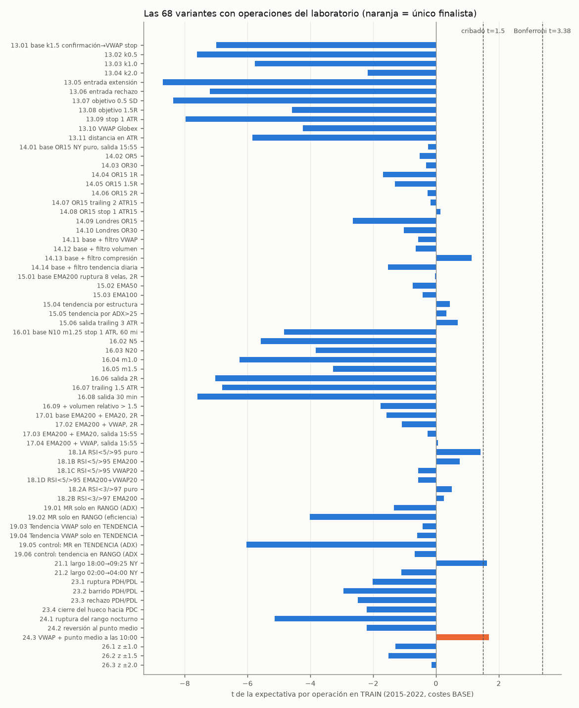
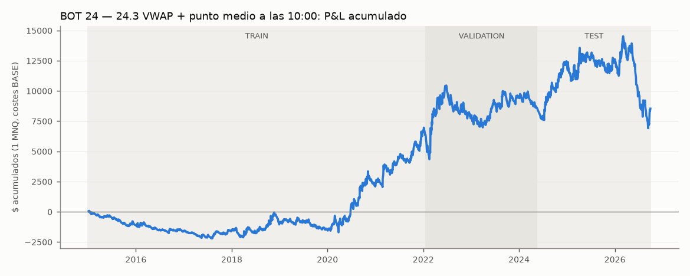
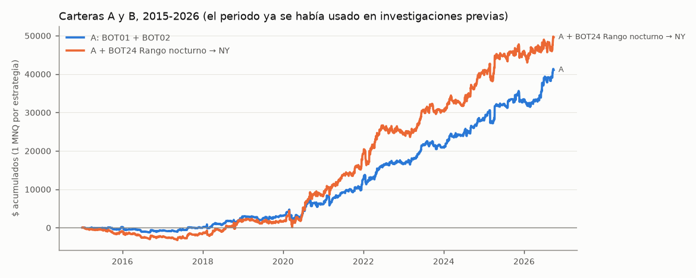

# TRADING BOT LAB — FINAL REPORT

30-sep-2026 · experimentos `20260930_0858_investigacion` (investigación, sin TEST en memoria) y `20260930_0900_test` (apertura única del TEST) · reproducible con `python -m bot_lab.run_lab investigacion`, `python -m bot_lab.run_lab test` y `python -m bot_lab.generar_informe`.

## Veredicto

### NO HAY NUEVO EDGE ROBUSTO.

- Se probaron **70 variantes pre-registradas** de 11 familias nuevas (BOT 13-19, 21, 23, 24 y 26), con las reglas fijadas y guardadas en git antes de ejecutar.
- Solo **1 variante** pasó el cribado en TRAIN y la VALIDATION: **BOT 24 — 24.3 VWAP + punto medio a las 10:00**.
  - En el TEST (abierto una sola vez con la variante congelada) dio **+0.19 $ por operación** en 426 operaciones (t = 0.02, PF 1.00). Es decir, **cero**.
  - La clasificación automática la deja en **B — PROMISING**, pero solo porque 0.19 > 0 de forma técnica.
  - **Lectura del analista:** no hay evidencia de ventaja. El IC 95 % incluye el 0, el walk-forward no es positivo, empeora la cartera actual y en 2026 pierde. Lo más probable es que sea **ruido seleccionado**: 1 de 70 variantes con t ≈ 1,7 es lo que se espera por azar.
- La mayoría de las familias intradía pierden aproximadamente lo que cuestan los costes (≈ 3 $ por operación con 1 MNQ). Es la firma de un mercado sin ventaja explotable con esas reglas, y coincide con la prueba de control del motor con entradas aleatorias.
- **BOT 01 (RSI(2)) y BOT 02 (zona de ruido) siguen siendo las únicas estrategias con evidencia.** Ninguna idea nueva mejora su cartera.

**Advertencias que condicionan todo lo anterior:**
1. 2015-2026 ya se había usado en investigaciones anteriores del proyecto, así que ningún tramo es fuera de muestra puro. El único dato nuevo es el forward test que empezó el 30-sep-2026.
2. **Pruebas múltiples.** El laboratorio tiene 70 variantes y el proyecto, unas 25 ideas anteriores. Con 70 variantes, la t que exigiría Bonferroni es **3.38**, y ninguna variante nueva se acerca.
3. BOT 25/26 NQ-ES **no se han probado**: faltan los datos de ES (15,06 $ en Databento; pendiente de tu autorización).

## Panel (dashboard)

Las cifras son de la variante elegida de cada BOT:
- **No finalistas:** solo TRAIN.
- **Finalista:** 2015-2026 completo.
- **BOT 01/02:** su código original, 2015-2026.

Nota: el P&L del BOT 26 va en $ por 25.000 $ nocionales por pata; el resto, en $ por 1 MNQ.

| BOT | Hipótesis | Marco | Sesión | Ops | PF | Expect. $ | IC95 $ | Max DD $ | Sharpe | Walk-forward | Costes ×2 | Estabilidad | MC P(año<0) % | Régimen | Estado |
|---|---|---|---|---|---|---|---|---|---|---|---|---|---|---|---|
| 01 | RSI(2) Connors diario | 1D | CME | 158 | 1.69 | 125.45 | (20.62, 226.93) | -2 977.00 | 0.68 | — (ya validada) | 121.45 | ver auditoría | 23.50 |  | Validada (auditoría 30-sep), en forward test |
| 02 | Zona de ruido (Zarattini) | 1m | NY 10:00-15:30 | 2 725 | 1.20 | 7.79 | (3.14, 12.87) | -3 645.00 | 0.79 | — (ya validada) | 4.79 | ver auditoría | 16.40 |  | Validada (auditoría 30-sep), en forward test |
| 13 | VWAP mean reversion | 5m | NY 10:00-15:00 (salida 15:55) | 2 560 | 0.88 | -1.82 | — | — | — | no llega | no llega | no llega | no llega | — | E — NEGATIVE |
| 14 | Opening range breakout | 1m | NY 09:30-12:00 (salida 15:55) / Londres | 871 | 1.12 | 3.79 | — | — | — | no llega | no llega | no llega | no llega | — | E — NEGATIVE |
| 15 | Trend following | 15m | NY 10:00-15:00 (salida 15:55) | 1 907 | 1.05 | 1.32 | — | — | — | no llega | no llega | no llega | no llega | — | E — NEGATIVE |
| 16 | Momentum breakout | 5m | NY 09:45-15:30 | 3 102 | 0.90 | -1.62 | — | — | — | no llega | no llega | no llega | no llega | — | E — NEGATIVE |
| 17 | Pullback trend | 5m | NY 10:00-15:00 (salida 15:55) | 2 740 | 1.00 | 0.12 | — | — | — | no llega | no llega | no llega | no llega | — | E — NEGATIVE |
| 18 | RSI(2) extremo + filtro de tendencia | 1D | sesión CME completa | 134 | 1.41 | 43.87 | — | — | — | no llega | no llega | no llega | no llega | — | E — NEGATIVE |
| 19 | VWAP + régimen | 5m | NY 10:00-15:00 (salida 15:55) | 1 295 | 0.97 | -0.97 | — | — | — | no llega | no llega | no llega | no llega | — | E — NEGATIVE |
| 21 | Hora del día (deriva nocturna) | 1m | noche | 1 766 | 1.14 | 4.90 | — | — | — | no llega | no llega | no llega | no llega | — | E — NEGATIVE (falla VALIDATION) |
| 23 | Niveles del día anterior | 5m | NY 09:35-15:00 (salida 15:55) | 850 | 0.83 | -2.87 | — | — | — | no llega | no llega | no llega | no llega | — | E — NEGATIVE |
| 24 | Rango nocturno → NY | 5m | NY 09:35-11:30 (salida 15:55) | 2 195 | 1.08 | 3.89 | (-3.13, 10.75) | -7 609.00 | 0.33 | 3.29 $/op, 45 % ventanas + | 0.83 | 0.90 | 37.50 | mejor en vol. NORMAL | B — PROMISING (analista: sin evidencia) |
| 26 | Spread estadístico oro/plata | 1D | día UTC | 74 | 0.96 | -20.82 | — | — | — | no llega | no llega | no llega | no llega | — | E — NEGATIVE |
| 25/26 NQ-ES | Divergencia / spread NQ-ES | — | — | — | — | — | — | — | — | — | — | — | — | — | PENDIENTE (sin datos de ES) |

## Respuestas a las 12 preguntas

**1. ¿Qué hipótesis nuevas muestran evidencia de edge?**

Ninguna con evidencia suficiente. La única finalista (BOT 24.3) desaparece en el TEST.

**2. ¿Cuáles son probablemente ruido?**

Todas las nuevas:
- **Negativas con claridad** (t en TRAIN entre −2 y −8): la reversión al VWAP (13), el momentum de ruptura (16), los niveles del día anterior (23) y la ruptura o reversión del rango nocturno (24.1 y 24.2).
- **Nulas** (|t| < 1,2): ORB (14), tendencia (15), retroceso (17) y régimen + VWAP (19).
- **Positivas en TRAIN pero caen después:** RSI(2) extremo (18), con t 1,4 e insuficiente; deriva nocturna (21), que falla la VALIDATION; y 24.3, que falla el TEST.
- **Spread oro/plata (26):** negativo.

**3. ¿Cuáles sobreviven a costes ×2 y ×3?**

BOT 24: ×2 → +0.83 $/op (casi cero); ×3 → -2.06 $/op (negativa). Es frágil ante los costes.

Las demás no llegaron a esta prueba: ya pierden con costes BASE.

La auditoría del 30-sep comprobó que BOT 01 y 02 sobreviven con ×2 y ×3.

**4. ¿Cuáles sobreviven al walk-forward?**

BOT 24:
- **Con re-selección:** +3.29 $/op, t 1.02, 45 % de 42 ventanas positivas. **No pasa** (hace falta ≥ 50 % de ventanas positivas y expectativa > 0).
- **Con parámetros fijos:** 60 % de ventanas positivas, pero concentrado en 2020-2022.

**5. ¿Cuáles tienen estabilidad de parámetros?**

BOT 24: estabilidad 0.90. Hay meseta en el stop (1,6 / 2 / 2,4 ATR dan resultados parecidos), pero los años positivos son solo 58%. Una meseta sobre una ventaja que no existe no ayuda.

**6. ¿Cuáles funcionan solo en determinados regímenes?**

BOT 24: todo su resultado viene de los días **RANGO** (ER20 ≤ 0,3): +7.09 $/op frente a -2.13 en TENDENCIA. Por años, de 2020-2021 y 2024. No se filtra por régimen a posteriori, porque sería ajustar al pasado.

**7. ¿Cuáles diversifican mejor RSI2 y Noise Zone?**

BOT24 Rango nocturno → NY: correlación diaria +0.01 con RSI(2) y +0.40 con la zona de ruido. **No diversifica**: también es una estrategia de apertura de NY en la dirección del VWAP, como la zona de ruido.

**8. ¿Cuál sería la cartera histórica más robusta?**

La **cartera A (BOT01 + BOT02, 1+1 MNQ)**: Sharpe 1.05, DD máximo -4,188 $ y 11/12 años positivos.
Añadir el BOT 24 la **empeora**: Sharpe 0.93, DD -4,764 $ y P(DD ≥ 5.000 $ en un año) del 10.2 % frente al 2.4 %.

**9. ¿Cuál es el drawdown máximo histórico y el de Monte Carlo?**

Cartera A (1+1 MNQ, capital de 25.000 $):
- **Histórico:** -4,188 $.
- **Monte Carlo a 1 año** (bootstrap por bloques): mediana -1,890 $, p95 -4,321 $, p99 -5,857 $.
- **Probabilidades:** año negativo 12.4 %; DD ≥ 5.000 $ 2.4 %.

**10. ¿Cuántas operaciones produce cada bot?**

Ver la columna Ops del panel.
- **Referencia por año:** BOT 01 ≈ 13; BOT 02 ≈ 230; BOT 24.3 ≈ 185.
- **Familias nuevas intradía:** 100-1.100 al año según la variante.

**11. ¿Cuánto habría que esperar para tener evidencia suficiente?**

Número de operaciones para t = 2 con la expectativa y la dispersión observadas, dividido entre las operaciones al año:

| estrategia | operaciones/año | operaciones para t=2 | años |
|---|---|---|---|
| BOT 01 RSI(2) | 13.00 | 111.00 | 8.50 |
| BOT 02 zona de ruido | 226.90 | 1 657.00 | 7.30 |
| BOT 24 (finalista) | 182.70 | 6 768.00 | 37.00 |

Son cifras con la ventaja histórica. Si la ventaja real es la mitad, hace falta el cuádruple. Para el forward test, lo razonable sigue siendo:
- **Zona de ruido:** ~150 operaciones (≈ 6-8 meses) para comprobar que se comporta como el backtest. Confirmarla estadísticamente lleva años.
- **RSI(2):** años, porque opera muy poco.

**12. ¿Qué debería pasar a forward testing?**

**Ninguna estrategia nueva.**
- BOT 01 y BOT 02 siguen en su forward test en la demo, sin cambios.
- Si quieres, el BOT 24.3 se puede **observar en papel** (sin dinero ni demo), solo para ver si reaparece. Mi recomendación es no dedicarle recursos.

## Detalle del cribado (TRAIN 2015-01 → 2022-01, costes BASE, 1 MNQ)

La regla de selección es fija: gana la variante con mayor t y muestra suficiente, y en empate gana la base. Así, la "elegida" de una familia negativa es simplemente su variante menos mala.

### BOT 13 — VWAP mean reversion
_Hipótesis: Cuando NQ se aleja significativamente del VWAP de la sesión, el precio tiende a volver hacia el VWAP._

| variante | operaciones | expectativa_$ | t | profit_factor | acierto_% | neto_$ |
|---|---|---|---|---|---|---|
| 13.01 base k1.5 confirmación→VWAP stop extremo | 3 378.00 | -4.34 | -6.99 | 0.71 | 41.80 | -14 651.00 |
| 13.02 k0.5 | 3 018.00 | -3.36 | -7.61 | 0.60 | 56.60 | -10 127.00 |
| 13.03 k1.0 | 3 412.00 | -3.40 | -5.76 | 0.74 | 54.60 | -11 616.00 |
| 13.04 k2.0 | 2 560.00 | -1.82 | -2.17 | 0.88 | 34.40 | -4 658.00 |
| 13.05 entrada extensión | 3 356.00 | -3.05 | -8.70 | 0.59 | 12.40 | -10 240.00 |
| 13.06 entrada rechazo | 3 479.00 | -4.15 | -7.20 | 0.70 | 44.20 | -14 430.00 |
| 13.07 objetivo 0.5 SD | 3 357.00 | -4.36 | -8.36 | 0.66 | 47.10 | -14 640.00 |
| 13.08 objetivo 1.5R | 3 360.00 | -3.48 | -4.58 | 0.81 | 37.10 | -11 691.00 |
| 13.09 stop 1 ATR | 3 377.00 | -4.81 | -7.98 | 0.69 | 40.10 | -16 235.00 |
| 13.10 VWAP Globex | 2 845.00 | -3.76 | -4.23 | 0.80 | 37.20 | -10 693.00 |
| 13.11 distancia en ATR | 3 060.00 | -3.72 | -5.84 | 0.74 | 53.40 | -11 369.00 |

Elegida: **13.04 k2.0** (mayor t en TRAIN (-2.17) entre 11 variantes con ≥ 100 operaciones). Resultado: **E**.

### BOT 14 — Opening range breakout
_Hipótesis: La ruptura del rango inicial de una sesión captura la expansión de volatilidad posterior._

| variante | operaciones | expectativa_$ | t | profit_factor | acierto_% | neto_$ |
|---|---|---|---|---|---|---|
| 14.01 base OR15 NY puro, salida 15:55 | 1 771.00 | -0.72 | -0.25 | 0.98 | 38.70 | -1 282.00 |
| 14.02 OR5 | 1 785.00 | -1.34 | -0.52 | 0.96 | 28.40 | -2 398.00 |
| 14.03 OR30 | 1 715.00 | -0.95 | -0.32 | 0.98 | 42.20 | -1 636.00 |
| 14.04 OR15 1R | 1 771.00 | -3.62 | -1.69 | 0.90 | 49.60 | -6 412.00 |
| 14.05 OR15 1.5R | 1 771.00 | -3.21 | -1.31 | 0.92 | 43.10 | -5 679.00 |
| 14.06 OR15 2R | 1 771.00 | -0.70 | -0.26 | 0.98 | 41.20 | -1 248.00 |
| 14.07 OR15 trailing 2 ATR15 | 1 771.00 | -0.29 | -0.17 | 0.99 | 35.30 | -511.00 |
| 14.08 OR15 stop 1 ATR15 | 1 771.00 | 0.27 | 0.14 | 1.01 | 16.50 | 486.00 |
| 14.09 Londres OR15 | 1 775.00 | -3.74 | -2.65 | 0.82 | 29.80 | -6 632.00 |
| 14.10 Londres OR30 | 1 737.00 | -1.61 | -1.02 | 0.93 | 37.50 | -2 794.00 |
| 14.11 base + filtro VWAP | 1 484.00 | -1.73 | -0.56 | 0.96 | 38.50 | -2 566.00 |
| 14.12 base + filtro volumen | 902.00 | -2.81 | -0.65 | 0.94 | 39.00 | -2 530.00 |
| 14.13 base + filtro compresión | 871.00 | 3.79 | 1.13 | 1.12 | 37.20 | 3 304.00 |
| 14.14 base + filtro tendencia diaria | 1 193.00 | -5.05 | -1.52 | 0.88 | 37.90 | -6 022.00 |

Elegida: **14.13 base + filtro compresión** (mayor t en TRAIN (1.13) entre 14 variantes con ≥ 100 operaciones). Resultado: **E**.

### BOT 15 — Trend following
_Hipótesis: Cuando NQ presenta una tendencia suficientemente fuerte, las rupturas a su favor tienen expectativa positiva._

| variante | operaciones | expectativa_$ | t | profit_factor | acierto_% | neto_$ |
|---|---|---|---|---|---|---|
| 15.01 base EMA200 ruptura 8 velas, 2R | 2 233.00 | -0.04 | -0.03 | 1.00 | 41.60 | -93.00 |
| 15.02 EMA50 | 2 595.00 | -1.13 | -0.74 | 0.96 | 40.50 | -2 938.00 |
| 15.03 EMA100 | 2 408.00 | -0.67 | -0.42 | 0.98 | 41.10 | -1 611.00 |
| 15.04 tendencia por estructura | 1 470.00 | 0.85 | 0.44 | 1.03 | 41.60 | 1 252.00 |
| 15.05 tendencia por ADX>25 | 1 726.00 | 0.61 | 0.33 | 1.02 | 41.10 | 1 052.00 |
| 15.06 salida trailing 3 ATR | 1 907.00 | 1.32 | 0.70 | 1.05 | 39.30 | 2 516.00 |

Elegida: **15.06 salida trailing 3 ATR** (mayor t en TRAIN (0.70) entre 6 variantes con ≥ 100 operaciones). Resultado: **E**.

### BOT 16 — Momentum breakout
_Hipótesis: Una expansión repentina de volatilidad con ruptura del rango reciente continúa durante cierto tiempo._

| variante | operaciones | expectativa_$ | t | profit_factor | acierto_% | neto_$ |
|---|---|---|---|---|---|---|
| 16.01 base N10 m1.25 stop 1 ATR, 60 min | 6 267.00 | -2.79 | -4.84 | 0.82 | 26.50 | -17 491.00 |
| 16.02 N5 | 7 964.00 | -2.86 | -5.58 | 0.82 | 26.60 | -22 777.00 |
| 16.03 N20 | 4 795.00 | -2.54 | -3.83 | 0.83 | 26.30 | -12 184.00 |
| 16.04 m1.0 | 7 856.00 | -3.12 | -6.25 | 0.80 | 27.30 | -24 536.00 |
| 16.05 m1.5 | 4 667.00 | -2.25 | -3.28 | 0.85 | 25.70 | -10 491.00 |
| 16.06 salida 2R | 7 827.00 | -2.91 | -7.03 | 0.81 | 32.20 | -22 772.00 |
| 16.07 trailing 1.5 ATR | 6 505.00 | -3.21 | -6.81 | 0.76 | 27.40 | -20 877.00 |
| 16.08 salida 30 min | 6 821.00 | -3.40 | -7.59 | 0.75 | 31.20 | -23 208.00 |
| 16.09 + volumen relativo > 1.5 | 3 102.00 | -1.62 | -1.76 | 0.90 | 27.50 | -5 020.00 |

Elegida: **16.09 + volumen relativo > 1.5** (mayor t en TRAIN (-1.76) entre 9 variantes con ≥ 100 operaciones). Resultado: **E**.

### BOT 17 — Pullback trend
_Hipótesis: En una tendencia establecida, entrar tras un retroceso ofrece mejor relación riesgo/beneficio que perseguir la ruptura._

| variante | operaciones | expectativa_$ | t | profit_factor | acierto_% | neto_$ |
|---|---|---|---|---|---|---|
| 17.01 base EMA200 + EMA20, 2R | 4 170.00 | -1.65 | -1.57 | 0.93 | 36.90 | -6 897.00 |
| 17.02 EMA200 + VWAP, 2R | 3 084.00 | -1.46 | -1.08 | 0.94 | 35.80 | -4 502.00 |
| 17.03 EMA200 + EMA20, salida 15:55 | 3 365.00 | -0.40 | -0.26 | 0.98 | 30.90 | -1 333.00 |
| 17.04 EMA200 + VWAP, salida 15:55 | 2 740.00 | 0.12 | 0.07 | 1.00 | 30.80 | 335.00 |

Elegida: **17.04 EMA200 + VWAP, salida 15:55** (mayor t en TRAIN (0.07) entre 4 variantes con ≥ 100 operaciones). Resultado: **E**.

### BOT 18 — RSI(2) extremo + filtro de tendencia
_Hipótesis: La reversión tras un extremo de RSI(2) funciona mejor cuando el mercado no está en una tendencia extrema en contra._

| variante | operaciones | expectativa_$ | t | profit_factor | acierto_% | neto_$ |
|---|---|---|---|---|---|---|
| 18.1A RSI<5/>95 puro | 134.00 | 43.87 | 1.42 | 1.41 | 54.50 | 5 879.00 |
| 18.1B RSI<5/>95 EMA200 | 31.00 | 56.29 | 0.76 | 1.43 | 71.00 | 1 745.00 |
| 18.1C RSI<5/>95 VWAP20 | 4.00 | -37.37 | -0.57 | 0.49 | 50.00 | -149.00 |
| 18.1D RSI<5/>95 EMA200+VWAP20 | 4.00 | -37.37 | -0.57 | 0.49 | 50.00 | -149.00 |
| 18.2A RSI<3/>97 puro | 77.00 | 19.26 | 0.50 | 1.17 | 50.60 | 1 483.00 |
| 18.2B RSI<3/>97 EMA200 | 17.00 | 25.29 | 0.26 | 1.21 | 58.80 | 430.00 |
| 18.2C RSI<3/>97 VWAP20 | 0.00 | — | — | — | — | 0.00 |
| 18.2D RSI<3/>97 EMA200+VWAP20 | 0.00 | — | — | — | — | 0.00 |

Elegida: **18.1A RSI<5/>95 puro** (mayor t en TRAIN (1.42) entre 3 variantes con ≥ 30 operaciones). Resultado: **E**.

### BOT 19 — VWAP + régimen
_Hipótesis: La reversión al VWAP funciona en rango y falla en tendencia; en tendencia funciona la continuación a favor del VWAP._

| variante | operaciones | expectativa_$ | t | profit_factor | acierto_% | neto_$ |
|---|---|---|---|---|---|---|
| 19.01 MR solo en RANGO (ADX) | 975.00 | -1.33 | -1.33 | 0.89 | 44.50 | -1 297.00 |
| 19.02 MR solo en RANGO (eficiencia) | 1 963.00 | -3.26 | -4.01 | 0.77 | 45.10 | -6 393.00 |
| 19.03 Tendencia VWAP solo en TENDENCIA (ADX) | 1 295.00 | -0.97 | -0.43 | 0.97 | 36.80 | -1 260.00 |
| 19.04 Tendencia VWAP solo en TENDENCIA (eficiencia) | 135.00 | -5.36 | -0.60 | 0.86 | 32.60 | -723.00 |
| 19.05 control: MR en TENDENCIA (ADX) | 2 563.00 | -4.94 | -6.03 | 0.71 | 38.90 | -12 665.00 |
| 19.06 control: tendencia en RANGO (ADX) | 1 520.00 | -1.24 | -0.67 | 0.95 | 34.50 | -1 883.00 |

Elegida: **19.03 Tendencia VWAP solo en TENDENCIA (ADX)** (mayor t en TRAIN (-0.43) entre 4 variantes con ≥ 100 operaciones). Resultado: **E**.

### BOT 21 — Hora del día (deriva nocturna)
_Hipótesis: Los rendimientos de los futuros de índices de EE. UU. se concentran fuera del horario regular, sobre todo en torno a la apertura europea (Boyarchenko, Larsen y Whelan, 2023)._

| variante | operaciones | expectativa_$ | t | profit_factor | acierto_% | neto_$ |
|---|---|---|---|---|---|---|
| 21.1 largo 18:00→09:25 NY | 1 766.00 | 4.90 | 1.62 | 1.14 | 54.20 | 8 648.00 |
| 21.2 largo 02:00→04:00 NY | 1 789.00 | -1.39 | -1.10 | 0.92 | 45.40 | -2 496.00 |

Elegida: **21.1 largo 18:00→09:25 NY** (mayor t en TRAIN (1.62) entre 2 variantes con ≥ 100 operaciones). Resultado: **pasa**; VALIDATION: 587 op., -5.35 $/op, PF 0.93 → **E**.

### BOT 23 — Niveles del día anterior
_Hipótesis: El máximo, el mínimo y el cierre de la sesión regular anterior son zonas de liquidez donde el precio reacciona de forma medible._

| variante | operaciones | expectativa_$ | t | profit_factor | acierto_% | neto_$ |
|---|---|---|---|---|---|---|
| 23.1 ruptura PDH/PDL | 850.00 | -2.87 | -2.01 | 0.83 | 32.20 | -2 438.00 |
| 23.2 barrido PDH/PDL | 347.00 | -4.81 | -2.95 | 0.65 | 32.00 | -1 668.00 |
| 23.3 rechazo PDH/PDL | 99.00 | -13.17 | -2.49 | 0.47 | 23.20 | -1 304.00 |
| 23.4 cierre del hueco hacia PDC | 890.00 | -9.86 | -2.21 | 0.81 | 47.30 | -8 774.00 |

Elegida: **23.1 ruptura PDH/PDL** (mayor t en TRAIN (-2.01) entre 3 variantes con ≥ 100 operaciones). Resultado: **E**.

### BOT 24 — Rango nocturno → NY
_Hipótesis: La relación entre el rango nocturno y la apertura de NY contiene información sobre expansión o reversión._

| variante | operaciones | expectativa_$ | t | profit_factor | acierto_% | neto_$ |
|---|---|---|---|---|---|---|
| 24.1 ruptura del rango nocturno | 1 374.00 | -4.87 | -5.14 | 0.70 | 31.90 | -6 691.00 |
| 24.2 reversión al punto medio | 1 272.00 | -3.53 | -2.20 | 0.83 | 38.10 | -4 490.00 |
| 24.3 VWAP + punto medio a las 10:00 | 1 312.00 | 4.86 | 1.69 | 1.16 | 28.30 | 6 381.00 |

Elegida: **24.3 VWAP + punto medio a las 10:00** (mayor t en TRAIN (1.69) entre 3 variantes con ≥ 100 operaciones). Resultado: **pasa**; VALIDATION: 457 op., +4.53 $/op, PF 1.06 → **finalista**.

### BOT 26 — Spread estadístico oro/plata
_Hipótesis: Los extremos del z-score del spread normalizado oro/plata revierten._

| variante | operaciones | expectativa_$ | t | profit_factor | acierto_% | neto_$ |
|---|---|---|---|---|---|---|
| 26.1 z ±1.0 | 158.00 | -118.25 | -1.29 | 0.75 | 53.20 | -18 683.00 |
| 26.2 z ±1.5 | 107.00 | -184.60 | -1.51 | 0.66 | 50.50 | -19 752.00 |
| 26.3 z ±2.0 | 74.00 | -20.82 | -0.14 | 0.96 | 59.50 | -1 540.00 |

Elegida: **26.3 z ±2.0** (mayor t en TRAIN (-0.14) entre 3 variantes con ≥ 30 operaciones). Resultado: **E**.

## Finalista BOT 24 — 24.3 VWAP + punto medio a las 10:00 (evaluación completa, 2015-2026)

**Por tramo:**
|  | operaciones | expectativa_$ | t | profit_factor | neto_$ | acierto_% |
|---|---|---|---|---|---|---|
| TRAIN | 1 312.00 | 4.86 | 1.69 | 1.16 | 6 381.00 | 28.30 |
| VALIDATION | 457.00 | 4.53 | 0.49 | 1.06 | 2 070.00 | 29.50 |
| TEST | 426.00 | 0.19 | 0.02 | 1.00 | 79.00 | 33.30 |

**Métricas completas** (1 MNQ, capital de referencia 25.000 $):

| métrica | valor |
|---|---|
| operaciones | 2 195 |
| operaciones_por_año | 182.70 |
| acierto_% | 29.50 |
| ganancia_media_$ | 186.99 |
| perdida_media_$ | -72.81 |
| payoff | 2.57 |
| ganancia_bruta_$ | 121 171.00 |
| perdida_bruta_$ | -112 642.00 |
| neto_$ | 8 529.00 |
| costes_$ | 4 390.00 |
| profit_factor | 1.08 |
| expectativa_$ | 3.89 |
| t | 1.14 |
| IC95_iid_$ | (-2.80, 10.57) |
| max_dd_$ | -7 609.00 |
| dd_medio_$ | -656.00 |
| sharpe | 0.33 |
| sortino | 0.67 |
| calmar | 0.09 |
| neto_anual_$ | 710.00 |
| racha_perdedora | 16 |
| racha_ganadora | 5 |
| duracion_media_min | 149.80 |
| duracion_mediana_min | 65.00 |
| mediana_$ | -28.27 |
| p5_$ | -172.60 |
| p25_$ | -82.90 |
| p75_$ | 31.50 |
| p95_$ | 341.30 |
| asimetria | 2.02 |
| curtosis_exceso | 6.32 |
| peor_operacion_$ | -432.00 |
| mejor_operacion_$ | 1 260.00 |
| peor_dia_$ | -432.00 |
| peor_semana_$ | -1 050.00 |
| peor_mes_$ | -2 267.00 |
| peor_año_$ | -4 087.00 |
| mes_medio_$ | 60.00 |
| meses_positivos_% | 48.20 |
| años_positivos | 7/12 |
| frac_años_positivos | 0.58 |
| expectativa_R | 0.05 |
| MAE_medio_R | 0.93 |
| MFE_medio_R | 1.71 |
| MAE_medio_pts | 33.25 |
| MFE_medio_pts | 59.45 |

**Resultado por año ($):** 2015: -1,113, 2016: -461, 2017: -43, 2018: +562, 2019: -458, 2020: +3,619, 2021: +4,641, 2022: +1,153, 2023: +1,532, 2024: +2,724, 2025: +460, 2026: -4,087

**IC 95 % de la expectativa por bloques de 20 sesiones:** (-3.13, 10.75) $. **TEST:** (-23.63, 23.21) $.

**Costes:**
|  | operaciones | expectativa_$ | t | profit_factor | neto_$ | acierto_% |
|---|---|---|---|---|---|---|
| BASE | 2 195.00 | 3.89 | 1.14 | 1.08 | 8 529.00 | 29.50 |
| STRESS_1 | 2 195.00 | 0.83 | 0.24 | 1.01 | 1 813.00 | 28.40 |
| STRESS_2 | 2 195.00 | -2.06 | -0.60 | 0.96 | -4 518.00 | 27.80 |

**Walk-forward (12 meses de entrenamiento, 3 de prueba):**
|  | operaciones | neto_$ | expectativa_$ | t | ventanas | ventanas_con_ops | ventanas_positivas_% |
|---|---|---|---|---|---|---|---|
| reseleccion | 1 954.00 | 6 422.00 | 3.29 | 1.02 | 42.00 | 42.00 | 45.20 |
| fija | 1 958.00 | 11 057.00 | 5.65 | 1.53 | 42.00 | 42.00 | 59.50 |

**Sensibilidad (vecindad pre-registrada):**
| variante | operaciones | expectativa_$ | t | profit_factor | neto_$ | acierto_% |
|---|---|---|---|---|---|---|
| (elegida) | 2 195.00 | 3.89 | 1.14 | 1.08 | 8 529.00 | 29.50 |
| atr_k=1.6 | 2 195.00 | 3.78 | 1.21 | 1.08 | 8 306.00 | 24.80 |
| atr_k=2.4 | 2 195.00 | 4.89 | 1.22 | 1.09 | 10 728.00 | 33.40 |

**Estabilidad:** {'vecinos_positivos': 1.0, 'años_positivos': 0.58, 'regimenes_vol_positivos': 1.0, 'costes_x2_positivo': 1.0, 'estabilidad': 0.9}

**Por vol:**
| vol | operaciones | neto_$ | expectativa_$ | t | PF |
|---|---|---|---|---|---|
| BAJA | 311.00 | 516.00 | 1.66 | 0.31 | 1.06 |
| NORMAL | 1 057.00 | 6 422.00 | 6.08 | 1.36 | 1.13 |
| ALTA | 640.00 | 2 634.00 | 4.12 | 0.47 | 1.05 |
| sin dato | 187.00 | -1 042.00 | -5.57 | -2.00 | 0.69 |

**Por tendencia:**
| tendencia | operaciones | neto_$ | expectativa_$ | t | PF |
|---|---|---|---|---|---|
| TENDENCIA | 742.00 | -1 580.00 | -2.13 | -0.41 | 0.96 |
| RANGO | 1 436.00 | 10 187.00 | 7.09 | 1.59 | 1.13 |
| sin dato | 17.00 | -77.00 | -4.53 | -0.38 | 0.79 |

**Por dia:**
| dia | operaciones | neto_$ | expectativa_$ | t | PF |
|---|---|---|---|---|---|
| lunes | 439.00 | 6 051.00 | 13.78 | 1.91 | 1.32 |
| martes | 448.00 | 1 329.00 | 2.97 | 0.41 | 1.06 |
| miércoles | 425.00 | -212.00 | -0.50 | -0.07 | 0.99 |
| jueves | 448.00 | 2 536.00 | 5.66 | 0.66 | 1.10 |
| viernes | 435.00 | -1 175.00 | -2.70 | -0.36 | 0.95 |

**Por año:**
| año | operaciones | neto_$ | expectativa_$ | t | PF |
|---|---|---|---|---|---|
| 2 015 | 191.00 | -1 113.00 | -5.83 | -2.14 | 0.68 |
| 2 016 | 199.00 | -461.00 | -2.32 | -0.71 | 0.86 |
| 2 017 | 187.00 | -43.00 | -0.23 | -0.08 | 0.98 |
| 2 018 | 187.00 | 562.00 | 3.01 | 0.42 | 1.09 |
| 2 019 | 185.00 | -458.00 | -2.48 | -0.53 | 0.90 |
| 2 020 | 171.00 | 3 619.00 | 21.16 | 1.55 | 1.39 |
| 2 021 | 185.00 | 4 641.00 | 25.09 | 2.09 | 1.51 |
| 2 022 | 202.00 | 1 153.00 | 5.71 | 0.34 | 1.06 |
| 2 023 | 196.00 | 1 532.00 | 7.82 | 0.68 | 1.13 |
| 2 024 | 180.00 | 2 724.00 | 15.13 | 1.07 | 1.24 |
| 2 025 | 179.00 | 460.00 | 2.57 | 0.15 | 1.03 |
| 2 026 | 133.00 | -4 087.00 | -30.73 | -1.35 | 0.76 |

**Por direccion:**
| lado | operaciones | neto_$ | expectativa_$ | t | PF |
|---|---|---|---|---|---|
| CORTO | 986.00 | 2 322.00 | 2.35 | 0.43 | 1.04 |
| LARGO | 1 209.00 | 6 208.00 | 5.13 | 1.21 | 1.11 |

**Monte Carlo (1 año, bloques de 20 sesiones):**
| medida | valor |
|---|---|
| P&L_año_p5_$ | -3 017.00 |
| P&L_año_p50_$ | 669.00 |
| P&L_año_p95_$ | 4 510.00 |
| prob_año_negativo_% | 37.50 |
| max_dd_p50_$ | -1 912.00 |
| max_dd_p95_$ | -4 343.00 |
| max_dd_p99_$ | -5 544.00 |
| prob_dd_≥2500_% | 30.00 |
| prob_dd_≥5000_% | 2.00 |
| prob_ruina_50%_capital_% | 0.00 |

**Criterios de clasificación:**
| criterio | cumple |
|---|---|
| 1 PF > 1.15 | no |
| 2 expectativa > 0 | sí |
| 3 IC95 bloques > 0 | no |
| 4 operaciones ≥ 200 | sí |
| 5 walk-forward positivo | no |
| 6 estabilidad ≥ 0.70 | sí |
| 7 costes ×2 positivo | sí |
| 8 años positivos ≥ 60 % | no |
| 9 P(año negativo) < 30 % | no |
| 10 neto anual / |DD| ≥ 0.33 | no |
| 11 TEST > 0 | sí |

**Clase automática: B — PROMISING.**

**Lectura del analista: sin evidencia.**
- El TEST da +0.19 $/op.
- La t de 2015-2026 es 1.14, lejos de la de Bonferroni (3.38).
- El walk-forward no pasa y hay 2026 negativo.
- Se correlaciona con la zona de ruido y empeora la cartera.

## BOT 01 y BOT 02 con las mismas métricas (código original, 2015-2026)

**BOT 01 RSI(2):**
- 158 operaciones, PF 1.69, +125.45 $/op, t 2.39.
- IC 95 % por bloques (20.62, 226.93); Sharpe 0.68; DD máximo -2,977 $.
- Costes ×2: +121.45 $/op; ×3: +117.46 $/op.
- Tramo 2024-05 → 2026-09: 39 op., +267.40 $/op. No es fuera de muestra: sus reglas se eligieron viendo ese periodo.

Por régimen de volatilidad:
| vol | operaciones | neto_$ | expectativa_$ | t | PF |
|---|---|---|---|---|---|
| BAJA | 28.00 | 5 920.00 | 211.45 | 3.35 | 8.38 |
| NORMAL | 83.00 | 1 513.00 | 18.22 | 0.24 | 1.08 |
| ALTA | 44.00 | 12 287.00 | 279.24 | 2.48 | 2.56 |
| sin dato | 3.00 | 102.00 | 33.83 | 0.28 | 1.56 |

**BOT 02 zona de ruido:**
- 2725 operaciones, PF 1.20, +7.79 $/op, t 2.56.
- IC 95 % por bloques (3.14, 12.87); Sharpe 0.79; DD máximo -3,645 $.
- Costes ×2: +4.79 $/op; ×3: +1.79 $/op.
- Tramo 2024-05 → 2026-09: 530 op., +12.30 $/op. No es fuera de muestra: sus reglas se eligieron viendo ese periodo.

Por régimen de volatilidad:
| vol | operaciones | neto_$ | expectativa_$ | t | PF |
|---|---|---|---|---|---|
| BAJA | 445.00 | -326.00 | -0.73 | -0.15 | 0.97 |
| NORMAL | 1 279.00 | 5 863.00 | 4.58 | 1.27 | 1.12 |
| ALTA | 793.00 | 15 814.00 | 19.94 | 2.44 | 1.36 |
| sin dato | 208.00 | -120.00 | -0.57 | -0.21 | 0.96 |

## BOT 20, 21 y 22 — regímenes, hora y día (investigación, solo TRAIN)

**BOT 20. Expectativa ($/op) de la variante elegida de cada BOT por régimen de volatilidad** (ATR14/ATR250 del día anterior):

| BOT | BAJA | NORMAL | ALTA |
|---|---|---|---|
| BOT 13 | -2.25 (385) | -2.42 (1027) | -0.85 (813) |
| BOT 14 | +0.91 (152) | +2.89 (348) | +10.35 (256) |
| BOT 15 | -0.19 (300) | -1.24 (755) | +7.59 (579) |
| BOT 16 | -1.75 (587) | -1.28 (1267) | -1.96 (785) |
| BOT 17 | -4.45 (446) | -0.45 (1093) | +4.14 (820) |
| BOT 18 | +34.50 (23) | +27.79 (64) | +103.74 (29) |
| BOT 19 | +1.81 (242) | -3.20 (533) | +1.11 (357) |
| BOT 21 | +2.37 (285) | +2.60 (720) | +12.60 (518) |
| BOT 23 | +0.11 (137) | -1.57 (331) | -6.42 (260) |
| BOT 24 | -4.87 (220) | +7.16 (549) | +12.82 (356) |
| BOT 26 | -159.22 (5) | +17.43 (20) | -490.00 (11) |
| BOT 01 | +53.81 (16) | +33.38 (47) | +131.89 (27) |
| BOT 02 | -5.13 (308) | +0.97 (648) | +14.94 (470) |

Lectura:
- Ninguna familia negativa se vuelve positiva de forma consistente en algún régimen.
- La zona de ruido (BOT 02) gana más en volatilidad ALTA, lo que confirma la dependencia de régimen que ya señaló la auditoría.
- No se crean filtros de régimen a posteriori.

**BOT 21 (parte 1). Cambio medio de NQ por franja** ($ por 1 MNQ comprado, **sin costes**, TRAIN):
| franja | días | media_$ | t | %_positivos |
|---|---|---|---|---|
| noche | 1 793.00 | 7.44 | 3.47 | 55.90 |
| Londres | 1 819.00 | 0.05 | 0.03 | 54.50 |
| pre-apertura/solape | 1 819.00 | 0.48 | 0.41 | 50.10 |
| apertura NY | 1 816.00 | 2.40 | 1.14 | 51.70 |
| mañana NY | 1 816.00 | -0.41 | -0.24 | 53.60 |
| mediodía NY | 1 816.00 | -0.18 | -0.09 | 54.50 |
| tarde NY | 1 759.00 | 1.33 | 0.56 | 55.50 |
| cierre/otras | 1 760.00 | 3.03 | 3.35 | 60.50 |

Lectura:
- La **noche** (18:00-03:00 NY) concentra la deriva alcista (t ≈ 3,5), como describe la literatura sobre la deriva nocturna. La estrategia pre-registrada 21.1 (comprado de 18:00 a 09:25) pasó el TRAIN, pero **falló la VALIDATION** 2022-2024.
- La franja 16:00-17:00 también sale alta (t ≈ 3,3), pero **no estaba en ninguna hipótesis previa**. Queda anotada para pre-registrarla en el futuro, no para operarla. Además, su media (≈ 3 $) no cubre los costes de ida y vuelta (≈ 3 $).
- **La apertura de NY no es superior** a las demás franjas.

**BOT 22. Apertura→cierre RTH por día de la semana** ($ por 1 MNQ, sin costes, TRAIN):
| día | días | media_$ | t | %_positivos |
|---|---|---|---|---|
| lunes | 364.00 | 13.43 | 1.47 | 58.50 |
| martes | 365.00 | -0.83 | -0.10 | 53.70 |
| miércoles | 364.00 | 1.73 | 0.18 | 51.90 |
| jueves | 367.00 | 5.15 | 0.56 | 54.80 |
| viernes | 356.00 | -3.67 | -0.42 | 54.50 |

Lectura: ningún día es significativo (|t| < 1,5). **No se crea ninguna estrategia por día de la semana.**

## Correlaciones y carteras (2015-2026)

**Correlación diaria:**
|  | BOT01 RSI2 | BOT02 Zona ruido | BOT24 Rango nocturno → NY |
|---|---|---|---|
| BOT01 RSI2 | 1.00 | -0.04 | 0.01 |
| BOT02 Zona ruido | -0.04 | 1.00 | 0.40 |
| BOT24 Rango nocturno → NY | 0.01 | 0.40 | 1.00 |

**Correlación mensual:**
|  | BOT01 RSI2 | BOT02 Zona ruido | BOT24 Rango nocturno → NY |
|---|---|---|---|
| BOT01 RSI2 | 1.00 | 0.03 | -0.16 |
| BOT02 Zona ruido | 0.03 | 1.00 | 0.34 |
| BOT24 Rango nocturno → NY | -0.16 | 0.34 | 1.00 |

**Correlación drawdown:**
|  | BOT01 RSI2 | BOT02 Zona ruido | BOT24 Rango nocturno → NY |
|---|---|---|---|
| BOT01 RSI2 | 1.00 | 0.01 | -0.06 |
| BOT02 Zona ruido | 0.01 | 1.00 | 0.34 |
| BOT24 Rango nocturno → NY | -0.06 | 0.34 | 1.00 |

**Carteras** (1 MNQ por estrategia, capital de 25.000 $, sin reinversión; Monte Carlo a 1 año):
| cartera | neto_$ | neto_anual_$ | rentabilidad_anual_% | volatilidad_anual_% | sharpe | max_dd_$ | max_dd_% | peor_dia_$ | años_positivos | neto/|DD| | P&L_año_p5_$ | P&L_año_p50_$ | P&L_año_p95_$ | prob_año_negativo_% | max_dd_p50_$ | max_dd_p95_$ | max_dd_p99_$ | prob_dd_≥2500_% | prob_dd_≥5000_% | prob_ruina_50%_capital_% |
|---|---|---|---|---|---|---|---|---|---|---|---|---|---|---|---|---|---|---|---|---|
| A: BOT01 + BOT02 | 41 052.00 | 3 377.00 | 13.51 | 12.91 | 1.05 | -4 188.00 | -16.80 | -2 798.00 | 11/12 | 9.80 | -1 420.00 | 3 244.00 | 8 638.00 | 12.40 | -1 890.00 | -4 321.00 | -5 857.00 | 32.00 | 2.40 | 0.00 |
| B: A + BOT24 Rango nocturno → NY | 49 581.00 | 4 079.00 | 16.32 | 17.45 | 0.93 | -4 764.00 | -19.10 | -3 005.00 | 9/12 | 10.41 | -2 185.00 | 3 951.00 | 11 026.00 | 14.70 | -2 684.00 | -5 902.00 | -7 915.00 | 55.50 | 10.20 | 0.00 |

No hay cartera C: no existe una segunda estrategia nueva de clase A o B que no esté correlacionada.

## Tamaño (solo para el finalista, separado de la señal)

**BOT 24**, arriesgando un % fijo de 25.000 $ por operación (contratos enteros, máximo 10 MNQ):
| riesgo | operaciones | contratos_medios | neto_anual_$ | max_dd_$ | max_dd_% | sharpe | prob_año_negativo_% | prob_dd_≥5000_% |
|---|---|---|---|---|---|---|---|---|
| 0.25% | 1 100 | 2.10 | -60.00 | -6 284.00 | -25.10 | -0.06 | 54.80 | 0.00 |
| 0.5% | 1 841 | 3.12 | 1 034.00 | -13 655.00 | -54.60 | 0.42 | 33.50 | 2.10 |
| 1.0% | 2 170 | 4.97 | 2 829.00 | -19 718.00 | -78.90 | 0.53 | 29.40 | 37.60 |

Sin ventaja, aumentar el tamaño solo agranda el drawdown. Con un 1 % por operación, el DD histórico sería del 79 % del capital.

## Modo prop firm (módulo aparte; estrategias sin adaptar)

Reglas simuladas:
- Cuenta de 50,000 $.
- Límite diario de 1,000 $.
- Trailing de 2,500 $ sobre el cierre diario.
- Objetivo de 3,000 $, con un máximo de 252 sesiones.

Método: bootstrap del P&L diario, 2.000 trayectorias.

**Aviso:** el trailing intradía real (con ganancias no realizadas) es más duro que esta simulación.

**A: BOT01 + BOT02**
| contratos_por_estrategia | prob_aprobar_% | prob_quemar_% | prob_ni_una_ni_otra_% | sesiones_medianas_hasta_aprobar |
|---|---|---|---|---|
| 1 | 65.10 | 14.10 | 20.80 | 126.00 |
| 2 | 75.80 | 23.50 | 0.70 | 59.00 |
| 3 | 74.50 | 25.50 | 0.00 | 36.00 |

**B: A + BOT24 Rango nocturno → NY**
| contratos_por_estrategia | prob_aprobar_% | prob_quemar_% | prob_ni_una_ni_otra_% | sesiones_medianas_hasta_aprobar |
|---|---|---|---|---|
| 1 | 65.00 | 29.10 | 5.90 | 91.00 |
| 2 | 60.60 | 39.40 | 0.10 | 33.00 |
| 3 | 58.30 | 41.70 | 0.00 | 21.00 |

## Qué NO se ha hecho (y por qué)

- **BOT 25/26 NQ-ES:** faltan los datos de ES, que cuestan 15,06 $ en Databento. Si lo autorizas, se prueban con el mismo protocolo, pero ya no podrán tener un TEST reservado, porque todo el periodo quedará visto.
- **SMC/ICT:** no se optimizó, como pediste.
- **Ninguna estrategia se ha ajustado después de ver resultados.** El único cambio, el BOT 24.2, se hizo antes de ver resultados, por un error de definición (ver `CRITERIOS.md`).
- **No se ha construido ningún EA nuevo.** No hay nada nuevo que merezca ejecución.

## Archivos

| Archivo | Contenido |
|---|---|
| `bot_lab/PROJECT_AUDIT.md` | Mapa del proyecto |
| `bot_lab/CRITERIOS.md` | Criterios pre-registrados |
| `bot_lab/research/hypotheses/` | Fichas de cada BOT |
| `bot_lab/RESEARCH_LOG.md` | Registro de todas las hipótesis |
| `bot_lab/research/finalistas.json` | Congelado antes del TEST |
| `bot_lab/research/experiments/` | Manifiestos (commit, versiones, SHA-1 de los datos, semilla), logs y tablas |
| `bot_lab/research/experiments/*_investigacion/control_entradas_aleatorias.md` | Control del motor |