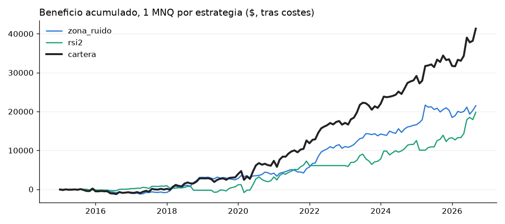

# Cartera NQ: zona de ruido + RSI(2) (1 MNQ cada una)

Combina los resultados de las dos estrategias validadas, con sus reglas registradas y sin ningún cambio (`edges/zona_ruido_mnq.md`, `edges/nq_rsi2.md`).

- **Costes:** los de cada estudio.
- **Mes:** el de la salida de cada operación.
- **Días excluidos:** las sesiones ilíquidas previsibles.

**Correlación mensual entre las dos: 0.04.** Casi nula: los meses malos de una no coinciden con los de la otra.

## 2015-2026

|            |   meses |   meses_positivos_% |   media_mes_usd |   mediana_mes_usd |   p10_mes_usd |   peor_mes_usd |   mejor_mes_usd |   trimestres_positivos_% |   drawdown_max_usd |   racha_meses_negativos |
|:-----------|--------:|--------------------:|----------------:|------------------:|--------------:|---------------:|----------------:|-------------------------:|-------------------:|------------------------:|
| zona_ruido |     141 |                59.6 |             153 |                86 |          -368 |          -1870 |            3776 |                     64.7 |              -3186 |                       4 |
| rsi2       |     141 |                45.4 |             141 |                 0 |          -528 |          -2483 |            3589 |                     57.6 |              -2648 |                      14 |
| cartera    |     141 |                61   |             293 |               178 |          -612 |          -2260 |            4693 |                     71.2 |              -2786 |                       3 |

## Desde 2023-04 (precios parecidos a los actuales)

|            |   meses |   meses_positivos_% |   media_mes_usd |   mediana_mes_usd |   p10_mes_usd |   peor_mes_usd |   mejor_mes_usd |   trimestres_positivos_% |   drawdown_max_usd |   racha_meses_negativos |
|:-----------|--------:|--------------------:|----------------:|------------------:|--------------:|---------------:|----------------:|-------------------------:|-------------------:|------------------------:|
| zona_ruido |      42 |                64.3 |             248 |               247 |          -690 |          -1870 |            3776 |                     72.5 |              -3186 |                       2 |
| rsi2       |      42 |                64.3 |             307 |               331 |          -852 |          -2483 |            3589 |                     75   |              -2648 |                       3 |
| cartera    |      42 |                66.7 |             556 |               343 |         -1028 |          -1917 |            4693 |                     72.5 |              -2786 |                       3 |

## Por año ($)

|      |   zona_ruido |   rsi2 |   cartera |
|-----:|-------------:|-------:|----------:|
| 2015 |         -116 |    286 |       170 |
| 2016 |         -715 |   -220 |      -935 |
| 2017 |          -47 |    733 |       686 |
| 2018 |         3932 |  -1055 |      2877 |
| 2019 |         -626 |    878 |       252 |
| 2020 |         1450 |   1560 |      3011 |
| 2021 |         1413 |   5081 |      6494 |
| 2022 |         5244 |  -1170 |      4075 |
| 2023 |         3216 |   1096 |      4312 |
| 2024 |         2704 |   4349 |      7053 |
| 2025 |         3884 |   1562 |      5446 |
| 2026 |         1166 |   6722 |      7888 |

Aviso: en las dos estrategias el fuera de muestra ya se ha mirado. La prueba que falta es la prueba en papel (ver `PLAN_OPERATIVO.md`).
