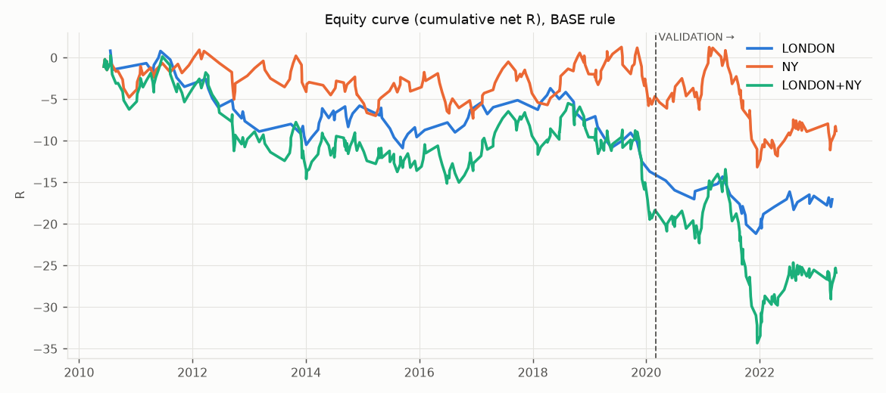
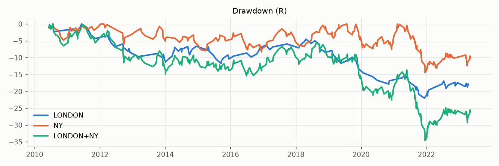
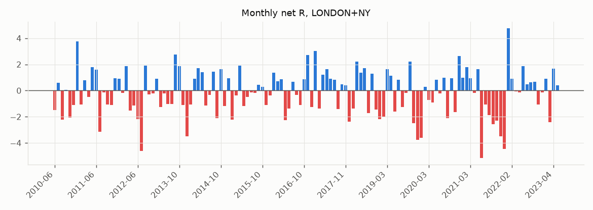
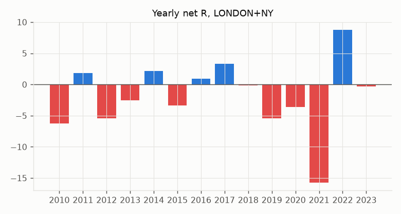
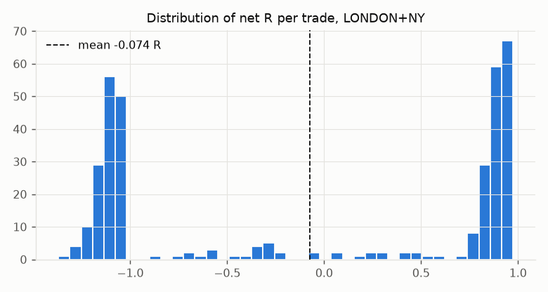
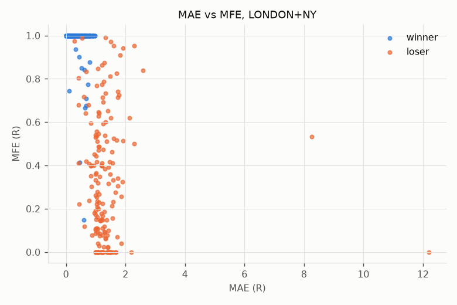
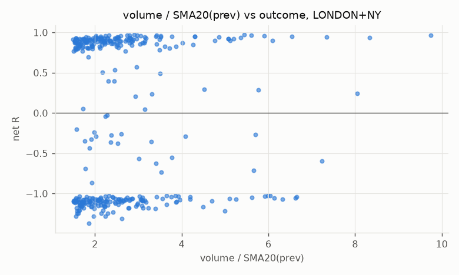
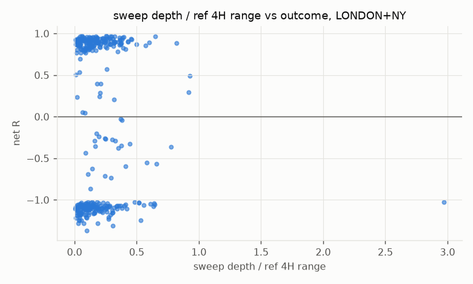
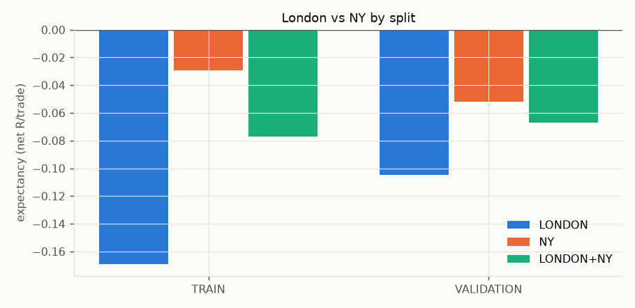

# CRT XAUUSD — FINAL REPORT

## VERDICT

**NO ROBUST EDGE**

| group | verdict | passed | evaluated |
|---|---|---|---|
| LONDON | NO ROBUST EDGE | 0 | 14 |
| NY | NO ROBUST EDGE | 1 | 14 |
| LONDON+NY | NO ROBUST EDGE | 1 | 14 |

Overall verdict = best group verdict; every group is reported and Holm-corrected over 3 groups.

TEST is **LOCKED** (not computed). By rule, ROBUST EDGE cannot be issued while TEST is locked.

## 1. Dataset

Source: `Databento GLBX.MDP3 GC.v.0 ohlcv-1m 2010-06-06..2026-09-29, aggregated to 15M` · broker/feed: `CME Globex (COMEX GC gold futures, 100 oz) - NOT spot XAUUSD` · price side:
`trade` · **volume type: `real (exchange-traded contracts)`** · raw timestamps:
`UTC` (bar open) → converted to UTC → America/New_York (IANA, DST-aware).

```
{
  "rows_raw": 384770,
  "unparseable_or_dst_ambiguous_ts": 0,
  "duplicate_ts_dropped": 0,
  "misaligned_ts_dropped": 0,
  "invalid_ohlc_dropped": 0,
  "rows_clean": 384770,
  "first_bar_utc": "2010-06-07 00:00:00+00:00",
  "last_bar_utc": "2026-09-28 23:45:00+00:00",
  "zero_volume_bars": 0,
  "volume_all_integer": true,
  "gaps_gt_15m": 4600,
  "unexpected_gaps_gt_15m": 1879,
  "has_spread_column": false,
  "contract_changes": 81,
  "h4_buckets": 25390,
  "h4_complete": 24811
}
```

Splits (UTC, by signal time): TRAIN ['2010-06-07 00:00:00+00:00', '2020-03-01 05:00:00+00:00'] · VALIDATION ['2020-03-01 05:00:00+00:00', '2023-06-01 04:00:00+00:00'] · TEST ['2023-06-01 04:00:00+00:00', '2026-09-29 00:00:00+00:00'].
Manifest (git commit, hashes): `RUN_MANIFEST.json`.

## 2. Exact CRT definition
4H candles are built from 15M bars on New-York wall clock anchored at 17:00 (17/21/01/05/09/13).
Reference 4H = the complete 4H bucket immediately before the execution 4H. See docs/PREREGISTRATION.md.

## 3. Sweep definition
LONG: first 15M bar of the execution 4H with Low < Low_ref (strict). SHORT: first bar with High > High_ref.
Only the first penetration counts.

## 4. Confirmation definition (FVG/IFVG removed in pre-registration v2)
The IMMEDIATELY next 15M bar must body-engulf the sweep bar in the opposite direction:
LONG `C_s<O_s, C_c>O_c, O_c<=C_s, C_c>=O_s`; SHORT `C_s>O_s, C_c<O_c, O_c>=C_s, C_c<=O_s`.
Otherwise the setup direction is invalidated (no waiting window).

## 5. Volume definition
`volume_c >= 1.5 × mean(volume of previous 20 bars)`, current bar excluded.
Volume type in this dataset: **real (exchange-traded contracts)**.

## 6. Entry rules
OPEN of the 15M bar after the confirmation close. Confirmation bar must be inside the KZ and the execution 4H.

## 7. SL / TP
SL = min(Low_sweep, Low_confirm) − 0.5 (LONG; mirrored SHORT). TP = 1R.
Same-bar SL/TP → SL. Forced exit at last bar closing ≤ 17:00 NY.
Signals: 437 from 12582 setups. Setup skips: {'no_signal': 12050, 'reference_4h_incomplete': 92, 'reference_4h_missing': 3}. Execution skips: {'position_already_open_same_kz': 2}.
Rejection reasons (setups with a sweep that were invalidated): {'volume_below_threshold': 4884, 'confirm_bar_outside_kill_zone': 4759, 'confirm_close_below_sweep_open': 4472, 'confirm_close_above_sweep_open': 4461, 'confirm_bar_not_bullish': 2890, 'confirm_bar_not_bearish': 2847, 'confirm_open_below_sweep_close': 1578, 'confirm_open_above_sweep_close': 1461, 'sweep_bar_not_bullish': 976, 'sweep_bar_not_bearish': 946, 'confirm_bar_outside_exec_4h': 226, 'abnormal_bar': 133, 'data_gap_before_sweep': 10}.

## 8–12. Results by kill zone and split (net of BASE costs)
| group | split | trades | win_rate | expectancy_R | profit_factor | total_R | max_drawdown_R | sharpe_daily_ann | max_consecutive_losses | pct_positive_months | p_value_one_sided |
|---|---|---|---|---|---|---|---|---|---|---|---|
| LONDON | TRAIN | 81 | 0.494 | -0.169 | 0.713 | -13.690 | -14.522 | -0.473 | 4 | 0.383 | 0.931 |
| LONDON | VALIDATION | 32 | 0.500 | -0.105 | 0.810 | -3.347 | -7.467 | -0.338 | 4 | 0.350 | 0.718 |
| LONDON | TRAIN+VALIDATION | 113 | 0.496 | -0.151 | 0.739 | -17.037 | -21.989 | -0.434 | 7 | 0.375 | 0.942 |
| NY | TRAIN | 157 | 0.522 | -0.030 | 0.935 | -4.641 | -8.244 | -0.126 | 6 | 0.500 | 0.656 |
| NY | VALIDATION | 80 | 0.487 | -0.052 | 0.895 | -4.156 | -14.425 | -0.276 | 6 | 0.515 | 0.684 |
| NY | TRAIN+VALIDATION | 237 | 0.511 | -0.037 | 0.921 | -8.797 | -14.440 | -0.168 | 6 | 0.504 | 0.730 |
| LONDON+NY | TRAIN | 238 | 0.513 | -0.077 | 0.846 | -18.331 | -19.728 | -0.399 | 6 | 0.444 | 0.893 |
| LONDON+NY | VALIDATION | 112 | 0.491 | -0.067 | 0.869 | -7.503 | -20.901 | -0.406 | 7 | 0.486 | 0.766 |
| LONDON+NY | TRAIN+VALIDATION | 350 | 0.506 | -0.074 | 0.853 | -25.834 | -34.587 | -0.398 | 7 | 0.455 | 0.925 |

Holm correction over the 3 groups (TRAIN+VALIDATION, one-sided t-test mean R > 0):

| group | p_raw | p_holm | reject_H0 |
|---|---|---|---|
| NY | 0.730 | 1.000 | False |
| LONDON+NY | 0.925 | 1.000 | False |
| LONDON | 0.942 | 1.000 | False |

## 13. Walk-forward (frozen rule, no fitting)

| span | group | windows | oos_windows_with_trades | pct_oos_positive | median_oos_expectancy_R |
|---|---|---|---|---|---|
| TRAIN+VALIDATION | LONDON | 24 | 24 | 0.417 | -0.142 |
| TRAIN+VALIDATION | LONDON+NY | 24 | 24 | 0.417 | -0.040 |
| TRAIN+VALIDATION | NY | 24 | 24 | 0.417 | -0.039 |

Full table: `CRT_XAUUSD_WALK_FORWARD.csv`.

## 14. Cost sensitivity (TRAIN+VALIDATION)

| level | group | trades | expectancy_R | profit_factor | win_rate | total_R | max_drawdown_R |
|---|---|---|---|---|---|---|---|
| 1x | LONDON | 113 | -0.151 | 0.739 | 0.496 | -17.037 | -21.989 |
| 1x | NY | 237 | -0.037 | 0.921 | 0.511 | -8.797 | -14.440 |
| 1x | LONDON+NY | 350 | -0.074 | 0.853 | 0.506 | -25.834 | -34.587 |
| 2x | LONDON | 113 | -0.293 | 0.551 | 0.496 | -33.075 | -35.979 |
| 2x | NY | 237 | -0.128 | 0.748 | 0.506 | -30.453 | -32.919 |
| 2x | LONDON+NY | 350 | -0.182 | 0.674 | 0.503 | -63.528 | -68.234 |
| 3x | LONDON | 113 | -0.435 | 0.404 | 0.487 | -49.112 | -50.281 |
| 3x | NY | 237 | -0.220 | 0.603 | 0.498 | -52.110 | -54.044 |
| 3x | LONDON+NY | 350 | -0.289 | 0.526 | 0.494 | -101.222 | -103.830 |

## 15. Slippage sensitivity (TRAIN+VALIDATION)

| level | group | trades | expectancy_R | profit_factor | win_rate | total_R | max_drawdown_R |
|---|---|---|---|---|---|---|---|
| 0 x 0.1 | LONDON | 113 | -0.112 | 0.799 | 0.496 | -12.703 | -18.456 |
| 0 x 0.1 | NY | 237 | -0.012 | 0.973 | 0.515 | -2.944 | -13.843 |
| 0 x 0.1 | LONDON+NY | 350 | -0.045 | 0.909 | 0.509 | -15.647 | -26.090 |
| 1 x 0.1 | LONDON | 113 | -0.189 | 0.684 | 0.496 | -21.372 | -25.770 |
| 1 x 0.1 | NY | 237 | -0.062 | 0.871 | 0.511 | -14.650 | -18.867 |
| 1 x 0.1 | LONDON+NY | 350 | -0.103 | 0.801 | 0.506 | -36.022 | -43.556 |
| 2 x 0.1 | LONDON | 113 | -0.266 | 0.584 | 0.496 | -30.041 | -33.332 |
| 2 x 0.1 | NY | 237 | -0.111 | 0.779 | 0.506 | -26.356 | -29.181 |
| 2 x 0.1 | LONDON+NY | 350 | -0.161 | 0.705 | 0.503 | -56.397 | -61.818 |
| 3 x 0.1 | LONDON | 113 | -0.343 | 0.496 | 0.487 | -38.709 | -40.894 |
| 3 x 0.1 | NY | 237 | -0.161 | 0.694 | 0.502 | -38.062 | -40.118 |
| 3 x 0.1 | LONDON+NY | 350 | -0.219 | 0.619 | 0.497 | -76.772 | -80.150 |

## Entry delay (TRAIN+VALIDATION)

| level | group | trades | expectancy_R | profit_factor | win_rate | total_R | max_drawdown_R |
|---|---|---|---|---|---|---|---|
| 0 | LONDON | 113 | -0.151 | 0.739 | 0.496 | -17.037 | -21.989 |
| 0 | NY | 237 | -0.037 | 0.921 | 0.511 | -8.797 | -14.440 |
| 0 | LONDON+NY | 350 | -0.074 | 0.853 | 0.506 | -25.834 | -34.587 |
| 1 | LONDON | 111 | -0.154 | 0.732 | 0.514 | -17.105 | -18.785 |
| 1 | NY | 224 | -0.089 | 0.819 | 0.496 | -19.937 | -26.905 |
| 1 | LONDON+NY | 335 | -0.111 | 0.787 | 0.501 | -37.042 | -42.100 |

## Take-profit sensitivity (not hypotheses) (TRAIN+VALIDATION)

| level | group | trades | expectancy_R | profit_factor | win_rate | total_R | max_drawdown_R |
|---|---|---|---|---|---|---|---|
| TP_1R | LONDON | 113 | -0.151 | 0.739 | 0.496 | -17.037 | -21.989 |
| TP_1R | NY | 237 | -0.037 | 0.921 | 0.511 | -8.797 | -14.440 |
| TP_1R | LONDON+NY | 350 | -0.074 | 0.853 | 0.506 | -25.834 | -34.587 |
| TP_1.5R | LONDON | 113 | -0.112 | 0.832 | 0.416 | -12.680 | -21.632 |
| TP_1.5R | NY | 236 | 0.004 | 1.008 | 0.462 | 0.985 | -12.589 |
| TP_1.5R | LONDON+NY | 349 | -0.034 | 0.941 | 0.447 | -11.695 | -26.483 |
| TP_2R | LONDON | 113 | -0.135 | 0.820 | 0.336 | -15.218 | -24.170 |
| TP_2R | NY | 234 | -0.076 | 0.866 | 0.410 | -17.889 | -28.117 |
| TP_2R | LONDON+NY | 347 | -0.095 | 0.848 | 0.386 | -33.107 | -51.724 |
| TP_3R | LONDON | 113 | -0.130 | 0.841 | 0.274 | -14.698 | -30.813 |
| TP_3R | NY | 234 | -0.086 | 0.856 | 0.385 | -20.162 | -29.030 |
| TP_3R | LONDON+NY | 347 | -0.100 | 0.850 | 0.349 | -34.860 | -57.731 |

## Volume-definition sensitivity (not hypotheses) (TRAIN+VALIDATION)

| level | group | trades | expectancy_R | profit_factor | win_rate | total_R | max_drawdown_R |
|---|---|---|---|---|---|---|---|
| ratio_1.3 | LONDON | 132 | -0.147 | 0.745 | 0.500 | -19.386 | -26.649 |
| ratio_1.3 | NY | 267 | -0.065 | 0.867 | 0.498 | -17.339 | -21.243 |
| ratio_1.3 | LONDON+NY | 399 | -0.092 | 0.822 | 0.499 | -36.725 | -45.895 |
| ratio_1.7 | LONDON | 86 | -0.164 | 0.720 | 0.488 | -14.089 | -17.049 |
| ratio_1.7 | NY | 210 | -0.025 | 0.945 | 0.514 | -5.270 | -14.750 |
| ratio_1.7 | LONDON+NY | 296 | -0.065 | 0.868 | 0.507 | -19.360 | -27.626 |
| pctl_70 | LONDON | 141 | -0.130 | 0.771 | 0.511 | -18.295 | -23.780 |
| pctl_70 | NY | 292 | -0.078 | 0.842 | 0.493 | -22.900 | -27.049 |
| pctl_70 | LONDON+NY | 433 | -0.095 | 0.817 | 0.499 | -41.195 | -47.393 |
| pctl_80 | LONDON | 124 | -0.177 | 0.702 | 0.484 | -21.925 | -27.753 |
| pctl_80 | NY | 250 | -0.043 | 0.908 | 0.508 | -10.844 | -17.080 |
| pctl_80 | LONDON+NY | 374 | -0.088 | 0.829 | 0.500 | -32.769 | -42.430 |
| pctl_90 | LONDON | 86 | -0.166 | 0.718 | 0.488 | -14.235 | -18.096 |
| pctl_90 | NY | 168 | -0.018 | 0.961 | 0.512 | -2.950 | -12.106 |
| pctl_90 | LONDON+NY | 254 | -0.068 | 0.863 | 0.504 | -17.185 | -26.169 |
| base_ratio_1.5 | LONDON | 113 | -0.151 | 0.739 | 0.496 | -17.037 | -21.989 |
| base_ratio_1.5 | NY | 237 | -0.037 | 0.921 | 0.511 | -8.797 | -14.440 |
| base_ratio_1.5 | LONDON+NY | 350 | -0.074 | 0.853 | 0.506 | -25.834 | -34.587 |

## 16. Randomization / falsification (TRAIN+VALIDATION)


**LONDON**

```
{
  "random_direction": {
    "observed_mean_R": -0.1507725804984599,
    "null_mean": -0.1441531114719112,
    "null_p95": -0.00917966014447759,
    "p_value": 0.5588822355289421,
    "n_null": 500
  },
  "time_randomization": {
    "observed_mean_R": -0.1507725804984599,
    "null_mean": -0.12922542499909195,
    "null_p95": -0.01941986242007801,
    "p_value": 0.6207584830339321,
    "n_null": 500
  },
  "random_entry": {
    "observed_mean_R": -0.1507725804984599,
    "null_mean": -0.1528959217270801,
    "null_p95": -0.004283465685697803,
    "p_value": 0.4810379241516966,
    "n_null": 500
  },
  "volume_permutation": {
    "observed_mean_R": -0.1507725804984599,
    "null_mean": -0.21908176278934938,
    "null_p95": -0.08657328238904884,
    "p_value": 0.2079207920792079,
    "n_null": 100
  },
  "randomized_sweep": {
    "observed_mean_R": -0.1507725804984599,
    "null_mean": -0.023248129428197352,
    "null_p95": 0.10313967989636309,
    "p_value": 0.9108910891089109,
    "n_null": 100
  },
  "ablation_no_sweep": {
    "mean_R": -0.16123853739512442,
    "trades": 2094
  },
  "ablation_no_volume": {
    "mean_R": -0.1726612340287543,
    "trades": 166
  },
  "observed_mean_R": -0.1507725804984599
}
```

**NY**

```
{
  "random_direction": {
    "observed_mean_R": -0.037117172310134935,
    "null_mean": -0.09466000915328564,
    "null_p95": 0.0040556914649409505,
    "p_value": 0.1596806387225549,
    "n_null": 500
  },
  "time_randomization": {
    "observed_mean_R": -0.037117172310134935,
    "null_mean": 0.0059337452792472085,
    "null_p95": 0.07213164427005904,
    "p_value": 0.872255489021956,
    "n_null": 500
  },
  "random_entry": {
    "observed_mean_R": -0.037117172310134935,
    "null_mean": -0.10558811364370503,
    "null_p95": -0.011785114209721356,
    "p_value": 0.12574850299401197,
    "n_null": 500
  },
  "volume_permutation": {
    "observed_mean_R": -0.037117172310134935,
    "null_mean": -0.0822383766314351,
    "null_p95": -0.004874878496040761,
    "p_value": 0.18811881188118812,
    "n_null": 100
  },
  "randomized_sweep": {
    "observed_mean_R": -0.037117172310134935,
    "null_mean": -0.08318871226964653,
    "null_p95": -0.01176910339416287,
    "p_value": 0.1485148514851485,
    "n_null": 100
  },
  "ablation_no_sweep": {
    "mean_R": -0.13993743023876923,
    "trades": 2684
  },
  "ablation_no_volume": {
    "mean_R": -0.10288780727285314,
    "trades": 335
  },
  "observed_mean_R": -0.037117172310134935
}
```

**LONDON+NY**

```
{
  "random_direction": {
    "observed_mean_R": -0.07381163266807986,
    "null_mean": -0.11792760694776687,
    "null_p95": -0.03445945106551702,
    "p_value": 0.2155688622754491,
    "n_null": 500
  },
  "time_randomization": {
    "observed_mean_R": -0.07381163266807986,
    "null_mean": -0.033019183552406205,
    "null_p95": 0.01693367720857035,
    "p_value": 0.8842315369261478,
    "n_null": 500
  },
  "random_entry": {
    "observed_mean_R": -0.07381163266807986,
    "null_mean": -0.1267791539843779,
    "null_p95": -0.05053412629168584,
    "p_value": 0.13572854291417166,
    "n_null": 500
  },
  "volume_permutation": {
    "observed_mean_R": -0.07381163266807986,
    "null_mean": -0.12237380312612751,
    "null_p95": -0.04612506590846365,
    "p_value": 0.1485148514851485,
    "n_null": 100
  },
  "randomized_sweep": {
    "observed_mean_R": -0.07381163266807986,
    "null_mean": -0.06531689043016628,
    "null_p95": 0.0007240691168517139,
    "p_value": 0.5544554455445545,
    "n_null": 100
  },
  "ablation_no_sweep": {
    "mean_R": -0.14927282546384413,
    "trades": 4778
  },
  "ablation_no_volume": {
    "mean_R": -0.1260063478746088,
    "trades": 501
  },
  "observed_mean_R": -0.07381163266807986
}
```

## 17. MAE / MFE

| exit_reason | MFE_R | MAE_R | minutes_held | minutes_to_MFE |
|---|---|---|---|---|
| session_close | 0.640 | 0.674 | 450.000 | 60.000 |
| stop | 0.230 | 1.241 | 60.000 | 15.000 |
| target | 1.000 | 0.283 | 60.000 | 60.000 |

Per-trade data: `CRT_XAUUSD_MAE_MFE.csv`.

## 18. Regime analysis (descriptive; NOT filters)


**vol_regime**

| vol_regime | trades | expectancy_R | total_R | win_rate |
|---|---|---|---|---|
| high | 120 | -0.068 | -8.189 | 0.500 |
| low | 115 | -0.089 | -10.287 | 0.513 |
| normal | 115 | -0.064 | -7.358 | 0.504 |

**trend_regime**

| trend_regime | trades | expectancy_R | total_R | win_rate |
|---|---|---|---|---|
| mixed | 107 | -0.028 | -3.033 | 0.523 |
| range | 161 | -0.020 | -3.179 | 0.534 |
| trend | 77 | -0.236 | -18.144 | 0.429 |

**weekday**

| weekday | trades | expectancy_R | total_R | win_rate |
|---|---|---|---|---|
| Friday | 70 | -0.061 | -4.239 | 0.514 |
| Monday | 62 | -0.041 | -2.527 | 0.484 |
| Thursday | 72 | -0.024 | -1.751 | 0.528 |
| Tuesday | 66 | -0.119 | -7.837 | 0.500 |
| Wednesday | 80 | -0.119 | -9.480 | 0.500 |

**year**

| year | trades | expectancy_R | total_R | win_rate |
|---|---|---|---|---|
| 2010 | 14 | -0.444 | -6.221 | 0.357 |
| 2011 | 22 | 0.083 | 1.822 | 0.591 |
| 2012 | 22 | -0.246 | -5.403 | 0.409 |
| 2013 | 17 | -0.151 | -2.560 | 0.471 |
| 2014 | 30 | 0.072 | 2.173 | 0.600 |
| 2015 | 23 | -0.147 | -3.391 | 0.478 |
| 2016 | 23 | 0.039 | 0.888 | 0.565 |
| 2017 | 20 | 0.165 | 3.306 | 0.650 |
| 2018 | 25 | -0.007 | -0.167 | 0.520 |
| 2019 | 35 | -0.156 | -5.451 | 0.486 |
| 2020 | 30 | -0.120 | -3.594 | 0.467 |
| 2021 | 40 | -0.393 | -15.718 | 0.350 |
| 2022 | 37 | 0.238 | 8.796 | 0.622 |
| 2023 | 12 | -0.026 | -0.312 | 0.500 |

**month**

| month | trades | expectancy_R | total_R | win_rate |
|---|---|---|---|---|
| 1 | 28 | 0.176 | 4.920 | 0.643 |
| 10 | 26 | 0.191 | 4.966 | 0.654 |
| 11 | 32 | -0.376 | -12.027 | 0.375 |
| 12 | 33 | -0.384 | -12.678 | 0.364 |
| 2 | 29 | 0.136 | 3.957 | 0.586 |
| 3 | 20 | 0.040 | 0.791 | 0.550 |
| 4 | 38 | 0.207 | 7.884 | 0.632 |
| 5 | 22 | -0.173 | -3.815 | 0.455 |
| 6 | 32 | -0.138 | -4.423 | 0.469 |
| 7 | 20 | 0.172 | 3.438 | 0.600 |
| 8 | 26 | -0.260 | -6.754 | 0.423 |
| 9 | 44 | -0.275 | -12.094 | 0.409 |

**kz**

| kz | trades | expectancy_R | total_R | win_rate |
|---|---|---|---|---|
| london | 113 | -0.151 | -17.037 | 0.496 |
| ny | 237 | -0.037 | -8.797 | 0.511 |

**direction**

| direction | trades | expectancy_R | total_R | win_rate |
|---|---|---|---|---|
| long | 183 | -0.033 | -5.952 | 0.525 |
| short | 167 | -0.119 | -19.882 | 0.485 |

**sweep_depth_pct_range_q**

| sweep_depth_pct_range | trades | expectancy_R | total_R | win_rate |
|---|---|---|---|---|
| (0.00619, 0.0706] | 88 | -0.079 | -6.913 | 0.534 |
| (0.0706, 0.144] | 87 | -0.119 | -10.332 | 0.494 |
| (0.144, 0.259] | 87 | -0.075 | -6.505 | 0.494 |
| (0.259, 2.971] | 88 | -0.024 | -2.084 | 0.500 |

**sweep_depth_q**

| sweep_depth | trades | expectancy_R | total_R | win_rate |
|---|---|---|---|---|
| (0.099, 0.4] | 97 | -0.155 | -15.023 | 0.505 |
| (0.4, 0.9] | 82 | -0.063 | -5.142 | 0.524 |
| (0.9, 1.6] | 86 | -0.007 | -0.580 | 0.535 |
| (1.6, 10.4] | 85 | -0.060 | -5.089 | 0.459 |

**volume_ratio_q**

| volume_ratio | trades | expectancy_R | total_R | win_rate |
|---|---|---|---|---|
| (1.499, 1.845] | 88 | -0.093 | -8.194 | 0.511 |
| (1.845, 2.257] | 87 | -0.084 | -7.270 | 0.494 |
| (2.257, 3.036] | 87 | -0.017 | -1.497 | 0.529 |
| (3.036, 9.747] | 88 | -0.101 | -8.874 | 0.489 |

**engulf_body_ratio_q**

| engulf_body_ratio | trades | expectancy_R | total_R | win_rate |
|---|---|---|---|---|
| (0.999, 1.302] | 88 | -0.052 | -4.567 | 0.534 |
| (1.302, 1.86] | 87 | 0.007 | 0.624 | 0.552 |
| (1.86, 3.333] | 87 | -0.235 | -20.433 | 0.402 |
| (3.333, 57.0] | 88 | -0.017 | -1.458 | 0.534 |

**confirm_body_ratio_q**

| confirm_body_ratio | trades | expectancy_R | total_R | win_rate |
|---|---|---|---|---|
| (0.142, 0.51] | 88 | -0.177 | -15.573 | 0.489 |
| (0.51, 0.667] | 88 | 0.070 | 6.197 | 0.580 |
| (0.667, 0.782] | 86 | -0.086 | -7.369 | 0.500 |
| (0.782, 1.0] | 88 | -0.103 | -9.090 | 0.455 |

**stop_distance_q**

| stop_distance | trades | expectancy_R | total_R | win_rate |
|---|---|---|---|---|
| (0.799, 2.7] | 92 | -0.164 | -15.094 | 0.511 |
| (2.7, 3.9] | 84 | 0.040 | 3.367 | 0.571 |
| (3.9, 5.6] | 88 | -0.056 | -4.930 | 0.489 |
| (5.6, 17.3] | 86 | -0.107 | -9.178 | 0.453 |

**minutes_exec_start_to_sweep_q**

| minutes_exec_start_to_sweep | trades | expectancy_R | total_R | win_rate |
|---|---|---|---|---|
| (-0.001, 15.0] | 110 | -0.146 | -16.073 | 0.455 |
| (15.0, 60.0] | 71 | -0.150 | -10.637 | 0.465 |
| (165.0, 210.0] | 79 | -0.016 | -1.252 | 0.532 |
| (60.0, 165.0] | 90 | 0.024 | 2.128 | 0.578 |

**sweep_in_kz**

| sweep_in_kz | trades | expectancy_R | total_R | win_rate |
|---|---|---|---|---|
| False | 28 | -0.320 | -8.956 | 0.429 |
| True | 322 | -0.052 | -16.878 | 0.512 |

**confirm_close_back_inside_ref_range**

| confirm_close_back_inside_ref_range | trades | expectancy_R | total_R | win_rate |
|---|---|---|---|---|
| True | 350 | -0.074 | -25.834 | 0.506 |

## 19. Outlier dependence

| group | top10pct_share_of_gross_profit | expectancy_R_without_top5pct |
|---|---|---|
| LONDON | 0.230 | -0.212 |
| NY | 0.225 | -0.091 |
| LONDON+NY | 0.221 | -0.130 |

## Success criteria checklist

| criterion | LONDON | NY | LONDON+NY |
|---|---|---|---|
| enough_trades_trainval | False | True | True |
| positive_expectancy_TRAIN | False | False | False |
| positive_expectancy_VALIDATION | False | False | False |
| holm_significant_trainval | False | False | False |
| survives_cost_multiplier | False | False | False |
| walk_forward_stable | False | False | False |
| yearly_stable | False | False | False |
| neighbour_params_positive | False | False | False |
| not_outlier_dependent | False | False | False |
| beats_null_random_direction | False | False | False |
| beats_null_time_randomization | False | False | False |
| beats_null_random_entry | False | False | False |
| beats_null_volume_permutation | False | False | False |
| beats_null_randomized_sweep | False | False | False |
| TEST_positive | None | None | None |
| economic_coherence | None | None | None |

`None` = not evaluable automatically (TEST locked, or economic coherence, which needs a written argument).

## 20. Weaknesses
- Volume is broker tick volume unless metadata says otherwise: it measures quote activity at ONE
  broker, not traded gold volume. The volume condition is therefore a proxy.
- Costs are ASSUMED placeholders unless replaced with the broker's actual spread/commission.
- 15M bars cannot resolve the intrabar order of SL and TP; the stop-first assumption biases results down.
- The 4H anchor (17:00 NY) is a convention; brokers with other server times draw different 4H candles.

## 21. Falsification conditions
The hypothesis is rejected if any of: TRAIN or VALIDATION expectancy ≤ 0 after costs; Holm p ≥ 0.05;
expectancy ≤ 0 at 2× costs; observed mean R not above the 95th percentile of the random-direction,
time-randomized, random-entry, volume-permutation or randomized-sweep nulls; TEST expectancy ≤ 0.

## 22. Next experiment
Decided only after reading this report, and recorded as a new pre-registration version BEFORE running it.

## Charts










