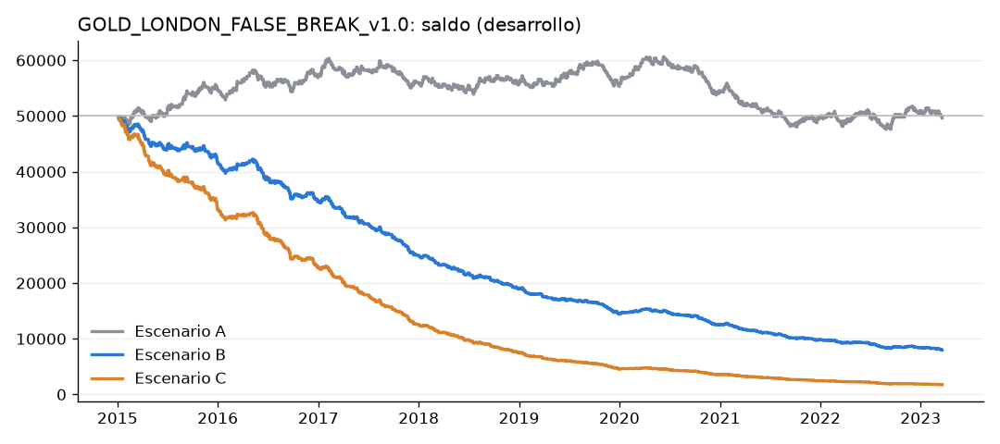
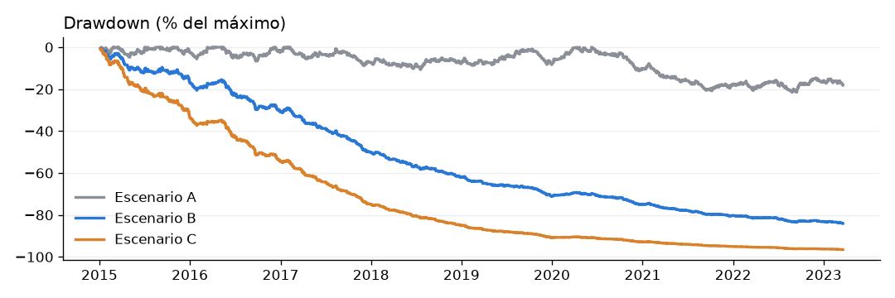

# GOLD_LONDON_FALSE_BREAK_v1.0: backtest de DESARROLLO

**Lógica:** rango de 08:00 a 09:00 de Londres → una vela de 15m supera un extremo y cierra dentro (falsa ruptura) →
entrada hacia el otro lado en la apertura siguiente → stop en el extremo de esa vela + 0,10 × ATR(14) → objetivo 2R →
salida a las 12:00 de Londres.

**Reglas e interpretaciones:** `edges/gold_london_false_break.md`, registradas antes del código (commit 777b7de).

**Datos:** futuros GC, con el mismo ajuste por cambios de contrato. Solo velas de 15m. Horas de Londres con el cambio
de hora respetado.

**Periodo:** desarrollo del 2-ene-2015 al 21-mar-2023 (8,2 años). **El fuera de muestra sigue BLOQUEADO.**

**Cuenta:** 50.000 $ con un riesgo del 0,5 % por operación. Costes iguales a los de los estudios anteriores.

**Código:** `src/strategies/gold_london_false_break.py`. Para repetirlo: `python -m src.report.gold_london`.

## Veredicto
**Sin ventaja.** Hay muestra de sobra (930 operaciones), y:
- **Sin costes el resultado es cero:** +0,0025 R por operación, t = 0,06, PF 1,00.
- **Con costes realistas es una pérdida enorme:** −0,39 R por operación, t = −9,2, PF 0,53. El stop mediano es de solo
  1,13 $ por onza (una vela de 15m), así que los 0,37 $/oz de costes cuestan de media 0,40 R por operación. Los costes
  de B equivalen a un tercio del riesgo.
- **No cumple los criterios** (PF > 1 y t ≥ 2 con los costes de B).

## Frecuencia
| Operaciones totales | Operaciones al año |
|---|---|
| **930** | **113** |

Supera el mínimo de 100 del desarrollo: el problema no es la muestra.

Destino de los 2.103 días:
- 930 con operación;
- 1.150 sin falsa ruptura;
- 18 con el rango incompleto;
- 5 con una vela que ataca los dos lados.

## Resultados (v1.0 exacta)
| | A: sin costes | B: costes realistas | C: costes + deslizamiento |
|---|---|---|---|
| Operaciones (al año) | 930 (113) | 930 (113) | 930 (113) |
| Acierto | 37,6 % | 35,4 % | 32,0 % |
| Profit factor | 1,00 | 0,53 | 0,35 |
| Expectancy (R) | +0,003 | −0,393 | −0,731 |
| Expectancy ($) | −0,4 | −45 | −52 |
| t | 0,06 | **−9,19** | −14,98 |
| Ganancia / pérdida media | +417 $ (+1,54 R) / −255 $ (−0,94 R) | +145 $ (+1,24 R) / −150 $ (−1,29 R) | +87 $ / −117 $ |
| Drawdown máximo | −21,5 % | −84,1 % | −96,5 % |
| Racha perdedora / ganadora | 16 / 5 | 16 / 5 | 16 / 5 |
| Duración media / mediana | 0,9 h / 0,5 h | igual | igual |
| Salidas | 24 % TP, 56 % SL, 20 % tiempo | igual | igual |
| MAE media (ganadoras) | −0,75 R (−0,39) | | |
| MFE media (perdedoras) | +1,04 R (+0,61) | | |

**Por año (A):**
- Positivo en 2015, 2016 y 2022, y cerca de cero en 2018 y 2019.
- Ningún año es significativo (|t| ≤ 1,2).
- Con los costes de B, **todos los años pierden**.

## Falsa ruptura del HIGH frente a la del LOW (solo diagnóstico)
| | Oper. | Acierto | PF | R medio | t |
|---|---|---|---|---|---|
| HIGH → SHORT (A) | 460 | 40,0 % | 1,11 | +0,070 | 1,15 |
| LOW → LONG (A) | 470 | 35,3 % | 0,89 | −0,064 | −1,11 |
| HIGH → SHORT (B) | 460 | 37,8 % | 0,62 | −0,343 | −5,56 |
| LOW → LONG (B) | 470 | 33,0 % | 0,46 | −0,441 | −7,46 |

- La diferencia entre lados está dentro del ruido (t ≈ ±1,1).
- Aunque los cortos fueran reales, +0,07 R no llega a cubrir ~0,4 R de costes.
- No cambia la v1.0.

## Rango → profundidad → resultado (solo diagnóstico)
- **Sin costes (A) no hay relación:**
  - correlación de Spearman entre el rango (%) y R: 0,03;
  - entre la profundidad / rango y R: 0,002;
  - ningún quintil tiene |t| > 1,6.
- **Con costes (B), los rangos pequeños pierden más:** R medio de −0,63 en el quintil 1 frente a −0,12 en el quintil 5.
  Es un efecto **mecánico** de los costes (rango pequeño → stop pequeño → el coste pesa más en R), no una ventaja del
  patrón.
- El detalle está en `range_depth_analysis.csv` (quintiles, escenario B) y en `diagnostics.md` (tabla cruzada 3 × 3 y
  correlaciones).

**Por hora de la falsa ruptura (A):** las de las 09:00 dan +0,07 R (t 1,0, 411 operaciones). El resto de horas están en
el ruido o con muestra pequeña (`false_break_time.csv`).

## Sensibilidad (solo diagnóstico; la oficial sigue siendo TP 2R con buffer de 0,10 ATR)
| Variante | R sin costes (t) | R con costes B (t) |
|---|---|---|
| **v1.0** | **+0,003 (0,06)** | **−0,393 (−9,19)** |
| TP 1,5R | −0,019 (−0,50) | −0,414 (−10,74) |
| TP 2,5R | −0,028 (−0,62) | −0,423 (−9,24) |
| Buffer 0 | −0,017 (−0,40) | −0,513 (−11,20) |

Todas las variantes dan cero sin costes y una pérdida grande con costes. No hay ninguna configuración escondida.

## Auditoría de look-ahead
Todo OK, revisado en las 930 operaciones:
- El rango sale de 4 velas de 08:00 a 08:45 y queda congelado a las 09:00.
- El primer break y la falsa ruptura se recalculan con los datos cortados en la vela de señal, siempre a las 11:30 o
  antes.
- La entrada es la apertura de la vela siguiente, antes de las 12:00.
- El SL usa el ATR calculado hasta el cierre de la señal.
- El TP es 2R sobre la entrada real.
- La salida por tiempo es el cierre de la última vela anterior a las 12:00, y nada queda abierto después.
- La prueba de truncamiento global (6 cortes en sábado) no muestra diferencias.

Hay pruebas en `tests/test_gold_london_false_break.py` y en `tests/test_lookahead_real.py`.

## Archivos
| Archivo | Contenido |
|---|---|
| `trades.csv` | Operaciones de A, B y C. Incluye rango ($ y %), distancia del stop, profundidad de la ruptura (absoluta y / rango), MAE, MFE y precios reales de GC |
| `daily_range_stats.csv` | Un registro por día: RH, RL, rango en $ y %, primer extremo atacado y su hora, hora y profundidad de la falsa ruptura, estado y resultado |
| `summary.csv`, `yearly.csv` | Resumen estadístico y tabla anual |
| `false_break_side.csv`, `false_break_time.csv`, `range_depth_analysis.csv` | Diagnóstico |
| `sensitivity.csv` | Variantes × escenarios |
| `signals.txt` | Alerta de cada operación (LONG/SHORT, Entry, SL, TP, RR, hora de Londres) |
| `equity_curve.png`, `drawdown_curve.png` | Curvas de saldo y de drawdown |
| `diagnostics.md` | Auditoría, estados de los días, primer extremo atacado, tabla rango × profundidad y correlaciones |

