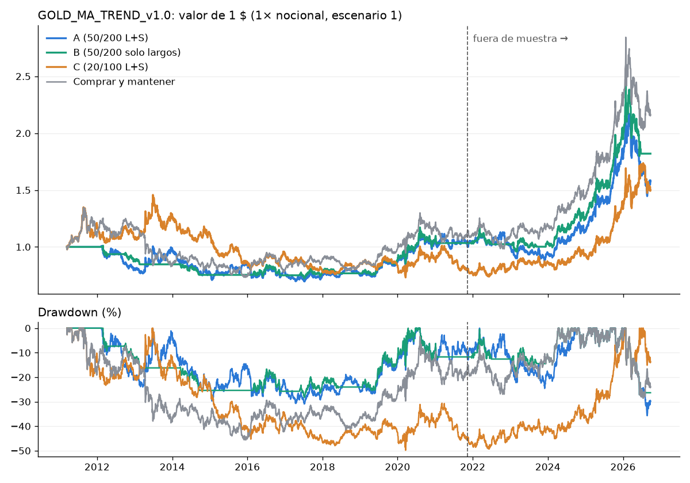

# GOLD_MA_TREND_v1.0: cruce de medias en el oro (GC diario)

Reglas y criterios registrados ANTES de ejecutar: `edges/gold_ma_trend.md` (commit 67ac0cd). Código: `src/strategies/gold_ma_trend.py`. Repetir: `python -m src.report.gold_ma_trend`.

## 1. DATA AUDIT

| punto                                                  | resultado                                                                                                                      |
|:-------------------------------------------------------|:-------------------------------------------------------------------------------------------------------------------------------|
| Fuente                                                 | Databento GLBX.MDP3 ohlcv-1d, contrato continuo por volumen GC.v.0                                                             |
| Rango                                                  | 2010-06-07 → 2026-09-27                                                                                                        |
| Velas en el archivo                                    | 5062 (834 domingos de reapertura)                                                                                              |
| Velas tras unir domingos al lunes                      | 4228                                                                                                                           |
| Duplicados / valores faltantes                         | 0 / 0                                                                                                                          |
| Velas imposibles (high < max(open, close) o low > min) | 0                                                                                                                              |
| Laborables sin vela                                    | 27: festivos (Viernes Santo, Navidad, Año Nuevo…) salvo 2014-06-13 y 2014-09-23/24/25 (hueco de datos de 3 días)               |
| Zona horaria                                           | UTC; cada vela es un día natural en UTC (00:00-24:00). Índice único y a las 00:00 UTC                                          |
| Cambios de contrato                                    | 81; salto medio 9.4 $ (mediana 4.0, máx. 64.9); ajuste aditivo hacia atrás                                                     |
| Mayores movimientos diarios (precio real)              | 2026-01-30 -9.4 % (día de roll); 2013-04-15 -8.4 %; 2020-03-24 +7.4 %; 2026-01-28 +6.4 %; 2026-02-05 -6.2 %; 2025-10-21 -6.2 % |

**Limitaciones:**
- Hueco de datos de 3 días en septiembre de 2014.
- Día natural en UTC en lugar de la sesión de CME. El cierre diario es el precio de las 00:00 UTC (19:00-20:00 NY), no el settlement oficial.
- El salto medido en un cambio de contrato incluye el movimiento de ese momento (unos minutos, porque el corte UTC cae en plena sesión).
- El contrato que usa la serie continua lo elige Databento por volumen.

## 2. STRATEGY RULES

- **Régimen** al cierre diario: SMA rápida > lenta → LARGO; < → CORTO (si son iguales, se mantiene).
- **Entrada / salida:** en la **apertura del día siguiente** al cruce confirmado.
- **Hipótesis:**
  - A: 50/200, largos y cortos (siempre dentro tras el primer cruce);
  - B: 50/200, solo largos;
  - C: 20/100, largos y cortos.
- **Sin** stop, objetivo, trailing ni filtros. 1 contrato GC (100 oz).
- **R** = P&L / (ATR(20) × 100) en la entrada.
- **Costes por contrato y lado:**
  - escenario 0: 0 $;
  - escenario 1: 2,50 $ + 1 tick (10 $) = 12,50 $;
  - escenario 2: 5 $ + 3 ticks = 35 $;
  - además, un ida y vuelta en cada cambio de contrato con posición abierta.
- **Métricas diarias:** 1× nocional sobre el precio real; Sharpe y Sortino anualizados con 252 días; t diario = media / desviación × √N.
- **Periodos:**
  - desarrollo: hasta el 2021-11-08, simulado **solo con datos de desarrollo**;
  - fuera de muestra: desde el 2021-11-09;
  - operaciones que cruzan el corte: A: 1; B: 0; C: 1 (cuentan en el periodo completo y en las métricas diarias).

## 3. DEVELOPMENT RESULTS (escenario 1)

| hipótesis   |   operaciones |   op_por_año |   neto_usd |   R_medio |   profit_factor |   acierto_% |   ganancia_media_usd |   perdida_media_usd |   mejor_usd |   peor_usd |   dur_media_dias |   dur_max_dias |
|:------------|--------------:|-------------:|-----------:|----------:|----------------:|------------:|---------------------:|--------------------:|------------:|-----------:|-----------------:|---------------:|
| A           |            15 |         1.41 |      19977 |     2.319 |            1.31 |        33.3 |                16740 |               -6372 |       45605 |     -16995 |              237 |            728 |
| B           |             7 |         0.66 |       4880 |     3.434 |            1.11 |        28.6 |                24255 |               -8726 |       45605 |     -16995 |              249 |            728 |
| C           |            37 |         3.47 |     -15008 |    -0.016 |            0.89 |        32.4 |                 9764 |               -5287 |       25985 |     -12240 |              106 |            299 |

|                    |   sharpe |   sortino |   t_diario |   rend_anual_% |   dd_max_% |   dd_max_usd |   dd_dur_dias |   en_mercado_% |   largo_% |   corto_% |
|:-------------------|---------:|----------:|-----------:|---------------:|-----------:|-------------:|--------------:|---------------:|----------:|----------:|
| A                  |     0.09 |      0.08 |       0.29 |           1.24 |      -30.9 |       -44765 |          3067 |           91.4 |      44.9 |      46.5 |
| B                  |     0.08 |      0.05 |       0.27 |           0.8  |      -28.2 |       -49725 |          2967 |           44.9 |      44.9 |       0   |
| C                  |    -0.06 |     -0.06 |      -0.19 |          -0.91 |      -49.8 |       -83100 |          3056 |          100   |      50.7 |      49.3 |
| Comprar y mantener |     0.14 |      0.14 |       0.48 |           2.26 |      -45.6 |       -88115 |          3731 |          100   |     100   |       0   |

## 4. OOS RESULTS (escenario 1)

| hipótesis   |   operaciones |   op_por_año |   neto_usd |   R_medio |   profit_factor |   acierto_% |   ganancia_media_usd |   perdida_media_usd |   mejor_usd |   peor_usd |   dur_media_dias |   dur_max_dias |
|:------------|--------------:|-------------:|-----------:|----------:|----------------:|------------:|---------------------:|--------------------:|------------:|-----------:|-----------------:|---------------:|
| A           |             8 |         1.64 |     138332 |     6.114 |            4.62 |        25   |                88287 |               -6374 |      173100 |     -13897 |              218 |            925 |
| B           |             4 |         0.82 |     166955 |    14.343 |           18.35 |        50   |                88287 |               -4810 |      173100 |      -5375 |              334 |            925 |
| C           |            13 |         2.67 |     233693 |     5.5   |            5.77 |        46.2 |                47109 |               -6995 |      180810 |     -16282 |              137 |            443 |

|                    |   sharpe |   sortino |   t_diario |   rend_anual_% |   dd_max_% |   dd_max_usd |   dd_dur_dias |   en_mercado_% |   largo_% |   corto_% |
|:-------------------|---------:|----------:|-----------:|---------------:|-----------:|-------------:|--------------:|---------------:|----------:|----------:|
| A                  |     0.55 |      0.53 |       1.23 |          10.45 |      -35.7 |      -201575 |           240 |            100 |      75   |      25   |
| B                  |     0.75 |      0.63 |       1.67 |          12.7  |      -27.2 |      -150725 |           240 |             75 |      75   |       0   |
| C                  |     0.76 |      0.72 |       1.71 |          14.54 |      -20.8 |      -114935 |           133 |            100 |      70.8 |      29.2 |
| Comprar y mantener |     0.78 |      0.78 |       1.76 |          14.92 |      -28.6 |      -158775 |           240 |            100 |     100   |       0   |

El t por operación no es apropiado con tan pocas operaciones. Se usa el t de los rendimientos diarios, que tiene autocorrelación y hay que leer con cautela.

## Periodo completo (escenario 1)

| hipótesis   |   operaciones |   op_por_año |   neto_usd |   R_medio |   profit_factor |   acierto_% |   ganancia_media_usd |   perdida_media_usd |   mejor_usd |   peor_usd |   dur_media_dias |   dur_max_dias |
|:------------|--------------:|-------------:|-----------:|----------:|----------------:|------------:|---------------------:|--------------------:|------------:|-----------:|-----------------:|---------------:|
| A           |            23 |         1.48 |     160932 |     3.674 |            2.58 |        30.4 |                37557 |               -6373 |      173100 |     -16995 |              232 |            925 |
| B           |            11 |         0.71 |     171835 |     7.401 |            4.23 |        36.4 |                56271 |               -7607 |      173100 |     -16995 |              280 |            925 |
| C           |            50 |         3.22 |     218662 |     1.418 |            2.21 |        36   |                22212 |               -5661 |      180810 |     -16282 |              114 |            443 |

|                    |   sharpe |   sortino |   t_diario |   rend_anual_% |   dd_max_% |   dd_max_usd |   dd_dur_dias |   en_mercado_% |   largo_% |   corto_% |
|:-------------------|---------:|----------:|-----------:|---------------:|-----------:|-------------:|--------------:|---------------:|----------:|----------:|
| A                  |     0.26 |      0.25 |       1.03 |           4.14 |      -35.7 |      -201575 |           240 |           94.1 |      54.4 |      39.8 |
| B                  |     0.36 |      0.26 |       1.44 |           4.54 |      -28.2 |      -150725 |          2967 |           54.4 |      54.4 |       0   |
| C                  |     0.23 |      0.23 |       0.94 |           3.95 |      -49.8 |      -114935 |          4590 |          100   |      57   |      43   |
| Comprar y mantener |     0.37 |      0.36 |       1.48 |           6.24 |      -45.6 |      -158775 |          4616 |          100   |     100   |       0   |

## 5. COST ANALYSIS (periodo completo)

| hipótesis   |   ('neto_usd', 0) |   ('neto_usd', 1) |   ('neto_usd', 2) |   ('profit_factor', 0) |   ('profit_factor', 1) |   ('profit_factor', 2) |   ('sharpe', 0) |   ('sharpe', 1) |   ('sharpe', 2) |
|:------------|------------------:|------------------:|------------------:|-----------------------:|-----------------------:|-----------------------:|----------------:|----------------:|----------------:|
| A           |            163320 |            160932 |            156635 |                   2.62 |                   2.58 |                   2.5  |            0.26 |            0.26 |            0.25 |
| B           |            173210 |            171835 |            169360 |                   4.29 |                   4.23 |                   4.12 |            0.36 |            0.36 |            0.35 |
| C           |            221850 |            218662 |            212925 |                   2.23 |                   2.21 |                   2.16 |            0.24 |            0.23 |            0.22 |

Referencia, comprar y mantener: Sharpe esc. 0: 0.38 / esc. 1: 0.37 / esc. 2: 0.36.

## 6. ROBUSTNESS (solo las 3 hipótesis registradas)

### Por periodo de mercado (escenario 1)

| hipotesis   | periodo                   |   neto_usd |   rend_anual_% |   sharpe |   dd_max_% |
|:------------|:--------------------------|-----------:|---------------:|---------:|-----------:|
| A           | 2010-2012 final alcista   |     -34987 |         -10.98 |    -1.09 |      -21.2 |
| A           | 2013-2015 bajista         |      17110 |           3.2  |     0.19 |      -29.5 |
| A           | 2016-2018 lateral         |     -12235 |          -3.41 |    -0.29 |      -17.6 |
| A           | 2019-2020 alcista         |      51815 |          17.56 |     1    |      -14.5 |
| A           | 2021-2023 lateral/volátil |     -12645 |          -2.32 |    -0.17 |      -24.6 |
| A           | 2024-2026 alcista fuerte  |     151875 |          20.61 |     0.93 |      -35.7 |
| B           | 2010-2012 final alcista   |     -20917 |          -6.32 |    -0.96 |      -13.8 |
| B           | 2013-2015 bajista         |     -22033 |          -5.1  |    -1.01 |      -15.7 |
| B           | 2016-2018 lateral         |       2225 |           1.02 |     0.11 |      -13.9 |
| B           | 2019-2020 alcista         |      51757 |          17.55 |     1    |      -14.5 |
| B           | 2021-2023 lateral/volátil |      -4970 |          -0.51 |    -0.06 |      -17.7 |
| B           | 2024-2026 alcista fuerte  |     165772 |          22.05 |     1.06 |      -27.2 |
| C           | 2010-2012 final alcista   |      12300 |           5.44 |     0.3  |      -23.3 |
| C           | 2013-2015 bajista         |     -12475 |          -5.41 |    -0.33 |      -41.6 |
| C           | 2016-2018 lateral         |       -380 |          -0.01 |    -0    |      -20.9 |
| C           | 2019-2020 alcista         |      10115 |           3.62 |     0.21 |      -20.4 |
| C           | 2021-2023 lateral/volátil |       1560 |           0.12 |     0.01 |      -26.9 |
| C           | 2024-2026 alcista fuerte  |     213550 |          21.88 |     0.99 |      -20.8 |

### Distribución de resultados por operación (escenario 1)

| hipotesis   |   R p5 |   R p25 |   R p50 |   R p75 |   R p95 |   ret_% p50 |   ret_% mejor |   ret_% peor |
|:------------|-------:|--------:|--------:|--------:|--------:|------------:|--------------:|-------------:|
| A           |  -5.09 |   -3.19 |   -1.16 |    1.85 |   41.28 |        -2   |          86.8 |         -9.6 |
| B           |  -6.5  |   -4.53 |   -1.88 |    1.91 |   52.11 |        -2.1 |          86.8 |         -9.6 |
| C           |  -5.57 |   -3.28 |   -1.07 |    1.58 |   14.9  |        -1.2 |          65.6 |         -8.4 |

### Duración de las tendencias (días de mercado entre cruces)

| hipotesis   |   tendencias |   días_mediana |   días_media |   más_corta |   más_larga |
|:------------|-------------:|---------------:|-------------:|------------:|------------:|
| A (50/200)  |           22 |            124 |          169 |           6 |         658 |
| B (50/200)  |           22 |            124 |          169 |           6 |         658 |
| C (20/100)  |           47 |             70 |           81 |           7 |         315 |

### Rachas (escenario 1, periodo completo)

| hipótesis   |   racha_perd |   racha_gan |
|:------------|-------------:|------------:|
| A           |            6 |           5 |
| B           |            5 |           3 |
| C           |           10 |           3 |

## 7. LOOK-AHEAD AUDIT

**Hipótesis A**

| validación                                                                      | resultado   | detalle                                                            |
|:--------------------------------------------------------------------------------|:------------|:-------------------------------------------------------------------|
| 1. Look-ahead: truncamiento (6 cortes, datos cortados ANTES de ajustar)         | OK          | sin diferencias                                                    |
| 2. Fuga de datos: desarrollo con solo datos de desarrollo = simulación completa | OK          | 14 operaciones cerradas idénticas                                  |
| 3. Información futura: régimen recalculado solo con datos hasta el día de señal | OK          | 23 operaciones; fallos 0                                           |
| 4. Ejecución: apertura de la vela siguiente (nunca el cierre de la señal)       | OK          | 23 operaciones; fallos 0                                           |
| 5. Rollover: ajuste aditivo; coste de ida y vuelta en cada roll con posición    | OK          | 73 rolls con posición abierta, todos con coste                     |
| 6. Sesgo de supervivencia                                                       | N/A         | un solo instrumento continuo, sin selección de activos             |
| 7. Costes omitidos                                                              | OK          | todas las operaciones pagan entrada, salida y rolls (sin coste: 0) |
| 8. Zona horaria                                                                 | OK          | índice UTC, único, velas a las 00:00 UTC                           |
| 9. Operaciones duplicadas                                                       | OK          | duplicadas: 0                                                      |
| 10. Posiciones simultáneas                                                      | OK          | entradas antes de cerrar la anterior: 0                            |

**Hipótesis B**

| validación                                                                      | resultado   | detalle                                                            |
|:--------------------------------------------------------------------------------|:------------|:-------------------------------------------------------------------|
| 1. Look-ahead: truncamiento (6 cortes, datos cortados ANTES de ajustar)         | OK          | sin diferencias                                                    |
| 2. Fuga de datos: desarrollo con solo datos de desarrollo = simulación completa | OK          | 7 operaciones cerradas idénticas                                   |
| 3. Información futura: régimen recalculado solo con datos hasta el día de señal | OK          | 11 operaciones; fallos 0                                           |
| 4. Ejecución: apertura de la vela siguiente (nunca el cierre de la señal)       | OK          | 11 operaciones; fallos 0                                           |
| 5. Rollover: ajuste aditivo; coste de ida y vuelta en cada roll con posición    | OK          | 44 rolls con posición abierta, todos con coste                     |
| 6. Sesgo de supervivencia                                                       | N/A         | un solo instrumento continuo, sin selección de activos             |
| 7. Costes omitidos                                                              | OK          | todas las operaciones pagan entrada, salida y rolls (sin coste: 0) |
| 8. Zona horaria                                                                 | OK          | índice UTC, único, velas a las 00:00 UTC                           |
| 9. Operaciones duplicadas                                                       | OK          | duplicadas: 0                                                      |
| 10. Posiciones simultáneas                                                      | OK          | entradas antes de cerrar la anterior: 0                            |

**Hipótesis C**

| validación                                                                      | resultado   | detalle                                                            |
|:--------------------------------------------------------------------------------|:------------|:-------------------------------------------------------------------|
| 1. Look-ahead: truncamiento (6 cortes, datos cortados ANTES de ajustar)         | OK          | sin diferencias                                                    |
| 2. Fuga de datos: desarrollo con solo datos de desarrollo = simulación completa | OK          | 36 operaciones cerradas idénticas                                  |
| 3. Información futura: régimen recalculado solo con datos hasta el día de señal | OK          | 50 operaciones; fallos 0                                           |
| 4. Ejecución: apertura de la vela siguiente (nunca el cierre de la señal)       | OK          | 50 operaciones; fallos 0                                           |
| 5. Rollover: ajuste aditivo; coste de ida y vuelta en cada roll con posición    | OK          | 78 rolls con posición abierta, todos con coste                     |
| 6. Sesgo de supervivencia                                                       | N/A         | un solo instrumento continuo, sin selección de activos             |
| 7. Costes omitidos                                                              | OK          | todas las operaciones pagan entrada, salida y rolls (sin coste: 0) |
| 8. Zona horaria                                                                 | OK          | índice UTC, único, velas a las 00:00 UTC                           |
| 9. Operaciones duplicadas                                                       | OK          | duplicadas: 0                                                      |
| 10. Posiciones simultáneas                                                      | OK          | entradas antes de cerrar la anterior: 0                            |

## 8. YEAR-BY-YEAR RESULTS (escenario 1; P&L diario de 1 contrato y rendimiento sobre el nocional)

|   año |   neto_usd |   rend_pct |   operaciones_abiertas | hipotesis   |
|------:|-----------:|-----------:|-----------------------:|:------------|
|  2011 |          0 |          0 |                      0 | A           |
|  2012 |     -34987 |        -20 |                      4 | A           |
|  2013 |      32840 |         22 |                      1 | A           |
|  2014 |     -29655 |        -24 |                      4 | A           |
|  2015 |      13925 |         11 |                      0 | A           |
|  2016 |      -9165 |         -8 |                      2 | A           |
|  2017 |      -4370 |         -4 |                      1 | A           |
|  2018 |       1300 |          1 |                      1 | A           |
|  2019 |      19960 |         15 |                      1 | A           |
|  2020 |      31855 |         21 |                      0 | A           |
|  2021 |       3915 |          2 |                      2 | A           |
|  2022 |      -5430 |         -3 |                      3 | A           |
|  2023 |     -11130 |         -6 |                      3 | A           |
|  2024 |      43385 |         20 |                      0 | A           |
|  2025 |     151575 |         46 |                      0 | A           |
|  2026 |     -43085 |         -8 |                      1 | A           |
|  2011 |          0 |          0 |                      0 | B           |
|  2012 |     -20917 |        -12 |                      2 | B           |
|  2013 |      -7308 |         -4 |                      0 | B           |
|  2014 |     -14725 |        -11 |                      2 | B           |
|  2015 |          0 |          0 |                      0 | B           |
|  2016 |       -680 |          0 |                      1 | B           |
|  2017 |       4802 |          4 |                      1 | B           |
|  2018 |      -1897 |         -1 |                      0 | B           |
|  2019 |      19902 |         15 |                      1 | B           |
|  2020 |      31855 |         21 |                      0 | B           |
|  2021 |      -3135 |         -2 |                      1 | B           |
|  2022 |      -4917 |         -2 |                      1 | B           |
|  2023 |       3083 |          2 |                      2 | B           |
|  2024 |      43385 |         20 |                      0 | B           |
|  2025 |     151575 |         46 |                      0 | B           |
|  2026 |     -29188 |         -4 |                      0 | B           |
|  2011 |      28845 |         20 |                      5 | C           |
|  2012 |     -16545 |        -10 |                      4 | C           |
|  2013 |      31975 |         20 |                      2 | C           |
|  2014 |     -17255 |        -14 |                      4 | C           |
|  2015 |     -27195 |        -23 |                      4 | C           |
|  2016 |      10655 |          9 |                      2 | C           |
|  2017 |     -21825 |        -18 |                      4 | C           |
|  2018 |      10790 |          9 |                      3 | C           |
|  2019 |      -1830 |         -1 |                      3 | C           |
|  2020 |      11945 |          8 |                      2 | C           |
|  2021 |     -24405 |        -14 |                      6 | C           |
|  2022 |      13210 |          7 |                      3 | C           |
|  2023 |      12755 |          7 |                      2 | C           |
|  2024 |      20515 |          9 |                      2 | C           |
|  2025 |     128025 |         37 |                      2 | C           |
|  2026 |      65010 |         16 |                      2 | C           |

## 9. LONG VS SHORT (escenario 1, periodo completo)

| hipotesis   | lado   |   operaciones |   neto_usd |   R_medio |   profit_factor |   acierto_% |
|:------------|:-------|--------------:|-----------:|----------:|----------------:|------------:|
| A           | LONG   |            11 |     171835 |     7.401 |            4.23 |        36.4 |
| A           | SHORT  |            12 |     -10903 |     0.258 |            0.78 |        25   |
| B           | LONG   |            11 |     171835 |     7.401 |            4.23 |        36.4 |
| C           | LONG   |            25 |     220082 |     3.688 |            3.6  |        40   |
| C           | SHORT  |            25 |      -1420 |    -0.851 |            0.99 |        32   |

## 10. DRAWDOWN ANALYSIS

| hipótesis   | periodo   |   dd_max_% |   dd_max_usd |   dd_dur_dias |
|:------------|:----------|-----------:|-------------:|--------------:|
| A           | dev       |      -30.9 |       -44765 |          3067 |
| A           | oos       |      -35.7 |      -201575 |           240 |
| A           | total     |      -35.7 |      -201575 |           240 |
| B           | dev       |      -28.2 |       -49725 |          2967 |
| B           | oos       |      -27.2 |      -150725 |           240 |
| B           | total     |      -28.2 |      -150725 |          2967 |
| C           | dev       |      -49.8 |       -83100 |          3056 |
| C           | oos       |      -20.8 |      -114935 |           133 |
| C           | total     |      -49.8 |      -114935 |          4590 |

## 11. FINAL STATUS

- **Hipótesis A: INCONCLUSIVE.** no cumple: 3 t diario del periodo completo ≥ 2; 5 neto sin la mejor operación > 0; 6 valor frente a comprar y mantener
- **Hipótesis B: INCONCLUSIVE.** no cumple: 3 t diario del periodo completo ≥ 2; 5 neto sin la mejor operación > 0; 6 valor frente a comprar y mantener
- **Hipótesis C: INCONCLUSIVE.** no cumple: 1 desarrollo: neto>0, PF>1, Sharpe>0; 3 t diario del periodo completo ≥ 2; 6 valor frente a comprar y mantener

**Lectura objetiva:**
- Ninguna hipótesis supera el Sharpe de simplemente comprar y mantener oro (0.37 en el periodo completo). Sharpe de las hipótesis: A 0.26, B 0.36, C 0.23.
- El beneficio viene del lado largo en los dos grandes tramos alcistas (2019-2020 y 2024-2026). Los cortos no aportan: A -10,903 $, C -1,420 $.
- En desarrollo (2011-2021) el resultado es casi nulo: Sharpe A 0.09, B 0.08 y C -0.06. El fuera de muestra es positivo porque coincide con la mayor subida del oro de la serie, no porque la regla anticipe nada.
- A y B dependen de una sola operación: sin la mejor (el largo de 2024-2026), el neto es negativo.
- Los costes apenas importan (de 1 a 3 operaciones al año): el problema no son los costes, sino la falta de ventaja frente a mantener la posición.
- No hay evidencia de que el seguimiento de tendencia con medias añada valor en el oro. Siguiendo lo pactado, no se prueban más combinaciones.
