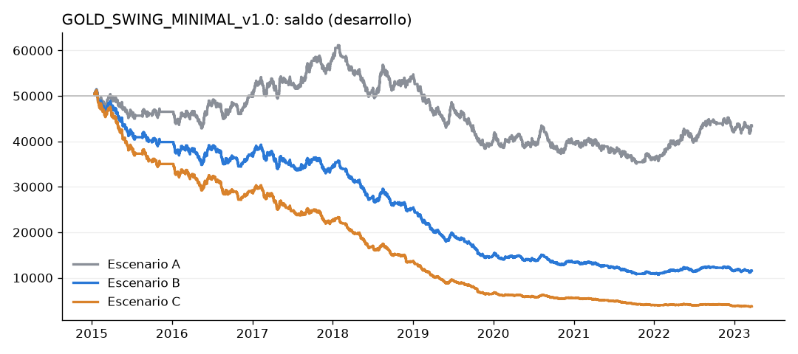
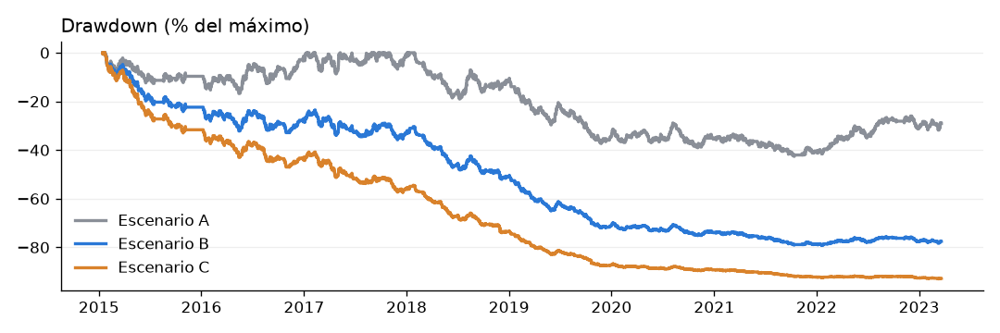

# GOLD_SWING_MINIMAL_v1.0: backtest de DESARROLLO

**Lógica:** cierre 4H frente a la EMA 50 → retroceso de 1H → recuperación en 1H (cierre más allá del extremo de la vela
anterior) → entrada → stop en el retroceso → objetivo 2R.

**Reglas e interpretaciones:** `edges/gold_swing_minimal.md`, registradas antes del código (commit 3e3ab9a).

**Datos:** futuros GC, con el mismo ajuste por cambios de contrato que GOLD_SWING_SIMPLE_v1.0. Solo velas de 1H y 4H.

**Periodo:** desarrollo del 2-ene-2015 al 21-mar-2023 (8,2 años). El fuera de muestra **no se ha ejecutado**.

**Cuenta:** 50.000 $ con un riesgo del 0,5 % por operación. Costes idénticos a los de GOLD_SWING_SIMPLE_v1.0.

**Código:** `src/strategies/gold_swing_minimal.py`. Para repetirlo: `python -m src.report.gold_minimal`.

## Respuesta a la pregunta
**No.** Con 2.337 operaciones la muestra ya es grande, y el resultado es claro:
- **Sin costes el resultado es cero:** −0,007 R por operación, t = −0,24. El acierto es del 33,2 %, justo el punto de
  equilibrio de un objetivo 2R (33,3 %). Es lo que daría el azar.
- **Con costes realistas pierde de forma estadísticamente clara:** −0,121 R por operación, t = −4,09.
- No hay ventaja que justifique seguir con esta familia tal cual.

## Frecuencia
| | Operaciones | Operaciones al año |
|---|---|---|
| GOLD_SWING_SIMPLE_v1.0 | 41 | ~5 |
| **GOLD_SWING_MINIMAL_v1.0** | **2.337** | **~285** |

La frecuencia se multiplica por 57: la muestra ya no es el problema. Además, 3.771 señales se ignoraron por tener una
operación abierta.

## Resultados (v1.0 exacta: EMA 50, TP 2R)
| | A: sin costes | B: costes realistas | C: costes + deslizamiento |
|---|---|---|---|
| Operaciones (al año) | 2.337 (284,5) | 2.337 (284,5) | 2.407 (293,1) |
| Acierto | 33,2 % | 33,2 % | 33,1 % |
| Profit factor | 0,98 | 0,82 | 0,71 |
| Expectancy (R) | −0,007 | −0,121 | −0,215 |
| t | −0,24 | **−4,09** | −7,00 |
| Ganancia / pérdida media en R | +2,00 / −1,00 | +1,89 / −1,12 | +1,86 / −1,24 |
| Ganancia / pérdida media en $ | +449 / −227 | +226 / −137 | +145 / −100 |
| Neto | −6.638 $ | −38.451 $ | −46.278 $ |
| Drawdown máximo | −42,6 % | −79,2 % | −93,0 % |
| Racha perdedora / ganadora | 15 / 8 | 15 / 8 | 15 / 8 |
| Duración media / mediana | 19,5 h / 6 h | 19,5 h / 6 h | 18,5 h / 6 h |
| MAE media (ganadoras) | −0,81 R (−0,43) | igual | igual |
| MFE media (perdedoras) | +1,13 R (+0,70) | igual | igual |

- En C hay más operaciones: el saldo cae tanto que algunas no llegan a 1 oz y no se abren, lo que deja libres otras
  señales.
- Los importes en $ se reducen con el tiempo porque el tamaño depende del saldo, que va bajando. Para comparar, lo
  fiable son las columnas en R.

**Por qué los costes hunden el resultado:** el stop mediano es de solo 4 $ por onza, porque el retroceso es de una sola
vela. Los costes del escenario B (0,37 $ por onza) cuestan de media 0,11 R en cada operación. Además, hay 119
operaciones con el stop a menos de 1,5 $, que llegan a posiciones de miles de onzas.

**Sin esas 119 el resultado sigue siendo 0:** sin costes da −0,004 R.

**Por año (A, sin costes):**
- Positivo en 2016, 2017, 2022 y 2023; negativo en el resto.
- El peor año es 2019: −0,19 R, t −2,5.
- No hay ningún año con un resultado significativo a favor.

**Con costes (B):** solo 2022 queda en positivo (+0,06 R). El detalle está en `yearly.csv`.

**Largos frente a cortos (A):**
- Largos: +0,002 R (t 0,04).
- Cortos: −0,017 R (t −0,39).
- Ninguno de los dos lados tiene ventaja.

## Sensibilidad (solo diagnóstico; la oficial sigue siendo EMA 50 con TP 2R)
| EMA | TP | Oper. | R sin costes (t) | R con costes B (t) |
|---|---|---|---|---|
| 20 | 1,5R | 2.736 | +0,023 (0,96) | −0,090 (−3,82) |
| 20 | 2R | 2.309 | +0,026 (0,88) | −0,087 (−2,90) |
| 20 | 2,5R | 1.977 | +0,025 (0,69) | −0,087 (−2,42) |
| 50 | 1,5R | 2.825 | +0,007 (0,29) | −0,108 (−4,62) |
| **50** | **2R** | **2.337** | **−0,007 (−0,24)** | **−0,121 (−4,09)** |
| 50 | 2,5R | 2.096 | −0,003 (−0,09) | −0,117 (−3,36) |
| 100 | 1,5R | 2.788 | +0,009 (0,38) | −0,104 (−4,41) |
| 100 | 2R | 2.346 | +0,006 (0,20) | −0,105 (−3,55) |
| 100 | 2,5R | 2.038 | +0,000 (0,00) | −0,109 (−3,10) |

- Las 9 combinaciones dan lo mismo: sin costes todas quedan entre −0,007 y +0,026 R, con |t| < 1 (ruido).
- Con costes, todas pierden con t ≤ −2,4.
- La EMA 20 sale algo "mejor" sin costes, pero la diferencia es del tamaño del ruido. No se elige a posteriori.

## Auditoría de look-ahead
Todo OK, revisado en las 2.337 operaciones:
- La EMA y la dirección 4H se recalculan solo con velas 4H cerradas, tanto en el retroceso como en la señal.
- El retroceso vigente está dentro de la ventana de 5 velas.
- La señal usa solo la vela anterior.
- La entrada es la apertura de la vela siguiente.
- El SL usa el ATR calculado hasta el cierre de la señal.
- El TP es 2R sobre la entrada real.
- La prueba de truncamiento global (6 cortes en sábado) no muestra diferencias.

Hay pruebas unitarias en `tests/test_gold_swing_minimal.py` y una prueba con datos reales en
`tests/test_lookahead_real.py`.

## Archivos
| Archivo | Contenido |
|---|---|
| `trades.csv` | Operaciones de A, B y C: señal, entrada, SL, TP, R, resultado, duración, MAE, MFE y precios reales de GC (`*_real`) |
| `signals.csv` | Todas las señales (escenario B), con su estado: tomada, ignorada por operación abierta o entrada más allá del stop |
| `signals.txt` | Texto de alerta de cada señal tomada (LONG/SHORT, Entry, SL, TP, RR, hora) |
| `summary.csv` | Resumen estadístico |
| `yearly.csv`, `long_short.csv` | Desgloses |
| `sensitivity.csv` | EMA 20/50/100 × TP 1,5/2/2,5 × escenarios A/B/C |
| `equity_curve.png`, `drawdown_curve.png` | Curvas de saldo y de drawdown |
| `diagnostics.md` | Auditoría de look-ahead y recuento de señales |

