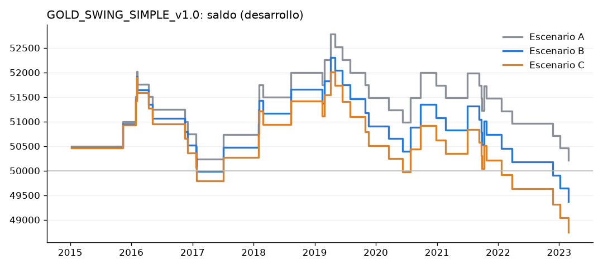
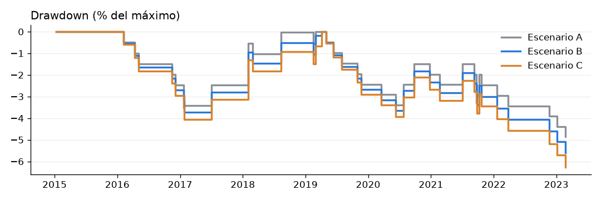

# GOLD_SWING_SIMPLE_v1.0: backtest de DESARROLLO

**Lógica:** 4H tendencia → barrido de liquidez 1H → confirmación 1H → FVG 1H → retest en 15m → entrada al 50 % del
FVG → objetivo 2R.

**Reglas e interpretaciones:** `edges/gold_swing_simple.md`, registradas antes del código y del backtest (commit a88cafe).

**Datos:** futuros GC de Databento (sustituto de XAUUSD), ajustados por cambios de contrato. La estrategia solo ve velas
de 15m, 1H y 4H.

**Periodo:** desarrollo del 2-ene-2015 al 21-mar-2023. El fuera de muestra **no se ha ejecutado**, porque el desarrollo
no cumple los criterios.

**Cuenta:** 50.000 $, con un riesgo del 0,5 % del saldo por operación (tamaño en onzas, redondeado hacia abajo).

**Código:** `src/strategies/gold_swing_simple.py`. Para repetirlo: `python -m src.report.gold_swing`.

## Veredicto
- **`INSUFFICIENT_SAMPLE`:** solo hay **41 operaciones en 8 años** (unas 5 al año). El mínimo registrado era 100, así
  que la v1.0 no se puede validar.
- Aun así, lo que se ve **no apunta a una ventaja**:
  - Antes de costes el resultado medio es +0,024 R por operación, con t = 0,11 (indistinguible de cero).
  - Con costes realistas es negativo: −0,058 R, PF 0,91.
- Las reglas no se tocan: cualquier cambio sería la v1.1.

## Resultados (v1.0 exacta)

| | A: sin costes | B: costes realistas | C: costes + deslizamiento |
|---|---|---|---|
| Operaciones | 41 | 41 | 41 |
| Acierto | 34,1 % | 34,1 % | 34,1 % |
| Profit factor | 1,03 | 0,91 | 0,84 |
| Expectancy (R) | +0,024 | −0,058 | −0,122 |
| Expectancy ($) | +5 | −15 | −31 |
| t | 0,11 | −0,26 | −0,53 |
| Ganancia media / pérdida media | +506 $ / −255 $ | +479 $ / −272 $ | +471 $ / −290 $ |
| Ganancia media / pérdida media en R | +2,00 / −1,00 | +1,91 / −1,08 | +1,88 / −1,16 |
| Neto | +209 $ | −631 $ | −1.253 $ |
| Drawdown máximo | −4,9 % (−10 R) | −5,6 % (−11,6 R) | −6,3 % (−13,1 R) |
| Racha perdedora / ganadora | 7 / 4 | 7 / 4 | 7 / 4 |
| Duración media / mediana | 26,8 h / 5,2 h | igual | igual |
| Muestra | INSUFFICIENT_SAMPLE | INSUFFICIENT_SAMPLE | INSUFFICIENT_SAMPLE |

Costes, en $ por onza:
- **B:** spread de 0,30 + comisión de 0,07, ida y vuelta.
- **C:** lo de B + 0,10 de deslizamiento en la entrada + 0,30 en las salidas por stop.

El riesgo medio es de solo 6 $ por onza (mediana 4,7 $), así que los costes de B se comen ~0,06 R por operación.

**MAE / MFE (en R):**

| | MAE | MFE |
|---|---|---|
| Media de todas las operaciones | −0,79 | +1,18 |
| Ganadoras | −0,38 | |
| Perdedoras | | +0,75 |

8 de las 27 perdedoras llegaron a ir +1R a favor antes de tocar el stop; 4 de ellas, a +1,5R.

**Por año, dirección, día y hora:** todos los grupos tienen menos de 30 operaciones (`INSUFFICIENT_SAMPLE`), así que
no se interpretan. Largos: 17 operaciones, −0,02 R. Cortos: 24 operaciones, −0,08 R. El detalle está en
`yearly.csv`, `long_short.csv`, `weekday.csv` y `entry_hour_rome.csv`.

## Embudo de setups (desarrollo)

| Paso | n | % del paso anterior |
|---|---|---|
| 0. Barridos 1H detectados (los dos lados) | 2.944 | |
| 1. A favor de la dirección 4H | 901 | 31 % |
| — descartados por tener una operación abierta | 18 | |
| — evaluables | 883 | |
| 2. Con confirmación 1H (la vela siguiente) | 194 | 22 % |
| 3. Con FVG | 81 | 42 % |
| 4. El precio vuelve al 50 % en 24 h | 57 | 70 % |
| 5. Entradas ejecutadas | 41 | 72 % de los FVG con retest |
| 6. Ganadoras | 14 | 34 % |
| 7. Perdedoras | 27 | 66 % |

- Dónde se pierde la muestra: la dirección 4H es neutral o contraria el 69 % de las veces, y 3 de cada 4 barridos
  alineados no tienen confirmación inmediata.
- **Dónde está el edge:** en ningún paso. El 34 % de acierto con objetivo 2R es justo el punto de equilibrio sin
  costes (33 %).

Setups cancelados antes de la entrada:
- Nuevo barrido: 29.
- Cambio de la dirección 4H: 6.
- Caducidad de 24 h: 5.

## Sensibilidad (solo diagnóstico; ninguna variante sustituye a la v1.0)

| Variante (un cambio cada vez) | Oper. | PF (A) | PF (B) | R medio (B) | t (B) |
|---|---|---|---|---|---|
| **v1.0 oficial** | 41 | 1,03 | 0,91 | −0,058 | −0,26 |
| Swing de 3 velas | 28 | 0,94 | 0,83 | −0,128 | −0,47 |
| TP 1,5R | 41 | 1,17 | 1,02 | +0,015 | 0,08 |
| TP 2,5R | 40 | 0,94 | 0,85 | −0,119 | −0,48 |
| Entrada en el borde cercano | 49 | 0,80 | 0,72 | −0,208 | −1,07 |
| Entrada en el borde lejano | 38 | 0,90 | 0,78 | −0,160 | −0,69 |
| Buffer 0 | 41 | 1,13 | 1,00 | +0,007 | 0,03 |

Todas las variantes tienen muestra insuficiente y ninguna tiene un t ni remotamente significativo. Las diferencias
entre ellas son del tamaño del ruido: con 41 operaciones, 2 operaciones más o menos cambian el PF en ±0,1.

## Auditoría de look-ahead
Todo OK. El detalle está en `diagnostics.md`. En cada operación se ha recalculado:
- el swing, confirmado antes de la vela del barrido;
- la dirección 4H, solo con velas 4H cerradas;
- el barrido, con los datos cortados en su vela;
- el FVG;
- el stop, con el ATR de ese momento;
- el orden temporal: barrido < confirmación < FVG ≤ entrada.

Además, la prueba de truncamiento global (6 cortes en sábado) no muestra diferencias, y hay pruebas unitarias en
`tests/test_gold_swing_simple.py`.

## Archivos
| Archivo | Contenido |
|---|---|
| `trades.csv` | Todas las operaciones de los escenarios A, B y C. Incluye entrada, SL, TP, R, resultado, duración, swing, barrido, FVG, MAE, MFE y precios reales del contrato (`*_real`) |
| `rejected_signals.csv` | Barridos alineados que no acabaron en operación, con el motivo (precios ajustados por rolls) |
| `summary.csv` | Todas las métricas |
| `funnel.csv` | Embudo de setups |
| `yearly.csv`, `long_short.csv`, `weekday.csv`, `entry_hour_rome.csv` | Desgloses |
| `sensitivity.csv` | Variantes de diagnóstico × escenarios |
| `equity_curve.png`, `drawdown_curve.png` | Curvas de saldo y de drawdown |
| `alerts.txt` | El texto de alerta que habría generado cada entrada (precios reales de GC) |

Alertas en vivo: `python scripts/senales_oro.py`. Solo imprime señales; nunca ejecuta órdenes. Los precios son de GC;
en XAUUSD cambia el nivel (diferencia de base) pero no las distancias.

