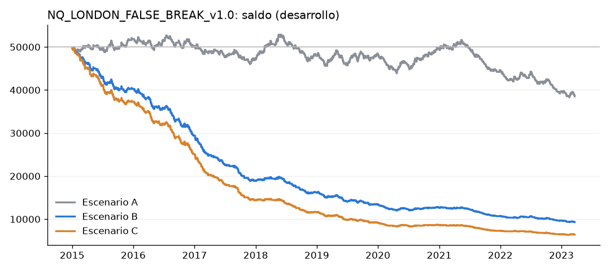
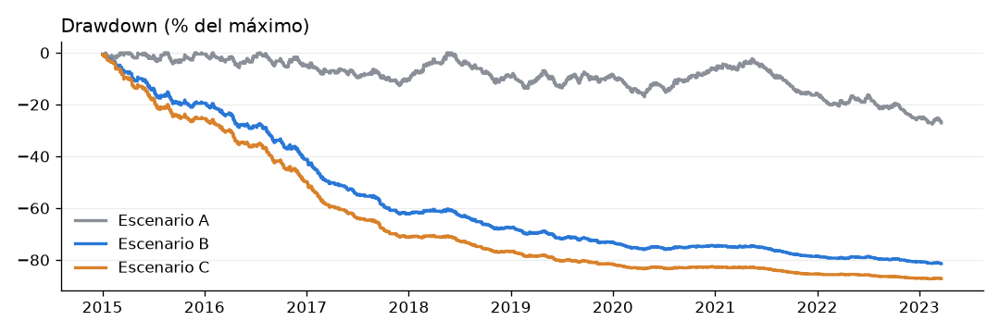

# NQ_LONDON_FALSE_BREAK_v1.0: la falsa ruptura del rango de Londres en el Nasdaq (desarrollo)

**Reglas:** idénticas a GOLD_LONDON_FALSE_BREAK_v1.0. Ficha: `edges/nq_london_false_break.md`, registrada antes de
ejecutar (commit 2724a28).
- Rango de 08:00 a 09:00 de Londres (15m) y falsa ruptura del primer ataque.
- Entrada en la apertura siguiente.
- SL en la vela + 0,10 ATR, TP 2R y salida a las 12:00 de Londres.

**Qué cambia (solo lo que depende del mercado):**
- **Datos:** futuros NQ, con el mismo ajuste por cambios de contrato.
- **Tamaño:** en contratos MNQ (2 $ por punto), con 50.000 $ y 0,5 % de riesgo.
- **Costes:** los estándar del proyecto para MNQ:
  - A: sin costes;
  - B: 1 tick en la entrada y en las salidas a mercado, más 1 $ por contrato y lado;
  - C: igual que B, con 2 ticks.

**Horario:** de 08:00 a 12:00 de Londres son las 03:00-07:00 de Nueva York, antes de la apertura de EE. UU.

**Periodo:** desarrollo del 2-ene-2015 al 21-mar-2023. **El fuera de muestra sigue BLOQUEADO.**

Para repetirlo: `python -m src.report.gold_london NQ`.

## Veredicto
**Sin ventaja, igual que en el oro.**
- **Sin costes el resultado es ligeramente negativo:** −0,057 R por operación, t = −1,33, PF 0,91.
- **Con costes realistas es una pérdida grande:** −0,41 R por operación, t = −8,8, PF 0,48. El stop mediano es de 6,1
  puntos; 1,5 puntos de costes por contrato son ~0,25 R en la mediana y 0,36 R de media.
- **No cumple los criterios.**

## Frecuencia
| | Operaciones | Al año |
|---|---|---|
| A | 913 | 111 |
| B | 861 | 105 |
| C | 808 | 98 |

En B y C hay menos operaciones porque, al bajar el saldo, algunos días el stop no permite ni 1 contrato
(`POSITION_SIZE_BELOW_MINIMUM`: 52 días en B).

## Resultados (v1.0 exacta)
| | A: sin costes | B: costes realistas | C: 2 ticks |
|---|---|---|---|
| Acierto | 34,7 % | 32,4 % | 31,8 % |
| Profit factor | 0,91 | 0,48 | 0,38 |
| Expectancy (R) | −0,057 | −0,409 | −0,539 |
| Expectancy ($) | −12,6 | −47,3 | −54,0 |
| t | −1,33 | **−8,82** | −10,79 |
| Ganancia / pérdida media | +372 $ (+1,62 R) / −219 $ (−0,96 R) | +132 $ / −134 $ | +104 $ / −128 $ |
| Drawdown máximo | −27,6 % | −81,4 % | −87,3 % |
| Racha perdedora / ganadora | 19 / 5 | 16 / 5 | 14 / 5 |
| Duración media / mediana | 0,9 h / 0,5 h | 0,8 h / 0,5 h | 0,8 h / 0,5 h |
| Salidas (A) | 24 % TP, 60 % SL, 16 % tiempo | | |
| MAE (ganadoras) / MFE (perdedoras) | −0,44 R / +0,67 R | | |

**Por año (A):**
- Positivo en 2015, 2018, 2019 y 2020, pero ningún año es significativo.
- 2021 y 2022 son los peores (−0,20 R, t ≈ −1,8).
- Con los costes de B, **todos los años pierden**.

## Diagnóstico (no cambia la v1.0)
| | Oper. (A) | Acierto | PF | R medio sin costes (t) | R medio con costes B |
|---|---|---|---|---|---|
| HIGH → SHORT | 463 | 32,0 % | 0,83 | −0,106 (−1,79) | −0,488 |
| LOW → LONG | 450 | 37,6 % | 1,00 | −0,006 (−0,10) | −0,326 |

- Ninguno de los dos lados tiene ventaja. En el oro, el que salía "mejor" era el contrario (el SHORT): esto confirma
  que esas diferencias son ruido.
- **Rango y profundidad sin costes:** sin relación. Spearman −0,013 (rango) y 0,029 (profundidad); ningún quintil
  positivo con t > 0,3.
- **Hora:** ninguna franja con muestra suficiente es significativa.

**Sensibilidad (A → B):**

| Variante | Sin costes | Con costes B |
|---|---|---|
| TP 1,5R | −0,060 | −0,413 |
| TP 2,5R | −0,041 | −0,398 |
| Buffer 0 | −0,143 | −0,638 |

Todas pierden. No hay ninguna configuración escondida.

## Auditoría de look-ahead
Todo OK en las 861 operaciones:
- rango congelado a las 09:00;
- primer break y falsa ruptura recalculados con los datos cortados;
- entrada en la apertura siguiente, antes de las 12:00;
- SL con el ATR de ese momento;
- TP 2R;
- salida a las 12:00.

La prueba de truncamiento global (6 cortes en sábado) no muestra diferencias.

## Archivos
Mismos archivos que en el informe del oro:
- `trades.csv`, `daily_range_stats.csv`, `summary.csv`, `yearly.csv`;
- `false_break_side.csv`, `false_break_time.csv`, `range_depth_analysis.csv`, `sensitivity.csv`;
- `signals.txt`, `equity_curve.png`, `drawdown_curve.png`, `diagnostics.md`.

En los CSV, la columna `onzas` son **contratos MNQ**, y `stop_distance_usd` y `range_usd` están en **puntos del
Nasdaq**.

