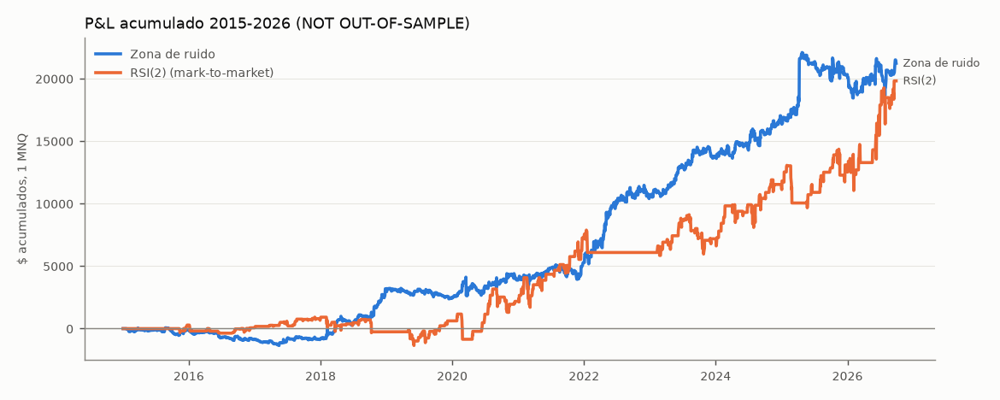
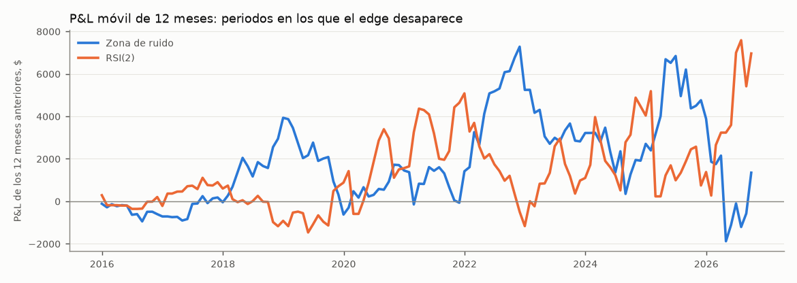
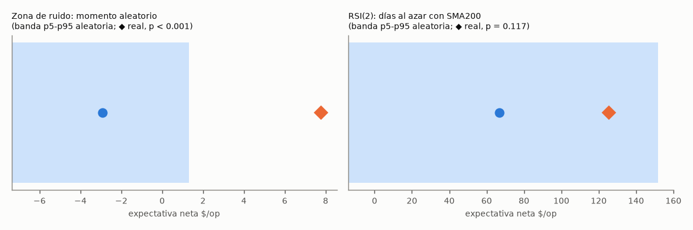

# SURVIVOR ANALYSIS v1.0

30-sep-2026 · experimento `survivor/experimentos/20260930_0939` · reglas **congeladas** (RSI2_SURVIVOR_V1, NOISE_ZONE_SURVIVOR_V1; SHA-256 del código comprobado; reproducen operación a operación la auditoría) · **todo NOT OUT-OF-SAMPLE** (2015-2026 ya estaba visto) · pre-registro: `survivor/SURVIVOR_ANALYSIS_PRE_REGISTRATION.md` (commit anterior a los cálculos).

## EXECUTIVE SUMMARY

Resultado global: **A — ambas sobreviven a las pruebas de falsación, pero con debilidades concretas y medidas**. Ninguna está probada fuera de muestra; el forward test es el único juez limpio.

### RSI(2)
**Evidencia**
- 158 operaciones, PF 1.69, +125.45 $/op, IC 95 % por bloques (20.62, 226.93).
- **Fortalezas:** casi inmune a los costes (×3 → +117 $/op), al deslizamiento y al retraso. Todos los parámetros vecinos son positivos. El 75 % de los años es positivo y ninguno aporta más del 34 %. En % del precio no crece con los años; el aumento en $ se debe sobre todo a que el NQ vale 4-6 veces más que en 2015.
- **Debilidad principal:** la **aleatorización solo da WEAK EVIDENCE**. Comprar el NQ en días al azar (con la misma duración y con el filtro SMA200) gana de media +67 $/op; el RSI(2) gana +125. La señal aporta unos +60 $/op, pero p = 0.12. **Buena parte de su resultado es la deriva alcista del Nasdaq 2015-2026.**
- **Otras debilidades:** muestra pequeña (13 op/año); sin los 10 mejores trades la t baja a 1,0; los años 2018 y 2022 son negativos.
- **Regímenes favorables:** positivo en las tres clases de volatilidad; mejor en TREND UP.
- **Regímenes desfavorables:** ninguno con evidencia (las celdas son pequeñas).
- **Fragilidad:** no ante costes ni ejecución; sí ante un cambio de régimen del mercado de fondo (años bajistas como 2022).

### ZONA DE RUIDO
**Evidencia**
- 2725 operaciones, PF 1.2, +7.79 $/op, IC (3.14, 12.87).
- **Fortalezas:** la aleatorización la **confirma** (dirección y momento aleatorios pierden los costes, p < 0,001). Resiste 2× costes, +3 ticks y 5 min de retraso. Los parámetros vecinos son positivos. Correlación diaria con el RSI(2) de -0.06.
- **Debilidad 1 — TAIL DEPENDENCE:** el 1 % de las mejores operaciones (27) aporta el 107 % del beneficio neto. Sin ellas, pierde. Es la naturaleza de un seguidor de tendencia intradía, pero hace que un año sin días de tendencia fuerte sea plano o negativo.
- **Debilidad 2 — depende de la volatilidad:** con ATR relativo BAJO, ≈ 0 $/op; con ALTO, +20 $/op. 2015-2017 fue negativo (PF 0,91).
- **Debilidad 3 — tras días de crash:** después de un día de crash (retorno ≤ percentil 2) **pierde** (−47 $/op, IC por debajo de 0). Es CONTRADICTION en esa condición.
- **Fragilidad ante costes:** moderada. La comisión es el 20 % del resultado bruto con MNQ; con 3× costes, la expectativa ≈ 0.

### CARTERA
- **Correlación:** diaria -0.06; mensual -0.06; de drawdown +0.05. Las correlaciones condicionadas son todas |ρ| < 0,15 contando todos los días, pero los días en que ambas operan con volatilidad BAJA llegan a +0,43.
- **Diversificación real:** a igual riesgo, la mezcla 75/25 tiene menos DD95 de Monte Carlo (-2,560 $) que la ZR sola (-2,667 $) y que el RSI(2) solo (-4,224 $), con Sharpe 0.96 frente a 0.79 y 0.57. La mejora es **modesta**.
- **Riesgo:** el EA actual (1+1 MNQ) **no es igual riesgo**: tiene un 59 % más de volatilidad que la ZR sola, un DD95 de -4,612 $, P(DD ≥ 5.000 $ en un año) = 3.2 % y P(algún día ≤ −1.000 $) = 37.0 %. Ese último riesgo viene casi entero del mark-to-market nocturno del RSI(2).

### FORWARD TEST — qué observar
- **Zona de ruido:** la expectativa móvil de 50 operaciones frente a la banda histórica (percentil 5 = −20,5 $); el deslizamiento real frente al tick supuesto; su resultado en días de volatilidad baja y tras días de crash.
- **RSI(2):** frecuencia (≈ 1,2 op/mes) y DD mark-to-market. Con 15 operaciones solo se detecta un fallo grosero (p5 = −71 $/op).
- **Cartera:** cuántas veces salta el límite diario de 1.000 $ por el RSI(2) abierto de noche.







## TABLA FINAL DE EVIDENCIA

Veredictos con las reglas pre-registradas. Sin puntuación, sin ranking y sin ganador.

| Test | RSI2 | Noise Zone |
|---|---|---|
| Historical evidence | +125 $/op, IC (20.62, 226.93); aleatorización p=0.12 → WEAK EVIDENCE | +7.79 $/op, IC (3.14, 12.87); aleatorización p<0,001 → CONFIRMATION |
| Sample size | 158 op. (13/año): pequeña | 2.725 op. (230/año): suficiente |
| Temporal stability | años: CONFIRMATION (75 % +); subperiodos: CONFIRMATION | años: CONFIRMATION (67 % +); subperiodos: WEAK EVIDENCE (2015-17 < 0) |
| Regime stability | VOL CONFIRMATION, TEND CONFIRMATION (celdas pequeñas) | VOL CONFIRMATION por regla, pero el edge es ≈ 0 en vol BAJA; tras crash: CONTRADICTION |
| Cost robustness | CONFIRMATION (3× → +117 $) | CONFIRMATION (2× → +4.79; 3× → +1.79) |
| Slippage robustness | CONFIRMATION | CONFIRMATION (+3 ticks → +4.79) |
| Parameter stability | CONFIRMATION | CONFIRMATION |
| Outlier dependence | CONFIRMATION (sin los 10 mejores: t 1,0) | CONFIRMATION, pero TAIL DEPENDENCE (top 1 % = 107 % del neto) |
| Walk-forward | anual congelado: CONFIRMATION (75% ventanas +) | trimestral congelado: CONFIRMATION (64% ventanas +) |
| Monte Carlo | CONFIRMATION (P(DD≥5k)=2.9 %; DD95 -4,508 $) | CONFIRMATION (P(DD≥5k)=0.1 %; DD95 -2,667 $) |
| Forward status | Iniciado el 30-sep-2026 (demo). Sin operaciones todavía | Iniciado el 30-sep-2026 (demo). Sin operaciones todavía |

## TABLA DE CARTERAS (igual riesgo: volatilidad diaria = ZR sola con 1 MNQ; σ estimadas con datos hasta 2023-03-21)

| Cartera (reparto de riesgo ZR/RSI2) | Pesos en MNQ | Sharpe | Max DD $ | Peor año $ | MC DD95 $ | % años negativos | P(año negativo) MC | P(DD ≥ 5.000 $) |
|---|---|---|---|---|---|---|---|---|
| Noise (100/0) | (1.00, 0.00) | 0.79 | -3,645 | -715 | -2,667 | 33.3 | 16.6 % | 0.1 % |
| 75/25 | (0.96, 0.30) | 0.96 | -3,321 | -755 | -2,560 | 25.0 | 12.2 % | 0.0 % |
| 50/50 | (0.73, 0.68) | 0.97 | -3,953 | -669 | -3,175 | 8.3 | 12.8 % | 0.3 % |
| 25/75 | (0.32, 0.90) | 0.77 | -3,736 | -428 | -3,932 | 8.3 | 18.3 % | 1.4 % |
| RSI2 (0/100) | (0.00, 0.94) | 0.57 | -3,184 | -1,096 | -4,224 | 25.0 | 24.8 % | 2.0 % |
| 1+1 MNQ (EA actual, MÁS riesgo) | (1.00, 1.00) | 0.96 | -5,648 | -935 | -4,612 | 8.3 | 13.2 % | 3.2 % |

No se elige ninguna cartera. La última fila **no** es igual riesgo: tiene más riesgo total. Tabla completa (Sortino, Calmar, peor mes, DD p50/p99, P(día ≤ −1.000 $)):
| cartera | pesos (ZR, RSI2) en MNQ | vol_diaria_$ | rentabilidad_anual_% | sharpe | sortino | max_dd_$ | calmar | peor_año_$ | años_negativos_% | peor_mes_$ | MC_DD_p50_$ | MC_DD_p95_$ | MC_DD_p99_$ | P(año negativo)_% | P(DD ≥ 5000 $)_% | P(algún día ≤ −1000 $)_% |
|---|---|---|---|---|---|---|---|---|---|---|---|---|---|---|---|---|
| 100/0 | (1.00, 0.00) | 141.30 | 7.05 | 0.79 | 1.47 | -3 645.00 | 0.48 | -715.00 | 33.30 | -1 870.00 | -1 326.00 | -2 667.00 | -3 513.00 | 16.60 | 0.10 | 0.00 |
| 75/25 | (0.96, 0.30) | 143.70 | 8.78 | 0.96 | 1.75 | -3 321.00 | 0.66 | -755.00 | 25.00 | -1 605.00 | -1 357.00 | -2 560.00 | -3 357.00 | 12.20 | 0.00 | 0.00 |
| 50/50 | (0.73, 0.68) | 156.30 | 9.60 | 0.97 | 1.66 | -3 953.00 | 0.61 | -669.00 | 8.30 | -1 587.00 | -1 540.00 | -3 175.00 | -4 189.00 | 12.80 | 0.30 | 14.60 |
| 25/75 | (0.32, 0.90) | 168.60 | 8.21 | 0.77 | 1.21 | -3 736.00 | 0.55 | -428.00 | 8.30 | -2 472.00 | -1 761.00 | -3 932.00 | -5 255.00 | 18.30 | 1.40 | 39.50 |
| 0/100 | (0.00, 0.94) | 171.50 | 6.17 | 0.57 | 0.86 | -3 184.00 | 0.48 | -1 096.00 | 25.00 | -2 754.00 | -1 864.00 | -4 224.00 | -5 637.00 | 24.80 | 2.00 | 44.90 |
| 1+1 MNQ (EA actual, MÁS riesgo) | (1.00, 1.00) | 224.10 | 13.64 | 0.96 | 1.64 | -5 648.00 | 0.60 | -935.00 | 8.30 | -2 372.00 | -2 211.00 | -4 612.00 | -6 109.00 | 13.20 | 3.20 | 37.00 |

## RESPUESTAS A LAS 10 PREGUNTAS

**Q1 — ¿Persiste el edge del RSI(2) al descomponerlo por régimen?**

Los datos son **compatibles**: VOL_ATR CONFIRMATION, VOL_REAL CONFIRMATION, TENDENCIA CONFIRMATION. Positivo en todas las celdas, pero con 22-130 operaciones por celda; solo BAJA y TREND UP tienen IC > 0.

**Q2 — ¿Y el de la zona de ruido?**

Por la regla pre-registrada, CONFIRMATION en las tres variables. En sustancia, **el edge vive en la volatilidad normal-alta**: BAJA ≈ −0,7 $/op; ALTA +19,9 $/op, IC (6.98, 34.49). En tendencia es parecido en las tres clases.

**Q3 — ¿Cuándo funcionan?**
- **ZR:** días con volatilidad relativa normal/alta; tras un rango previo normal; cuando el precio ya se ha alejado del cierre anterior a favor.
- **RSI(2):** en casi cualquier condición del régimen alcista. Mejor en TREND UP.

**Q4 — ¿Cuándo fallan?**
- **ZR:** con volatilidad baja (≈ 0); tras días de crash (−47 $/op, IC < 0); tras un día de expansión de rango (−4,5 $/op, exploratorio); en 2015-2017 y 2019.
- **RSI(2):** en años de mercado bajista o de corrección prolongada (2018, 2022). La salida por tiempo (5 sesiones sin RSI > 70) concentra todas las pérdidas grandes (−593 $/op de media).

**Q5 — ¿Difieren las ganadoras de las perdedoras antes de entrar?**
- **RSI(2): no.** Ningún rasgo previo las separa (todas las p de Bonferroni = 1).
- **ZR: sí, aunque débilmente.** Las ganadoras tienen más ATR, más distancia al cierre anterior a favor, un hueco y una noche a favor (p de Bonferroni < 0,03). Es compatible con la hipótesis de momentum. Las diferencias de mediana son pequeñas y **no se convierten en filtros**.

| rasgo (ZR) | mediana_ganadoras | mediana_perdedoras | p_MannWhitney | p_Bonferroni |
|---|---|---|---|---|
| dist_vwap_atr | 0.21 | 0.21 | 0.24 | 1.00 |
| dist_cierre_ant_atr | 0.63 | 0.56 | 0.00 | 0.00 |
| hueco_atr | 0.04 | 0.01 | 0.00 | 0.00 |
| noche_ret_atr | 0.14 | 0.10 | 0.00 | 0.02 |
| noche_rango_atr | 0.59 | 0.58 | 0.32 | 1.00 |
| rango_previo_atr | 0.86 | 0.87 | 0.97 | 1.00 |
| atr14 | 205.09 | 185.40 | 0.00 | 0.00 |

**Q6 — ¿Estructural o concentrado en el tiempo?**
- **RSI(2):** ningún año aporta más del 34 % y los subperiodos son todos positivos → compatible con algo estructural. Pero la aleatorización indica que una parte grande es beta del Nasdaq, no señal.
- **ZR:** ningún año aporta más del 25 % y el 64 % de los trimestres es positivo. Pero 2015-2017 fue negativo, y el resultado depende de pocos días de tendencia fuerte (cola).

**Q7 — ¿Explotan fenómenos distintos?**

Veredicto: **CONFIRMATION**. Uno es momentum intradía (continuación del desequilibrio del día, largos y cortos) y el otro reversión a la media diaria en tendencia alcista (solo largos). La correlación diaria es -0.06. Correlaciones condicionadas:
|  | dias | corr_todos_los_dias | dias_con_ambas | corr_dias_con_ambas |
|---|---|---|---|---|
| VOL_ATR = sin dato | 257.00 | -0.00 | 7.00 | — |
| VOL_ATR = NORMAL | 1 436.00 | -0.09 | 203.00 | -0.20 |
| VOL_ATR = ALTA | 924.00 | -0.07 | 127.00 | -0.16 |
| VOL_ATR = BAJA | 417.00 | 0.15 | 62.00 | 0.42 |
| TENDENCIA = sin dato | 28.00 | 0.04 | 0.00 | — |
| TENDENCIA = RANGE | 1 991.00 | -0.07 | 318.00 | -0.13 |
| TENDENCIA = TREND UP | 837.00 | 0.02 | 53.00 | 0.26 |
| TENDENCIA = TREND DOWN | 178.00 | -0.09 | 28.00 | -0.32 |
| ZR entradas 10:00-11:00 | 1 214.00 | -0.08 | 299.00 | -0.20 |
| ZR entradas 14:00-15:30 | 461.00 | -0.12 | 129.00 | -0.39 |

**Solapamiento:** 646 de 2725 operaciones de la ZR ocurren con un RSI(2) abierto. En 316 van en el mismo sentido y en 330 en el opuesto. Hay 497 días con ambas.

**Q8 — ¿La combinación reduce el drawdown sin aumentar el riesgo?** Veredicto: **CONFIRMATION**, con una mejora pequeña. Ver la tabla de carteras: a igual volatilidad, las mezclas 75/25 y 50/50 tienen mejor Sharpe que cualquiera de las dos solas, pero la 50/50 ya tiene más DD95 que la ZR sola.

**Q9 — ¿Lo que ayuda a una perjudica a la otra?**

Parcialmente, y solo de forma **exploratoria**:
- Las operaciones de la ZR mientras hay un RSI(2) abierto rinden -4.78 (mismo sentido) y -3.66 (opuesto) $/op, frente a +11.52 sin RSI(2) abierto. Los días tras una caída en tendencia alcista, que son los del RSI(2), son malos para la ZR.
- Por volatilidad, la ZR necesita volatilidad y el RSI(2) funciona en todas.

Esto va a `POST_HOC_OBSERVATIONS.md` y **no** se usa como regla.

**Q10 — ¿Qué vigilar en el forward?** Ver el árbol de decisión y `forward_testing/`.

## Detalle — RSI(2)

**Año a año:**
| ventana | operaciones | PF | expectativa_$ | P&L_$ | max_dd_$ | acierto_% |
|---|---|---|---|---|---|---|
| 2015 | 4.00 | 2.56 | 71.38 | 286.00 | -182.00 | 75.00 |
| 2016 | 12.00 | 0.81 | -18.33 | -220.00 | -644.00 | 66.70 |
| 2017 | 13.00 | 3.03 | 56.35 | 733.00 | -290.00 | 53.80 |
| 2018 | 11.00 | 0.45 | -95.91 | -1 055.00 | -1 173.00 | 63.60 |
| 2019 | 14.00 | 1.53 | 62.71 | 878.00 | -877.00 | 64.30 |
| 2020 | 14.00 | 1.36 | 111.46 | 1 560.00 | -2 016.00 | 71.40 |
| 2021 | 22.00 | 2.70 | 230.95 | 5 081.00 | -1 675.00 | 77.30 |
| 2022 | 3.00 | 0.25 | -390.00 | -1 170.00 | -1 570.00 | 66.70 |
| 2023 | 18.00 | 1.29 | 60.92 | 1 096.00 | -2 648.00 | 66.70 |
| 2024 | 19.00 | 2.29 | 228.87 | 4 349.00 | -1 532.00 | 73.70 |
| 2025 | 13.00 | 1.32 | 120.15 | 1 562.00 | -2 977.00 | 84.60 |
| 2026 | 15.00 | 3.66 | 448.10 | 6 722.00 | -1 331.00 | 66.70 |

Año con más peso: 33.9 % del neto; años positivos: 75%. Veredicto: **CONFIRMATION**.

**Normalizado** (media por operación; la columna t es la de la media):
|  | media | mediana | t |
|---|---|---|---|
| pts | 62.72 | 98.38 | 2.39 |
| %_precio | 0.38 | 0.86 | 2.06 |
| ATR_d | 0.24 | 0.66 | 1.78 |
| R_proyecto | 0.34 | 0.97 | 1.92 |

**Normalizado por año** (¿crece el edge solo por el precio?):
| t_salida | pts | %_precio | ATR_d | R_proyecto |
|---|---|---|---|---|
| 2 015 | 35.69 | 0.80 | 0.48 | 0.73 |
| 2 016 | -9.17 | -0.21 | -0.09 | -0.05 |
| 2 017 | 28.17 | 0.50 | 0.58 | 0.78 |
| 2 018 | -47.95 | -0.65 | -0.59 | -0.99 |
| 2 019 | 31.36 | 0.40 | 0.33 | 0.49 |
| 2 020 | 55.73 | 0.60 | 0.07 | 0.35 |
| 2 021 | 115.48 | 0.83 | 0.48 | 0.70 |
| 2 022 | -195.00 | -1.28 | -0.58 | -0.91 |
| 2 023 | 30.46 | 0.27 | 0.16 | 0.29 |
| 2 024 | 114.43 | 0.64 | 0.46 | 0.57 |
| 2 025 | 60.08 | 0.27 | 0.20 | 0.19 |
| 2 026 | 224.05 | 0.77 | 0.47 | 0.61 |

**Meses:** meses: 141, mediana_mensual_$: 0.00, meses_positivos_%: 45.40, peor_mes_$: -2 483.00, peor_mes: 2025-02-28, mejor_mes_$: 3 589.00, mejor_mes: 2026-06-30, dd_mensual_max_$: -2 648.00, racha_meses_negativos: 3

**Ventanas móviles:**
|  | ventanas | ventanas_negativas_% | peor_$ | peor_hasta | expectativa_min_$ | expectativa_mediana_$ | mayor_racha_ventanas_negativas |
|---|---|---|---|---|---|---|---|
| 3 meses | 139 | 26.60 | -2 648.00 | 2023-10-31 | -1 241.75 | 79.50 | 8 |
| 6 meses | 136 | 30.10 | -1 633.00 | 2025-07-31 | -964.50 | 58.75 | 8 |
| 12 meses | 130 | 23.80 | -1 173.00 | 2019-01-31 | -390.00 | 69.16 | 14 |

**Subperiodos:**
|  | operaciones | PF | expectativa_$ | P&L_$ | max_dd_$ |
|---|---|---|---|---|---|
| 2015-2017 | 29.00 | 1.47 | 27.52 | 798.00 | -644.00 |
| 2018-2020 | 39.00 | 1.17 | 35.47 | 1 383.00 | -2 016.00 |
| 2021-2023 | 43.00 | 1.60 | 116.45 | 5 008.00 | -2 648.00 |
| 2024-2026 | 47.00 | 2.17 | 268.77 | 12 632.00 | -2 977.00 |

Veredicto: **CONFIRMATION**.

**Walk-forward congelado (anual):** 75% de ventanas positivas → **CONFIRMATION**.
Nota: el RSI(2) entra a las 18:00 NY, así que las señales del viernes entran el domingo por la tarde (sesión del lunes). "domingo" en la tabla DIA = sesión del lunes.

**Regímenes y rasgos previos** (IC 95 % por bloques de 20 sesiones; celdas de rasgos descriptivos = terciles de la propia muestra):
*VOL_ATR*
|  | operaciones | PF | expectativa_$ | P&L_$ | IC95_$ | acierto_% |
|---|---|---|---|---|---|---|
| BAJA | 27 | 7.47 | 192.37 | 5 194.00 | (65.98, 332.21) | 77.80 |
| NORMAL | 79 | 1.25 | 52.58 | 4 154.00 | (-97.97, 187.89) | 65.80 |
| ALTA | 49 | 1.93 | 211.66 | 10 372.00 | (-44.98, 450.53) | 71.40 |
| sin dato | 3 | 1.56 | 33.83 | 102.00 | (—, —) | 66.70 |

*VOL_REAL*
|  | operaciones | PF | expectativa_$ | P&L_$ | IC95_$ | acierto_% |
|---|---|---|---|---|---|---|
| baja | 35 | 2.63 | 106.83 | 3 739.00 | (-2.53, 235.12) | 65.70 |
| media | 65 | 1.54 | 106.38 | 6 915.00 | (-68.02, 253.09) | 72.30 |
| alta | 53 | 1.72 | 176.46 | 9 353.00 | (-55.79, 399.92) | 69.80 |
| sin dato | 5 | 0.72 | -37.00 | -185.00 | (—, —) | 60.00 |

*TENDENCIA*
|  | operaciones | PF | expectativa_$ | P&L_$ | IC95_$ | acierto_% |
|---|---|---|---|---|---|---|
| TREND UP | 22 | 11.46 | 287.09 | 6 316.00 | (145.84, 435.43) | 77.30 |
| RANGE | 130 | 1.43 | 92.69 | 12 050.00 | (-26.05, 212.06) | 68.50 |
| TREND DOWN | 6 | 4.40 | 242.50 | 1 455.00 | (—, —) | 66.70 |

*RSI_NIVEL*
|  | operaciones | PF | expectativa_$ | P&L_$ | IC95_$ | acierto_% |
|---|---|---|---|---|---|---|
| 5-10 | 40 | 1.35 | 73.06 | 2 923.00 | (-124.20, 267.60) | 57.50 |
| 10-20 | 107 | 1.89 | 150.60 | 16 114.00 | (23.79, 272.59) | 74.80 |
| < 5 | 11 | 1.34 | 71.32 | 784.00 | (—, —) | 63.60 |

*MOV_PREVIO*
|  | operaciones | PF | expectativa_$ | P&L_$ | IC95_$ | acierto_% |
|---|---|---|---|---|---|---|
| caída media | 52 | 2.06 | 149.73 | 7 786.00 | (19.63, 287.07) | 73.10 |
| caída grande | 53 | 1.39 | 95.58 | 5 066.00 | (-129.59, 320.23) | 66.00 |
| caída pequeña | 53 | 1.83 | 131.49 | 6 969.00 | (-50.56, 298.68) | 69.80 |

*DIST_SMA200*
|  | operaciones | PF | expectativa_$ | P&L_$ | IC95_$ | acierto_% |
|---|---|---|---|---|---|---|
| bajo | 53 | 2.72 | 197.35 | 10 459.00 | (69.56, 324.53) | 73.60 |
| medio | 52 | 1.12 | 22.23 | 1 156.00 | (-158.43, 172.81) | 65.40 |
| alto | 53 | 1.61 | 154.82 | 8 205.00 | (-91.08, 392.10) | 69.80 |

*VWAP*
|  | operaciones | PF | expectativa_$ | P&L_$ | IC95_$ | acierto_% |
|---|---|---|---|---|---|---|
| cerca | 53 | 1.73 | 123.65 | 6 554.00 | (-57.57, 277.86) | 71.70 |
| extremo | 53 | 1.62 | 117.03 | 6 203.00 | (-39.60, 280.58) | 66.00 |
| moderado | 52 | 1.72 | 135.87 | 7 065.00 | (-59.90, 315.11) | 71.20 |

*HUECO*
|  | operaciones | PF | expectativa_$ | P&L_$ | IC95_$ | acierto_% |
|---|---|---|---|---|---|---|
| medio | 52 | 1.30 | 57.38 | 2 984.00 | (-105.39, 211.63) | 67.30 |
| alto | 53 | 1.46 | 83.33 | 4 417.00 | (-101.52, 251.16) | 71.70 |
| bajo | 53 | 2.38 | 234.35 | 12 420.00 | (43.16, 435.98) | 69.80 |

*apertura*
|  | operaciones | PF | expectativa_$ | P&L_$ | IC95_$ | acierto_% |
|---|---|---|---|---|---|---|
| mitad alta | 30 | 1.18 | 42.20 | 1 266.00 | (-258.31, 293.54) | 66.70 |
| mitad baja | 53 | 1.66 | 114.43 | 6 065.00 | (-41.67, 258.30) | 73.60 |
| debajo del mín. | 67 | 2.12 | 190.89 | 12 789.00 | (27.49, 357.26) | 68.70 |
| encima del máx. | 8 | 0.77 | -37.44 | -300.00 | (—, —) | 62.50 |

*NOCHE_RET*
|  | operaciones | PF | expectativa_$ | P&L_$ | IC95_$ | acierto_% |
|---|---|---|---|---|---|---|
| medio | 52 | 1.32 | 61.84 | 3 216.00 | (-109.30, 215.89) | 67.30 |
| alto | 53 | 1.45 | 78.25 | 4 147.00 | (-100.98, 240.71) | 73.60 |
| bajo | 53 | 2.31 | 235.07 | 12 458.00 | (34.22, 439.43) | 67.90 |

*NOCHE_RANGO*
|  | operaciones | PF | expectativa_$ | P&L_$ | IC95_$ | acierto_% |
|---|---|---|---|---|---|---|
| bajo | 53 | 1.46 | 76.11 | 4 034.00 | (-103.05, 230.97) | 71.70 |
| alto | 53 | 1.84 | 165.09 | 8 750.00 | (-13.57, 341.90) | 66.00 |
| medio | 52 | 1.74 | 135.33 | 7 037.00 | (-61.07, 319.70) | 71.20 |

*RANGO_PREVIO*
|  | operaciones | PF | expectativa_$ | P&L_$ | IC95_$ | acierto_% |
|---|---|---|---|---|---|---|
| contracción | 35 | 2.35 | 179.96 | 6 299.00 | (-10.91, 374.93) | 65.70 |
| normal | 54 | 1.93 | 155.02 | 8 371.00 | (-42.23, 317.57) | 75.90 |
| expansión | 69 | 1.34 | 74.66 | 5 151.00 | (-93.19, 241.24) | 66.70 |

*DIA*
|  | operaciones | PF | expectativa_$ | P&L_$ | IC95_$ | acierto_% |
|---|---|---|---|---|---|---|
| lunes | 21 | 1.55 | 79.26 | 1 665.00 | (-130.08, 274.82) | 71.40 |
| martes | 31 | 6.79 | 370.48 | 11 485.00 | (184.06, 547.52) | 77.40 |
| miércoles | 37 | 2.68 | 174.31 | 6 450.00 | (8.69, 325.70) | 75.70 |
| jueves | 33 | 0.73 | -99.91 | -3 297.00 | (-419.27, 196.44) | 60.60 |
| domingo | 36 | 1.45 | 97.75 | 3 519.00 | (-135.41, 336.13) | 63.90 |

**Crisis y extremos** (clasificación causal, percentiles expansivos):
|  | operaciones | expectativa_$ | P&L_$ | PF | IC95_$ |
|---|---|---|---|---|---|
| CRISIS_VOL (sí) | 3 | 312.67 | 938.00 | — | (—, —) |
| CRISIS_VOL (no) | 155 | 121.83 | 18 883.00 | 1.66 | (18.97, 228.35) |
| CRISIS_CRASH (sí) | 11 | 375.77 | 4 134.00 | 2.39 | (—, —) |
| CRISIS_CRASH (no) | 147 | 106.72 | 15 687.00 | 1.61 | (3.38, 205.88) |
| CRISIS_TENDENCIA (sí) | 3 | 538.83 | 1 616.00 | — | (—, —) |
| CRISIS_TENDENCIA (no) | 155 | 117.45 | 18 205.00 | 1.63 | (14.93, 222.59) |

Veredictos: {'CRISIS_VOL': 'INCONCLUSIVE', 'CRISIS_CRASH': 'INCONCLUSIVE', 'CRISIS_TENDENCIA': 'INCONCLUSIVE'}

**MAE / MFE:**
|  | operaciones | mae_% mediana | mae_% p75 | mfe_% mediana | mfe_% p75 |
|---|---|---|---|---|---|
| ganadoras | 110.00 | 0.93 | 1.62 | 1.86 | 2.54 |
| perdedoras | 48.00 | 3.22 | 4.92 | 0.68 | 1.06 |

Captura mediana del MFE en las ganadoras: 86%.

**Horizontes fijos** (¿el edge está en la entrada o en la salida?):
|  | media_% | t |
|---|---|---|
| 1 | 0.26 | 2.95 |
| 2 | 0.18 | 1.52 |
| 3 | 0.20 | 1.21 |
| 4 | 0.27 | 1.38 |
| 5 | 0.50 | 2.33 |

Lectura: el sesgo existe desde la primera sesión (+0,26 %, t 3,0). La salida por RSI > 70 cierra casi siempre en beneficio; la salida por tiempo a las 5 sesiones concentra las pérdidas:
| sesiones | operaciones | acierto_% | expectativa_$ | neto_$ |
|---|---|---|---|---|
| 1 | 9.00 | 100.00 | 422.78 | 3 805.00 |
| 2 | 31.00 | 100.00 | 490.68 | 15 211.00 |
| 3 | 31.00 | 100.00 | 378.10 | 11 721.00 |
| 4 | 24.00 | 83.30 | 304.06 | 7 297.00 |
| 5 | 63.00 | 30.20 | -289.10 | -18 213.00 |

| motivo | size | mean | sum |
|---|---|---|---|
| rsi | 112.00 | 420.38 | 47 082.00 |
| tiempo | 46.00 | -592.63 | -27 261.00 |

**Estrés** (reglas congeladas):
|  | operaciones | PF | expectativa_$ | neto_$ | t | IC95_bloques_$ |
|---|---|---|---|---|---|---|
| costes BASE | 158 | 1.69 | 125.45 | 19 821.00 | 2.39 | (20.62, 226.93) |
| costes 1.5x | 158 | 1.67 | 123.45 | 19 505.00 | 2.35 | (18.62, 224.94) |
| costes 2x | 158 | 1.66 | 121.45 | 19 190.00 | 2.31 | (16.62, 222.95) |
| costes 3x | 158 | 1.64 | 117.46 | 18 558.00 | 2.24 | (12.63, 218.96) |
| +1 tick | 158 | 1.68 | 124.45 | 19 663.00 | 2.37 | (19.62, 225.93) |
| +2 tick | 158 | 1.67 | 123.45 | 19 505.00 | 2.35 | (18.62, 224.93) |
| +3 tick | 158 | 1.67 | 122.45 | 19 347.00 | 2.33 | (17.62, 223.93) |
| retraso +1m | 158 | 1.70 | 126.25 | 19 948.00 | 2.38 | (19.89, 230.37) |
| retraso +2m | 158 | 1.70 | 126.32 | 19 959.00 | 2.39 | (19.97, 229.34) |
| retraso +3m | 158 | 1.71 | 128.95 | 20 375.00 | 2.43 | (21.75, 232.27) |
| retraso +5m | 158 | 1.74 | 132.71 | 20 969.00 | 2.51 | (26.71, 235.40) |

Veredictos: {'costes': 'CONFIRMATION', 'deslizamiento': 'CONFIRMATION', 'retraso': 'CONFIRMATION', 'sensibilidad': 'CONFIRMATION'}

**Sensibilidad** (perturbaciones pequeñas, una a una; no se elige ninguna):
|  | operaciones | PF | expectativa_$ | t | IC95_bloques_$ |
|---|---|---|---|---|---|
| entrada=18 | 150 | 1.82 | 143.37 | 2.68 | (37.16, 245.38) |
| entrada=19 | 152 | 1.74 | 132.38 | 2.47 | (25.07, 235.17) |
| entrada=21 | 170 | 1.67 | 123.37 | 2.40 | (10.97, 226.88) |
| entrada=22 | 175 | 1.79 | 138.33 | 2.79 | (30.89, 237.56) |
| salida=65 | 161 | 1.62 | 106.29 | 2.20 | (6.49, 197.94) |
| salida=75 | 153 | 1.57 | 113.79 | 2.02 | (0.16, 221.96) |
| max_dias=4 | 167 | 1.51 | 91.63 | 1.89 | (-9.73, 185.97) |
| max_dias=6 | 156 | 2.42 | 193.27 | 3.97 | (98.21, 286.14) |
| sma=180 | 157 | 1.71 | 128.19 | 2.43 | (22.68, 229.20) |
| sma=220 | 157 | 1.66 | 121.95 | 2.31 | (17.29, 224.80) |

**Concentración:** top 1% operaciones (2): 18.10, top 5% operaciones (8): 52.70, top 10% operaciones (16): 89.70, mejores 1 meses: 18.10, mejores 3 meses: 37.80, mejores 5 meses: 53.60, mejores 1 años: 33.90, mejores 2 años: 59.50, TAIL DEPENDENCE (top 10% > 100%): no

**Sin los mejores trades** (diagnóstico, no un backtest nuevo):
|  | operaciones | neto_$ | expectativa_$ | PF | t |
|---|---|---|---|---|---|
| original | 158.00 | 19 821.00 | 125.45 | 1.69 | 2.39 |
| sin los 1 mejores | 157.00 | 17 700.00 | 112.74 | 1.61 | 2.20 |
| sin los 3 mejores | 155.00 | 14 900.00 | 96.13 | 1.52 | 1.90 |
| sin los 5 mejores | 153.00 | 12 562.00 | 82.10 | 1.44 | 1.63 |
| sin los 10 mejores | 148.00 | 7 351.00 | 49.67 | 1.26 | 1.00 |

Veredicto: **CONFIRMATION**.

**Rachas frente a Monte Carlo** (5.000 permutaciones):
|  | observada | p5_MC | p50_MC | p95_MC | percentil_de_la_observada |
|---|---|---|---|---|---|
| racha perdedora máx. | 3.00 | 3.00 | 4.00 | 6.00 | 19.50 |
| racha ganadora máx. | 8.00 | 8.00 | 11.00 | 17.00 | 6.70 |

Distribución de rachas: {'perdedoras': {1: 27, 2: 9, 3: 1}, 'ganadoras': {1: 13, 2: 5, 3: 6, 4: 3, 5: 6, 6: 2, 7: 1, 8: 1}}. Veredicto: **CONFIRMATION**.

## Detalle — Zona de ruido

**Año a año:**
| ventana | operaciones | PF | expectativa_$ | P&L_$ | max_dd_$ | acierto_% |
|---|---|---|---|---|---|---|
| 2015 | 210.00 | 0.96 | -0.55 | -116.00 | -618.00 | 33.30 |
| 2016 | 238.00 | 0.81 | -3.00 | -715.00 | -872.00 | 29.00 |
| 2017 | 237.00 | 0.98 | -0.20 | -47.00 | -528.00 | 32.50 |
| 2018 | 226.00 | 1.77 | 17.40 | 3 932.00 | -748.00 | 39.80 |
| 2019 | 248.00 | 0.87 | -2.52 | -626.00 | -844.00 | 32.30 |
| 2020 | 235.00 | 1.13 | 6.17 | 1 450.00 | -1 483.00 | 37.90 |
| 2021 | 229.00 | 1.15 | 6.17 | 1 413.00 | -1 220.00 | 39.30 |
| 2022 | 255.00 | 1.35 | 20.57 | 5 244.00 | -1 308.00 | 41.60 |
| 2023 | 229.00 | 1.35 | 14.04 | 3 216.00 | -936.00 | 43.20 |
| 2024 | 231.00 | 1.22 | 11.71 | 2 704.00 | -1 349.00 | 42.00 |
| 2025 | 223.00 | 1.26 | 17.42 | 3 884.00 | -2 397.00 | 40.40 |
| 2026 | 164.00 | 1.06 | 5.44 | 892.00 | -3 065.00 | 40.20 |

Año con más peso: 24.7 % del neto; años positivos: 67%. Veredicto: **CONFIRMATION**.

**Normalizado** (media por operación; la columna t es la de la media):
|  | media | mediana | t |
|---|---|---|---|
| pts | 3.90 | -5.75 | 2.56 |
| %_precio | 0.03 | -0.07 | 2.50 |
| ATR_d | 0.01 | -0.05 | 2.25 |

**Normalizado por año** (¿crece el edge solo por el precio?):
| t_salida | pts | %_precio | ATR_d |
|---|---|---|---|
| 2 015 | -0.28 | -0.01 | 0.00 |
| 2 016 | -1.50 | -0.03 | -0.03 |
| 2 017 | -0.10 | -0.00 | 0.00 |
| 2 018 | 8.70 | 0.13 | 0.07 |
| 2 019 | -1.26 | -0.01 | -0.02 |
| 2 020 | 3.09 | 0.03 | 0.03 |
| 2 021 | 3.09 | 0.02 | 0.01 |
| 2 022 | 10.28 | 0.08 | 0.03 |
| 2 023 | 7.02 | 0.05 | 0.03 |
| 2 024 | 5.85 | 0.03 | 0.03 |
| 2 025 | 8.71 | 0.05 | 0.01 |
| 2 026 | 2.72 | 0.01 | 0.00 |

**Meses:** meses: 141, mediana_mensual_$: 86.00, meses_positivos_%: 59.60, peor_mes_$: -1 870.00, peor_mes: 2026-01-31, mejor_mes_$: 3 776.00, mejor_mes: 2025-04-30, dd_mensual_max_$: -3 186.00, racha_meses_negativos: 4

**Ventanas móviles:**
|  | ventanas | ventanas_negativas_% | peor_$ | peor_hasta | expectativa_min_$ | expectativa_mediana_$ | mayor_racha_ventanas_negativas |
|---|---|---|---|---|---|---|---|
| 3 meses | 139 | 34.50 | -2 041.00 | 2026-01-31 | -35.19 | 2.56 | 6 |
| 6 meses | 136 | 31.60 | -2 052.00 | 2026-01-31 | -16.55 | 4.00 | 13 |
| 12 meses | 130 | 23.80 | -1 883.00 | 2026-04-30 | -8.37 | 6.97 | 20 |

**Subperiodos:**
|  | operaciones | PF | expectativa_$ | P&L_$ | max_dd_$ |
|---|---|---|---|---|---|
| 2015-2017 | 685.00 | 0.91 | -1.28 | -878.00 | -1 432.00 |
| 2018-2020 | 709.00 | 1.23 | 6.71 | 4 756.00 | -1 483.00 |
| 2021-2023 | 713.00 | 1.29 | 13.85 | 9 873.00 | -1 308.00 |
| 2024-2026 | 618.00 | 1.18 | 12.10 | 7 480.00 | -3 754.00 |

Veredicto: **WEAK EVIDENCE**.

**Walk-forward congelado (trimestral):** 64% de ventanas positivas → **CONFIRMATION**.
| ventana | inicio | fin | operaciones | PF | expectativa_$ | P&L_$ | max_dd_$ | acierto_% |
|---|---|---|---|---|---|---|---|---|
| 2015Q1 | 2015-01-01 | 2015-03-31 | 43 | 0.95 | -0.58 | -25.00 | -257.00 | 37.20 |
| 2015Q2 | 2015-04-01 | 2015-06-30 | 54 | 0.97 | -0.40 | -22.00 | -166.00 | 35.20 |
| 2015Q3 | 2015-07-01 | 2015-09-30 | 52 | 0.84 | -2.79 | -145.00 | -264.00 | 32.70 |
| 2015Q4 | 2015-10-01 | 2015-12-31 | 61 | 1.09 | 1.24 | 76.00 | -354.00 | 29.50 |
| 2016Q1 | 2016-01-01 | 2016-03-31 | 44 | 0.87 | -3.23 | -142.00 | -400.00 | 27.30 |
| 2016Q2 | 2016-04-01 | 2016-06-30 | 76 | 0.63 | -5.59 | -425.00 | -641.00 | 28.90 |
| 2016Q3 | 2016-07-01 | 2016-09-30 | 59 | 0.99 | -0.07 | -4.00 | -302.00 | 30.50 |
| 2016Q4 | 2016-10-01 | 2016-12-31 | 59 | 0.82 | -2.44 | -144.00 | -261.00 | 28.80 |
| 2017Q1 | 2017-01-01 | 2017-03-31 | 61 | 0.70 | -2.64 | -161.00 | -300.00 | 32.80 |
| 2017Q2 | 2017-04-01 | 2017-06-30 | 76 | 1.24 | 2.45 | 186.00 | -367.00 | 32.90 |
| 2017Q3 | 2017-07-01 | 2017-09-30 | 54 | 1.05 | 0.59 | 32.00 | -200.00 | 31.50 |
| 2017Q4 | 2017-10-01 | 2017-12-31 | 46 | 0.84 | -2.26 | -104.00 | -200.00 | 32.60 |
| 2018Q1 | 2018-01-01 | 2018-03-31 | 63 | 1.83 | 19.92 | 1 255.00 | -454.00 | 39.70 |
| 2018Q2 | 2018-04-01 | 2018-06-30 | 57 | 0.99 | -0.28 | -16.00 | -748.00 | 31.60 |
| 2018Q3 | 2018-07-01 | 2018-09-30 | 47 | 1.57 | 9.17 | 431.00 | -310.00 | 44.70 |
| 2018Q4 | 2018-10-01 | 2018-12-31 | 59 | 2.41 | 38.33 | 2 262.00 | -373.00 | 44.10 |
| 2019Q1 | 2019-01-01 | 2019-03-31 | 55 | 1.04 | 0.95 | 52.00 | -300.00 | 32.70 |
| 2019Q2 | 2019-04-01 | 2019-06-30 | 45 | 1.02 | 0.41 | 18.00 | -516.00 | 28.90 |
| 2019Q3 | 2019-07-01 | 2019-09-30 | 76 | 0.85 | -3.25 | -247.00 | -622.00 | 34.20 |
| 2019Q4 | 2019-10-01 | 2019-12-31 | 72 | 0.62 | -6.24 | -450.00 | -496.00 | 31.90 |
| 2020Q1 | 2020-01-01 | 2020-03-31 | 59 | 1.23 | 14.39 | 849.00 | -1 483.00 | 45.80 |
| 2020Q2 | 2020-04-01 | 2020-06-30 | 58 | 1.06 | 2.56 | 148.00 | -942.00 | 36.20 |
| 2020Q3 | 2020-07-01 | 2020-09-30 | 63 | 1.13 | 5.95 | 375.00 | -668.00 | 38.10 |
| 2020Q4 | 2020-10-01 | 2020-12-31 | 55 | 1.04 | 1.42 | 78.00 | -527.00 | 30.90 |
| 2021Q1 | 2021-01-01 | 2021-03-31 | 65 | 1.06 | 3.48 | 226.00 | -984.00 | 36.90 |
| 2021Q2 | 2021-04-01 | 2021-06-30 | 47 | 1.54 | 16.06 | 755.00 | -368.00 | 38.30 |
| 2021Q3 | 2021-07-01 | 2021-09-30 | 60 | 0.83 | -6.63 | -398.00 | -1 016.00 | 38.30 |
| 2021Q4 | 2021-10-01 | 2021-12-31 | 57 | 1.40 | 14.55 | 830.00 | -831.00 | 43.90 |
| 2022Q1 | 2022-01-01 | 2022-03-31 | 62 | 1.33 | 23.74 | 1 472.00 | -1 308.00 | 40.30 |
| 2022Q2 | 2022-04-01 | 2022-06-30 | 67 | 1.93 | 48.86 | 3 274.00 | -760.00 | 49.30 |
| 2022Q3 | 2022-07-01 | 2022-09-30 | 60 | 1.18 | 9.18 | 551.00 | -818.00 | 38.30 |
| 2022Q4 | 2022-10-01 | 2022-12-31 | 66 | 0.99 | -0.79 | -52.00 | -1 074.00 | 37.90 |
| 2023Q1 | 2023-01-01 | 2023-03-31 | 54 | 1.22 | 9.89 | 534.00 | -608.00 | 38.90 |
| 2023Q2 | 2023-04-01 | 2023-06-30 | 57 | 2.31 | 34.33 | 1 957.00 | -280.00 | 49.10 |
| 2023Q3 | 2023-07-01 | 2023-09-30 | 55 | 1.55 | 22.22 | 1 222.00 | -372.00 | 43.60 |
| 2023Q4 | 2023-10-01 | 2023-12-31 | 63 | 0.83 | -7.90 | -498.00 | -936.00 | 41.30 |
| 2024Q1 | 2024-01-01 | 2024-03-31 | 61 | 1.04 | 1.89 | 115.00 | -810.00 | 37.70 |
| 2024Q2 | 2024-04-01 | 2024-06-30 | 52 | 1.20 | 9.83 | 511.00 | -678.00 | 44.20 |
| 2024Q3 | 2024-07-01 | 2024-09-30 | 58 | 1.27 | 19.56 | 1 134.00 | -1 349.00 | 39.70 |
| 2024Q4 | 2024-10-01 | 2024-12-31 | 60 | 1.34 | 15.72 | 944.00 | -682.00 | 46.70 |
| 2025Q1 | 2025-01-01 | 2025-03-31 | 59 | 1.40 | 24.13 | 1 424.00 | -823.00 | 45.80 |
| 2025Q2 | 2025-04-01 | 2025-06-30 | 42 | 2.04 | 79.51 | 3 340.00 | -1 077.00 | 40.50 |
| 2025Q3 | 2025-07-01 | 2025-09-30 | 69 | 0.63 | -19.33 | -1 334.00 | -1 482.00 | 34.80 |
| 2025Q4 | 2025-10-01 | 2025-12-31 | 53 | 1.10 | 8.58 | 455.00 | -1 640.00 | 41.50 |
| 2026Q1 | 2026-01-01 | 2026-03-31 | 64 | 0.94 | -4.84 | -310.00 | -1 892.00 | 40.60 |
| 2026Q2 | 2026-04-01 | 2026-06-30 | 55 | 1.22 | 19.75 | 1 086.00 | -1 046.00 | 43.60 |
| 2026Q3 | 2026-07-01 | 2026-09-30 | 45 | 1.02 | 2.57 | 116.00 | -2 567.00 | 35.60 |

**Regímenes y rasgos previos** (IC 95 % por bloques de 20 sesiones; celdas de rasgos descriptivos = terciles de la propia muestra):
*VOL_ATR*
|  | operaciones | PF | expectativa_$ | P&L_$ | IC95_$ | acierto_% |
|---|---|---|---|---|---|---|
| BAJA | 445 | 0.97 | -0.73 | -326.00 | (-10.15, 11.17) | 31.50 |
| NORMAL | 1 279 | 1.12 | 4.58 | 5 863.00 | (-1.03, 10.72) | 37.70 |
| ALTA | 793 | 1.36 | 19.94 | 15 814.00 | (6.98, 34.49) | 41.90 |
| sin dato | 208 | 0.96 | -0.57 | -120.00 | (-6.05, 4.57) | 33.20 |

*VOL_REAL*
|  | operaciones | PF | expectativa_$ | P&L_$ | IC95_$ | acierto_% |
|---|---|---|---|---|---|---|
| baja | 686 | 1.03 | 0.65 | 443.00 | (-4.98, 8.09) | 34.30 |
| media | 809 | 1.24 | 9.88 | 7 996.00 | (1.65, 18.80) | 37.70 |
| alta | 1 008 | 1.24 | 12.86 | 12 960.00 | (2.25, 24.54) | 40.60 |
| sin dato | 222 | 0.95 | -0.75 | -167.00 | (-5.85, 4.20) | 33.30 |

*TENDENCIA*
|  | operaciones | PF | expectativa_$ | P&L_$ | IC95_$ | acierto_% |
|---|---|---|---|---|---|---|
| TREND UP | 737 | 1.20 | 6.02 | 4 434.00 | (-1.74, 14.61) | 35.50 |
| RANGE | 1 784 | 1.19 | 7.61 | 13 568.00 | (1.91, 13.05) | 38.00 |
| TREND DOWN | 199 | 1.26 | 16.54 | 3 291.00 | (-8.28, 54.49) | 41.20 |
| sin dato | 5 | 0.22 | -12.40 | -62.00 | (—, —) | 20.00 |

*VWAP*
|  | operaciones | PF | expectativa_$ | P&L_$ | IC95_$ | acierto_% |
|---|---|---|---|---|---|---|
| extremo | 908 | 1.33 | 14.11 | 12 816.00 | (4.32, 24.45) | 40.00 |
| cerca | 908 | 1.15 | 5.70 | 5 178.00 | (-3.59, 16.91) | 37.40 |
| moderado | 907 | 1.10 | 3.61 | 3 274.00 | (-3.83, 10.92) | 35.30 |

*HUECO*
|  | operaciones | PF | expectativa_$ | P&L_$ | IC95_$ | acierto_% |
|---|---|---|---|---|---|---|
| medio | 906 | 1.34 | 11.27 | 10 214.00 | (4.71, 18.62) | 38.40 |
| alto | 908 | 1.22 | 9.42 | 8 557.00 | (0.20, 19.25) | 40.50 |
| bajo | 909 | 1.07 | 2.75 | 2 496.00 | (-7.10, 13.78) | 33.80 |

*apertura*
|  | operaciones | PF | expectativa_$ | P&L_$ | IC95_$ | acierto_% |
|---|---|---|---|---|---|---|
| mitad alta | 908 | 1.47 | 15.68 | 14 240.00 | (7.06, 25.53) | 38.10 |
| debajo del mín. | 405 | 1.09 | 4.25 | 1 720.00 | (-10.04, 20.32) | 34.10 |
| mitad baja | 822 | 0.98 | -0.67 | -552.00 | (-10.39, 10.88) | 36.30 |
| encima del máx. | 590 | 1.31 | 9.87 | 5 823.00 | (0.53, 19.54) | 40.80 |

*NOCHE_RET*
|  | operaciones | PF | expectativa_$ | P&L_$ | IC95_$ | acierto_% |
|---|---|---|---|---|---|---|
| medio | 909 | 1.32 | 10.27 | 9 331.00 | (2.44, 18.00) | 38.60 |
| alto | 906 | 1.26 | 10.47 | 9 488.00 | (2.30, 19.76) | 40.50 |
| bajo | 908 | 1.06 | 2.70 | 2 448.00 | (-7.74, 13.43) | 33.60 |

*NOCHE_RANGO*
|  | operaciones | PF | expectativa_$ | P&L_$ | IC95_$ | acierto_% |
|---|---|---|---|---|---|---|
| medio | 905 | 1.21 | 7.94 | 7 187.00 | (-0.62, 16.14) | 37.60 |
| alto | 908 | 1.17 | 8.24 | 7 486.00 | (-3.23, 21.86) | 38.40 |
| bajo | 910 | 1.25 | 7.25 | 6 594.00 | (-0.26, 15.63) | 36.70 |

*RANGO_PREVIO*
|  | operaciones | PF | expectativa_$ | P&L_$ | IC95_$ | acierto_% |
|---|---|---|---|---|---|---|
| contracción | 1 170 | 1.19 | 6.48 | 7 581.00 | (-0.27, 13.55) | 37.00 |
| normal | 954 | 1.48 | 17.18 | 16 386.00 | (8.92, 26.74) | 39.50 |
| expansión | 599 | 0.92 | -4.51 | -2 700.00 | (-17.22, 10.67) | 35.60 |
| sin dato | 2 | 0.00 | -18.00 | -36.00 | (—, —) | 0.00 |

*DIST_CIERRE_ANT*
|  | operaciones | PF | expectativa_$ | P&L_$ | IC95_$ | acierto_% |
|---|---|---|---|---|---|---|
| alto | 908 | 1.31 | 12.32 | 11 190.00 | (4.11, 22.79) | 41.50 |
| bajo | 908 | 1.00 | 0.18 | 160.00 | (-9.53, 11.09) | 30.80 |
| medio | 907 | 1.30 | 10.93 | 9 918.00 | (3.36, 19.47) | 40.40 |

*HORA*
|  | operaciones | PF | expectativa_$ | P&L_$ | IC95_$ | acierto_% |
|---|---|---|---|---|---|---|
| 10:00 | 762 | 1.18 | 8.80 | 6 703.00 | (-0.79, 18.78) | 37.90 |
| 10:30-11:00 | 557 | 1.15 | 6.40 | 3 568.00 | (-5.08, 18.11) | 33.80 |
| 11:30-13:30 mediodía | 864 | 1.24 | 8.23 | 7 114.00 | (-0.93, 20.01) | 35.50 |
| 14:00-15:30 tarde | 542 | 1.23 | 7.10 | 3 846.00 | (-2.61, 17.12) | 44.10 |

*DIA*
|  | operaciones | PF | expectativa_$ | P&L_$ | IC95_$ | acierto_% |
|---|---|---|---|---|---|---|
| lunes | 524 | 1.07 | 2.45 | 1 284.00 | (-5.84, 11.07) | 35.30 |
| martes | 545 | 1.24 | 8.44 | 4 599.00 | (-2.16, 19.02) | 39.80 |
| miércoles | 550 | 1.28 | 10.59 | 5 826.00 | (-2.41, 26.44) | 37.50 |
| jueves | 585 | 1.10 | 4.52 | 2 646.00 | (-6.67, 16.27) | 37.10 |
| viernes | 521 | 1.30 | 13.19 | 6 874.00 | (1.06, 26.18) | 38.00 |

*LADO*
|  | operaciones | PF | expectativa_$ | P&L_$ | IC95_$ | acierto_% |
|---|---|---|---|---|---|---|
| LARGO | 1 330 | 1.32 | 10.86 | 14 440.00 | (4.40, 18.51) | 40.90 |
| CORTO | 1 395 | 1.11 | 4.87 | 6 790.00 | (-1.84, 12.07) | 34.30 |

**Crisis y extremos** (clasificación causal, percentiles expansivos):
|  | operaciones | expectativa_$ | P&L_$ | PF | IC95_$ |
|---|---|---|---|---|---|
| CRISIS_VOL (sí) | 173 | 30.00 | 5 190.00 | 1.48 | (-0.61, 78.94) |
| CRISIS_VOL (no) | 2 552 | 6.29 | 16 041.00 | 1.17 | (2.26, 10.51) |
| CRISIS_CRASH (sí) | 82 | -46.60 | -3 821.00 | 0.52 | (-88.50, -0.41) |
| CRISIS_CRASH (no) | 2 643 | 9.48 | 25 052.00 | 1.26 | (4.50, 14.80) |
| CRISIS_TENDENCIA (sí) | 201 | 8.67 | 1 742.00 | 1.12 | (-18.02, 47.03) |
| CRISIS_TENDENCIA (no) | 2 524 | 7.72 | 19 489.00 | 1.21 | (3.43, 12.14) |

Veredictos: {'CRISIS_VOL': 'CONFIRMATION', 'CRISIS_CRASH': 'CONTRADICTION', 'CRISIS_TENDENCIA': 'CONFIRMATION'}

**MAE / MFE:**
|  | operaciones | mae_pts mediana | mae_pts p75 | mfe_pts mediana | mfe_pts p75 |
|---|---|---|---|---|---|
| ganadoras | 1 023.00 | 9.25 | 20.50 | 69.75 | 134.00 |
| perdedoras | 1 702.00 | 27.25 | 55.75 | 11.50 | 28.25 |

Captura mediana del MFE en las ganadoras: 59%.

**Horizontes fijos** (¿el edge está en la entrada o en la salida?):
|  | media_pts_sin_costes | t | n |
|---|---|---|---|
| 5 | 1.29 | 3.28 | 2 725.00 |
| 15 | 0.99 | 1.58 | 2 724.00 |
| 30 | 0.83 | 0.97 | 2 595.00 |
| 60 | 1.56 | 1.26 | 2 461.00 |

Lectura: a +5 min, la entrada ya tiene un sesgo a favor (+1,3 pts brutos, t 3,3), que se diluye a 15-60 min (t < 1,6). La salida real (trailing VWAP/banda) obtiene de media ≈ 5.4 pts brutos. **El edge está en la entrada más la salida que deja correr las ganadoras**; con salidas fijas sería mucho menor. La salida es parte esencial de la estrategia, no un detalle arbitrario.

**Tiempo hasta fallar:**
| c | operaciones | acierto_% | expectativa_$ | neto_$ |
|---|---|---|---|---|
| 1-15 min | 1.00 | 100.00 | 33.00 | 33.00 |
| 15-30 min | 1 112.00 | 13.20 | -52.10 | -57 940.00 |
| 30-60 min | 432.00 | 23.40 | -29.23 | -12 630.00 |
| > 60 min | 1 180.00 | 65.60 | 77.77 | 91 768.00 |

|  | operaciones | acierto_final_% | expectativa_final_$ |
|---|---|---|---|
| en beneficio a +30 min | 1 227.00 | 61.50 | 66.54 |
| sin beneficio a +30 min | 385.00 | 31.20 | -6.53 |

Lectura: por construcción, las operaciones que no avanzan salen en el primer chequeo, a los 30 min, y son las perdedoras. Las que siguen abiertas después de 60 min ganan el 66 % de las veces. Es coherente con un seguidor de tendencia. No se crea un stop por tiempo.
**Estrés** (reglas congeladas):
|  | operaciones | PF | expectativa_$ | neto_$ | t | IC95_bloques_$ |
|---|---|---|---|---|---|---|
| costes BASE | 2 725 | 1.20 | 7.79 | 21 231.00 | 2.56 | (3.14, 12.87) |
| costes 1.5x | 2 725 | 1.16 | 6.29 | 17 144.00 | 2.07 | (1.64, 11.37) |
| costes 2x | 2 725 | 1.12 | 4.79 | 13 056.00 | 1.58 | (0.14, 9.87) |
| costes 3x | 2 725 | 1.04 | 1.79 | 4 881.00 | 0.59 | (-2.86, 6.87) |
| +1 tick | 2 725 | 1.17 | 6.79 | 18 506.00 | 2.24 | (2.14, 11.87) |
| +2 tick | 2 725 | 1.14 | 5.79 | 15 781.00 | 1.91 | (1.14, 10.87) |
| +3 tick | 2 725 | 1.12 | 4.79 | 13 056.00 | 1.58 | (0.14, 9.87) |
| retraso +1m | 2 725 | 1.16 | 6.33 | 17 260.00 | 2.11 | (1.82, 11.23) |
| retraso +2m | 2 725 | 1.14 | 5.47 | 14 910.00 | 1.82 | (0.96, 10.32) |
| retraso +3m | 2 725 | 1.12 | 4.70 | 12 806.00 | 1.59 | (0.20, 9.63) |
| retraso +5m | 2 725 | 1.13 | 4.93 | 13 428.00 | 1.69 | (0.34, 10.03) |

Veredictos: {'costes': 'CONFIRMATION', 'deslizamiento': 'CONFIRMATION', 'retraso': 'CONFIRMATION', 'sensibilidad': 'CONFIRMATION'}

**Sensibilidad** (perturbaciones pequeñas, una a una; no se elige ninguna):
|  | operaciones | PF | expectativa_$ | t | IC95_bloques_$ |
|---|---|---|---|---|---|
| dias_ruido=13 | 2 742 | 1.22 | 8.39 | 2.76 | (3.74, 13.42) |
| dias_ruido=15 | 2 704 | 1.20 | 7.86 | 2.56 | (3.13, 12.97) |
| mult=0.9 | 2 989 | 1.15 | 6.00 | 2.06 | (1.57, 10.56) |
| mult=1.1 | 2 455 | 1.22 | 8.45 | 2.62 | (3.50, 13.95) |

**Concentración:** top 1% operaciones (27): 106.60, top 5% operaciones (136): 292.80, top 10% operaciones (272): 422.60, mejores 1 meses: 17.80, mejores 3 meses: 31.30, mejores 5 meses: 41.90, mejores 1 años: 24.70, mejores 2 años: 43.20, TAIL DEPENDENCE (top 10% > 100%): sí

**Sin los mejores trades** (diagnóstico, no un backtest nuevo):
|  | operaciones | neto_$ | expectativa_$ | PF | t |
|---|---|---|---|---|---|
| original | 2 725.00 | 21 231.00 | 7.79 | 1.20 | 2.56 |
| sin los 1 mejores | 2 724.00 | 17 608.00 | 6.46 | 1.17 | 2.36 |
| sin los 3 mejores | 2 722.00 | 14 515.00 | 5.33 | 1.14 | 2.04 |
| sin los 5 mejores | 2 720.00 | 12 890.00 | 4.74 | 1.12 | 1.83 |
| sin los 10 mejores | 2 715.00 | 9 178.00 | 3.38 | 1.09 | 1.34 |

Veredicto: **CONFIRMATION**.

**Rachas frente a Monte Carlo** (5.000 permutaciones):
|  | observada | p5_MC | p50_MC | p95_MC | percentil_de_la_observada |
|---|---|---|---|---|---|
| racha perdedora máx. | 14.00 | 12.00 | 15.00 | 20.00 | 35.30 |
| racha ganadora máx. | 6.00 | 6.00 | 7.00 | 10.00 | 8.20 |

Distribución de rachas: {'perdedoras': {1: 253, 2: 167, 3: 87, 4: 63, 5: 27, 6: 18, 7: 14, 8: 10, 9: 9, 10: 3, 11: 3, 12: 1, 14: 1}, 'ganadoras': {1: 415, 2: 144, 3: 58, 4: 20, 5: 12, 6: 1}}. Veredicto: **CONFIRMATION**.

## Aleatorización (falsación)

| prueba | expectativa_real_$ | media_aleatoria_$ | p5_aleatoria_$ | p95_aleatoria_$ | p_valor | replicas | veredicto |
|---|---|---|---|---|---|---|---|
| NOISE_ZONE dirección aleatoria (N1) | 7.79 | -2.82 | -7.76 | 2.25 | 0.00 | 1 000 | CONFIRMATION |
| NOISE_ZONE momento aleatorio (N2) | 7.79 | -2.93 | -7.37 | 1.32 | 0.00 | 1 000 | CONFIRMATION |
| RSI2 días al azar con SMA200 (N1) | 125.45 | 66.70 | -14.03 | 151.81 | 0.12 | 1 000 | WEAK EVIDENCE |
| RSI2 días al azar sin filtro (N2) | 125.45 | 57.94 | -26.16 | 146.54 | 0.10 | 1 000 | WEAK EVIDENCE |

Lectura:
- **ZR:** la señal importa. Quitarla (dirección o momento al azar) deja la expectativa en −3 $/op, es decir, los costes.
- **RSI(2):** estar largo en el Nasdaq al azar ya gana unos +60 $/op con la misma duración. La señal RSI(2) añade unos +60 $/op, pero solo 1 de cada 9-10 réplicas aleatorias la iguala o supera (p ≈ 0,10). Los datos son **compatibles** con un edge modesto sobre la deriva del mercado y **no permiten** descartar que el resultado sea mayoritariamente beta.

## NQ frente a MNQ (sección 27) y normalización (sección 28)

|  | NOISE_ZONE | RSI2 |
|---|---|---|
| puntos_medios_con_desl | 4.90 | 63.73 |
| MNQ_neto_$ (2 $/pt, 1 $/lado) | 7.79 | 125.45 |
| NQ_neto_$ (20 $/pt, 2,5 $/lado supuesto) | 92.91 | 1 269.49 |
| comisión/bruto medio MNQ_% | 20.40 | 1.60 |
| comisión/bruto medio NQ_% | 5.10 | 0.40 |

Los puntos por operación son idénticos (mismo mercado). En NQ la comisión pesa proporcionalmente menos. Para la ZR, eso hace que el NQ sea económicamente algo más favorable por unidad de riesgo. Supuesto de comisión del NQ: 2,50 $ por lado.

**RSI(2), drawdown por día de salida frente a mark-to-market:** {'DD_mtm_$': -3398.0, 'DD_por_dia_de_salida_$': -2977.0}. La auditoría subestimaba algo el drawdown al contar el P&L el día de salida.

## DECISION TREE FINAL

### RSI2
```text
STATUS:        SOBREVIVE (validación adicional respaldada por los datos; NO fuera de muestra)
CONFIDENCE:    BAJA-MEDIA. Robusto ante costes, ejecución y parámetros; pero con muestra pequeña y aleatorización
               p ≈ 0,10: una parte grande del resultado es la deriva alcista del Nasdaq.
MAIN RISK:     Régimen bajista prolongado (2018, 2022) y la salida por tiempo (5 sesiones) en caídas que continúan.
               Sin stop: DD mark-to-market 1 año p95 ≈ 4.500 $ con 1 MNQ.
WHAT WOULD FALSIFY IT:  En forward, expectativa media de 15 operaciones < −71 $ (p5 histórico) o < −136 $ (p1);
               o, con ≥ 50 operaciones forward, una expectativa no mejor que la de entradas aleatorias en tendencia (~+60 $).
WHAT TO MONITOR LIVE:   Frecuencia (≈ 1,2 op/mes), % de salidas por tiempo (históricamente el 29 %, todas las pérdidas grandes),
               P&L nocturno (huecos del lunes), coincidencia de señales del EA (CFD) con las del futuro.
```

### NOISE ZONE
```text
STATUS:        SOBREVIVE (la aleatorización la distingue claramente del azar; NO fuera de muestra)
CONFIDENCE:    MEDIA. Muestra grande y señal no aleatoria; pero con dependencia de cola (1 % de las operaciones =
               107 % del neto) y de la volatilidad (≈ 0 en vol baja), 2015-2017 negativo y fragilidad a 3× costes.
MAIN RISK:     Periodos largos de volatilidad baja o sin días de tendencia: 12 meses móviles negativos en el 24 % de las
               ventanas (peor −1.883 $). Días tras un crash (−47 $/op). Deslizamiento real mayor que 1 tick por lado.
WHAT WOULD FALSIFY IT:  Expectativa media de las últimas 50 operaciones < −20,5 $ (p5) o < −33 $ (p1); o deslizamiento
               medio real ≥ 4-5 ticks por lado (cada tick extra por lado cuesta 1 $/op; la expectativa histórica se
               anula hacia ~5 ticks/lado); o, con ≥ 500 operaciones forward,
               un IC 95 % por bloques completamente por debajo de 0.
WHAT TO MONITOR LIVE:   Deslizamiento por ejecución; operaciones por mes (≈ 19); expectativa por régimen de vol (etiquetando
               cada día con el ATR relativo); presencia de días de cola (> +200 $), sin los que es normal perder.
```

### PORTFOLIO
```text
STATUS:        Dos fuentes distintas (correlación diaria −0,06; mecanismos distintos). La combinación mejora algo el
               Sharpe a igual riesgo. El EA actual (1+1 MNQ) es MÁS riesgo que una sola estrategia, no igual riesgo.
MAIN RISK:     Con 1+1 MNQ: P(DD ≥ 5.000 $ en 1 año) ≈ 3 %, P(algún día ≤ −1.000 $) ≈ 37 % (sobre todo huecos del
               RSI(2) de noche) -> el freno diario del EA saltará con cierta frecuencia y bloqueará entradas de la ZR.
DIVERSIFICATION EVIDENCE:  Correlación diaria −0,06, mensual −0,06, de drawdown +0,05; condicionada ≤ 0,15 (todos los
               días); +0,43 en días con ambas y volatilidad BAJA (62 días; observación). La ZR rinde peor cuando el
               RSI(2) está abierto (observación post hoc).
WHAT TO MONITOR LIVE:   Correlación móvil de 60 días entre ambas; días en que salta el freno diario y por qué estrategia;
               DD combinado frente al p95 de Monte Carlo (≈ 4.600 $ con 1+1 MNQ).
```

## Anexos

| Documento | Contenido |
|---|---|
| `survivor/SURVIVOR_PROJECT_AUDIT.md` | Diagnóstico inicial, incluida la petición de datos de ES (15,06 $, **no descargados**) |
| `survivor/SURVIVOR_ANALYSIS_PRE_REGISTRATION.md` | Preguntas, pruebas y umbrales fijados antes de ejecutar |
| `survivor/POST_HOC_OBSERVATIONS.md` | Patrones vistos después; no validados |
| `survivor/TEST_CONTAMINATION_LOG.md` | Qué datos se han visto y cuándo |
| `forward_testing/` | `survivors.csv`, `deriva.py` (bandas, sin apagar nada), `comparar.py` (importa el `APEX_registro.csv` del EA) |

**Sobre NQ/ES:** no merece la pena ahora.
- No hay forma de reservar un TEST limpio, así que sería EXPLORATORY ONLY.
- El laboratorio no encontró edge en ideas intradía parecidas.
- El objetivo actual es observar las dos supervivientes, no buscar una tercera.