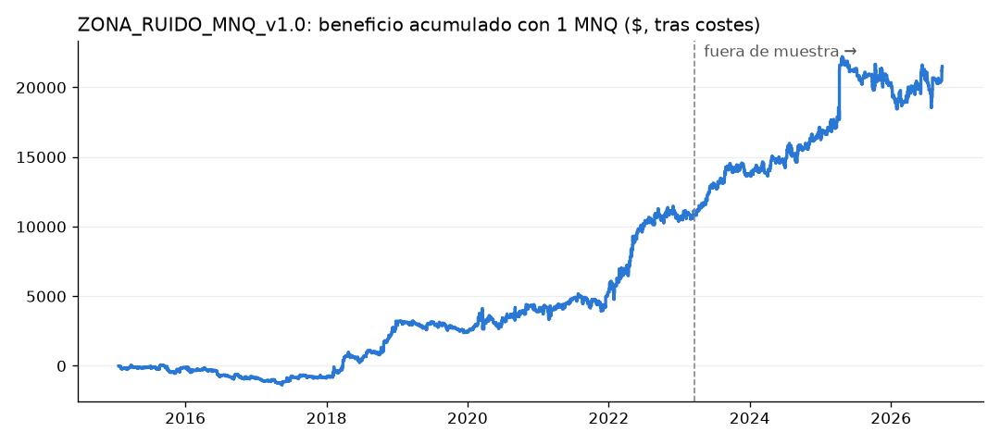

# ZONA_RUIDO_MNQ_v1.0: verificación en el marco actual

Reglas: `edges/zona_ruido_mnq.md`. Código: `src/strategies/zona_ruido.py`. 1 MNQ fijo; costes: 1 tick por lado + 1 $ por contrato y lado. Sesiones ilíquidas previsibles excluidas.

## Auditoría de look-ahead

- Truncamiento (6 cortes en sábado, 2016-2026): OK, sin diferencias.
- Todas las entradas ocurren en un chequeo de media hora (10:00-15:30 NY) y deciden con el cierre del minuto anterior: OK.
- Sigma de cada día calculada solo con los 14 días anteriores (`shift`), y cierre anterior sin hueco en los días de cambio de contrato (pruebas en `tests/test_zona_ruido.py`).

## Resultados por periodo

|                                       |   operaciones |   por_año |   acierto_% |   profit_factor |   media_$ |   ganancia_media_$ |   perdida_media_$ |    t |   neto_$ |   drawdown_max_$ |   racha_perdedora |   racha_ganadora |
|:--------------------------------------|--------------:|----------:|------------:|----------------:|----------:|-------------------:|------------------:|-----:|---------:|-----------------:|------------------:|-----------------:|
| desarrollo (2015 → 21-mar-2023)       |          1924 |       236 |        35.9 |           1.194 |      5.73 |               98.6 |             -46.5 | 2.26 |    11034 |            -1483 |                14 |                6 |
| fuera de muestra (22-mar-2023 → 2026) |           800 |       228 |        41.6 |           1.215 |     13.09 |              177.4 |            -104.8 | 1.57 |    10472 |            -3754 |                 8 |                5 |
| total                                 |          2724 |       233 |        37.6 |           1.204 |      7.89 |              124.3 |             -62.5 | 2.6  |    21506 |            -3754 |                14 |                6 |

El fuera de muestra ya se había visto en el estudio original (archivo): no es virgen. La prueba honesta que queda es la prueba hacia delante en papel.

## Por año

|   fecha |   operaciones |   neto_usd |   acierto |
|--------:|--------------:|-----------:|----------:|
|    2015 |           210 |       -116 |        33 |
|    2016 |           238 |       -715 |        29 |
|    2017 |           237 |        -47 |        32 |
|    2018 |           226 |       3932 |        40 |
|    2019 |           248 |       -626 |        32 |
|    2020 |           235 |       1450 |        38 |
|    2021 |           229 |       1413 |        39 |
|    2022 |           255 |       5244 |        42 |
|    2023 |           229 |       3216 |        43 |
|    2024 |           231 |       2704 |        42 |
|    2025 |           223 |       3884 |        40 |
|    2026 |           163 |       1166 |        40 |

## Qué esperar en papel (distribución histórica, 1 MNQ)

|                                  |   p5 |   p25 |   p50 |   p75 |   p95 |
|:---------------------------------|-----:|------:|------:|------:|------:|
| P&L de 1 mes ($, 1 MNQ)          | -622 |  -180 |    86 |   452 |  1100 |
| P&L de 3 meses ($)               | -635 |  -134 |   158 |   839 |  2279 |
| Peor caída dentro de 3 meses ($) | -211 |  -354 |  -556 |  -920 | -1514 |

Meses positivos: 59.6 %. Ventanas de 3 meses positivas: 64.7 %.

**Criterios de la prueba en papel (ver ficha):** el P&L de 3 meses no debe quedar por debajo del p5 de 3 meses (-635 $); se abandona antes si la caída desde el máximo supera el p95 de la peor caída en 3 meses (-1514 $).

## Motivos de salida

| motivo   |    n |
|:---------|-----:|
| trailing | 1833 |
| cierre   |  891 |

## Entradas por hora de Italia

| t_entrada   |   operaciones |   media_usd |
|:------------|--------------:|------------:|
| 15:00       |            51 |        22.8 |
| 15:30       |            19 |        -4.8 |
| 16:00       |           723 |         8.3 |
| 16:30       |           312 |         6.1 |
| 17:00       |           240 |         4.1 |
| 17:30       |           219 |        10.5 |
| 18:00       |           192 |        -9.3 |
| 18:30       |           173 |        28.3 |
| 19:00       |           133 |        -6   |
| 19:30       |           134 |        21.1 |
| 20:00       |           148 |        -5.4 |
| 20:30       |           135 |         9   |
| 21:00       |           124 |        21.6 |
| 21:30       |           121 |         8.5 |

## Rangos de referencia para la prueba en papel (periodo 2023-2026, precio parecido al actual; 1 MNQ)
| | p5 | p25 | mediana | p75 | p95 |
|---|---|---|---|---|---|
| P&L de 1 mes ($) | −956 | −211 | +240 | +720 | +1.183 |
| P&L de 3 meses ($) | −1.334 | 0 | +586 | +1.222 | +3.340 |

- Peor caída dentro de 3 meses: mediana −968 $ y p95 −2.888 $.
- Meses positivos: 65 %. Trimestres positivos: 73 %.
- Son los números de los criterios de `edges/zona_ruido_mnq.md`.
- La tabla anterior ("Qué esperar en papel") usa 2015-2026, con precios mucho más bajos, así que infravalora los
  importes actuales.
