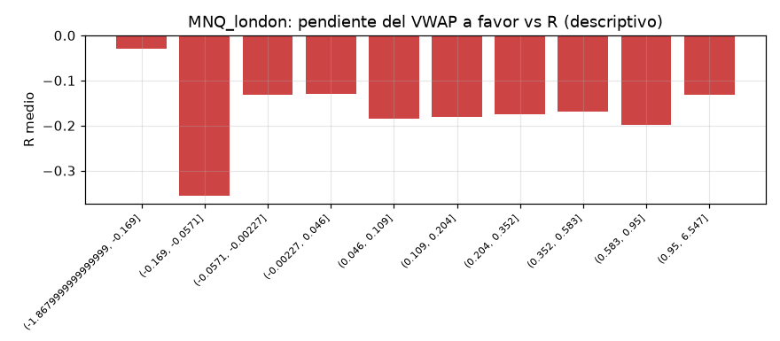
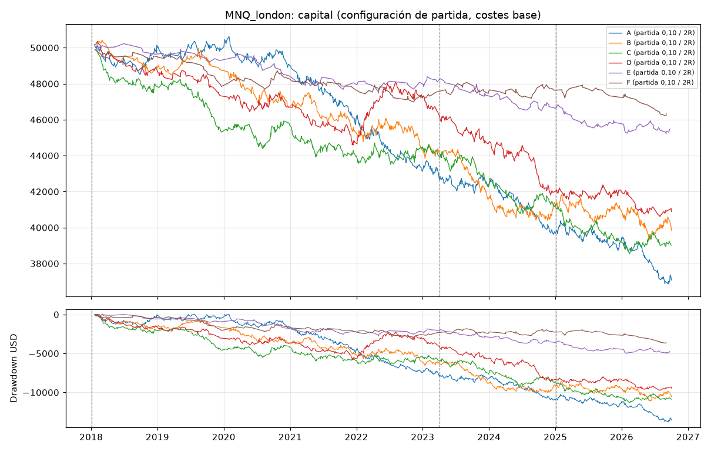
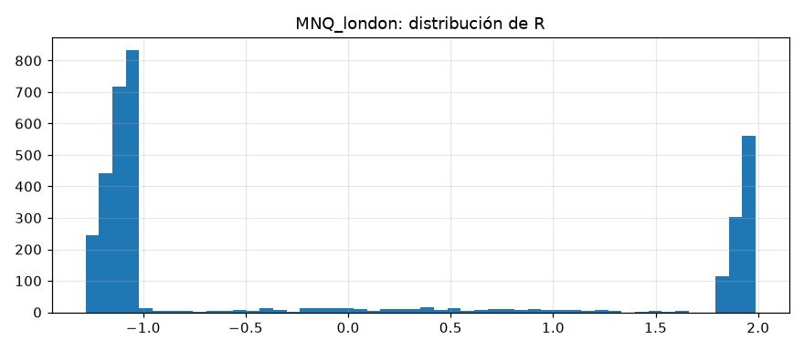
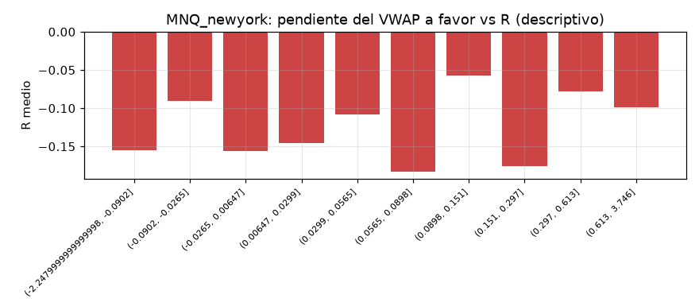
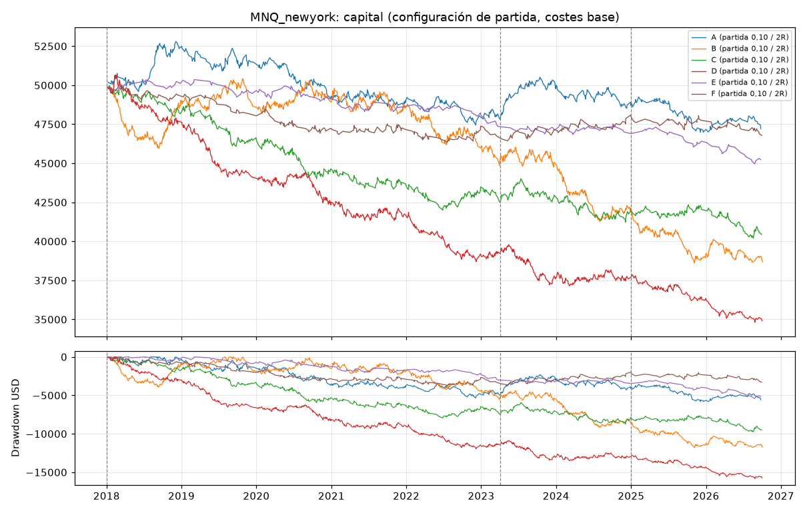
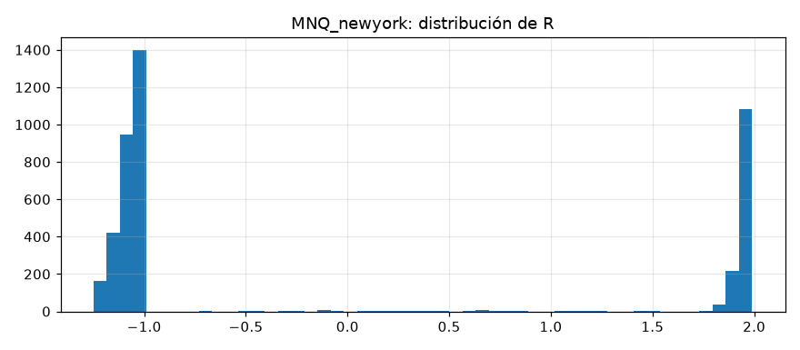

# Laboratorio VWAP + EMA (MNQ, MGC) — informe final

Resultados históricos de backtest. No son una previsión. Costes: 0,62 USD/lado = SUPUESTO; sustituir por la tarifa real (comisión + tasas de bolsa).

## A. Resumen ejecutivo

- **MNQ_london:** ningún candidato (ninguna configuración con esperanza > 0 en desarrollo y ≥ 30 operaciones en validación)
- **MNQ_newyork:** ningún candidato (ninguna configuración con esperanza > 0 en desarrollo y ≥ 30 operaciones en validación)
- **MGC_london: BLOQUEADO** — no existe vwap_lab/data/cache/MGC_5m.csv
- **MGC_newyork: BLOQUEADO** — no existe vwap_lab/data/cache/MGC_5m.csv

## MNQ_london

Periodos: desarrollo 2018-01-02 → 2023-04-04, validacion 2023-04-05 → 2025-01-02, oos 2025-01-03 → 2026-10-02

Configuraciones probadas en desarrollo + validación: 90; con esperanza > 0 en desarrollo: 0; en validación: 5; en ambas: 0.

### B. Ranking (mejor configuración de cada estrategia según validación; solo descriptivo)

| estrategia | umbral | objetivo_R | desarrollo_n | desarrollo_esperanza_R | validacion_n | validacion_esperanza_R | validacion_pf | validacion_dd_usd |
|---|---|---|---|---|---|---|---|---|
| F | 0.1 | 1.500 | 116 | -0.231 | 47 | 0.113 | 1.226 | 967.920 |
| C | 0.05 | 1.500 | 531 | -0.155 | 210 | -0.059 | 0.882 | 2,226.100 |
| E | 0.2 | 1.500 | 65 | -0.152 | 35 | -0.125 | 0.798 | 724.740 |
| A | sin filtro | 2.000 | 1279 | -0.166 | 527 | -0.128 | 0.834 | 5,388.040 |
| B | 0.05 | 2.000 | 473 | -0.132 | 221 | -0.169 | 0.766 | 4,249.560 |
| D | 0.15 | 1.500 | 313 | -0.101 | 151 | -0.205 | 0.712 | 3,012.440 |

### Configuración de partida (umbral 0,10, objetivo 2R): esperanza en R por periodo y escenario de costes

| estrategia | escenario_costes | desarrollo | validacion | oos |
|---|---|---|---|---|
| A | base | -0.172 | -0.205 | -0.189 |
| A | severe | -0.213 | -0.266 | -0.192 |
| A | stress | -0.217 | -0.174 | -0.188 |
| B | base | -0.145 | -0.181 | -0.056 |
| B | severe | -0.257 | -0.046 | 0.040 |
| B | stress | -0.142 | -0.044 | -0.020 |
| C | base | -0.134 | -0.182 | -0.157 |
| C | severe | -0.087 | -0.246 | -0.077 |
| C | stress | -0.143 | -0.232 | -0.180 |
| D | base | -0.105 | -0.285 | -0.101 |
| D | severe | 0.037 | -0.284 | -0.055 |
| D | stress | -0.067 | -0.307 | -0.160 |
| E | base | -0.190 | -0.316 | -0.204 |
| E | severe | -0.319 | -0.335 | -0.214 |
| E | stress | -0.331 | -0.382 | -0.246 |
| F | base | -0.221 | -0.000 | -0.332 |
| F | severe | -0.158 | -0.042 | -0.135 |
| F | stress | -0.149 | -0.069 | -0.385 |

### Métricas completas de la configuración de partida (costes base)

| estrategia | periodo | n | acierto | esperanza_R | esperanza_usd | pf | neto | costes | costes_pct_bruto_positivo | dd_usd | dd_pct | racha_perdedora | ops_por_sesion | exposicion | ambiguas | ic90_R_bajo | ic90_R_alto |
|---|---|---|---|---|---|---|---|---|---|---|---|---|---|---|---|---|---|
| A | desarrollo | 454 | 0.326 | -0.172 | -16.132 | 0.768 | -7,324.120 | 6,355.120 | 0.244 | 7,952.440 | 0.157 | 9 | 0.340 | 0.046 | 3 | -0.274 | -0.066 |
| A | validacion | 183 | 0.322 | -0.205 | -16.394 | 0.735 | -3,000.140 | 1,922.640 | 0.219 | 3,294.880 | 0.077 | 9 | 0.411 | 0.053 | 1 | -0.372 | -0.047 |
| A | oos | 194 | 0.299 | -0.189 | -13.372 | 0.759 | -2,594.180 | 1,489.680 | 0.175 | 3,512.800 | 0.087 | 11 | 0.436 | 0.041 | 6 | -0.346 | -0.017 |
| B | desarrollo | 414 | 0.333 | -0.145 | -14.087 | 0.799 | -5,832.220 | 6,227.720 | 0.250 | 6,586.980 | 0.131 | 14 | 0.310 | 0.027 | 5 | -0.252 | -0.032 |
| B | validacion | 192 | 0.333 | -0.181 | -15.414 | 0.756 | -2,959.520 | 2,526.520 | 0.258 | 3,952.000 | 0.089 | 11 | 0.431 | 0.041 | 4 | -0.328 | -0.009 |
| B | oos | 230 | 0.352 | -0.056 | -5.999 | 0.893 | -1,379.760 | 2,043.260 | 0.169 | 2,522.120 | 0.060 | 11 | 0.517 | 0.039 | 2 | -0.204 | 0.098 |
| C | desarrollo | 432 | 0.343 | -0.134 | -13.865 | 0.788 | -5,989.860 | 5,614.360 | 0.236 | 6,489.100 | 0.130 | 12 | 0.324 | 0.046 | 3 | -0.239 | -0.025 |
| C | validacion | 171 | 0.322 | -0.182 | -16.399 | 0.739 | -2,804.160 | 1,965.660 | 0.233 | 3,473.140 | 0.079 | 10 | 0.384 | 0.050 | 0 | -0.362 | -0.009 |
| C | oos | 174 | 0.322 | -0.157 | -12.596 | 0.779 | -2,191.660 | 1,445.660 | 0.180 | 2,677.240 | 0.065 | 10 | 0.391 | 0.035 | 3 | -0.310 | 0.008 |
| D | desarrollo | 343 | 0.347 | -0.105 | -11.327 | 0.831 | -3,885.280 | 4,623.280 | 0.227 | 5,772.880 | 0.115 | 12 | 0.257 | 0.030 | 1 | -0.222 | 0.024 |
| D | validacion | 167 | 0.293 | -0.285 | -24.540 | 0.640 | -4,098.200 | 2,136.200 | 0.274 | 4,390.960 | 0.095 | 18 | 0.375 | 0.038 | 0 | -0.453 | -0.111 |
| D | oos | 143 | 0.336 | -0.101 | -7.880 | 0.859 | -1,126.880 | 1,223.380 | 0.169 | 1,766.380 | 0.042 | 14 | 0.321 | 0.028 | 5 | -0.263 | 0.086 |
| E | desarrollo | 98 | 0.347 | -0.190 | -19.347 | 0.739 | -1,896.020 | 1,725.020 | 0.293 | 2,747.780 | 0.055 | 9 | 0.073 | 0.006 | 2 | -0.409 | 0.047 |
| E | validacion | 48 | 0.271 | -0.316 | -30.612 | 0.616 | -1,469.380 | 764.380 | 0.303 | 1,774.960 | 0.037 | 7 | 0.108 | 0.007 | 0 | -0.675 | 0.026 |
| E | oos | 58 | 0.293 | -0.204 | -19.970 | 0.712 | -1,158.240 | 579.240 | 0.193 | 1,623.860 | 0.035 | 7 | 0.130 | 0.007 | 1 | -0.479 | 0.100 |
| F | desarrollo | 116 | 0.284 | -0.221 | -21.242 | 0.695 | -2,464.100 | 1,417.600 | 0.240 | 3,014.180 | 0.060 | 18 | 0.087 | 0.016 | 0 | -0.411 | -0.028 |
| F | validacion | 47 | 0.404 | -0.000 | 2.121 | 1.034 | 99.680 | 561.320 | 0.173 | 879.540 | 0.018 | 6 | 0.106 | 0.018 | 0 | -0.290 | 0.323 |
| F | oos | 35 | 0.257 | -0.332 | -37.097 | 0.511 | -1,298.380 | 346.380 | 0.245 | 1,700.600 | 0.035 | 12 | 0.079 | 0.008 | 0 | -0.668 | 0.014 |

### D. Filtro de VWAP plano (objetivo 2R)

| estrategia | umbral | senales_originales | senales_filtradas | operaciones | ganadoras_eliminadas | perdedoras_eliminadas | esperanza_R_dev_val | pf_dev_val | dd_usd_dev_val | costes_dev_val | esperanza_R_validacion | esperanza_R_oos |
|---|---|---|---|---|---|---|---|---|---|---|---|---|
| A | sin filtro | 3926 | 0 | 2302 | 0 | 0 | -0.155 | 0.780 | 21,620.920 | 19,465.000 | -0.128 | -0.182 |
| A | 0.05 | 3926 | 2507 | 1038 | 470 | 918 | -0.193 | 0.737 | 14,325.360 | 9,990.520 | -0.203 | -0.147 |
| A | 0.1 | 3926 | 2848 | 831 | 524 | 1039 | -0.181 | 0.759 | 11,007.420 | 8,277.760 | -0.205 | -0.189 |
| A | 0.15 | 3926 | 3014 | 701 | 561 | 1106 | -0.168 | 0.773 | 9,477.320 | 7,303.100 | -0.197 | -0.260 |
| A | 0.2 | 3926 | 3093 | 634 | 583 | 1139 | -0.175 | 0.767 | 8,957.740 | 6,724.340 | -0.235 | -0.271 |
| B | sin filtro | 2161 | 0 | 1226 | 0 | 0 | -0.187 | 0.743 | 14,876.840 | 11,853.320 | -0.239 | -0.071 |
| B | 0.05 | 2161 | 581 | 952 | 95 | 213 | -0.144 | 0.802 | 10,456.840 | 9,911.760 | -0.169 | -0.043 |
| B | 0.1 | 2161 | 832 | 836 | 137 | 279 | -0.156 | 0.787 | 10,028.320 | 8,754.240 | -0.181 | -0.056 |
| B | 0.15 | 2161 | 1012 | 747 | 170 | 334 | -0.169 | 0.776 | 9,525.540 | 7,880.960 | -0.204 | -0.057 |
| B | 0.2 | 2161 | 1128 | 682 | 195 | 374 | -0.180 | 0.762 | 9,320.200 | 7,244.300 | -0.244 | -0.051 |
| C | sin filtro | 3469 | 0 | 2026 | 0 | 0 | -0.104 | 0.832 | 14,980.660 | 17,850.160 | -0.121 | -0.142 |
| C | 0.05 | 3469 | 2162 | 952 | 411 | 738 | -0.143 | 0.769 | 11,197.860 | 8,977.700 | -0.121 | -0.198 |
| C | 0.1 | 3469 | 2447 | 777 | 454 | 830 | -0.147 | 0.774 | 9,230.380 | 7,580.020 | -0.182 | -0.157 |
| C | 0.15 | 3469 | 2614 | 659 | 490 | 905 | -0.131 | 0.807 | 6,907.100 | 6,594.160 | -0.184 | -0.224 |
| C | 0.2 | 3469 | 2723 | 576 | 514 | 959 | -0.120 | 0.822 | 5,437.960 | 5,947.960 | -0.251 | -0.215 |
| D | sin filtro | 1619 | 0 | 1024 | 0 | 0 | -0.199 | 0.718 | 14,967.740 | 9,899.620 | -0.284 | -0.056 |
| D | 0.05 | 1619 | 507 | 697 | 109 | 242 | -0.179 | 0.746 | 9,809.680 | 7,186.000 | -0.282 | -0.070 |
| D | 0.1 | 1619 | 590 | 653 | 121 | 265 | -0.164 | 0.768 | 8,550.420 | 6,759.480 | -0.285 | -0.101 |
| D | 0.15 | 1619 | 690 | 597 | 134 | 304 | -0.137 | 0.804 | 6,566.960 | 6,241.620 | -0.269 | -0.093 |
| D | 0.2 | 1619 | 764 | 559 | 150 | 324 | -0.149 | 0.786 | 6,696.460 | 5,806.400 | -0.261 | -0.133 |
| E | sin filtro | 1199 | 0 | 600 | 0 | 0 | -0.199 | 0.725 | 8,586.240 | 6,784.020 | -0.165 | -0.204 |
| E | 0.05 | 1199 | 763 | 255 | 115 | 236 | -0.199 | 0.728 | 4,031.760 | 3,014.420 | -0.208 | -0.341 |
| E | 0.1 | 1199 | 865 | 204 | 128 | 270 | -0.231 | 0.697 | 3,722.460 | 2,489.400 | -0.316 | -0.204 |
| E | 0.15 | 1199 | 932 | 164 | 138 | 300 | -0.149 | 0.791 | 2,062.440 | 2,028.740 | -0.282 | -0.208 |
| E | 0.2 | 1199 | 967 | 139 | 145 | 317 | -0.130 | 0.818 | 1,805.540 | 1,765.740 | -0.186 | -0.158 |
| F | sin filtro | 1235 | 0 | 858 | 0 | 0 | -0.081 | 0.882 | 5,232.840 | 8,317.400 | -0.080 | -0.100 |
| F | 0.05 | 1235 | 917 | 241 | 230 | 391 | -0.191 | 0.723 | 4,199.520 | 2,412.660 | 0.006 | -0.313 |
| F | 0.1 | 1235 | 982 | 198 | 241 | 422 | -0.157 | 0.786 | 3,014.180 | 1,978.920 | -0.000 | -0.332 |
| F | 0.15 | 1235 | 1022 | 167 | 251 | 442 | -0.148 | 0.798 | 2,508.760 | 1,675.340 | 0.023 | -0.493 |
| F | 0.2 | 1235 | 1044 | 150 | 258 | 452 | -0.175 | 0.762 | 2,110.560 | 1,517.600 | -0.114 | -0.539 |

### Walk-forward anual (configuración elegida solo con años anteriores)

| estrategia | años | operaciones | neto_usd | años_positivos |
|---|---|---|---|---|
| A | 7 | 62 | -802.300 | 0 |
| B | 7 | 0 | 0.000 | 0 |
| C | 7 | 0 | 0.000 | 0 |
| D | 7 | 0 | 0.000 | 0 |
| E | 7 | 0 | 0.000 | 0 |
| F | 7 | 0 | 0.000 | 0 |

| estrategia | año | config | n | esperanza_R | neto_usd |
|---|---|---|---|---|---|
| A | 2020 | umbral=0.2 objetivo=2.0R | 62 | -0.116 | -802.300 |
| A | 2021 | sin candidato | 0 | — | 0.000 |
| A | 2022 | sin candidato | 0 | — | 0.000 |
| A | 2023 | sin candidato | 0 | — | 0.000 |
| A | 2024 | sin candidato | 0 | — | 0.000 |
| A | 2025 | sin candidato | 0 | — | 0.000 |
| A | 2026 | sin candidato | 0 | — | 0.000 |
| B | 2020 | sin candidato | 0 | — | 0.000 |
| B | 2021 | sin candidato | 0 | — | 0.000 |
| B | 2022 | sin candidato | 0 | — | 0.000 |
| B | 2023 | sin candidato | 0 | — | 0.000 |
| B | 2024 | sin candidato | 0 | — | 0.000 |
| B | 2025 | sin candidato | 0 | — | 0.000 |
| B | 2026 | sin candidato | 0 | — | 0.000 |
| C | 2020 | sin candidato | 0 | — | 0.000 |
| C | 2021 | sin candidato | 0 | — | 0.000 |
| C | 2022 | sin candidato | 0 | — | 0.000 |
| C | 2023 | sin candidato | 0 | — | 0.000 |
| C | 2024 | sin candidato | 0 | — | 0.000 |
| C | 2025 | sin candidato | 0 | — | 0.000 |
| C | 2026 | sin candidato | 0 | — | 0.000 |
| D | 2020 | sin candidato | 0 | — | 0.000 |
| D | 2021 | sin candidato | 0 | — | 0.000 |
| D | 2022 | sin candidato | 0 | — | 0.000 |
| D | 2023 | sin candidato | 0 | — | 0.000 |
| D | 2024 | sin candidato | 0 | — | 0.000 |
| D | 2025 | sin candidato | 0 | — | 0.000 |
| D | 2026 | sin candidato | 0 | — | 0.000 |
| E | 2020 | sin candidato | 0 | — | 0.000 |
| E | 2021 | sin candidato | 0 | — | 0.000 |
| E | 2022 | sin candidato | 0 | — | 0.000 |
| E | 2023 | sin candidato | 0 | — | 0.000 |
| E | 2024 | sin candidato | 0 | — | 0.000 |
| E | 2025 | sin candidato | 0 | — | 0.000 |
| E | 2026 | sin candidato | 0 | — | 0.000 |
| F | 2020 | sin candidato | 0 | — | 0.000 |
| F | 2021 | sin candidato | 0 | — | 0.000 |
| F | 2022 | sin candidato | 0 | — | 0.000 |
| F | 2023 | sin candidato | 0 | — | 0.000 |
| F | 2024 | sin candidato | 0 | — | 0.000 |
| F | 2025 | sin candidato | 0 | — | 0.000 |
| F | 2026 | sin candidato | 0 | — | 0.000 |

### Pendiente del VWAP a favor de la operación frente al resultado (descriptivo, sin filtro, dev + val)

| tramo | count | mean |
|---|---|---|
| (-1.8679999999999999, -0.169] | 517 | -0.030 |
| (-0.169, -0.0571] | 516 | -0.356 |
| (-0.0571, -0.00227] | 516 | -0.131 |
| (-0.00227, 0.046] | 517 | -0.130 |
| (0.046, 0.109] | 515 | -0.185 |
| (0.109, 0.204] | 516 | -0.181 |
| (0.204, 0.352] | 516 | -0.174 |
| (0.352, 0.583] | 516 | -0.169 |
| (0.583, 0.95] | 517 | -0.198 |
| (0.95, 6.547] | 516 | -0.132 |

## MNQ_newyork

Periodos: desarrollo 2018-01-02 → 2023-03-31, validacion 2023-04-03 → 2024-12-30, oos 2024-12-31 → 2026-10-02

Configuraciones probadas en desarrollo + validación: 90; con esperanza > 0 en desarrollo: 0; en validación: 13; en ambas: 0.

### B. Ranking (mejor configuración de cada estrategia según validación; solo descriptivo)

| estrategia | umbral | objetivo_R | desarrollo_n | desarrollo_esperanza_R | validacion_n | validacion_esperanza_R | validacion_pf | validacion_dd_usd |
|---|---|---|---|---|---|---|---|---|
| F | 0.2 | 2.000 | 94 | -0.252 | 29 | 0.174 | 1.337 | 218.960 |
| A | 0.1 | 2.000 | 450 | -0.037 | 151 | 0.062 | 1.087 | 1,996.460 |
| C | 0.2 | 1.500 | 279 | -0.179 | 108 | 0.035 | 1.065 | 1,068.860 |
| D | 0.05 | 1.500 | 768 | -0.232 | 275 | -0.038 | 0.938 | 2,271.460 |
| B | 0.2 | 2.000 | 509 | -0.092 | 186 | -0.076 | 0.860 | 2,622.500 |
| E | 0.2 | 1.500 | 80 | -0.119 | 27 | -0.100 | 0.900 | 417.880 |

### Configuración de partida (umbral 0,10, objetivo 2R): esperanza en R por periodo y escenario de costes

| estrategia | escenario_costes | desarrollo | validacion | oos |
|---|---|---|---|---|
| A | base | -0.037 | 0.062 | -0.127 |
| A | severe | -0.069 | 0.085 | -0.095 |
| A | stress | -0.066 | 0.091 | -0.105 |
| B | base | -0.070 | -0.122 | -0.137 |
| B | severe | -0.103 | -0.176 | -0.140 |
| B | stress | -0.068 | -0.167 | -0.149 |
| C | base | -0.162 | -0.016 | -0.106 |
| C | severe | -0.183 | -0.129 | -0.139 |
| C | stress | -0.184 | -0.065 | -0.083 |
| D | base | -0.208 | -0.100 | -0.248 |
| D | severe | -0.192 | -0.160 | -0.316 |
| D | stress | -0.180 | -0.105 | -0.281 |
| E | base | -0.158 | -0.115 | -0.321 |
| E | severe | -0.265 | 0.156 | -0.409 |
| E | stress | -0.241 | -0.077 | -0.325 |
| F | base | -0.160 | 0.160 | -0.200 |
| F | severe | -0.161 | -0.044 | -0.278 |
| F | stress | -0.172 | 0.070 | -0.199 |

### Métricas completas de la configuración de partida (costes base)

| estrategia | periodo | n | acierto | esperanza_R | esperanza_usd | pf | neto | costes | costes_pct_bruto_positivo | dd_usd | dd_pct | racha_perdedora | ops_por_sesion | exposicion | ambiguas | ic90_R_bajo | ic90_R_alto |
|---|---|---|---|---|---|---|---|---|---|---|---|---|---|---|---|---|---|
| A | desarrollo | 450 | 0.342 | -0.037 | -4.705 | 0.933 | -2,117.240 | 4,000.740 | 0.131 | 5,358.940 | 0.101 | 14 | 0.352 | 0.031 | 10 | -0.143 | 0.073 |
| A | validacion | 151 | 0.371 | 0.062 | 5.388 | 1.087 | 813.620 | 903.880 | 0.086 | 1,996.460 | 0.040 | 9 | 0.354 | 0.024 | 3 | -0.122 | 0.272 |
| A | oos | 117 | 0.308 | -0.127 | -12.608 | 0.812 | -1,475.140 | 607.640 | 0.094 | 2,265.740 | 0.046 | 10 | 0.274 | 0.013 | 3 | -0.345 | 0.071 |
| B | desarrollo | 703 | 0.339 | -0.070 | -7.051 | 0.898 | -4,956.820 | 7,114.820 | 0.157 | 5,579.420 | 0.111 | 17 | 0.549 | 0.028 | 23 | -0.155 | 0.019 |
| B | validacion | 258 | 0.314 | -0.122 | -12.139 | 0.804 | -3,131.840 | 1,857.840 | 0.140 | 4,763.240 | 0.103 | 17 | 0.606 | 0.031 | 8 | -0.277 | 0.018 |
| B | oos | 216 | 0.306 | -0.137 | -14.888 | 0.740 | -3,215.740 | 1,272.240 | 0.135 | 3,298.940 | 0.079 | 17 | 0.506 | 0.015 | 12 | -0.302 | 0.042 |
| C | desarrollo | 488 | 0.314 | -0.162 | -15.220 | 0.772 | -7,427.340 | 4,186.340 | 0.160 | 8,010.380 | 0.160 | 11 | 0.381 | 0.027 | 16 | -0.261 | -0.057 |
| C | validacion | 181 | 0.343 | -0.016 | -2.581 | 0.954 | -467.180 | 1,049.680 | 0.106 | 2,775.060 | 0.063 | 12 | 0.425 | 0.024 | 4 | -0.220 | 0.158 |
| C | oos | 154 | 0.318 | -0.106 | -10.844 | 0.813 | -1,670.000 | 786.000 | 0.105 | 2,149.140 | 0.051 | 12 | 0.361 | 0.018 | 9 | -0.269 | 0.078 |
| D | desarrollo | 609 | 0.292 | -0.208 | -17.537 | 0.733 | -10,679.960 | 5,538.960 | 0.181 | 11,947.060 | 0.236 | 10 | 0.476 | 0.027 | 21 | -0.295 | -0.121 |
| D | validacion | 223 | 0.323 | -0.100 | -7.258 | 0.863 | -1,618.460 | 1,421.460 | 0.135 | 2,647.400 | 0.067 | 17 | 0.523 | 0.035 | 6 | -0.251 | 0.050 |
| D | oos | 157 | 0.268 | -0.248 | -17.757 | 0.665 | -2,787.860 | 818.360 | 0.143 | 3,044.540 | 0.080 | 15 | 0.368 | 0.012 | 9 | -0.422 | -0.079 |
| E | desarrollo | 156 | 0.314 | -0.158 | -16.935 | 0.775 | -2,641.860 | 1,855.860 | 0.194 | 3,000.440 | 0.060 | 8 | 0.122 | 0.004 | 6 | -0.341 | 0.025 |
| E | validacion | 45 | 0.333 | -0.115 | -10.125 | 0.852 | -455.620 | 448.120 | 0.164 | 661.280 | 0.014 | 6 | 0.106 | 0.004 | 4 | -0.448 | 0.274 |
| E | oos | 53 | 0.245 | -0.321 | -31.628 | 0.563 | -1,676.280 | 366.280 | 0.164 | 2,367.440 | 0.050 | 13 | 0.124 | 0.002 | 7 | -0.649 | 0.015 |
| F | desarrollo | 225 | 0.324 | -0.160 | -14.858 | 0.783 | -3,342.960 | 1,951.960 | 0.155 | 3,726.920 | 0.074 | 10 | 0.176 | 0.014 | 6 | -0.310 | -0.009 |
| F | validacion | 77 | 0.403 | 0.160 | 18.561 | 1.344 | 1,429.160 | 490.840 | 0.085 | 659.900 | 0.014 | 6 | 0.181 | 0.015 | 0 | -0.134 | 0.413 |
| F | oos | 79 | 0.291 | -0.200 | -16.463 | 0.751 | -1,300.600 | 453.600 | 0.113 | 1,300.600 | 0.027 | 9 | 0.185 | 0.010 | 3 | -0.429 | 0.058 |

### D. Filtro de VWAP plano (objetivo 2R)

| estrategia | umbral | senales_originales | senales_filtradas | operaciones | ganadoras_eliminadas | perdedoras_eliminadas | esperanza_R_dev_val | pf_dev_val | dd_usd_dev_val | costes_dev_val | esperanza_R_validacion | esperanza_R_oos |
|---|---|---|---|---|---|---|---|---|---|---|---|---|
| A | sin filtro | 5127 | 0 | 2652 | 0 | 0 | -0.107 | 0.851 | 24,280.960 | 17,295.980 | -0.079 | -0.193 |
| A | 0.05 | 5127 | 3828 | 1015 | 589 | 1302 | -0.032 | 0.947 | 7,992.540 | 6,911.260 | 0.054 | -0.110 |
| A | 0.1 | 5127 | 4255 | 718 | 655 | 1439 | -0.012 | 0.968 | 5,358.940 | 4,904.620 | 0.062 | -0.127 |
| A | 0.15 | 5127 | 4391 | 615 | 676 | 1488 | -0.008 | 0.980 | 4,917.060 | 4,205.680 | 0.036 | -0.296 |
| A | 0.2 | 5127 | 4461 | 558 | 691 | 1507 | -0.018 | 0.966 | 5,148.080 | 3,812.060 | 0.041 | -0.378 |
| B | sin filtro | 3211 | 0 | 2078 | 0 | 0 | -0.139 | 0.804 | 19,930.240 | 14,316.200 | -0.127 | -0.198 |
| B | 0.05 | 3211 | 1188 | 1560 | 188 | 452 | -0.121 | 0.830 | 14,391.300 | 11,627.100 | -0.198 | -0.194 |
| B | 0.1 | 3211 | 1742 | 1177 | 290 | 709 | -0.084 | 0.874 | 9,161.840 | 8,972.660 | -0.122 | -0.137 |
| B | 0.15 | 3211 | 2022 | 978 | 357 | 822 | -0.092 | 0.867 | 8,951.200 | 7,300.420 | -0.098 | -0.164 |
| B | 0.2 | 3211 | 2183 | 852 | 394 | 903 | -0.087 | 0.868 | 7,411.580 | 6,347.000 | -0.076 | -0.120 |
| C | sin filtro | 5529 | 0 | 2779 | 0 | 0 | -0.097 | 0.856 | 20,240.340 | 16,673.940 | -0.022 | -0.078 |
| C | 0.05 | 5529 | 3758 | 1251 | 587 | 1189 | -0.110 | 0.838 | 11,714.840 | 8,690.680 | -0.056 | -0.078 |
| C | 0.1 | 5529 | 4398 | 823 | 692 | 1396 | -0.122 | 0.815 | 8,770.720 | 5,236.020 | -0.016 | -0.106 |
| C | 0.15 | 5529 | 4725 | 606 | 745 | 1514 | -0.163 | 0.767 | 8,252.700 | 4,039.020 | -0.095 | -0.038 |
| C | 0.2 | 5529 | 4924 | 468 | 777 | 1596 | -0.093 | 0.868 | 4,246.620 | 3,187.260 | 0.030 | -0.047 |
| D | sin filtro | 3143 | 0 | 1936 | 0 | 0 | -0.146 | 0.794 | 19,842.100 | 12,952.520 | -0.055 | -0.090 |
| D | 0.05 | 3143 | 1432 | 1241 | 276 | 504 | -0.186 | 0.745 | 17,231.860 | 8,588.460 | -0.053 | -0.257 |
| D | 0.1 | 3143 | 1860 | 989 | 343 | 669 | -0.179 | 0.763 | 13,503.880 | 6,960.420 | -0.100 | -0.248 |
| D | 0.15 | 3143 | 2107 | 829 | 391 | 777 | -0.189 | 0.751 | 12,531.340 | 5,783.860 | -0.105 | -0.248 |
| D | 0.2 | 3143 | 2269 | 718 | 423 | 858 | -0.153 | 0.787 | 10,097.480 | 4,993.280 | -0.116 | -0.244 |
| E | sin filtro | 1699 | 0 | 1145 | 0 | 0 | -0.179 | 0.766 | 14,529.140 | 9,521.780 | -0.257 | -0.137 |
| E | 0.05 | 1699 | 1126 | 414 | 232 | 522 | -0.169 | 0.774 | 5,840.000 | 3,887.640 | -0.233 | -0.175 |
| E | 0.1 | 1699 | 1356 | 254 | 278 | 628 | -0.149 | 0.791 | 3,522.820 | 2,303.980 | -0.115 | -0.321 |
| E | 0.15 | 1699 | 1460 | 187 | 295 | 675 | -0.096 | 0.868 | 1,873.580 | 1,720.960 | -0.153 | -0.358 |
| E | 0.2 | 1699 | 1531 | 141 | 311 | 703 | -0.127 | 0.835 | 1,769.900 | 1,217.880 | -0.139 | -0.343 |
| F | sin filtro | 2560 | 0 | 1747 | 0 | 0 | -0.044 | 0.944 | 10,123.280 | 12,576.140 | 0.034 | 0.023 |
| F | 0.05 | 2560 | 1527 | 680 | 390 | 721 | -0.039 | 0.951 | 4,691.180 | 5,038.020 | 0.066 | -0.087 |
| F | 0.1 | 2560 | 1970 | 381 | 495 | 889 | -0.079 | 0.902 | 3,726.920 | 2,442.800 | 0.160 | -0.200 |
| F | 0.15 | 2560 | 2205 | 228 | 549 | 977 | -0.199 | 0.727 | 4,112.720 | 1,524.280 | 0.026 | -0.202 |
| F | 0.2 | 2560 | 2322 | 151 | 569 | 1031 | -0.152 | 0.804 | 2,359.500 | 905.960 | 0.174 | -0.171 |

### Walk-forward anual (configuración elegida solo con años anteriores)

| estrategia | años | operaciones | neto_usd | años_positivos |
|---|---|---|---|---|
| A | 7 | 285 | -4,588.800 | 1 |
| B | 7 | 0 | 0.000 | 0 |
| C | 7 | 0 | 0.000 | 0 |
| D | 7 | 0 | 0.000 | 0 |
| E | 7 | 80 | -1,973.700 | 0 |
| F | 7 | 0 | 0.000 | 0 |

| estrategia | año | config | n | esperanza_R | neto_usd |
|---|---|---|---|---|---|
| A | 2020 | umbral=0.15 objetivo=2.0R | 77 | -0.202 | -1,784.500 |
| A | 2021 | umbral=0.15 objetivo=2.0R | 75 | 0.010 | 93.320 |
| A | 2022 | umbral=0.15 objetivo=2.0R | 65 | -0.298 | -1,953.940 |
| A | 2023 | sin candidato | 0 | — | 0.000 |
| A | 2024 | umbral=0.15 objetivo=2.0R | 68 | -0.162 | -943.680 |
| A | 2025 | sin candidato | 0 | — | 0.000 |
| A | 2026 | sin candidato | 0 | — | 0.000 |
| B | 2020 | sin candidato | 0 | — | 0.000 |
| B | 2021 | sin candidato | 0 | — | 0.000 |
| B | 2022 | sin candidato | 0 | — | 0.000 |
| B | 2023 | sin candidato | 0 | — | 0.000 |
| B | 2024 | sin candidato | 0 | — | 0.000 |
| B | 2025 | sin candidato | 0 | — | 0.000 |
| B | 2026 | sin candidato | 0 | — | 0.000 |
| C | 2020 | sin candidato | 0 | — | 0.000 |
| C | 2021 | sin candidato | 0 | — | 0.000 |
| C | 2022 | sin candidato | 0 | — | 0.000 |
| C | 2023 | sin candidato | 0 | — | 0.000 |
| C | 2024 | sin candidato | 0 | — | 0.000 |
| C | 2025 | sin candidato | 0 | — | 0.000 |
| C | 2026 | sin candidato | 0 | — | 0.000 |
| D | 2020 | sin candidato | 0 | — | 0.000 |
| D | 2021 | sin candidato | 0 | — | 0.000 |
| D | 2022 | sin candidato | 0 | — | 0.000 |
| D | 2023 | sin candidato | 0 | — | 0.000 |
| D | 2024 | sin candidato | 0 | — | 0.000 |
| D | 2025 | sin candidato | 0 | — | 0.000 |
| D | 2026 | sin candidato | 0 | — | 0.000 |
| E | 2020 | umbral=0.15 objetivo=2.0R | 26 | -0.299 | -837.280 |
| E | 2021 | umbral=0.2 objetivo=1.0R | 16 | 0.038 | -31.300 |
| E | 2022 | umbral=0.2 objetivo=1.0R | 14 | -0.196 | -236.760 |
| E | 2023 | umbral=0.15 objetivo=1.5R | 24 | -0.347 | -868.360 |
| E | 2024 | sin candidato | 0 | — | 0.000 |
| E | 2025 | sin candidato | 0 | — | 0.000 |
| E | 2026 | sin candidato | 0 | — | 0.000 |
| F | 2020 | sin candidato | 0 | — | 0.000 |
| F | 2021 | sin candidato | 0 | — | 0.000 |
| F | 2022 | sin candidato | 0 | — | 0.000 |
| F | 2023 | sin candidato | 0 | — | 0.000 |
| F | 2024 | sin candidato | 0 | — | 0.000 |
| F | 2025 | sin candidato | 0 | — | 0.000 |
| F | 2026 | sin candidato | 0 | — | 0.000 |

### Pendiente del VWAP a favor de la operación frente al resultado (descriptivo, sin filtro, dev + val)

| tramo | count | mean |
|---|---|---|
| (-2.2479999999999998, -0.0902] | 885 | -0.155 |
| (-0.0902, -0.0265] | 885 | -0.090 |
| (-0.0265, 0.00647] | 884 | -0.156 |
| (0.00647, 0.0299] | 885 | -0.145 |
| (0.0299, 0.0565] | 884 | -0.108 |
| (0.0565, 0.0898] | 886 | -0.184 |
| (0.0898, 0.151] | 883 | -0.057 |
| (0.151, 0.297] | 885 | -0.176 |
| (0.297, 0.613] | 884 | -0.078 |
| (0.613, 3.746] | 885 | -0.099 |

