# Laboratorio VWAP + EMA (MNQ, MGC) — informe final

Resultados históricos de backtest. No son una previsión. Costes: 0,62 USD/lado = SUPUESTO; sustituir por la tarifa real (comisión + tasas de bolsa).

## A. Resumen ejecutivo

- **MNQ_london:** ningún candidato (ninguna configuración con esperanza > 0 en desarrollo y ≥ 30 operaciones en validación)
- **MNQ_newyork:** ningún candidato (ninguna configuración con esperanza > 0 en desarrollo y ≥ 30 operaciones en validación)
- **MGC_london:** ningún candidato (ninguna configuración con esperanza > 0 en desarrollo y ≥ 30 operaciones en validación)
- **MGC_newyork:** ningún candidato (ninguna configuración con esperanza > 0 en desarrollo y ≥ 30 operaciones en validación)

## MNQ_london

Periodos: desarrollo 2018-01-02 → 2023-04-05, validacion 2023-04-06 → 2024-12-30, oos 2024-12-31 → 2026-10-02

Configuraciones probadas en desarrollo + validación: 45; con esperanza > 0 en desarrollo: 0; en validación: 0; en ambas: 0.

### B. Ranking (mejor configuración de cada estrategia según validación; solo descriptivo)

| estrategia | umbral | objetivo_R | desarrollo_n | desarrollo_esperanza_R | validacion_n | validacion_esperanza_R | validacion_pf | validacion_dd_usd |
|---|---|---|---|---|---|---|---|---|
| E | 0.05 | 2.000 | 296 | -0.299 | 133 | -0.038 | 0.945 | 1,298.440 |
| C | sin filtro | 1.000 | 1731 | -0.206 | 748 | -0.205 | 0.665 | 6,238.640 |
| F | sin filtro | 1.500 | 1237 | -0.188 | 524 | -0.243 | 0.661 | 7,538.680 |

### Configuración de partida (umbral 0,10, objetivo 2R): esperanza en R por periodo y escenario de costes

| estrategia | escenario_costes | desarrollo | validacion | oos |
|---|---|---|---|---|
| C | base | -0.223 | -0.333 | -0.200 |
| C | severe | -0.318 | -0.279 | -0.215 |
| C | stress | -0.299 | -0.389 | -0.184 |
| E | base | -0.323 | -0.072 | -0.113 |
| E | severe | -0.369 | 0.258 | -0.244 |
| E | stress | -0.271 | -0.099 | -0.133 |
| F | base | -0.226 | -0.339 | -0.211 |
| F | severe | -0.333 | -0.244 | -0.243 |
| F | stress | -0.327 | -0.397 | -0.204 |

### Métricas completas de la configuración de partida (costes base)

| estrategia | periodo | n | acierto | esperanza_R | esperanza_usd | pf | neto | costes | costes_pct_bruto_positivo | dd_usd | dd_pct | racha_perdedora | ops_por_sesion | exposicion | ambiguas | ic90_R_bajo | ic90_R_alto |
|---|---|---|---|---|---|---|---|---|---|---|---|---|---|---|---|---|---|
| C | desarrollo | 983 | 0.309 | -0.223 | -18.056 | 0.705 | -17,749.020 | 14,225.020 | 0.309 | 18,015.720 | 0.360 | 12 | 0.748 | 0.036 | 3 | -0.294 | -0.153 |
| C | validacion | 433 | 0.279 | -0.333 | -17.915 | 0.605 | -7,757.400 | 4,867.900 | 0.374 | 8,520.000 | 0.260 | 16 | 0.989 | 0.042 | 1 | -0.449 | -0.235 |
| C | oos | 551 | 0.307 | -0.200 | -8.450 | 0.733 | -4,655.840 | 3,542.840 | 0.258 | 5,137.040 | 0.208 | 13 | 1.258 | 0.043 | 2 | -0.299 | -0.112 |
| E | desarrollo | 283 | 0.283 | -0.323 | -29.925 | 0.616 | -8,468.740 | 5,470.240 | 0.367 | 8,468.740 | 0.169 | 14 | 0.215 | 0.007 | 2 | -0.445 | -0.192 |
| E | validacion | 126 | 0.365 | -0.072 | -6.081 | 0.902 | -766.180 | 2,228.680 | 0.288 | 1,576.660 | 0.038 | 6 | 0.288 | 0.008 | 0 | -0.301 | 0.157 |
| E | oos | 192 | 0.344 | -0.113 | -8.926 | 0.856 | -1,713.860 | 2,816.360 | 0.255 | 2,709.040 | 0.065 | 9 | 0.438 | 0.009 | 2 | -0.285 | 0.082 |
| F | desarrollo | 860 | 0.309 | -0.226 | -18.708 | 0.706 | -16,089.220 | 12,976.220 | 0.308 | 16,206.540 | 0.324 | 12 | 0.654 | 0.031 | 3 | -0.299 | -0.156 |
| F | validacion | 375 | 0.277 | -0.339 | -20.217 | 0.590 | -7,581.480 | 4,535.480 | 0.379 | 8,258.280 | 0.240 | 22 | 0.856 | 0.035 | 0 | -0.462 | -0.234 |
| F | oos | 499 | 0.303 | -0.211 | -9.495 | 0.723 | -4,738.040 | 3,400.040 | 0.258 | 5,277.140 | 0.199 | 13 | 1.139 | 0.040 | 2 | -0.313 | -0.120 |

### D. Filtro de VWAP plano (objetivo 2R)

| estrategia | umbral | senales_originales | senales_filtradas | operaciones | ganadoras_eliminadas | perdedoras_eliminadas | esperanza_R_dev_val | pf_dev_val | dd_usd_dev_val | costes_dev_val | esperanza_R_validacion | esperanza_R_oos |
|---|---|---|---|---|---|---|---|---|---|---|---|---|
| C | sin filtro | 11961 | 0 | 3238 | 0 | 0 | -0.215 | 0.710 | 31,896.320 | 26,223.420 | -0.208 | -0.209 |
| C | 0.05 | 11961 | 6279 | 2051 | 708 | 1552 | -0.237 | 0.705 | 25,192.920 | 20,353.980 | -0.309 | -0.217 |
| C | 0.1 | 11961 | 6617 | 1967 | 725 | 1573 | -0.257 | 0.680 | 25,805.840 | 19,092.920 | -0.333 | -0.200 |
| C | 0.15 | 11961 | 6972 | 1880 | 738 | 1600 | -0.266 | 0.669 | 25,513.340 | 18,195.460 | -0.337 | -0.189 |
| C | 0.2 | 11961 | 7330 | 1795 | 751 | 1629 | -0.270 | 0.670 | 24,798.680 | 17,760.060 | -0.347 | -0.190 |
| E | sin filtro | 4783 | 0 | 1209 | 0 | 0 | -0.250 | 0.681 | 17,455.880 | 13,464.900 | -0.130 | -0.205 |
| E | 0.05 | 4783 | 2293 | 627 | 189 | 462 | -0.218 | 0.720 | 9,148.400 | 8,075.540 | -0.038 | -0.112 |
| E | 0.1 | 4783 | 2423 | 601 | 199 | 473 | -0.245 | 0.691 | 9,659.840 | 7,698.920 | -0.072 | -0.113 |
| E | 0.15 | 4783 | 2561 | 567 | 209 | 488 | -0.252 | 0.679 | 9,497.980 | 7,308.040 | -0.077 | -0.132 |
| E | 0.2 | 4783 | 2711 | 529 | 221 | 509 | -0.277 | 0.656 | 9,225.920 | 6,791.560 | -0.125 | -0.084 |
| F | sin filtro | 6298 | 0 | 2391 | 0 | 0 | -0.225 | 0.718 | 26,982.200 | 22,667.820 | -0.278 | -0.253 |
| F | 0.05 | 6298 | 1710 | 1780 | 283 | 631 | -0.262 | 0.675 | 24,358.520 | 17,776.700 | -0.323 | -0.216 |
| F | 0.1 | 6298 | 1874 | 1734 | 295 | 653 | -0.260 | 0.677 | 23,852.520 | 17,511.700 | -0.339 | -0.211 |
| F | 0.15 | 6298 | 2072 | 1685 | 309 | 688 | -0.260 | 0.676 | 23,281.840 | 17,016.020 | -0.329 | -0.194 |
| F | 0.2 | 6298 | 2267 | 1635 | 320 | 719 | -0.252 | 0.688 | 22,273.360 | 16,867.440 | -0.332 | -0.185 |

### Walk-forward anual (configuración elegida solo con años anteriores)

| estrategia | años | operaciones | neto_usd | años_positivos |
|---|---|---|---|---|
| C | 7 | 0 | 0.000 | 0 |
| E | 7 | 0 | 0.000 | 0 |
| F | 7 | 0 | 0.000 | 0 |

| estrategia | año | config | n | esperanza_R | neto_usd |
|---|---|---|---|---|---|
| C | 2020 | sin candidato | 0 | — | 0.000 |
| C | 2021 | sin candidato | 0 | — | 0.000 |
| C | 2022 | sin candidato | 0 | — | 0.000 |
| C | 2023 | sin candidato | 0 | — | 0.000 |
| C | 2024 | sin candidato | 0 | — | 0.000 |
| C | 2025 | sin candidato | 0 | — | 0.000 |
| C | 2026 | sin candidato | 0 | — | 0.000 |
| E | 2020 | sin candidato | 0 | — | 0.000 |
| E | 2021 | sin candidato | 0 | — | 0.000 |
| E | 2022 | sin candidato | 0 | — | 0.000 |
| E | 2023 | sin candidato | 0 | — | 0.000 |
| E | 2024 | sin candidato | 0 | — | 0.000 |
| E | 2025 | sin candidato | 0 | — | 0.000 |
| E | 2026 | sin candidato | 0 | — | 0.000 |
| F | 2020 | sin candidato | 0 | — | 0.000 |
| F | 2021 | sin candidato | 0 | — | 0.000 |
| F | 2022 | sin candidato | 0 | — | 0.000 |
| F | 2023 | sin candidato | 0 | — | 0.000 |
| F | 2024 | sin candidato | 0 | — | 0.000 |
| F | 2025 | sin candidato | 0 | — | 0.000 |
| F | 2026 | sin candidato | 0 | — | 0.000 |

### Pendiente del VWAP a favor de la operación frente al resultado (descriptivo, sin filtro, dev + val)

| tramo | count | mean |
|---|---|---|
| (-5.445, -0.757] | 311 | -0.210 |
| (-0.757, -0.14] | 311 | -0.292 |
| (-0.14, 0.0692] | 311 | -0.135 |
| (0.0692, 0.26] | 310 | -0.119 |
| (0.26, 0.436] | 311 | -0.385 |
| (0.436, 0.635] | 312 | -0.178 |
| (0.635, 0.871] | 310 | -0.221 |
| (0.871, 1.134] | 310 | -0.252 |
| (1.134, 1.575] | 311 | -0.252 |
| (1.575, 5.458] | 311 | -0.423 |

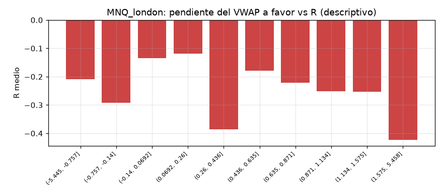

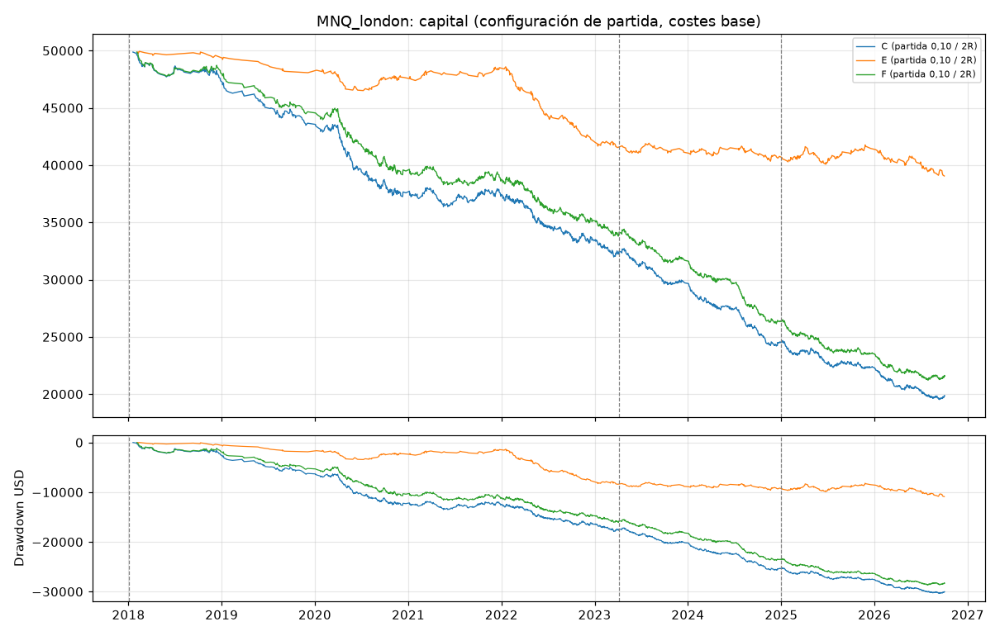
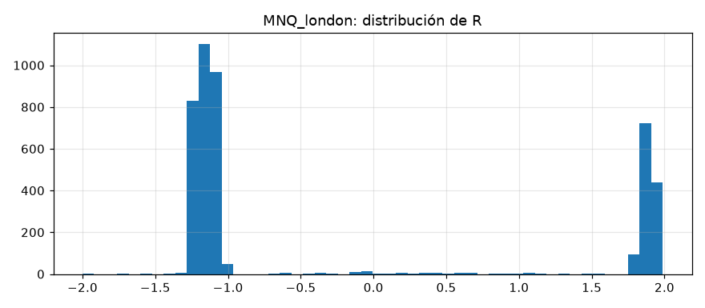

## MNQ_newyork

Periodos: desarrollo 2018-01-02 → 2023-03-31, validacion 2023-04-03 → 2024-12-30, oos 2024-12-31 → 2026-10-02

Configuraciones probadas en desarrollo + validación: 45; con esperanza > 0 en desarrollo: 0; en validación: 0; en ambas: 0.

### B. Ranking (mejor configuración de cada estrategia según validación; solo descriptivo)

| estrategia | umbral | objetivo_R | desarrollo_n | desarrollo_esperanza_R | validacion_n | validacion_esperanza_R | validacion_pf | validacion_dd_usd |
|---|---|---|---|---|---|---|---|---|
| F | 0.2 | 2.000 | 1891 | -0.131 | 719 | -0.035 | 0.947 | 2,440.580 |
| C | 0.2 | 2.000 | 2070 | -0.136 | 775 | -0.044 | 0.932 | 3,495.720 |
| E | sin filtro | 2.000 | 1604 | -0.212 | 637 | -0.211 | 0.713 | 5,966.260 |

### Configuración de partida (umbral 0,10, objetivo 2R): esperanza en R por periodo y escenario de costes

| estrategia | escenario_costes | desarrollo | validacion | oos |
|---|---|---|---|---|
| C | base | -0.160 | -0.079 | -0.175 |
| C | severe | -0.179 | -0.086 | -0.264 |
| C | stress | -0.206 | -0.137 | -0.210 |
| E | base | -0.205 | -0.228 | -0.195 |
| E | severe | -0.186 | -0.183 | -0.287 |
| E | stress | -0.166 | -0.241 | -0.228 |
| F | base | -0.125 | -0.067 | -0.156 |
| F | severe | -0.109 | -0.082 | -0.237 |
| F | stress | -0.151 | -0.121 | -0.202 |

### Métricas completas de la configuración de partida (costes base)

| estrategia | periodo | n | acierto | esperanza_R | esperanza_usd | pf | neto | costes | costes_pct_bruto_positivo | dd_usd | dd_pct | racha_perdedora | ops_por_sesion | exposicion | ambiguas | ic90_R_bajo | ic90_R_alto |
|---|---|---|---|---|---|---|---|---|---|---|---|---|---|---|---|---|---|
| C | desarrollo | 2211 | 0.319 | -0.160 | -11.526 | 0.783 | -25,483.640 | 24,386.140 | 0.247 | 27,387.700 | 0.532 | 18 | 1.727 | 0.031 | 12 | -0.213 | -0.107 |
| C | validacion | 814 | 0.343 | -0.079 | -3.471 | 0.894 | -2,825.680 | 5,085.680 | 0.201 | 3,519.280 | 0.140 | 18 | 1.911 | 0.024 | 6 | -0.163 | 0.012 |
| C | oos | 796 | 0.303 | -0.175 | -6.079 | 0.772 | -4,839.020 | 3,069.520 | 0.178 | 5,028.360 | 0.231 | 12 | 1.864 | 0.020 | 9 | -0.255 | -0.096 |
| E | desarrollo | 1107 | 0.309 | -0.205 | -16.452 | 0.739 | -18,212.060 | 15,477.060 | 0.280 | 18,668.720 | 0.370 | 18 | 0.865 | 0.009 | 10 | -0.273 | -0.134 |
| E | validacion | 485 | 0.301 | -0.228 | -12.264 | 0.728 | -5,947.840 | 4,694.340 | 0.275 | 5,987.660 | 0.188 | 23 | 1.138 | 0.009 | 3 | -0.312 | -0.127 |
| E | oos | 510 | 0.304 | -0.195 | -9.315 | 0.730 | -4,750.780 | 3,177.780 | 0.233 | 5,260.380 | 0.200 | 14 | 1.194 | 0.009 | 11 | -0.298 | -0.099 |
| F | desarrollo | 2004 | 0.330 | -0.125 | -10.081 | 0.821 | -20,201.660 | 23,111.660 | 0.234 | 22,512.180 | 0.441 | 15 | 1.566 | 0.027 | 10 | -0.179 | -0.070 |
| F | validacion | 761 | 0.346 | -0.067 | -3.855 | 0.904 | -2,933.500 | 5,685.500 | 0.195 | 3,339.180 | 0.111 | 18 | 1.786 | 0.023 | 6 | -0.156 | 0.023 |
| F | oos | 752 | 0.307 | -0.156 | -7.128 | 0.786 | -5,360.300 | 3,426.800 | 0.166 | 5,540.700 | 0.206 | 15 | 1.761 | 0.023 | 6 | -0.237 | -0.075 |

### D. Filtro de VWAP plano (objetivo 2R)

| estrategia | umbral | senales_originales | senales_filtradas | operaciones | ganadoras_eliminadas | perdedoras_eliminadas | esperanza_R_dev_val | pf_dev_val | dd_usd_dev_val | costes_dev_val | esperanza_R_validacion | esperanza_R_oos |
|---|---|---|---|---|---|---|---|---|---|---|---|---|
| C | sin filtro | 20966 | 0 | 4171 | 0 | 0 | -0.122 | 0.828 | 28,545.400 | 28,772.400 | -0.151 | -0.146 |
| C | 0.05 | 20966 | 7264 | 3908 | 836 | 1845 | -0.142 | 0.802 | 30,308.100 | 29,881.360 | -0.093 | -0.178 |
| C | 0.1 | 20966 | 8311 | 3821 | 854 | 1876 | -0.138 | 0.804 | 29,767.560 | 29,471.820 | -0.079 | -0.175 |
| C | 0.15 | 20966 | 9303 | 3731 | 873 | 1924 | -0.125 | 0.815 | 28,144.040 | 29,451.360 | -0.059 | -0.126 |
| C | 0.2 | 20966 | 10318 | 3605 | 893 | 1967 | -0.111 | 0.836 | 25,237.580 | 29,878.380 | -0.044 | -0.174 |
| E | sin filtro | 7456 | 0 | 2872 | 0 | 0 | -0.211 | 0.720 | 30,923.580 | 23,351.760 | -0.211 | -0.162 |
| E | 0.05 | 7456 | 2118 | 2228 | 344 | 780 | -0.205 | 0.743 | 24,903.940 | 21,268.620 | -0.229 | -0.193 |
| E | 0.1 | 7456 | 2544 | 2102 | 379 | 851 | -0.212 | 0.736 | 24,616.560 | 20,171.400 | -0.228 | -0.195 |
| E | 0.15 | 7456 | 2887 | 2008 | 403 | 914 | -0.206 | 0.740 | 23,609.560 | 19,547.400 | -0.225 | -0.168 |
| E | 0.2 | 7456 | 3271 | 1878 | 435 | 998 | -0.202 | 0.743 | 22,589.220 | 18,524.520 | -0.231 | -0.136 |
| F | sin filtro | 11363 | 0 | 3802 | 0 | 0 | -0.142 | 0.795 | 29,227.220 | 26,127.900 | -0.105 | -0.190 |
| F | 0.05 | 11363 | 2059 | 3575 | 361 | 827 | -0.110 | 0.841 | 24,115.000 | 29,109.160 | -0.076 | -0.179 |
| F | 0.1 | 11363 | 2472 | 3517 | 388 | 891 | -0.109 | 0.839 | 24,322.360 | 28,797.160 | -0.067 | -0.156 |
| F | 0.15 | 11363 | 2953 | 3425 | 424 | 960 | -0.110 | 0.846 | 23,159.600 | 28,468.040 | -0.061 | -0.155 |
| F | 0.2 | 11363 | 3459 | 3326 | 457 | 1032 | -0.104 | 0.848 | 21,844.900 | 27,549.440 | -0.035 | -0.177 |

### Walk-forward anual (configuración elegida solo con años anteriores)

| estrategia | años | operaciones | neto_usd | años_positivos |
|---|---|---|---|---|
| C | 7 | 0 | 0.000 | 0 |
| E | 7 | 0 | 0.000 | 0 |
| F | 7 | 0 | 0.000 | 0 |

| estrategia | año | config | n | esperanza_R | neto_usd |
|---|---|---|---|---|---|
| C | 2020 | sin candidato | 0 | — | 0.000 |
| C | 2021 | sin candidato | 0 | — | 0.000 |
| C | 2022 | sin candidato | 0 | — | 0.000 |
| C | 2023 | sin candidato | 0 | — | 0.000 |
| C | 2024 | sin candidato | 0 | — | 0.000 |
| C | 2025 | sin candidato | 0 | — | 0.000 |
| C | 2026 | sin candidato | 0 | — | 0.000 |
| E | 2020 | sin candidato | 0 | — | 0.000 |
| E | 2021 | sin candidato | 0 | — | 0.000 |
| E | 2022 | sin candidato | 0 | — | 0.000 |
| E | 2023 | sin candidato | 0 | — | 0.000 |
| E | 2024 | sin candidato | 0 | — | 0.000 |
| E | 2025 | sin candidato | 0 | — | 0.000 |
| E | 2026 | sin candidato | 0 | — | 0.000 |
| F | 2020 | sin candidato | 0 | — | 0.000 |
| F | 2021 | sin candidato | 0 | — | 0.000 |
| F | 2022 | sin candidato | 0 | — | 0.000 |
| F | 2023 | sin candidato | 0 | — | 0.000 |
| F | 2024 | sin candidato | 0 | — | 0.000 |
| F | 2025 | sin candidato | 0 | — | 0.000 |
| F | 2026 | sin candidato | 0 | — | 0.000 |

### Pendiente del VWAP a favor de la operación frente al resultado (descriptivo, sin filtro, dev + val)

| tramo | count | mean |
|---|---|---|
| (-4.551, -0.191] | 567 | -0.218 |
| (-0.191, 0.0441] | 567 | -0.050 |
| (0.0441, 0.188] | 568 | -0.193 |
| (0.188, 0.323] | 565 | -0.202 |
| (0.323, 0.481] | 567 | -0.097 |
| (0.481, 0.665] | 567 | -0.087 |
| (0.665, 0.849] | 566 | -0.073 |
| (0.849, 1.091] | 567 | -0.194 |
| (1.091, 1.536] | 568 | -0.181 |
| (1.536, 3.934] | 566 | -0.146 |

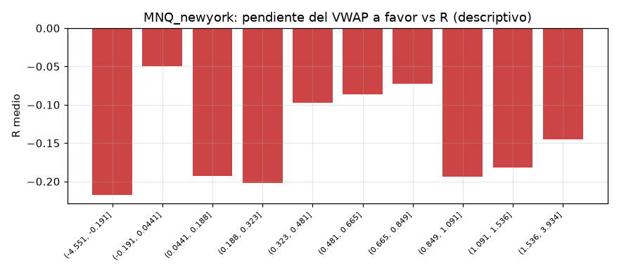

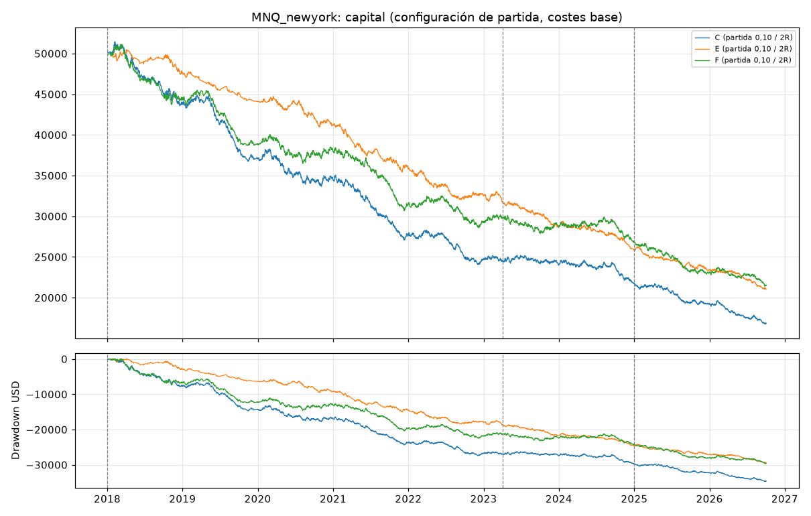
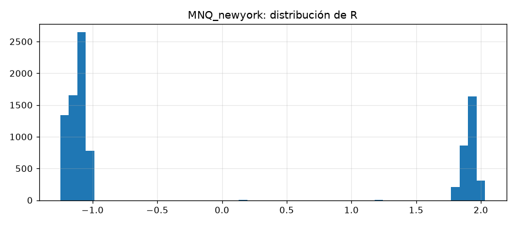

## MGC_london

Periodos: desarrollo 2018-01-02 → 2023-04-05, validacion 2023-04-06 → 2025-01-02, oos 2025-01-03 → 2026-10-02

Configuraciones probadas en desarrollo + validación: 45; con esperanza > 0 en desarrollo: 0; en validación: 0; en ambas: 0.

### B. Ranking (mejor configuración de cada estrategia según validación; solo descriptivo)

| estrategia | umbral | objetivo_R | desarrollo_n | desarrollo_esperanza_R | validacion_n | validacion_esperanza_R | validacion_pf | validacion_dd_usd |
|---|---|---|---|---|---|---|---|---|
| E | 0.05 | 1.000 | 88 | -0.126 | 23 | -0.111 | 0.809 | 839.760 |
| F | 0.05 | 1.000 | 329 | -0.338 | 126 | -0.230 | 0.635 | 2,513.640 |
| C | 0.05 | 1.000 | 382 | -0.336 | 144 | -0.233 | 0.638 | 2,657.520 |

### Configuración de partida (umbral 0,10, objetivo 2R): esperanza en R por periodo y escenario de costes

| estrategia | escenario_costes | desarrollo | validacion | oos |
|---|---|---|---|---|
| C | base | -0.303 | -0.492 | -0.265 |
| C | severe | -0.329 | — | -0.361 |
| C | stress | -0.209 | -0.028 | -0.366 |
| E | base | -0.387 | -0.217 | -0.253 |
| E | severe | -0.102 | -0.292 | -0.226 |
| E | stress | 0.732 | -0.209 | -0.268 |
| F | base | -0.310 | -0.431 | -0.247 |
| F | severe | -0.263 | — | -0.378 |
| F | stress | -0.152 | -0.028 | -0.381 |

### Métricas completas de la configuración de partida (costes base)

| estrategia | periodo | n | acierto | esperanza_R | esperanza_usd | pf | neto | costes | costes_pct_bruto_positivo | dd_usd | dd_pct | racha_perdedora | ops_por_sesion | exposicion | ambiguas | ic90_R_bajo | ic90_R_alto |
|---|---|---|---|---|---|---|---|---|---|---|---|---|---|---|---|---|---|
| C | desarrollo | 356 | 0.287 | -0.303 | -26.844 | 0.617 | -9,556.320 | 7,452.320 | 0.433 | 11,165.200 | 0.221 | 22.000 | 0.274 | 0.023 | 0.000 | -0.415 | -0.195 |
| C | validacion | 136 | 0.228 | -0.492 | -36.397 | 0.453 | -4,950.000 | 2,579.000 | 0.564 | 5,098.560 | 0.126 | 12.000 | 0.315 | 0.027 | 0.000 | -0.672 | -0.314 |
| C | oos | 499 | 0.285 | -0.265 | -15.907 | 0.664 | -7,937.840 | 5,144.840 | 0.306 | 8,628.400 | 0.242 | 12.000 | 1.152 | 0.044 | 1.000 | -0.353 | -0.172 |
| E | desarrollo | 86 | 0.279 | -0.387 | -36.968 | 0.544 | -3,179.280 | 2,102.280 | 0.492 | 3,205.680 | 0.064 | 10.000 | 0.066 | 0.006 | 0.000 | -0.603 | -0.166 |
| E | validacion | 23 | 0.304 | -0.217 | -17.984 | 0.749 | -413.640 | 545.640 | 0.402 | 968.280 | 0.020 | 6.000 | 0.053 | 0.004 | 0.000 | -0.692 | 0.258 |
| E | oos | 172 | 0.291 | -0.253 | -22.087 | 0.683 | -3,798.920 | 2,908.920 | 0.331 | 5,123.640 | 0.110 | 17.000 | 0.397 | 0.010 | 0.000 | -0.450 | -0.094 |
| F | desarrollo | 313 | 0.284 | -0.310 | -27.989 | 0.610 | -8,760.520 | 6,647.520 | 0.436 | 10,402.400 | 0.205 | 19.000 | 0.241 | 0.019 | 0.000 | -0.428 | -0.189 |
| F | validacion | 121 | 0.248 | -0.431 | -32.997 | 0.507 | -3,992.680 | 2,358.680 | 0.516 | 4,192.120 | 0.101 | 10.000 | 0.280 | 0.025 | 0.000 | -0.620 | -0.238 |
| F | oos | 445 | 0.290 | -0.247 | -16.121 | 0.684 | -7,174.040 | 4,920.040 | 0.295 | 8,112.280 | 0.216 | 13.000 | 1.028 | 0.040 | 1.000 | -0.346 | -0.149 |

### D. Filtro de VWAP plano (objetivo 2R)

| estrategia | umbral | senales_originales | senales_filtradas | operaciones | ganadoras_eliminadas | perdedoras_eliminadas | esperanza_R_dev_val | pf_dev_val | dd_usd_dev_val | costes_dev_val | esperanza_R_validacion | esperanza_R_oos |
|---|---|---|---|---|---|---|---|---|---|---|---|---|
| C | sin filtro | 12042 | 0 | 1952 | 0 | 0 | -0.303 | 0.629 | 25,905.800 | 20,065.240 | -0.406 | -0.249 |
| C | 0.05 | 12042 | 6292 | 1034 | 403 | 951 | -0.329 | 0.600 | 14,937.080 | 10,620.000 | -0.461 | -0.257 |
| C | 0.1 | 12042 | 6621 | 991 | 413 | 964 | -0.355 | 0.574 | 15,046.600 | 10,031.320 | -0.492 | -0.265 |
| C | 0.15 | 12042 | 6961 | 940 | 423 | 986 | -0.362 | 0.569 | 14,671.880 | 9,613.960 | -0.516 | -0.252 |
| C | 0.2 | 12042 | 7260 | 893 | 428 | 1001 | -0.360 | 0.571 | 14,033.200 | 9,219.280 | -0.518 | -0.227 |
| E | sin filtro | 6659 | 0 | 617 | 0 | 0 | -0.261 | 0.684 | 6,225.560 | 6,049.560 | -0.297 | -0.198 |
| E | 0.05 | 6659 | 3240 | 293 | 112 | 243 | -0.339 | 0.596 | 3,555.400 | 2,696.000 | -0.217 | -0.245 |
| E | 0.1 | 6659 | 3423 | 281 | 116 | 249 | -0.351 | 0.583 | 3,619.320 | 2,647.920 | -0.217 | -0.253 |
| E | 0.15 | 6659 | 3621 | 268 | 119 | 258 | -0.346 | 0.583 | 3,336.440 | 2,459.040 | -0.217 | -0.250 |
| E | 0.2 | 6659 | 3788 | 253 | 122 | 267 | -0.368 | 0.568 | 3,320.840 | 2,370.840 | -0.221 | -0.213 |
| F | sin filtro | 6329 | 0 | 1252 | 0 | 0 | -0.281 | 0.652 | 16,014.960 | 13,063.320 | -0.378 | -0.196 |
| F | 0.05 | 6329 | 1645 | 904 | 154 | 307 | -0.326 | 0.602 | 13,381.520 | 9,320.360 | -0.406 | -0.247 |
| F | 0.1 | 6329 | 1800 | 879 | 164 | 320 | -0.344 | 0.583 | 13,541.560 | 9,006.200 | -0.431 | -0.247 |
| F | 0.15 | 6329 | 1978 | 841 | 175 | 341 | -0.357 | 0.573 | 13,379.520 | 8,684.040 | -0.456 | -0.233 |
| F | 0.2 | 6329 | 2164 | 810 | 180 | 365 | -0.362 | 0.568 | 13,149.200 | 8,413.720 | -0.462 | -0.218 |

### Walk-forward anual (configuración elegida solo con años anteriores)

| estrategia | años | operaciones | neto_usd | años_positivos |
|---|---|---|---|---|
| C | 7 | 0 | 0.000 | 0 |
| E | 7 | 0 | 0.000 | 0 |
| F | 7 | 192 | -5,766.040 | 0 |

| estrategia | año | config | n | esperanza_R | neto_usd |
|---|---|---|---|---|---|
| C | 2020 | sin candidato | 0 | — | 0.000 |
| C | 2021 | sin candidato | 0 | — | 0.000 |
| C | 2022 | sin candidato | 0 | — | 0.000 |
| C | 2023 | sin candidato | 0 | — | 0.000 |
| C | 2024 | sin candidato | 0 | — | 0.000 |
| C | 2025 | sin candidato | 0 | — | 0.000 |
| C | 2026 | sin candidato | 0 | — | 0.000 |
| E | 2020 | sin candidato | 0 | — | 0.000 |
| E | 2021 | sin candidato | 0 | — | 0.000 |
| E | 2022 | sin candidato | 0 | — | 0.000 |
| E | 2023 | sin candidato | 0 | — | 0.000 |
| E | 2024 | sin candidato | 0 | — | 0.000 |
| E | 2025 | sin candidato | 0 | — | 0.000 |
| E | 2026 | sin candidato | 0 | — | 0.000 |
| F | 2020 | umbral=None objetivo=2.0R | 192 | -0.323 | -5,766.040 |
| F | 2021 | sin candidato | 0 | — | 0.000 |
| F | 2022 | sin candidato | 0 | — | 0.000 |
| F | 2023 | sin candidato | 0 | — | 0.000 |
| F | 2024 | sin candidato | 0 | — | 0.000 |
| F | 2025 | sin candidato | 0 | — | 0.000 |
| F | 2026 | sin candidato | 0 | — | 0.000 |

### Pendiente del VWAP a favor de la operación frente al resultado (descriptivo, sin filtro, dev + val)

| tramo | count | mean |
|---|---|---|
| (-4.180000000000001, -0.962] | 142 | -0.065 |
| (-0.962, -0.278] | 141 | -0.453 |
| (-0.278, -0.0263] | 141 | -0.195 |
| (-0.0263, 0.153] | 141 | -0.338 |
| (0.153, 0.351] | 141 | -0.226 |
| (0.351, 0.53] | 141 | -0.526 |
| (0.53, 0.742] | 142 | -0.346 |
| (0.742, 1.058] | 141 | -0.475 |
| (1.058, 1.451] | 140 | -0.284 |
| (1.451, 4.024] | 141 | -0.338 |

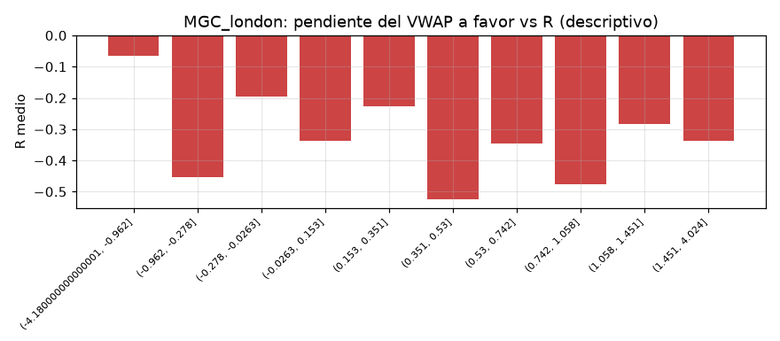

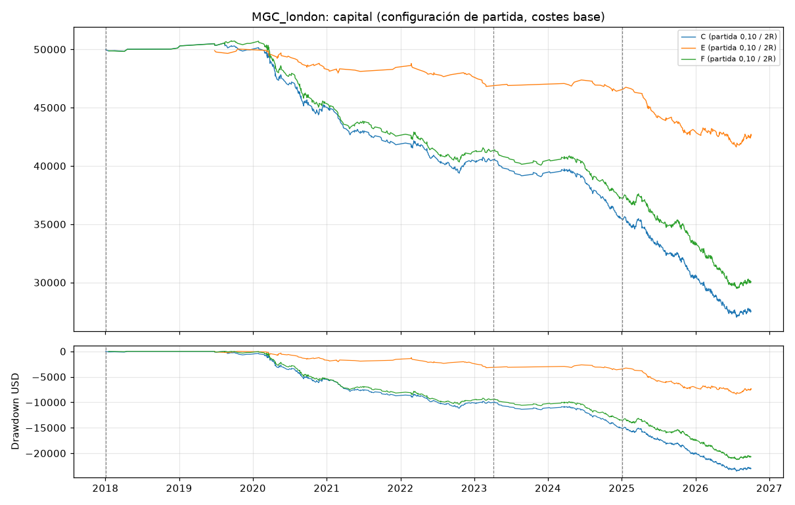
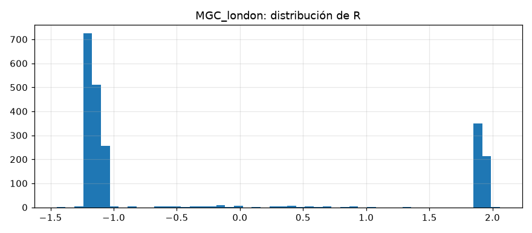

## MGC_newyork

Periodos: desarrollo 2018-01-02 → 2023-04-10, validacion 2023-04-11 → 2025-01-03, oos 2025-01-06 → 2026-10-02

Configuraciones probadas en desarrollo + validación: 45; con esperanza > 0 en desarrollo: 0; en validación: 0; en ambas: 0.

### B. Ranking (mejor configuración de cada estrategia según validación; solo descriptivo)

| estrategia | umbral | objetivo_R | desarrollo_n | desarrollo_esperanza_R | validacion_n | validacion_esperanza_R | validacion_pf | validacion_dd_usd |
|---|---|---|---|---|---|---|---|---|
| C | 0.1 | 2.000 | 938 | -0.153 | 447 | -0.088 | 0.875 | 4,009.080 |
| F | 0.1 | 2.000 | 784 | -0.156 | 376 | -0.130 | 0.829 | 4,943.720 |
| E | sin filtro | 1.000 | 478 | -0.279 | 273 | -0.200 | 0.679 | 4,369.440 |

### Configuración de partida (umbral 0,10, objetivo 2R): esperanza en R por periodo y escenario de costes

| estrategia | escenario_costes | desarrollo | validacion | oos |
|---|---|---|---|---|
| C | base | -0.153 | -0.088 | -0.274 |
| C | severe | -0.158 | 0.093 | -0.345 |
| C | stress | -0.295 | -0.097 | -0.300 |
| E | base | -0.283 | -0.516 | -0.312 |
| E | severe | -0.287 | -0.155 | -0.489 |
| E | stress | -0.381 | -0.364 | -0.378 |
| F | base | -0.156 | -0.130 | -0.275 |
| F | severe | -0.097 | 0.204 | -0.355 |
| F | stress | -0.309 | -0.064 | -0.305 |

### Métricas completas de la configuración de partida (costes base)

| estrategia | periodo | n | acierto | esperanza_R | esperanza_usd | pf | neto | costes | costes_pct_bruto_positivo | dd_usd | dd_pct | racha_perdedora | ops_por_sesion | exposicion | ambiguas | ic90_R_bajo | ic90_R_alto |
|---|---|---|---|---|---|---|---|---|---|---|---|---|---|---|---|---|---|
| C | desarrollo | 938 | 0.335 | -0.153 | -13.517 | 0.796 | -12,678.560 | 17,283.560 | 0.320 | 13,659.880 | 0.270 | 26 | 0.744 | 0.033 | 0 | -0.230 | -0.074 |
| C | validacion | 447 | 0.353 | -0.088 | -6.295 | 0.875 | -2,813.920 | 6,404.920 | 0.300 | 4,009.080 | 0.107 | 13 | 1.064 | 0.035 | 0 | -0.198 | 0.008 |
| C | oos | 733 | 0.277 | -0.274 | -14.415 | 0.659 | -10,566.360 | 6,204.360 | 0.286 | 10,947.960 | 0.315 | 20 | 1.745 | 0.031 | 5 | -0.356 | -0.204 |
| E | desarrollo | 226 | 0.296 | -0.283 | -26.694 | 0.657 | -6,032.920 | 4,907.920 | 0.387 | 7,477.440 | 0.147 | 11 | 0.179 | 0.005 | 0 | -0.434 | -0.139 |
| E | validacion | 143 | 0.217 | -0.516 | -41.687 | 0.440 | -5,961.200 | 2,749.200 | 0.538 | 5,961.200 | 0.136 | 13 | 0.340 | 0.010 | 1 | -0.668 | -0.363 |
| E | oos | 387 | 0.269 | -0.312 | -20.476 | 0.619 | -7,924.160 | 4,620.160 | 0.334 | 8,372.560 | 0.219 | 14 | 0.921 | 0.009 | 4 | -0.428 | -0.208 |
| F | desarrollo | 784 | 0.334 | -0.156 | -14.326 | 0.789 | -11,231.880 | 14,719.880 | 0.322 | 12,075.080 | 0.239 | 23 | 0.622 | 0.027 | 0 | -0.242 | -0.066 |
| F | validacion | 376 | 0.340 | -0.130 | -9.112 | 0.829 | -3,426.160 | 5,635.160 | 0.311 | 4,943.720 | 0.127 | 20 | 0.895 | 0.030 | 1 | -0.250 | -0.012 |
| F | oos | 656 | 0.276 | -0.275 | -15.739 | 0.642 | -10,324.880 | 5,615.880 | 0.286 | 10,918.120 | 0.305 | 18 | 1.562 | 0.026 | 3 | -0.361 | -0.204 |

### D. Filtro de VWAP plano (objetivo 2R)

| estrategia | umbral | senales_originales | senales_filtradas | operaciones | ganadoras_eliminadas | perdedoras_eliminadas | esperanza_R_dev_val | pf_dev_val | dd_usd_dev_val | costes_dev_val | esperanza_R_validacion | esperanza_R_oos |
|---|---|---|---|---|---|---|---|---|---|---|---|---|
| C | sin filtro | 21410 | 0 | 3118 | 0 | 0 | -0.160 | 0.797 | 26,851.480 | 34,090.400 | -0.188 | -0.125 |
| C | 0.05 | 21410 | 7959 | 2218 | 706 | 1420 | -0.140 | 0.808 | 18,099.640 | 24,786.320 | -0.088 | -0.266 |
| C | 0.1 | 21410 | 9376 | 2118 | 722 | 1451 | -0.132 | 0.817 | 17,137.720 | 23,688.480 | -0.088 | -0.274 |
| C | 0.15 | 21410 | 10715 | 2018 | 740 | 1481 | -0.154 | 0.790 | 18,042.520 | 22,271.560 | -0.125 | -0.290 |
| C | 0.2 | 21410 | 12010 | 1892 | 755 | 1537 | -0.140 | 0.809 | 15,633.160 | 21,231.200 | -0.135 | -0.275 |
| E | sin filtro | 11411 | 0 | 1286 | 0 | 0 | -0.258 | 0.690 | 17,605.480 | 14,445.240 | -0.378 | -0.260 |
| E | 0.05 | 11411 | 3667 | 796 | 208 | 408 | -0.352 | 0.599 | 13,078.880 | 8,141.680 | -0.497 | -0.315 |
| E | 0.1 | 11411 | 4488 | 756 | 218 | 431 | -0.373 | 0.575 | 12,968.480 | 7,657.120 | -0.516 | -0.312 |
| E | 0.15 | 11411 | 5260 | 714 | 232 | 454 | -0.396 | 0.557 | 12,782.440 | 7,255.240 | -0.533 | -0.315 |
| E | 0.2 | 11411 | 6015 | 674 | 242 | 481 | -0.396 | 0.551 | 12,188.120 | 6,755.920 | -0.504 | -0.312 |
| F | sin filtro | 11156 | 0 | 2379 | 0 | 0 | -0.170 | 0.775 | 22,780.160 | 25,275.120 | -0.159 | -0.213 |
| F | 0.05 | 11156 | 2261 | 1883 | 268 | 554 | -0.157 | 0.787 | 17,384.200 | 20,888.080 | -0.144 | -0.255 |
| F | 0.1 | 11156 | 2842 | 1816 | 294 | 603 | -0.147 | 0.800 | 16,494.400 | 20,355.040 | -0.130 | -0.275 |
| F | 0.15 | 11156 | 3455 | 1754 | 313 | 645 | -0.148 | 0.801 | 15,986.000 | 19,718.440 | -0.148 | -0.275 |
| F | 0.2 | 11156 | 4086 | 1673 | 333 | 698 | -0.142 | 0.806 | 14,447.480 | 18,859.840 | -0.165 | -0.268 |

### Walk-forward anual (configuración elegida solo con años anteriores)

| estrategia | años | operaciones | neto_usd | años_positivos |
|---|---|---|---|---|
| C | 7 | 0 | 0.000 | 0 |
| E | 7 | 156 | -5,449.960 | 0 |
| F | 7 | 0 | 0.000 | 0 |

| estrategia | año | config | n | esperanza_R | neto_usd |
|---|---|---|---|---|---|
| C | 2020 | sin candidato | 0 | — | 0.000 |
| C | 2021 | sin candidato | 0 | — | 0.000 |
| C | 2022 | sin candidato | 0 | — | 0.000 |
| C | 2023 | sin candidato | 0 | — | 0.000 |
| C | 2024 | sin candidato | 0 | — | 0.000 |
| C | 2025 | sin candidato | 0 | — | 0.000 |
| C | 2026 | sin candidato | 0 | — | 0.000 |
| E | 2020 | umbral=None objetivo=2.0R | 156 | -0.369 | -5,449.960 |
| E | 2021 | sin candidato | 0 | — | 0.000 |
| E | 2022 | sin candidato | 0 | — | 0.000 |
| E | 2023 | sin candidato | 0 | — | 0.000 |
| E | 2024 | sin candidato | 0 | — | 0.000 |
| E | 2025 | sin candidato | 0 | — | 0.000 |
| E | 2026 | sin candidato | 0 | — | 0.000 |
| F | 2020 | sin candidato | 0 | — | 0.000 |
| F | 2021 | sin candidato | 0 | — | 0.000 |
| F | 2022 | sin candidato | 0 | — | 0.000 |
| F | 2023 | sin candidato | 0 | — | 0.000 |
| F | 2024 | sin candidato | 0 | — | 0.000 |
| F | 2025 | sin candidato | 0 | — | 0.000 |
| F | 2026 | sin candidato | 0 | — | 0.000 |

### Pendiente del VWAP a favor de la operación frente al resultado (descriptivo, sin filtro, dev + val)

| tramo | count | mean |
|---|---|---|
| (-6.214, -1.092] | 305 | -0.103 |
| (-1.092, -0.169] | 304 | -0.228 |
| (-0.169, 0.0465] | 304 | -0.139 |
| (0.0465, 0.179] | 305 | -0.151 |
| (0.179, 0.34] | 303 | -0.269 |
| (0.34, 0.514] | 305 | -0.163 |
| (0.514, 0.722] | 303 | -0.145 |
| (0.722, 0.997] | 304 | -0.230 |
| (0.997, 1.418] | 305 | -0.274 |
| (1.418, 4.954] | 304 | -0.224 |

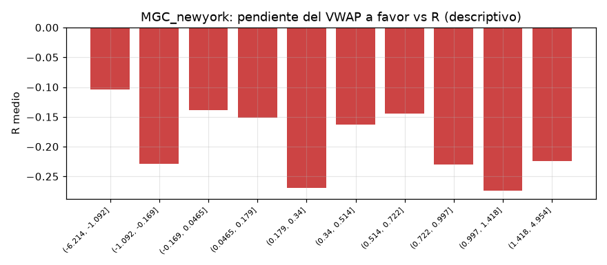

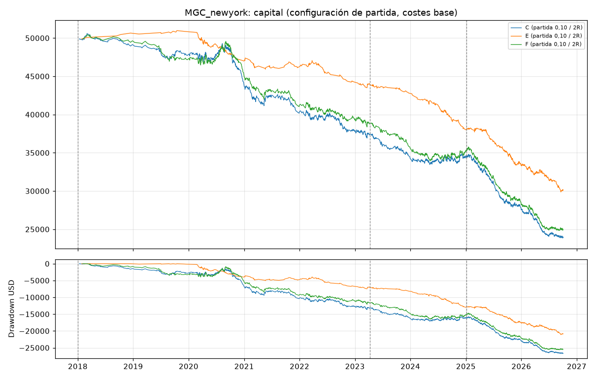
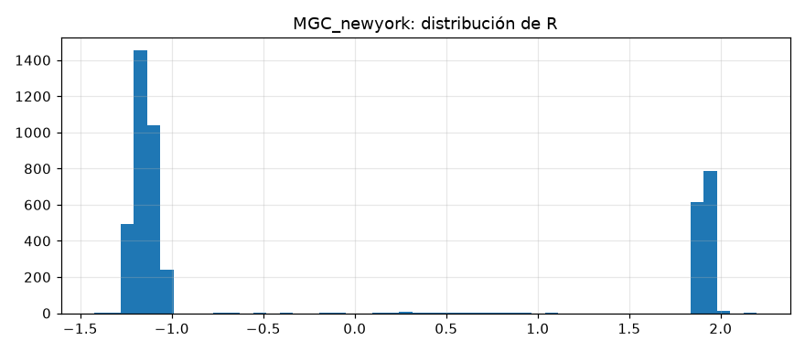
