# Laboratorio VWAP + EMA (MNQ, MGC) — informe final

Resultados históricos de backtest. No son una previsión. Costes: 0,62 USD/lado = SUPUESTO; sustituir por la tarifa real (comisión + tasas de bolsa).

## A. Resumen ejecutivo

- **MNQ_london:** ningún candidato (ninguna configuración con esperanza > 0 en desarrollo y ≥ 30 operaciones en validación)
- **MNQ_newyork:** ningún candidato (ninguna configuración con esperanza > 0 en desarrollo y ≥ 30 operaciones en validación)
- **MGC_london:** ningún candidato (ninguna configuración con esperanza > 0 en desarrollo y ≥ 30 operaciones en validación)
- **MGC_newyork:** ningún candidato (ninguna configuración con esperanza > 0 en desarrollo y ≥ 30 operaciones en validación)

## MNQ_london

Periodos: desarrollo 2018-01-02 → 2023-04-04, validacion 2023-04-05 → 2025-01-02, oos 2025-01-03 → 2026-10-02

Configuraciones probadas en desarrollo + validación: 90; con esperanza > 0 en desarrollo: 0; en validación: 5; en ambas: 0.

### B. Ranking (mejor configuración de cada estrategia según validación; solo descriptivo)

| estrategia | umbral | objetivo_R | desarrollo_n | desarrollo_esperanza_R | validacion_n | validacion_esperanza_R | validacion_pf | validacion_dd_usd |
|---|---|---|---|---|---|---|---|---|
| F | 0.1 | 1.500 | 116 | -0.231 | 47 | 0.113 | 1.226 | 967.920 |
| C | 0.05 | 1.500 | 528 | -0.151 | 209 | -0.054 | 0.900 | 2,211.300 |
| E | 0.2 | 1.500 | 65 | -0.152 | 35 | -0.125 | 0.798 | 724.740 |
| A | sin filtro | 1.500 | 1211 | -0.186 | 503 | -0.159 | 0.768 | 5,381.340 |
| B | 0.05 | 2.000 | 472 | -0.130 | 221 | -0.169 | 0.766 | 4,260.240 |
| D | 0.15 | 1.500 | 313 | -0.101 | 151 | -0.205 | 0.712 | 3,012.440 |

### Configuración de partida (umbral 0,10, objetivo 2R): esperanza en R por periodo y escenario de costes

| estrategia | escenario_costes | desarrollo | validacion | oos |
|---|---|---|---|---|
| A | base | -0.168 | -0.212 | -0.175 |
| A | severe | -0.214 | -0.258 | -0.172 |
| A | stress | -0.218 | -0.168 | -0.171 |
| B | base | -0.143 | -0.181 | -0.056 |
| B | severe | -0.252 | -0.046 | 0.040 |
| B | stress | -0.138 | -0.044 | -0.020 |
| C | base | -0.131 | -0.177 | -0.169 |
| C | severe | -0.087 | -0.238 | -0.077 |
| C | stress | -0.143 | -0.226 | -0.194 |
| D | base | -0.105 | -0.285 | -0.101 |
| D | severe | 0.037 | -0.284 | -0.055 |
| D | stress | -0.067 | -0.307 | -0.160 |
| E | base | -0.190 | -0.316 | -0.241 |
| E | severe | -0.319 | -0.335 | -0.264 |
| E | stress | -0.331 | -0.382 | -0.290 |
| F | base | -0.221 | -0.000 | -0.332 |
| F | severe | -0.158 | -0.042 | -0.135 |
| F | stress | -0.149 | -0.069 | -0.385 |

### Métricas completas de la configuración de partida (costes base)

| estrategia | periodo | n | acierto | esperanza_R | esperanza_usd | pf | neto | costes | costes_pct_bruto_positivo | dd_usd | dd_pct | racha_perdedora | ops_por_sesion | exposicion | ambiguas | ic90_R_bajo | ic90_R_alto |
|---|---|---|---|---|---|---|---|---|---|---|---|---|---|---|---|---|---|
| A | desarrollo | 449 | 0.327 | -0.168 | -16.045 | 0.770 | -7,204.320 | 6,311.320 | 0.244 | 8,016.760 | 0.158 | 9 | 0.337 | 0.045 | 3 | -0.270 | -0.062 |
| A | validacion | 181 | 0.320 | -0.212 | -17.015 | 0.726 | -3,079.740 | 1,904.240 | 0.221 | 3,364.740 | 0.078 | 9 | 0.407 | 0.052 | 1 | -0.381 | -0.059 |
| A | oos | 191 | 0.304 | -0.175 | -12.610 | 0.772 | -2,408.500 | 1,474.000 | 0.173 | 3,327.120 | 0.082 | 11 | 0.429 | 0.041 | 6 | -0.334 | -0.000 |
| B | desarrollo | 413 | 0.334 | -0.143 | -13.869 | 0.802 | -5,728.000 | 6,221.000 | 0.249 | 6,482.760 | 0.129 | 14 | 0.310 | 0.027 | 5 | -0.250 | -0.029 |
| B | validacion | 192 | 0.333 | -0.181 | -15.467 | 0.756 | -2,969.740 | 2,532.740 | 0.259 | 3,962.220 | 0.089 | 11 | 0.431 | 0.041 | 4 | -0.328 | -0.009 |
| B | oos | 230 | 0.352 | -0.056 | -5.863 | 0.896 | -1,348.480 | 2,048.980 | 0.169 | 2,514.600 | 0.060 | 11 | 0.517 | 0.039 | 2 | -0.204 | 0.098 |
| C | desarrollo | 431 | 0.343 | -0.131 | -13.250 | 0.798 | -5,710.900 | 5,603.400 | 0.233 | 6,271.800 | 0.125 | 11 | 0.323 | 0.046 | 3 | -0.235 | -0.023 |
| C | validacion | 170 | 0.324 | -0.177 | -16.495 | 0.740 | -2,804.080 | 1,982.580 | 0.233 | 3,594.300 | 0.081 | 10 | 0.382 | 0.049 | 0 | -0.358 | -0.003 |
| C | oos | 173 | 0.318 | -0.169 | -14.023 | 0.757 | -2,425.940 | 1,441.940 | 0.183 | 2,911.520 | 0.070 | 11 | 0.389 | 0.035 | 3 | -0.326 | 0.001 |
| D | desarrollo | 343 | 0.347 | -0.105 | -11.327 | 0.831 | -3,885.280 | 4,623.280 | 0.227 | 5,772.880 | 0.115 | 12 | 0.257 | 0.030 | 1 | -0.222 | 0.024 |
| D | validacion | 167 | 0.293 | -0.285 | -24.540 | 0.640 | -4,098.200 | 2,136.200 | 0.274 | 4,390.960 | 0.095 | 18 | 0.375 | 0.038 | 0 | -0.453 | -0.111 |
| D | oos | 143 | 0.336 | -0.101 | -7.880 | 0.859 | -1,126.880 | 1,223.380 | 0.169 | 1,766.380 | 0.042 | 14 | 0.321 | 0.028 | 5 | -0.263 | 0.086 |
| E | desarrollo | 98 | 0.347 | -0.190 | -19.347 | 0.739 | -1,896.020 | 1,725.020 | 0.293 | 2,747.780 | 0.055 | 9 | 0.073 | 0.006 | 2 | -0.409 | 0.047 |
| E | validacion | 48 | 0.271 | -0.316 | -30.612 | 0.616 | -1,469.380 | 764.380 | 0.303 | 1,774.960 | 0.037 | 7 | 0.108 | 0.007 | 0 | -0.675 | 0.026 |
| E | oos | 57 | 0.281 | -0.241 | -23.304 | 0.669 | -1,328.300 | 568.300 | 0.202 | 1,793.920 | 0.038 | 7 | 0.128 | 0.007 | 1 | -0.523 | 0.064 |
| F | desarrollo | 116 | 0.284 | -0.221 | -21.242 | 0.695 | -2,464.100 | 1,417.600 | 0.240 | 3,014.180 | 0.060 | 18 | 0.087 | 0.016 | 0 | -0.411 | -0.028 |
| F | validacion | 47 | 0.404 | -0.000 | 2.121 | 1.034 | 99.680 | 561.320 | 0.173 | 879.540 | 0.018 | 6 | 0.106 | 0.018 | 0 | -0.290 | 0.323 |
| F | oos | 35 | 0.257 | -0.332 | -37.097 | 0.511 | -1,298.380 | 346.380 | 0.245 | 1,700.600 | 0.035 | 12 | 0.079 | 0.008 | 0 | -0.668 | 0.014 |

### D. Filtro de VWAP plano (objetivo 2R)

| estrategia | umbral | senales_originales | senales_filtradas | operaciones | ganadoras_eliminadas | perdedoras_eliminadas | esperanza_R_dev_val | pf_dev_val | dd_usd_dev_val | costes_dev_val | esperanza_R_validacion | esperanza_R_oos |
|---|---|---|---|---|---|---|---|---|---|---|---|---|
| A | sin filtro | 3567 | 0 | 2186 | 0 | 0 | -0.166 | 0.770 | 21,507.760 | 18,470.840 | -0.162 | -0.187 |
| A | 0.05 | 3567 | 2172 | 1020 | 422 | 834 | -0.187 | 0.748 | 13,998.940 | 9,881.260 | -0.200 | -0.139 |
| A | 0.1 | 3567 | 2500 | 821 | 475 | 957 | -0.181 | 0.758 | 11,151.340 | 8,215.560 | -0.212 | -0.175 |
| A | 0.15 | 3567 | 2659 | 698 | 510 | 1022 | -0.163 | 0.780 | 9,295.000 | 7,297.120 | -0.191 | -0.260 |
| A | 0.2 | 3567 | 2738 | 631 | 533 | 1058 | -0.169 | 0.775 | 8,795.700 | 6,716.120 | -0.230 | -0.271 |
| B | sin filtro | 2129 | 0 | 1211 | 0 | 0 | -0.191 | 0.741 | 14,881.540 | 11,753.520 | -0.240 | -0.086 |
| B | 0.05 | 2129 | 551 | 951 | 88 | 202 | -0.143 | 0.804 | 10,377.040 | 9,921.960 | -0.169 | -0.043 |
| B | 0.1 | 2129 | 801 | 835 | 130 | 269 | -0.155 | 0.788 | 9,934.320 | 8,753.740 | -0.181 | -0.056 |
| B | 0.15 | 2129 | 981 | 746 | 163 | 326 | -0.167 | 0.779 | 9,408.780 | 7,882.700 | -0.204 | -0.057 |
| B | 0.2 | 2129 | 1096 | 682 | 188 | 365 | -0.180 | 0.762 | 9,320.200 | 7,244.300 | -0.244 | -0.051 |
| C | sin filtro | 3454 | 0 | 2022 | 0 | 0 | -0.104 | 0.832 | 14,974.060 | 17,819.060 | -0.124 | -0.142 |
| C | 0.05 | 3454 | 2156 | 948 | 410 | 739 | -0.139 | 0.774 | 11,022.500 | 8,946.580 | -0.117 | -0.198 |
| C | 0.1 | 3454 | 2437 | 774 | 454 | 829 | -0.144 | 0.782 | 9,072.580 | 7,585.980 | -0.177 | -0.169 |
| C | 0.15 | 3454 | 2604 | 656 | 490 | 904 | -0.127 | 0.811 | 6,813.460 | 6,567.280 | -0.178 | -0.238 |
| C | 0.2 | 3454 | 2713 | 573 | 514 | 958 | -0.115 | 0.826 | 5,303.380 | 5,923.320 | -0.244 | -0.232 |
| D | sin filtro | 1618 | 0 | 1023 | 0 | 0 | -0.199 | 0.718 | 14,967.740 | 9,899.620 | -0.284 | -0.051 |
| D | 0.05 | 1618 | 506 | 697 | 109 | 241 | -0.179 | 0.746 | 9,809.680 | 7,186.000 | -0.282 | -0.070 |
| D | 0.1 | 1618 | 589 | 653 | 121 | 264 | -0.164 | 0.768 | 8,550.420 | 6,759.480 | -0.285 | -0.101 |
| D | 0.15 | 1618 | 689 | 597 | 134 | 303 | -0.137 | 0.804 | 6,566.960 | 6,241.620 | -0.269 | -0.093 |
| D | 0.2 | 1618 | 763 | 559 | 150 | 323 | -0.149 | 0.786 | 6,696.460 | 5,806.400 | -0.261 | -0.133 |
| E | sin filtro | 1188 | 0 | 594 | 0 | 0 | -0.203 | 0.722 | 8,601.980 | 6,734.760 | -0.174 | -0.217 |
| E | 0.05 | 1188 | 757 | 252 | 113 | 235 | -0.189 | 0.741 | 3,807.120 | 2,989.280 | -0.192 | -0.371 |
| E | 0.1 | 1188 | 856 | 203 | 126 | 267 | -0.231 | 0.697 | 3,722.460 | 2,489.400 | -0.316 | -0.241 |
| E | 0.15 | 1188 | 923 | 163 | 136 | 297 | -0.149 | 0.791 | 2,062.440 | 2,028.740 | -0.282 | -0.254 |
| E | 0.2 | 1188 | 958 | 138 | 143 | 314 | -0.130 | 0.818 | 1,805.540 | 1,765.740 | -0.186 | -0.213 |
| F | sin filtro | 1235 | 0 | 858 | 0 | 0 | -0.081 | 0.882 | 5,232.840 | 8,317.400 | -0.080 | -0.100 |
| F | 0.05 | 1235 | 917 | 241 | 230 | 391 | -0.191 | 0.723 | 4,199.520 | 2,412.660 | 0.006 | -0.313 |
| F | 0.1 | 1235 | 982 | 198 | 241 | 422 | -0.157 | 0.786 | 3,014.180 | 1,978.920 | -0.000 | -0.332 |
| F | 0.15 | 1235 | 1022 | 167 | 251 | 442 | -0.148 | 0.798 | 2,508.760 | 1,675.340 | 0.023 | -0.493 |
| F | 0.2 | 1235 | 1044 | 150 | 258 | 452 | -0.175 | 0.762 | 2,110.560 | 1,517.600 | -0.114 | -0.539 |

### Walk-forward anual (configuración elegida solo con años anteriores)

| estrategia | años | operaciones | neto_usd | años_positivos |
|---|---|---|---|---|
| A | 7 | 62 | -745.540 | 0 |
| B | 7 | 0 | 0.000 | 0 |
| C | 7 | 0 | 0.000 | 0 |
| D | 7 | 0 | 0.000 | 0 |
| E | 7 | 0 | 0.000 | 0 |
| F | 7 | 0 | 0.000 | 0 |

| estrategia | año | config | n | esperanza_R | neto_usd |
|---|---|---|---|---|---|
| A | 2020 | umbral=0.2 objetivo=2.0R | 62 | -0.116 | -745.540 |
| A | 2021 | sin candidato | 0 | — | 0.000 |
| A | 2022 | sin candidato | 0 | — | 0.000 |
| A | 2023 | sin candidato | 0 | — | 0.000 |
| A | 2024 | sin candidato | 0 | — | 0.000 |
| A | 2025 | sin candidato | 0 | — | 0.000 |
| A | 2026 | sin candidato | 0 | — | 0.000 |
| B | 2020 | sin candidato | 0 | — | 0.000 |
| B | 2021 | sin candidato | 0 | — | 0.000 |
| B | 2022 | sin candidato | 0 | — | 0.000 |
| B | 2023 | sin candidato | 0 | — | 0.000 |
| B | 2024 | sin candidato | 0 | — | 0.000 |
| B | 2025 | sin candidato | 0 | — | 0.000 |
| B | 2026 | sin candidato | 0 | — | 0.000 |
| C | 2020 | sin candidato | 0 | — | 0.000 |
| C | 2021 | sin candidato | 0 | — | 0.000 |
| C | 2022 | sin candidato | 0 | — | 0.000 |
| C | 2023 | sin candidato | 0 | — | 0.000 |
| C | 2024 | sin candidato | 0 | — | 0.000 |
| C | 2025 | sin candidato | 0 | — | 0.000 |
| C | 2026 | sin candidato | 0 | — | 0.000 |
| D | 2020 | sin candidato | 0 | — | 0.000 |
| D | 2021 | sin candidato | 0 | — | 0.000 |
| D | 2022 | sin candidato | 0 | — | 0.000 |
| D | 2023 | sin candidato | 0 | — | 0.000 |
| D | 2024 | sin candidato | 0 | — | 0.000 |
| D | 2025 | sin candidato | 0 | — | 0.000 |
| D | 2026 | sin candidato | 0 | — | 0.000 |
| E | 2020 | sin candidato | 0 | — | 0.000 |
| E | 2021 | sin candidato | 0 | — | 0.000 |
| E | 2022 | sin candidato | 0 | — | 0.000 |
| E | 2023 | sin candidato | 0 | — | 0.000 |
| E | 2024 | sin candidato | 0 | — | 0.000 |
| E | 2025 | sin candidato | 0 | — | 0.000 |
| E | 2026 | sin candidato | 0 | — | 0.000 |
| F | 2020 | sin candidato | 0 | — | 0.000 |
| F | 2021 | sin candidato | 0 | — | 0.000 |
| F | 2022 | sin candidato | 0 | — | 0.000 |
| F | 2023 | sin candidato | 0 | — | 0.000 |
| F | 2024 | sin candidato | 0 | — | 0.000 |
| F | 2025 | sin candidato | 0 | — | 0.000 |
| F | 2026 | sin candidato | 0 | — | 0.000 |

### Pendiente del VWAP a favor de la operación frente al resultado (descriptivo, sin filtro, dev + val)

| tramo | count | mean |
|---|---|---|
| (-1.414, -0.145] | 508 | -0.120 |
| (-0.145, -0.0489] | 507 | -0.292 |
| (-0.0489, 0.00417] | 508 | -0.193 |
| (0.00417, 0.0513] | 507 | -0.049 |
| (0.0513, 0.115] | 508 | -0.237 |
| (0.115, 0.212] | 507 | -0.181 |
| (0.212, 0.364] | 507 | -0.157 |
| (0.364, 0.594] | 509 | -0.154 |
| (0.594, 0.963] | 506 | -0.207 |
| (0.963, 6.547] | 508 | -0.145 |

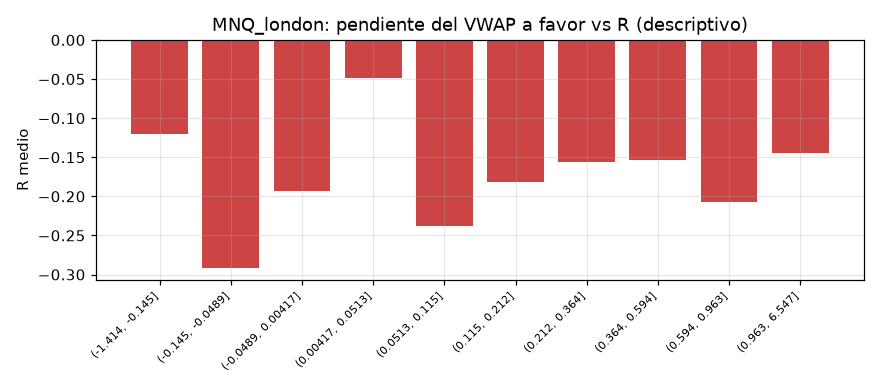

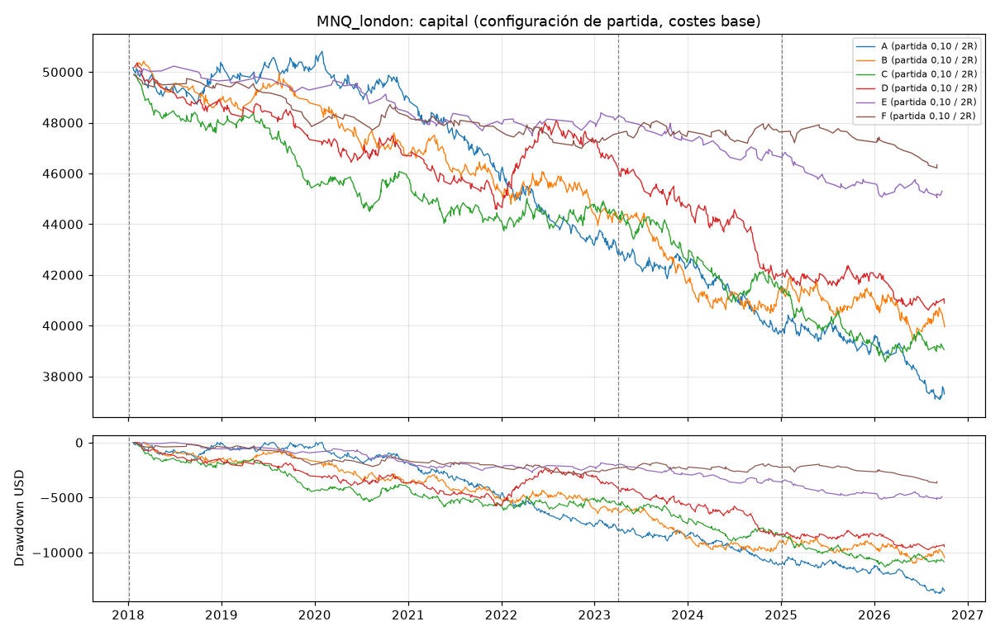
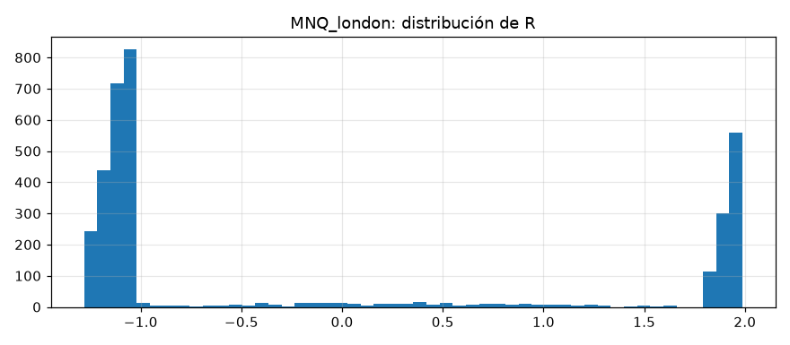

## MNQ_newyork

Periodos: desarrollo 2018-01-02 → 2023-03-31, validacion 2023-04-03 → 2024-12-30, oos 2024-12-31 → 2026-10-02

Configuraciones probadas en desarrollo + validación: 90; con esperanza > 0 en desarrollo: 0; en validación: 13; en ambas: 0.

### B. Ranking (mejor configuración de cada estrategia según validación; solo descriptivo)

| estrategia | umbral | objetivo_R | desarrollo_n | desarrollo_esperanza_R | validacion_n | validacion_esperanza_R | validacion_pf | validacion_dd_usd |
|---|---|---|---|---|---|---|---|---|
| F | 0.2 | 2.000 | 94 | -0.252 | 29 | 0.174 | 1.337 | 218.960 |
| A | 0.05 | 2.000 | 638 | -0.058 | 207 | 0.057 | 1.087 | 1,701.660 |
| C | 0.2 | 1.500 | 279 | -0.179 | 107 | 0.046 | 1.073 | 1,023.680 |
| E | 0.2 | 1.500 | 79 | -0.137 | 25 | -0.025 | 1.019 | 417.880 |
| D | 0.05 | 1.500 | 768 | -0.232 | 275 | -0.038 | 0.938 | 2,271.460 |
| B | 0.2 | 2.000 | 508 | -0.096 | 185 | -0.087 | 0.842 | 2,657.460 |

### Configuración de partida (umbral 0,10, objetivo 2R): esperanza en R por periodo y escenario de costes

| estrategia | escenario_costes | desarrollo | validacion | oos |
|---|---|---|---|---|
| A | base | -0.037 | 0.051 | -0.130 |
| A | severe | -0.069 | 0.075 | -0.105 |
| A | stress | -0.066 | 0.081 | -0.115 |
| B | base | -0.073 | -0.119 | -0.137 |
| B | severe | -0.107 | -0.176 | -0.140 |
| B | stress | -0.071 | -0.167 | -0.149 |
| C | base | -0.160 | -0.012 | -0.112 |
| C | severe | -0.181 | -0.116 | -0.139 |
| C | stress | -0.182 | -0.065 | -0.090 |
| D | base | -0.208 | -0.100 | -0.248 |
| D | severe | -0.192 | -0.160 | -0.316 |
| D | stress | -0.180 | -0.105 | -0.281 |
| E | base | -0.166 | -0.072 | -0.321 |
| E | severe | -0.256 | 0.247 | -0.409 |
| E | stress | -0.251 | -0.022 | -0.325 |
| F | base | -0.160 | 0.160 | -0.200 |
| F | severe | -0.161 | -0.044 | -0.278 |
| F | stress | -0.172 | 0.070 | -0.199 |

### Métricas completas de la configuración de partida (costes base)

| estrategia | periodo | n | acierto | esperanza_R | esperanza_usd | pf | neto | costes | costes_pct_bruto_positivo | dd_usd | dd_pct | racha_perdedora | ops_por_sesion | exposicion | ambiguas | ic90_R_bajo | ic90_R_alto |
|---|---|---|---|---|---|---|---|---|---|---|---|---|---|---|---|---|---|
| A | desarrollo | 450 | 0.342 | -0.037 | -4.705 | 0.933 | -2,117.240 | 4,000.740 | 0.131 | 5,358.940 | 0.101 | 14 | 0.352 | 0.031 | 10 | -0.143 | 0.073 |
| A | validacion | 147 | 0.367 | 0.051 | 4.224 | 1.068 | 621.000 | 881.000 | 0.088 | 2,116.500 | 0.042 | 9 | 0.345 | 0.024 | 3 | -0.139 | 0.263 |
| A | oos | 114 | 0.307 | -0.130 | -12.754 | 0.809 | -1,453.940 | 596.940 | 0.095 | 2,174.080 | 0.044 | 10 | 0.267 | 0.013 | 3 | -0.349 | 0.069 |
| B | desarrollo | 702 | 0.338 | -0.073 | -7.328 | 0.894 | -5,144.100 | 7,108.600 | 0.157 | 5,766.700 | 0.114 | 17 | 0.548 | 0.028 | 23 | -0.157 | 0.017 |
| B | validacion | 257 | 0.315 | -0.119 | -11.793 | 0.808 | -3,030.880 | 1,849.380 | 0.139 | 4,719.760 | 0.103 | 17 | 0.603 | 0.031 | 8 | -0.275 | 0.019 |
| B | oos | 216 | 0.306 | -0.137 | -14.830 | 0.739 | -3,203.280 | 1,263.780 | 0.135 | 3,286.480 | 0.079 | 17 | 0.506 | 0.015 | 12 | -0.302 | 0.042 |
| C | desarrollo | 487 | 0.314 | -0.160 | -15.041 | 0.774 | -7,324.860 | 4,181.860 | 0.160 | 8,010.380 | 0.160 | 11 | 0.380 | 0.027 | 16 | -0.260 | -0.054 |
| C | validacion | 181 | 0.343 | -0.012 | -2.573 | 0.954 | -465.740 | 1,036.240 | 0.104 | 2,773.620 | 0.063 | 12 | 0.425 | 0.026 | 3 | -0.218 | 0.159 |
| C | oos | 155 | 0.316 | -0.112 | -11.447 | 0.804 | -1,774.240 | 788.240 | 0.106 | 2,253.380 | 0.053 | 12 | 0.363 | 0.018 | 9 | -0.276 | 0.073 |
| D | desarrollo | 609 | 0.292 | -0.208 | -17.537 | 0.733 | -10,679.960 | 5,538.960 | 0.181 | 11,947.060 | 0.236 | 10 | 0.476 | 0.027 | 21 | -0.295 | -0.121 |
| D | validacion | 223 | 0.323 | -0.100 | -7.258 | 0.863 | -1,618.460 | 1,421.460 | 0.135 | 2,647.400 | 0.067 | 17 | 0.523 | 0.035 | 6 | -0.251 | 0.050 |
| D | oos | 157 | 0.268 | -0.248 | -17.757 | 0.665 | -2,787.860 | 818.360 | 0.143 | 3,044.540 | 0.080 | 15 | 0.368 | 0.012 | 9 | -0.422 | -0.079 |
| E | desarrollo | 154 | 0.312 | -0.166 | -17.641 | 0.766 | -2,716.740 | 1,831.240 | 0.195 | 3,075.320 | 0.061 | 8 | 0.120 | 0.004 | 6 | -0.351 | 0.017 |
| E | validacion | 43 | 0.349 | -0.072 | -4.643 | 0.931 | -199.640 | 443.140 | 0.158 | 661.280 | 0.014 | 6 | 0.101 | 0.004 | 4 | -0.413 | 0.335 |
| E | oos | 53 | 0.245 | -0.321 | -31.628 | 0.563 | -1,676.280 | 366.280 | 0.164 | 2,367.440 | 0.050 | 13 | 0.124 | 0.002 | 7 | -0.649 | 0.015 |
| F | desarrollo | 225 | 0.324 | -0.160 | -14.858 | 0.783 | -3,342.960 | 1,951.960 | 0.155 | 3,726.920 | 0.074 | 10 | 0.176 | 0.014 | 6 | -0.310 | -0.009 |
| F | validacion | 77 | 0.403 | 0.160 | 18.561 | 1.344 | 1,429.160 | 490.840 | 0.085 | 659.900 | 0.014 | 6 | 0.181 | 0.015 | 0 | -0.134 | 0.413 |
| F | oos | 79 | 0.291 | -0.200 | -16.463 | 0.751 | -1,300.600 | 453.600 | 0.113 | 1,300.600 | 0.027 | 9 | 0.185 | 0.010 | 3 | -0.429 | 0.058 |

### D. Filtro de VWAP plano (objetivo 2R)

| estrategia | umbral | senales_originales | senales_filtradas | operaciones | ganadoras_eliminadas | perdedoras_eliminadas | esperanza_R_dev_val | pf_dev_val | dd_usd_dev_val | costes_dev_val | esperanza_R_validacion | esperanza_R_oos |
|---|---|---|---|---|---|---|---|---|---|---|---|---|
| A | sin filtro | 4861 | 0 | 2629 | 0 | 0 | -0.099 | 0.860 | 22,040.740 | 17,233.000 | -0.063 | -0.174 |
| A | 0.05 | 4861 | 3574 | 1006 | 576 | 1245 | -0.030 | 0.948 | 7,885.860 | 6,854.780 | 0.057 | -0.104 |
| A | 0.1 | 4861 | 3995 | 711 | 647 | 1390 | -0.015 | 0.963 | 5,358.940 | 4,881.740 | 0.051 | -0.130 |
| A | 0.15 | 4861 | 4127 | 613 | 669 | 1443 | -0.006 | 0.981 | 4,917.060 | 4,205.680 | 0.045 | -0.288 |
| A | 0.2 | 4861 | 4195 | 558 | 686 | 1466 | -0.018 | 0.966 | 5,148.080 | 3,812.060 | 0.041 | -0.378 |
| B | sin filtro | 3179 | 0 | 2070 | 0 | 0 | -0.138 | 0.808 | 19,586.820 | 14,353.520 | -0.134 | -0.194 |
| B | 0.05 | 3179 | 1158 | 1558 | 184 | 441 | -0.122 | 0.828 | 14,543.380 | 11,610.680 | -0.198 | -0.194 |
| B | 0.1 | 3179 | 1711 | 1175 | 287 | 699 | -0.085 | 0.873 | 9,305.640 | 8,957.980 | -0.119 | -0.137 |
| B | 0.15 | 3179 | 1991 | 976 | 354 | 812 | -0.095 | 0.863 | 9,170.760 | 7,287.980 | -0.098 | -0.160 |
| B | 0.2 | 3179 | 2152 | 850 | 391 | 893 | -0.093 | 0.859 | 7,632.060 | 6,335.060 | -0.087 | -0.120 |
| C | sin filtro | 5520 | 0 | 2779 | 0 | 0 | -0.096 | 0.856 | 20,171.140 | 16,665.480 | -0.025 | -0.078 |
| C | 0.05 | 5520 | 3757 | 1246 | 586 | 1192 | -0.106 | 0.843 | 11,338.540 | 8,644.880 | -0.052 | -0.073 |
| C | 0.1 | 5520 | 4394 | 823 | 691 | 1397 | -0.120 | 0.817 | 8,666.800 | 5,218.100 | -0.012 | -0.112 |
| C | 0.15 | 5520 | 4719 | 605 | 744 | 1514 | -0.161 | 0.771 | 8,099.260 | 4,025.080 | -0.087 | -0.038 |
| C | 0.2 | 5520 | 4918 | 467 | 776 | 1596 | -0.090 | 0.870 | 4,246.620 | 3,171.580 | 0.041 | -0.047 |
| D | sin filtro | 3143 | 0 | 1936 | 0 | 0 | -0.146 | 0.794 | 19,842.100 | 12,952.520 | -0.055 | -0.090 |
| D | 0.05 | 3143 | 1432 | 1241 | 276 | 504 | -0.186 | 0.745 | 17,231.860 | 8,588.460 | -0.053 | -0.257 |
| D | 0.1 | 3143 | 1860 | 989 | 343 | 669 | -0.179 | 0.763 | 13,503.880 | 6,960.420 | -0.100 | -0.248 |
| D | 0.15 | 3143 | 2107 | 829 | 391 | 777 | -0.189 | 0.751 | 12,531.340 | 5,783.860 | -0.105 | -0.248 |
| D | 0.2 | 3143 | 2269 | 718 | 423 | 858 | -0.153 | 0.787 | 10,097.480 | 4,993.280 | -0.116 | -0.244 |
| E | sin filtro | 1693 | 0 | 1141 | 0 | 0 | -0.182 | 0.762 | 14,650.800 | 9,485.220 | -0.254 | -0.137 |
| E | 0.05 | 1693 | 1126 | 408 | 232 | 524 | -0.174 | 0.762 | 6,044.040 | 3,831.180 | -0.211 | -0.164 |
| E | 0.1 | 1693 | 1354 | 250 | 277 | 629 | -0.145 | 0.799 | 3,326.980 | 2,274.380 | -0.072 | -0.321 |
| E | 0.15 | 1693 | 1457 | 184 | 294 | 675 | -0.096 | 0.869 | 1,724.420 | 1,691.860 | -0.103 | -0.358 |
| E | 0.2 | 1693 | 1528 | 138 | 310 | 703 | -0.129 | 0.833 | 1,753.540 | 1,191.020 | -0.067 | -0.343 |
| F | sin filtro | 2560 | 0 | 1747 | 0 | 0 | -0.044 | 0.944 | 10,123.280 | 12,576.140 | 0.034 | 0.023 |
| F | 0.05 | 2560 | 1527 | 680 | 390 | 721 | -0.039 | 0.951 | 4,691.180 | 5,038.020 | 0.066 | -0.087 |
| F | 0.1 | 2560 | 1970 | 381 | 495 | 889 | -0.079 | 0.902 | 3,726.920 | 2,442.800 | 0.160 | -0.200 |
| F | 0.15 | 2560 | 2205 | 228 | 549 | 977 | -0.199 | 0.727 | 4,112.720 | 1,524.280 | 0.026 | -0.202 |
| F | 0.2 | 2560 | 2322 | 151 | 569 | 1031 | -0.152 | 0.804 | 2,359.500 | 905.960 | 0.174 | -0.171 |

### Walk-forward anual (configuración elegida solo con años anteriores)

| estrategia | años | operaciones | neto_usd | años_positivos |
|---|---|---|---|---|
| A | 7 | 284 | -4,527.800 | 1 |
| B | 7 | 0 | 0.000 | 0 |
| C | 7 | 0 | 0.000 | 0 |
| D | 7 | 0 | 0.000 | 0 |
| E | 7 | 78 | -1,776.740 | 0 |
| F | 7 | 0 | 0.000 | 0 |

| estrategia | año | config | n | esperanza_R | neto_usd |
|---|---|---|---|---|---|
| A | 2020 | umbral=0.15 objetivo=2.0R | 77 | -0.202 | -1,784.500 |
| A | 2021 | umbral=0.15 objetivo=2.0R | 75 | 0.010 | 93.320 |
| A | 2022 | umbral=0.15 objetivo=2.0R | 65 | -0.298 | -1,953.940 |
| A | 2023 | sin candidato | 0 | — | 0.000 |
| A | 2024 | umbral=0.15 objetivo=2.0R | 67 | -0.149 | -882.680 |
| A | 2025 | sin candidato | 0 | — | 0.000 |
| A | 2026 | sin candidato | 0 | — | 0.000 |
| B | 2020 | sin candidato | 0 | — | 0.000 |
| B | 2021 | sin candidato | 0 | — | 0.000 |
| B | 2022 | sin candidato | 0 | — | 0.000 |
| B | 2023 | sin candidato | 0 | — | 0.000 |
| B | 2024 | sin candidato | 0 | — | 0.000 |
| B | 2025 | sin candidato | 0 | — | 0.000 |
| B | 2026 | sin candidato | 0 | — | 0.000 |
| C | 2020 | sin candidato | 0 | — | 0.000 |
| C | 2021 | sin candidato | 0 | — | 0.000 |
| C | 2022 | sin candidato | 0 | — | 0.000 |
| C | 2023 | sin candidato | 0 | — | 0.000 |
| C | 2024 | sin candidato | 0 | — | 0.000 |
| C | 2025 | sin candidato | 0 | — | 0.000 |
| C | 2026 | sin candidato | 0 | — | 0.000 |
| D | 2020 | sin candidato | 0 | — | 0.000 |
| D | 2021 | sin candidato | 0 | — | 0.000 |
| D | 2022 | sin candidato | 0 | — | 0.000 |
| D | 2023 | sin candidato | 0 | — | 0.000 |
| D | 2024 | sin candidato | 0 | — | 0.000 |
| D | 2025 | sin candidato | 0 | — | 0.000 |
| D | 2026 | sin candidato | 0 | — | 0.000 |
| E | 2020 | umbral=0.15 objetivo=2.0R | 26 | -0.299 | -837.280 |
| E | 2021 | umbral=0.2 objetivo=1.0R | 16 | 0.038 | -31.300 |
| E | 2022 | umbral=0.2 objetivo=1.0R | 14 | -0.196 | -236.760 |
| E | 2023 | umbral=0.15 objetivo=1.5R | 22 | -0.285 | -671.400 |
| E | 2024 | sin candidato | 0 | — | 0.000 |
| E | 2025 | sin candidato | 0 | — | 0.000 |
| E | 2026 | sin candidato | 0 | — | 0.000 |
| F | 2020 | sin candidato | 0 | — | 0.000 |
| F | 2021 | sin candidato | 0 | — | 0.000 |
| F | 2022 | sin candidato | 0 | — | 0.000 |
| F | 2023 | sin candidato | 0 | — | 0.000 |
| F | 2024 | sin candidato | 0 | — | 0.000 |
| F | 2025 | sin candidato | 0 | — | 0.000 |
| F | 2026 | sin candidato | 0 | — | 0.000 |

### Pendiente del VWAP a favor de la operación frente al resultado (descriptivo, sin filtro, dev + val)

| tramo | count | mean |
|---|---|---|
| (-1.5819999999999999, -0.0828] | 883 | -0.124 |
| (-0.0828, -0.0226] | 883 | -0.083 |
| (-0.0226, 0.00827] | 881 | -0.177 |
| (0.00827, 0.0316] | 883 | -0.139 |
| (0.0316, 0.058] | 882 | -0.098 |
| (0.058, 0.0916] | 882 | -0.175 |
| (0.0916, 0.154] | 883 | -0.075 |
| (0.154, 0.299] | 882 | -0.177 |
| (0.299, 0.616] | 882 | -0.073 |
| (0.616, 3.746] | 883 | -0.104 |

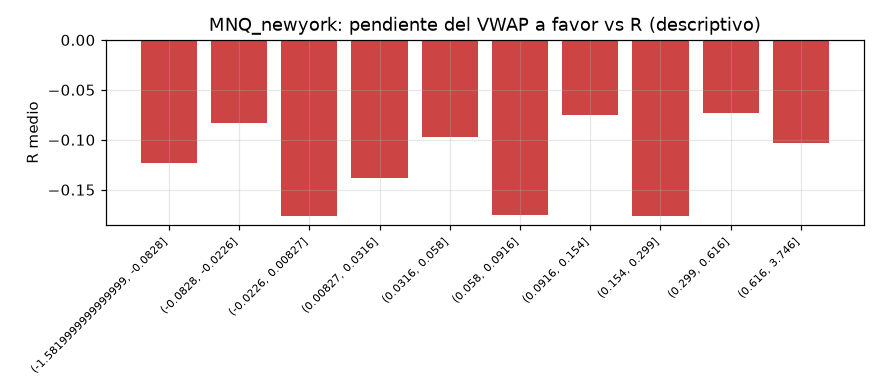

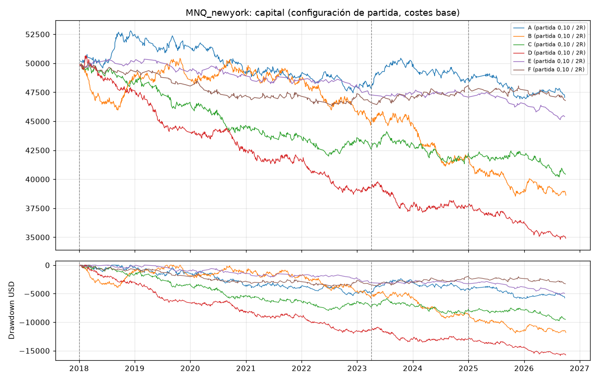
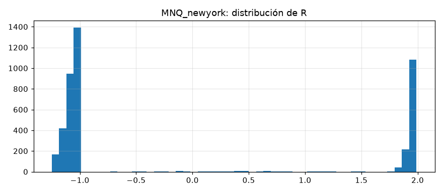

## MGC_london

Periodos: desarrollo 2018-01-02 → 2023-04-12, validacion 2023-04-13 → 2025-01-07, oos 2025-01-08 → 2026-10-02

Configuraciones probadas en desarrollo + validación: 90; con esperanza > 0 en desarrollo: 0; en validación: 0; en ambas: 0.

### B. Ranking (mejor configuración de cada estrategia según validación; solo descriptivo)

| estrategia | umbral | objetivo_R | desarrollo_n | desarrollo_esperanza_R | validacion_n | validacion_esperanza_R | validacion_pf | validacion_dd_usd |
|---|---|---|---|---|---|---|---|---|
| A | 0.05 | 2.000 | 379 | -0.122 | 178 | -0.049 | 0.930 | 1,935.280 |
| F | 0.2 | 2.000 | 62 | -0.099 | 22 | -0.055 | 0.920 | 642.960 |
| B | sin filtro | 2.000 | 350 | -0.178 | 179 | -0.126 | 0.824 | 2,515.160 |
| C | 0.2 | 1.000 | 215 | -0.190 | 83 | -0.191 | 0.685 | 1,889.840 |
| D | sin filtro | 2.000 | 318 | -0.153 | 127 | -0.231 | 0.679 | 2,802.280 |
| E | sin filtro | 1.000 | 187 | -0.230 | 99 | -0.348 | 0.495 | 3,267.440 |

### Configuración de partida (umbral 0,10, objetivo 2R): esperanza en R por periodo y escenario de costes

| estrategia | escenario_costes | desarrollo | validacion | oos |
|---|---|---|---|---|
| A | base | -0.072 | -0.101 | -0.039 |
| A | severe | -0.110 | 0.063 | -0.195 |
| A | stress | -0.155 | 0.122 | -0.155 |
| B | base | -0.241 | -0.225 | -0.069 |
| B | severe | -0.305 | -0.376 | -0.131 |
| B | stress | -0.244 | -0.225 | -0.056 |
| C | base | -0.174 | -0.352 | -0.038 |
| C | severe | -0.453 | -0.106 | -0.191 |
| C | stress | -0.281 | -0.297 | -0.151 |
| D | base | -0.080 | -0.322 | -0.236 |
| D | severe | -0.364 | -0.597 | -0.163 |
| D | stress | -0.142 | -0.615 | -0.234 |
| E | base | -0.181 | -0.506 | -0.381 |
| E | severe | 0.063 | -1.204 | -0.491 |
| E | stress | -0.376 | -0.730 | -0.496 |
| F | base | -0.184 | -0.344 | 0.185 |
| F | severe | -0.455 | -0.181 | 0.169 |
| F | stress | -0.258 | -0.376 | 0.058 |

### Métricas completas de la configuración de partida (costes base)

| estrategia | periodo | n | acierto | esperanza_R | esperanza_usd | pf | neto | costes | costes_pct_bruto_positivo | dd_usd | dd_pct | racha_perdedora | ops_por_sesion | exposicion | ambiguas | ic90_R_bajo | ic90_R_alto |
|---|---|---|---|---|---|---|---|---|---|---|---|---|---|---|---|---|---|
| A | desarrollo | 302 | 0.384 | -0.072 | -6.896 | 0.898 | -2,082.720 | 5,757.720 | 0.285 | 5,421.760 | 0.103 | 10 | 0.229 | 0.039 | 0 | -0.208 | 0.054 |
| A | validacion | 146 | 0.363 | -0.101 | -8.758 | 0.871 | -1,278.640 | 2,623.640 | 0.281 | 2,064.520 | 0.043 | 13 | 0.333 | 0.055 | 0 | -0.288 | 0.083 |
| A | oos | 196 | 0.352 | -0.039 | -4.083 | 0.935 | -800.360 | 1,945.360 | 0.161 | 1,561.440 | 0.033 | 7 | 0.446 | 0.046 | 2 | -0.221 | 0.137 |
| B | desarrollo | 237 | 0.329 | -0.241 | -22.569 | 0.676 | -5,348.920 | 4,664.920 | 0.375 | 5,576.320 | 0.111 | 10 | 0.180 | 0.023 | 2 | -0.370 | -0.122 |
| B | validacion | 124 | 0.331 | -0.225 | -19.842 | 0.691 | -2,460.360 | 2,203.360 | 0.360 | 2,619.680 | 0.058 | 12 | 0.282 | 0.032 | 0 | -0.407 | -0.031 |
| B | oos | 170 | 0.353 | -0.069 | -4.743 | 0.916 | -806.280 | 1,812.280 | 0.195 | 3,142.480 | 0.072 | 13 | 0.387 | 0.026 | 2 | -0.252 | 0.122 |
| C | desarrollo | 313 | 0.339 | -0.174 | -17.003 | 0.751 | -5,321.920 | 5,998.920 | 0.336 | 7,230.560 | 0.139 | 10 | 0.237 | 0.043 | 0 | -0.290 | -0.051 |
| C | validacion | 117 | 0.282 | -0.352 | -29.921 | 0.554 | -3,500.720 | 1,841.720 | 0.389 | 3,533.800 | 0.079 | 13 | 0.267 | 0.047 | 0 | -0.521 | -0.148 |
| C | oos | 204 | 0.358 | -0.038 | -3.669 | 0.931 | -748.480 | 1,899.480 | 0.179 | 2,338.360 | 0.056 | 11 | 0.465 | 0.053 | 1 | -0.218 | 0.114 |
| D | desarrollo | 208 | 0.365 | -0.080 | -8.031 | 0.877 | -1,670.480 | 4,199.480 | 0.316 | 2,538.360 | 0.050 | 14 | 0.158 | 0.027 | 1 | -0.226 | 0.072 |
| D | validacion | 87 | 0.310 | -0.322 | -28.857 | 0.581 | -2,510.600 | 1,654.600 | 0.415 | 2,600.960 | 0.054 | 7 | 0.198 | 0.031 | 0 | -0.520 | -0.103 |
| D | oos | 133 | 0.301 | -0.236 | -19.608 | 0.694 | -2,607.800 | 1,560.800 | 0.248 | 3,252.560 | 0.070 | 9 | 0.303 | 0.027 | 3 | -0.413 | -0.052 |
| E | desarrollo | 68 | 0.309 | -0.181 | -17.689 | 0.761 | -1,202.840 | 1,449.840 | 0.345 | 2,933.840 | 0.057 | 11 | 0.052 | 0.006 | 0 | -0.447 | 0.113 |
| E | validacion | 33 | 0.212 | -0.506 | -47.589 | 0.449 | -1,570.440 | 693.440 | 0.494 | 1,994.200 | 0.041 | 12 | 0.075 | 0.008 | 0 | -0.849 | -0.140 |
| E | oos | 65 | 0.246 | -0.381 | -33.932 | 0.559 | -2,205.600 | 1,010.600 | 0.337 | 2,852.080 | 0.060 | 11 | 0.148 | 0.007 | 2 | -0.678 | -0.116 |
| F | desarrollo | 93 | 0.333 | -0.184 | -18.847 | 0.736 | -1,752.760 | 1,788.760 | 0.332 | 2,185.480 | 0.043 | 9 | 0.071 | 0.012 | 0 | -0.418 | 0.067 |
| F | validacion | 32 | 0.281 | -0.344 | -33.487 | 0.551 | -1,071.600 | 502.600 | 0.352 | 1,287.280 | 0.027 | 7 | 0.073 | 0.014 | 0 | -0.705 | 0.048 |
| F | oos | 58 | 0.448 | 0.185 | 18.953 | 1.352 | 1,099.280 | 579.720 | 0.131 | 579.000 | 0.012 | 6 | 0.132 | 0.015 | 0 | -0.173 | 0.462 |

### D. Filtro de VWAP plano (objetivo 2R)

| estrategia | umbral | senales_originales | senales_filtradas | operaciones | ganadoras_eliminadas | perdedoras_eliminadas | esperanza_R_dev_val | pf_dev_val | dd_usd_dev_val | costes_dev_val | esperanza_R_validacion | esperanza_R_oos |
|---|---|---|---|---|---|---|---|---|---|---|---|---|
| A | sin filtro | 3476 | 0 | 1653 | 0 | 0 | -0.153 | 0.783 | 15,779.400 | 19,696.040 | -0.147 | -0.158 |
| A | 0.05 | 3476 | 1987 | 813 | 290 | 612 | -0.098 | 0.854 | 7,927.040 | 10,185.600 | -0.049 | -0.130 |
| A | 0.1 | 3476 | 2342 | 644 | 340 | 719 | -0.082 | 0.889 | 6,613.560 | 8,381.360 | -0.101 | -0.039 |
| A | 0.15 | 3476 | 2497 | 558 | 372 | 764 | -0.088 | 0.885 | 6,114.760 | 7,313.120 | -0.126 | -0.035 |
| A | 0.2 | 3476 | 2593 | 497 | 396 | 793 | -0.113 | 0.847 | 6,060.440 | 6,367.160 | -0.093 | -0.090 |
| B | sin filtro | 2073 | 0 | 787 | 0 | 0 | -0.160 | 0.767 | 8,354.760 | 10,088.000 | -0.126 | -0.097 |
| B | 0.05 | 2073 | 512 | 611 | 79 | 118 | -0.204 | 0.717 | 7,695.200 | 7,720.120 | -0.202 | -0.130 |
| B | 0.1 | 2073 | 741 | 531 | 108 | 169 | -0.235 | 0.681 | 7,863.360 | 6,868.280 | -0.225 | -0.069 |
| B | 0.15 | 2073 | 901 | 471 | 135 | 201 | -0.261 | 0.659 | 7,673.200 | 6,086.120 | -0.199 | -0.067 |
| B | 0.2 | 2073 | 1034 | 422 | 152 | 229 | -0.291 | 0.627 | 7,788.720 | 5,489.640 | -0.242 | -0.036 |
| C | sin filtro | 3251 | 0 | 1507 | 0 | 0 | -0.222 | 0.697 | 19,739.480 | 17,413.040 | -0.291 | -0.082 |
| C | 0.05 | 3251 | 1884 | 771 | 257 | 553 | -0.202 | 0.718 | 11,499.280 | 9,475.440 | -0.283 | -0.089 |
| C | 0.1 | 3251 | 2191 | 634 | 295 | 621 | -0.222 | 0.698 | 10,764.360 | 7,840.640 | -0.352 | -0.038 |
| C | 0.15 | 3251 | 2394 | 519 | 334 | 686 | -0.220 | 0.699 | 9,151.880 | 6,395.080 | -0.375 | -0.034 |
| C | 0.2 | 3251 | 2535 | 438 | 355 | 739 | -0.191 | 0.731 | 7,391.120 | 5,416.520 | -0.329 | -0.011 |
| D | sin filtro | 1427 | 0 | 645 | 0 | 0 | -0.175 | 0.746 | 7,907.040 | 8,325.480 | -0.231 | -0.208 |
| D | 0.05 | 1427 | 393 | 449 | 68 | 137 | -0.138 | 0.803 | 4,701.520 | 6,190.160 | -0.246 | -0.254 |
| D | 0.1 | 1427 | 456 | 428 | 74 | 150 | -0.152 | 0.786 | 4,669.760 | 5,854.080 | -0.322 | -0.236 |
| D | 0.15 | 1427 | 534 | 397 | 89 | 163 | -0.171 | 0.766 | 4,903.080 | 5,531.400 | -0.327 | -0.322 |
| D | 0.2 | 1427 | 613 | 369 | 97 | 182 | -0.165 | 0.774 | 4,437.400 | 5,254.560 | -0.351 | -0.330 |
| E | sin filtro | 1352 | 0 | 437 | 0 | 0 | -0.231 | 0.688 | 7,068.720 | 5,891.080 | -0.384 | -0.397 |
| E | 0.05 | 1352 | 795 | 209 | 68 | 162 | -0.237 | 0.700 | 4,691.040 | 2,681.200 | -0.513 | -0.338 |
| E | 0.1 | 1352 | 944 | 166 | 84 | 189 | -0.287 | 0.648 | 4,741.200 | 2,143.280 | -0.506 | -0.381 |
| E | 0.15 | 1352 | 1025 | 137 | 90 | 211 | -0.291 | 0.640 | 3,470.520 | 1,751.120 | -0.589 | -0.273 |
| E | 0.2 | 1352 | 1098 | 105 | 102 | 231 | -0.359 | 0.584 | 3,180.600 | 1,342.760 | -0.622 | -0.470 |
| F | sin filtro | 1178 | 0 | 657 | 0 | 0 | -0.189 | 0.722 | 8,394.440 | 8,072.400 | -0.240 | -0.077 |
| F | 0.05 | 1178 | 831 | 225 | 149 | 289 | -0.204 | 0.710 | 3,448.680 | 2,831.800 | -0.451 | -0.030 |
| F | 0.1 | 1178 | 903 | 183 | 161 | 316 | -0.225 | 0.687 | 3,185.680 | 2,291.360 | -0.344 | 0.185 |
| F | 0.15 | 1178 | 952 | 149 | 170 | 339 | -0.161 | 0.770 | 2,370.800 | 1,783.000 | -0.232 | 0.151 |
| F | 0.2 | 1178 | 991 | 122 | 179 | 357 | -0.088 | 0.863 | 1,748.960 | 1,496.160 | -0.055 | 0.137 |

### Walk-forward anual (configuración elegida solo con años anteriores)

| estrategia | años | operaciones | neto_usd | años_positivos |
|---|---|---|---|---|
| A | 7 | 140 | -1,386.960 | 1 |
| B | 7 | 0 | 0.000 | 0 |
| C | 7 | 108 | -3,060.560 | 0 |
| D | 7 | 0 | 0.000 | 0 |
| E | 7 | 44 | -1,686.680 | 0 |
| F | 7 | 26 | -1,194.600 | 0 |

| estrategia | año | config | n | esperanza_R | neto_usd |
|---|---|---|---|---|---|
| A | 2020 | umbral=0.15 objetivo=2.0R | 71 | 0.235 | 1,668.960 |
| A | 2021 | umbral=0.15 objetivo=2.0R | 69 | -0.421 | -3,055.920 |
| A | 2022 | sin candidato | 0 | — | 0.000 |
| A | 2023 | sin candidato | 0 | — | 0.000 |
| A | 2024 | sin candidato | 0 | — | 0.000 |
| A | 2025 | sin candidato | 0 | — | 0.000 |
| A | 2026 | sin candidato | 0 | — | 0.000 |
| B | 2020 | sin candidato | 0 | — | 0.000 |
| B | 2021 | sin candidato | 0 | — | 0.000 |
| B | 2022 | sin candidato | 0 | — | 0.000 |
| B | 2023 | sin candidato | 0 | — | 0.000 |
| B | 2024 | sin candidato | 0 | — | 0.000 |
| B | 2025 | sin candidato | 0 | — | 0.000 |
| B | 2026 | sin candidato | 0 | — | 0.000 |
| C | 2020 | umbral=0.2 objetivo=2.0R | 64 | -0.164 | -1,051.240 |
| C | 2021 | umbral=0.2 objetivo=2.0R | 44 | -0.459 | -2,009.320 |
| C | 2022 | sin candidato | 0 | — | 0.000 |
| C | 2023 | sin candidato | 0 | — | 0.000 |
| C | 2024 | sin candidato | 0 | — | 0.000 |
| C | 2025 | sin candidato | 0 | — | 0.000 |
| C | 2026 | sin candidato | 0 | — | 0.000 |
| D | 2020 | sin candidato | 0 | — | 0.000 |
| D | 2021 | sin candidato | 0 | — | 0.000 |
| D | 2022 | sin candidato | 0 | — | 0.000 |
| D | 2023 | sin candidato | 0 | — | 0.000 |
| D | 2024 | sin candidato | 0 | — | 0.000 |
| D | 2025 | sin candidato | 0 | — | 0.000 |
| D | 2026 | sin candidato | 0 | — | 0.000 |
| E | 2020 | sin candidato | 0 | — | 0.000 |
| E | 2021 | umbral=0.05 objetivo=2.0R | 24 | -0.351 | -830.400 |
| E | 2022 | umbral=0.05 objetivo=2.0R | 20 | -0.440 | -856.280 |
| E | 2023 | sin candidato | 0 | — | 0.000 |
| E | 2024 | sin candidato | 0 | — | 0.000 |
| E | 2025 | sin candidato | 0 | — | 0.000 |
| E | 2026 | sin candidato | 0 | — | 0.000 |
| F | 2020 | sin candidato | 0 | — | 0.000 |
| F | 2021 | umbral=0.2 objetivo=2.0R | 11 | -0.735 | -827.360 |
| F | 2022 | sin candidato | 0 | — | 0.000 |
| F | 2023 | sin candidato | 0 | — | 0.000 |
| F | 2024 | sin candidato | 0 | — | 0.000 |
| F | 2025 | sin candidato | 0 | — | 0.000 |
| F | 2026 | umbral=0.2 objetivo=2.0R | 15 | -0.269 | -367.240 |

### Pendiente del VWAP a favor de la operación frente al resultado (descriptivo, sin filtro, dev + val)

| tramo | count | mean |
|---|---|---|
| (-1.9349999999999998, -0.155] | 339 | -0.130 |
| (-0.155, -0.0416] | 336 | -0.315 |
| (-0.0416, 0.0081] | 337 | -0.174 |
| (0.0081, 0.0546] | 337 | -0.221 |
| (0.0546, 0.112] | 338 | -0.106 |
| (0.112, 0.197] | 339 | -0.190 |
| (0.197, 0.336] | 335 | -0.293 |
| (0.336, 0.567] | 337 | -0.111 |
| (0.567, 0.969] | 338 | -0.171 |
| (0.969, 3.696] | 337 | -0.192 |

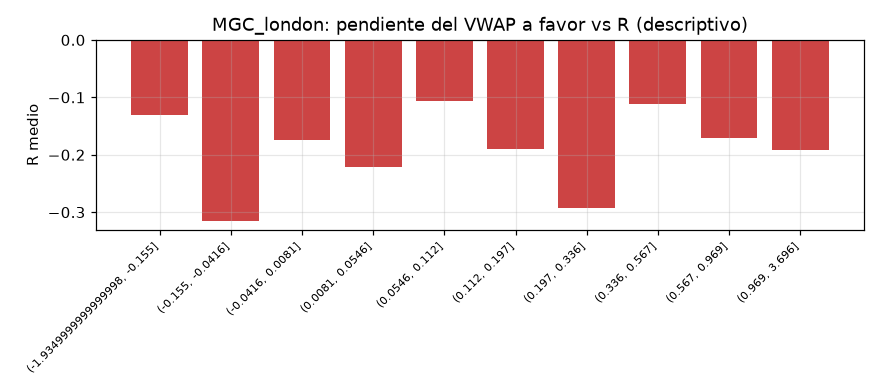

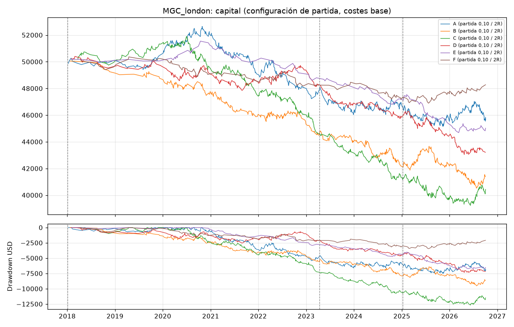
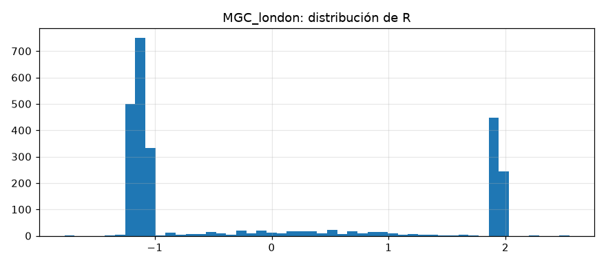

## MGC_newyork

Periodos: desarrollo 2018-01-02 → 2023-04-04, validacion 2023-04-05 → 2024-12-31, oos 2025-01-02 → 2026-10-02

Configuraciones probadas en desarrollo + validación: 90; con esperanza > 0 en desarrollo: 2; en validación: 1; en ambas: 0.

### B. Ranking (mejor configuración de cada estrategia según validación; solo descriptivo)

| estrategia | umbral | objetivo_R | desarrollo_n | desarrollo_esperanza_R | validacion_n | validacion_esperanza_R | validacion_pf | validacion_dd_usd |
|---|---|---|---|---|---|---|---|---|
| D | 0.2 | 2.000 | 283 | -0.158 | 106 | 0.087 | 1.108 | 908.920 |
| A | 0.2 | 1.500 | 382 | -0.106 | 145 | -0.014 | 0.982 | 1,444.560 |
| B | 0.2 | 1.500 | 307 | -0.184 | 128 | -0.089 | 0.848 | 1,904.480 |
| C | 0.1 | 1.500 | 409 | -0.144 | 159 | -0.142 | 0.811 | 1,782.000 |
| F | sin filtro | 1.000 | 632 | -0.138 | 250 | -0.237 | 0.620 | 4,787.280 |
| E | 0.05 | 1.000 | 136 | -0.133 | 63 | -0.241 | 0.608 | 1,681.760 |

### Configuración de partida (umbral 0,10, objetivo 2R): esperanza en R por periodo y escenario de costes

| estrategia | escenario_costes | desarrollo | validacion | oos |
|---|---|---|---|---|
| A | base | -0.108 | -0.044 | -0.144 |
| A | severe | -0.197 | -0.218 | -0.128 |
| A | stress | -0.138 | -0.149 | -0.133 |
| B | base | -0.239 | -0.198 | -0.145 |
| B | severe | -0.310 | -0.234 | -0.134 |
| B | stress | -0.229 | -0.237 | -0.084 |
| C | base | -0.157 | -0.197 | -0.064 |
| C | severe | -0.217 | -0.245 | -0.134 |
| C | stress | -0.145 | -0.243 | -0.071 |
| D | base | -0.213 | -0.004 | -0.202 |
| D | severe | -0.335 | 0.020 | -0.199 |
| D | stress | -0.288 | 0.135 | -0.213 |
| E | base | 0.116 | -0.303 | -0.047 |
| E | severe | 0.161 | -0.415 | -0.134 |
| E | stress | 0.194 | -0.158 | -0.070 |
| F | base | -0.071 | -0.314 | 0.120 |
| F | severe | -0.113 | -0.316 | -0.002 |
| F | stress | -0.022 | -0.127 | 0.087 |

### Métricas completas de la configuración de partida (costes base)

| estrategia | periodo | n | acierto | esperanza_R | esperanza_usd | pf | neto | costes | costes_pct_bruto_positivo | dd_usd | dd_pct | racha_perdedora | ops_por_sesion | exposicion | ambiguas | ic90_R_bajo | ic90_R_alto |
|---|---|---|---|---|---|---|---|---|---|---|---|---|---|---|---|---|---|
| A | desarrollo | 446 | 0.343 | -0.108 | -10.899 | 0.843 | -4,860.920 | 6,740.920 | 0.243 | 5,392.560 | 0.107 | 16 | 0.349 | 0.033 | 2 | -0.212 | 0.007 |
| A | validacion | 168 | 0.351 | -0.044 | -2.646 | 0.957 | -444.520 | 2,017.520 | 0.194 | 1,781.640 | 0.039 | 11 | 0.394 | 0.041 | 1 | -0.250 | 0.126 |
| A | oos | 165 | 0.309 | -0.144 | -11.012 | 0.817 | -1,817.000 | 1,191.000 | 0.142 | 2,087.440 | 0.047 | 15 | 0.387 | 0.023 | 3 | -0.336 | 0.035 |
| B | desarrollo | 412 | 0.306 | -0.239 | -21.847 | 0.686 | -9,000.760 | 6,656.760 | 0.313 | 9,010.600 | 0.180 | 13 | 0.322 | 0.026 | 5 | -0.340 | -0.122 |
| B | validacion | 182 | 0.308 | -0.198 | -15.278 | 0.747 | -2,780.640 | 2,386.640 | 0.272 | 3,030.640 | 0.073 | 10 | 0.427 | 0.025 | 0 | -0.365 | -0.008 |
| B | oos | 190 | 0.316 | -0.145 | -11.344 | 0.782 | -2,155.440 | 1,507.440 | 0.187 | 3,107.360 | 0.081 | 10 | 0.446 | 0.022 | 11 | -0.339 | 0.028 |
| C | desarrollo | 408 | 0.336 | -0.157 | -15.514 | 0.775 | -6,329.720 | 5,846.720 | 0.251 | 6,872.680 | 0.136 | 10 | 0.319 | 0.041 | 1 | -0.263 | -0.046 |
| C | validacion | 159 | 0.321 | -0.197 | -15.995 | 0.739 | -2,543.240 | 2,005.240 | 0.261 | 2,543.240 | 0.058 | 8 | 0.373 | 0.044 | 1 | -0.353 | -0.023 |
| C | oos | 153 | 0.340 | -0.064 | -3.492 | 0.933 | -534.200 | 1,110.200 | 0.144 | 1,675.360 | 0.040 | 11 | 0.359 | 0.027 | 3 | -0.253 | 0.136 |
| D | desarrollo | 377 | 0.321 | -0.213 | -20.759 | 0.690 | -7,826.160 | 5,696.160 | 0.302 | 8,545.960 | 0.169 | 16 | 0.295 | 0.035 | 0 | -0.319 | -0.098 |
| D | validacion | 151 | 0.377 | -0.004 | -1.731 | 0.969 | -261.440 | 1,995.440 | 0.227 | 1,033.480 | 0.024 | 6 | 0.354 | 0.037 | 1 | -0.174 | 0.182 |
| D | oos | 193 | 0.295 | -0.202 | -15.878 | 0.728 | -3,064.520 | 1,710.520 | 0.201 | 3,409.520 | 0.081 | 13 | 0.453 | 0.018 | 5 | -0.346 | -0.040 |
| E | desarrollo | 100 | 0.430 | 0.116 | 12.616 | 1.195 | 1,261.560 | 1,796.440 | 0.215 | 1,316.840 | 0.026 | 8 | 0.078 | 0.007 | 0 | -0.124 | 0.357 |
| E | validacion | 47 | 0.277 | -0.303 | -28.974 | 0.639 | -1,361.760 | 815.760 | 0.314 | 1,562.040 | 0.030 | 8 | 0.110 | 0.009 | 0 | -0.579 | 0.033 |
| E | oos | 50 | 0.340 | -0.047 | -3.382 | 0.951 | -169.120 | 546.120 | 0.160 | 1,245.800 | 0.025 | 8 | 0.117 | 0.005 | 1 | -0.352 | 0.287 |
| F | desarrollo | 136 | 0.368 | -0.071 | -7.506 | 0.890 | -1,020.840 | 2,023.840 | 0.229 | 1,456.560 | 0.029 | 8 | 0.106 | 0.013 | 1 | -0.262 | 0.131 |
| F | validacion | 51 | 0.314 | -0.314 | -32.509 | 0.551 | -1,657.960 | 705.960 | 0.323 | 1,688.720 | 0.034 | 6 | 0.120 | 0.015 | 0 | -0.578 | -0.054 |
| F | oos | 46 | 0.413 | 0.120 | 11.132 | 1.197 | 512.080 | 374.920 | 0.116 | 695.920 | 0.015 | 5 | 0.108 | 0.007 | 0 | -0.248 | 0.509 |

### D. Filtro de VWAP plano (objetivo 2R)

| estrategia | umbral | senales_originales | senales_filtradas | operaciones | ganadoras_eliminadas | perdedoras_eliminadas | esperanza_R_dev_val | pf_dev_val | dd_usd_dev_val | costes_dev_val | esperanza_R_validacion | esperanza_R_oos |
|---|---|---|---|---|---|---|---|---|---|---|---|---|
| A | sin filtro | 4467 | 0 | 2214 | 0 | 0 | -0.135 | 0.803 | 19,908.880 | 22,311.600 | -0.068 | -0.216 |
| A | 0.05 | 4467 | 3137 | 960 | 438 | 904 | -0.131 | 0.820 | 9,673.920 | 10,894.040 | -0.121 | -0.205 |
| A | 0.1 | 4467 | 3439 | 779 | 486 | 1024 | -0.091 | 0.871 | 6,220.040 | 8,758.440 | -0.044 | -0.144 |
| A | 0.15 | 4467 | 3531 | 709 | 508 | 1065 | -0.105 | 0.855 | 6,441.000 | 8,119.640 | -0.073 | -0.124 |
| A | 0.2 | 4467 | 3597 | 666 | 520 | 1095 | -0.078 | 0.890 | 5,434.760 | 7,859.960 | -0.027 | -0.119 |
| B | sin filtro | 2903 | 0 | 1400 | 0 | 0 | -0.230 | 0.695 | 19,419.920 | 15,230.920 | -0.213 | -0.125 |
| B | 0.05 | 2903 | 1190 | 982 | 152 | 323 | -0.220 | 0.712 | 13,794.000 | 11,245.000 | -0.193 | -0.228 |
| B | 0.1 | 2903 | 1607 | 784 | 207 | 456 | -0.226 | 0.703 | 11,781.400 | 9,043.400 | -0.198 | -0.145 |
| B | 0.15 | 2903 | 1839 | 648 | 245 | 544 | -0.238 | 0.700 | 10,324.240 | 7,686.240 | -0.132 | -0.079 |
| B | 0.2 | 2903 | 1994 | 559 | 263 | 608 | -0.197 | 0.751 | 7,831.480 | 6,821.360 | -0.096 | 0.009 |
| C | sin filtro | 4977 | 0 | 2251 | 0 | 0 | -0.153 | 0.778 | 22,143.360 | 22,300.960 | -0.177 | -0.097 |
| C | 0.05 | 4977 | 3360 | 980 | 482 | 906 | -0.217 | 0.711 | 14,357.080 | 10,640.080 | -0.305 | -0.110 |
| C | 0.1 | 4977 | 3914 | 720 | 544 | 1066 | -0.168 | 0.766 | 9,415.920 | 7,851.960 | -0.197 | -0.064 |
| C | 0.15 | 4977 | 4171 | 581 | 582 | 1144 | -0.167 | 0.782 | 7,529.200 | 6,407.240 | -0.233 | -0.013 |
| C | 0.2 | 4977 | 4314 | 490 | 609 | 1199 | -0.182 | 0.759 | 7,213.200 | 5,481.680 | -0.255 | -0.031 |
| D | sin filtro | 2535 | 0 | 1249 | 0 | 0 | -0.160 | 0.769 | 13,702.800 | 12,737.520 | -0.053 | -0.174 |
| D | 0.05 | 2535 | 1070 | 826 | 156 | 298 | -0.167 | 0.751 | 10,261.400 | 8,663.080 | -0.000 | -0.174 |
| D | 0.1 | 2535 | 1333 | 721 | 183 | 369 | -0.153 | 0.760 | 8,854.240 | 7,691.600 | -0.004 | -0.202 |
| D | 0.15 | 2535 | 1528 | 619 | 218 | 437 | -0.145 | 0.780 | 7,639.080 | 6,622.880 | -0.011 | -0.261 |
| D | 0.2 | 2535 | 1688 | 527 | 244 | 500 | -0.091 | 0.846 | 5,900.360 | 5,625.880 | 0.087 | -0.335 |
| E | sin filtro | 2048 | 0 | 762 | 0 | 0 | -0.126 | 0.821 | 7,358.400 | 9,780.640 | -0.273 | -0.155 |
| E | 0.05 | 2048 | 1429 | 280 | 160 | 326 | -0.082 | 0.888 | 2,355.440 | 3,658.480 | -0.273 | -0.193 |
| E | 0.1 | 2048 | 1660 | 197 | 183 | 384 | -0.018 | 0.990 | 2,262.120 | 2,612.200 | -0.303 | -0.047 |
| E | 0.15 | 2048 | 1775 | 150 | 205 | 410 | -0.167 | 0.769 | 2,924.920 | 1,967.560 | -0.501 | -0.023 |
| E | 0.2 | 2048 | 1830 | 121 | 216 | 427 | -0.237 | 0.678 | 2,858.960 | 1,574.720 | -0.524 | 0.025 |
| F | sin filtro | 2228 | 0 | 1146 | 0 | 0 | -0.158 | 0.784 | 12,893.960 | 13,515.320 | -0.288 | -0.080 |
| F | 0.05 | 2228 | 1533 | 368 | 277 | 522 | -0.246 | 0.658 | 6,780.600 | 4,455.960 | -0.380 | -0.050 |
| F | 0.1 | 2228 | 1852 | 233 | 310 | 620 | -0.137 | 0.794 | 3,145.280 | 2,729.800 | -0.314 | 0.120 |
| F | 0.15 | 2228 | 1998 | 158 | 340 | 659 | -0.207 | 0.715 | 3,331.320 | 1,859.480 | -0.641 | -0.086 |
| F | 0.2 | 2228 | 2047 | 131 | 349 | 673 | -0.269 | 0.642 | 3,560.240 | 1,599.400 | -0.640 | -0.148 |

### Walk-forward anual (configuración elegida solo con años anteriores)

| estrategia | años | operaciones | neto_usd | años_positivos |
|---|---|---|---|---|
| A | 7 | 0 | 0.000 | 0 |
| B | 7 | 66 | -1,921.840 | 0 |
| C | 7 | 0 | 0.000 | 0 |
| D | 7 | 0 | 0.000 | 0 |
| E | 7 | 46 | -1,473.200 | 0 |
| F | 7 | 61 | -1,244.240 | 1 |

| estrategia | año | config | n | esperanza_R | neto_usd |
|---|---|---|---|---|---|
| A | 2020 | sin candidato | 0 | — | 0.000 |
| A | 2021 | sin candidato | 0 | — | 0.000 |
| A | 2022 | sin candidato | 0 | — | 0.000 |
| A | 2023 | sin candidato | 0 | — | 0.000 |
| A | 2024 | sin candidato | 0 | — | 0.000 |
| A | 2025 | sin candidato | 0 | — | 0.000 |
| A | 2026 | sin candidato | 0 | — | 0.000 |
| B | 2020 | umbral=0.2 objetivo=1.5R | 66 | -0.301 | -1,921.840 |
| B | 2021 | sin candidato | 0 | — | 0.000 |
| B | 2022 | sin candidato | 0 | — | 0.000 |
| B | 2023 | sin candidato | 0 | — | 0.000 |
| B | 2024 | sin candidato | 0 | — | 0.000 |
| B | 2025 | sin candidato | 0 | — | 0.000 |
| B | 2026 | sin candidato | 0 | — | 0.000 |
| C | 2020 | sin candidato | 0 | — | 0.000 |
| C | 2021 | sin candidato | 0 | — | 0.000 |
| C | 2022 | sin candidato | 0 | — | 0.000 |
| C | 2023 | sin candidato | 0 | — | 0.000 |
| C | 2024 | sin candidato | 0 | — | 0.000 |
| C | 2025 | sin candidato | 0 | — | 0.000 |
| C | 2026 | sin candidato | 0 | — | 0.000 |
| D | 2020 | sin candidato | 0 | — | 0.000 |
| D | 2021 | sin candidato | 0 | — | 0.000 |
| D | 2022 | sin candidato | 0 | — | 0.000 |
| D | 2023 | sin candidato | 0 | — | 0.000 |
| D | 2024 | sin candidato | 0 | — | 0.000 |
| D | 2025 | sin candidato | 0 | — | 0.000 |
| D | 2026 | sin candidato | 0 | — | 0.000 |
| E | 2020 | sin candidato | 0 | — | 0.000 |
| E | 2021 | sin candidato | 0 | — | 0.000 |
| E | 2022 | umbral=0.1 objetivo=2.0R | 23 | -0.172 | -354.280 |
| E | 2023 | umbral=0.1 objetivo=2.0R | 23 | -0.471 | -1,118.920 |
| E | 2024 | sin candidato | 0 | — | 0.000 |
| E | 2025 | sin candidato | 0 | — | 0.000 |
| E | 2026 | sin candidato | 0 | — | 0.000 |
| F | 2020 | umbral=0.2 objetivo=2.0R | 15 | 0.079 | 89.080 |
| F | 2021 | umbral=0.1 objetivo=2.0R | 29 | -0.113 | -342.160 |
| F | 2022 | umbral=0.2 objetivo=2.0R | 17 | -0.572 | -991.160 |
| F | 2023 | sin candidato | 0 | — | 0.000 |
| F | 2024 | sin candidato | 0 | — | 0.000 |
| F | 2025 | sin candidato | 0 | — | 0.000 |
| F | 2026 | sin candidato | 0 | — | 0.000 |

### Pendiente del VWAP a favor de la operación frente al resultado (descriptivo, sin filtro, dev + val)

| tramo | count | mean |
|---|---|---|
| (-1.757, -0.0837] | 610 | -0.051 |
| (-0.0837, -0.017] | 608 | -0.186 |
| (-0.017, 0.00944] | 610 | -0.217 |
| (0.00944, 0.0315] | 608 | -0.181 |
| (0.0315, 0.0621] | 609 | -0.210 |
| (0.0621, 0.121] | 609 | -0.212 |
| (0.121, 0.23] | 609 | -0.186 |
| (0.23, 0.436] | 609 | -0.136 |
| (0.436, 0.852] | 609 | -0.176 |
| (0.852, 4.789] | 609 | -0.108 |

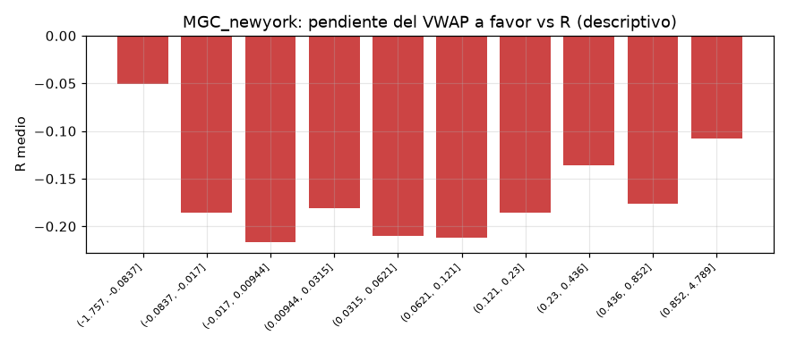

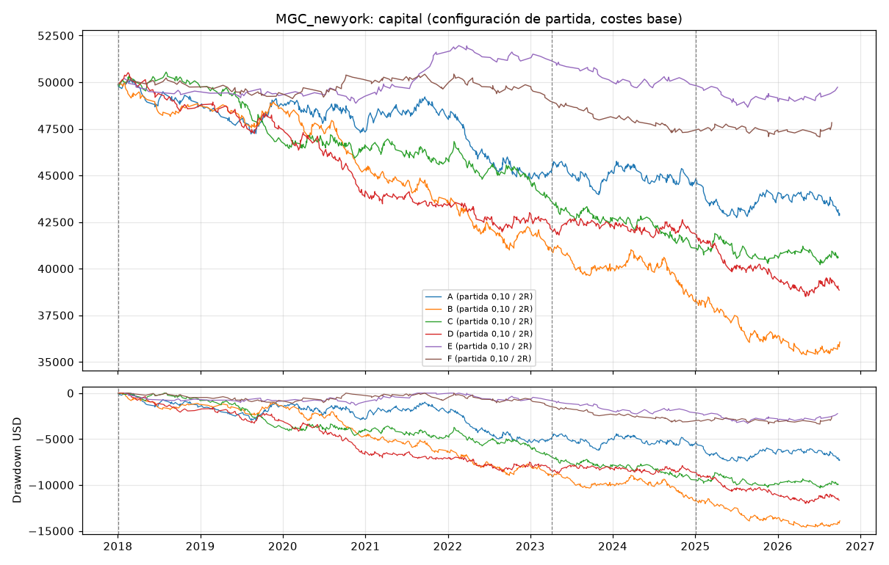
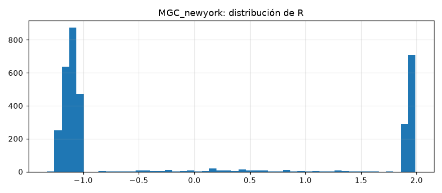
