# Informe: VWAP direccional en MNQ, velas de 15 minutos

*Generado automáticamente el 2026-09-29 20:46 UTC por `python -m src.run_backtest report`. Todas las cifras salen de ejecuciones reales de este código sobre los datos descritos. Ninguna cifra histórica garantiza resultados futuros.*

## 1. La estrategia y sus reglas exactas
- **Idea:** operar en el sentido del precio respecto al VWAP de la sesión regular (09:30–16:00 NY, reiniciado cada día; precio típico (H+L+C)/3 ponderado por volumen, calculado con velas de 1 min y leído al cierre de cada vela de 15 min).
- **Señal (modo A, baseline):** al cierre de una vela de 15 min, si el cierre cruza por encima del VWAP (el último cierre no igual al VWAP estaba por debajo) → compra; cruce a la baja → venta. Cierre igual al VWAP: sin señal. La primera vela de la sesión no genera señal. **Modo B:** la vela siguiente al cruce confirma el lado.
- **Ejecución:** a mercado en la apertura de la vela de 15 min siguiente. Una sola posición. Última entrada 15:15 NY; cierre forzado 15:45 NY; nada abierto de noche.
- **Salida del baseline:** señal contraria (cierra y gira), stop 2.0 × ATR(14) de 15 min de la vela de señal desde el precio de entrada, cierre de sesión. Sin objetivo.
- **Riesgo:** 0.5 % del capital actual por operación (capital inicial 50,000 $), contratos = floor(riesgo / (distancia al stop × 2 $)); si sale < 1, no se opera. Límite de pérdida diaria 2.0 %, máximo 6 operaciones por sesión, pausa tras 3 pérdidas seguidas.

## 2. Datos
- Fuente: velas de 1 min de NQ (Databento GLBX.MDP3, contrato continuo por volumen), 2015-01-01 23:00:00+00:00 → 2026-09-29 07:09:00+00:00. NQ y MNQ cotizan el mismo índice al mismo precio; el P&L usa las especificaciones de MNQ (2 $/punto, tick 0,25).
- Calidad: 4,088,229 filas, 0 duplicadas, 0 inválidas, 0 con volumen 0. 2924 sesiones válidas de 3027 (103 excluidas por cierre anticipado o huecos). 48 contratos; 0 cambios de contrato dentro de una vela de 15 min.
- Particiones: train 2015-01-01 → 2020-12-31; validación 2021-01-01 → 2023-03-21; test final 2023-03-22 → fin de datos (usado una vez, ver `REGISTRO_TEST.md`).

## 3. Supuestos de ejecución y costes
- Comisión 0.85 $ por contrato y lado. Deslizamiento 1 tick en entradas y salidas a mercado y stops (adverso: 2). Target límite sin deslizamiento y solo si el precio lo supera en 1 tick.
- Stops y targets se comprueban minuto a minuto; si stop y target caen en el mismo minuto, se asume el stop. Si el minuto abre más allá del stop (hueco), se ejecuta en esa apertura.
- Resultado **bruto** = sin comisiones ni deslizamiento; **neto** = con todo. R = resultado neto / riesgo inicial en $.

## 4. Resultados del baseline y de la candidata
Candidata elegida con el protocolo: **F horario 09:30-11:30, F horario 09:30-13:00, S0 baseline: contraria+giro, stop 2 ATR**. 

|                        |   baseline train |   baseline validación |   baseline TEST |   candidata train |   candidata validación |   candidata TEST |
|:-----------------------|-----------------:|----------------------:|----------------:|------------------:|-----------------------:|-----------------:|
| operaciones            |        2952      |              894      |       1355      |         2470      |               659      |         962      |
| expectativa_R          |          -0.0441 |                0      |          0.0079 |           -0.0359 |                 0.0057 |           0.0084 |
| expectativa_R_bruta    |           0.0153 |                0.0185 |          0.0248 |            0.0211 |                 0.0242 |           0.025  |
| t_R                    |          -3.21   |                0      |          0.33   |           -2.28   |                 0.18   |           0.3    |
| profit_factor          |           0.809  |                0.972  |          1      |            0.846  |                 0.986  |           1.011  |
| win_rate_%             |          25.2    |               28      |         27.5    |           24.6    |                26.7    |          26.8    |
| neto_usd               |      -22425      |            -1169      |         33      |       -17135      |              -434      |         517      |
| bruto_usd              |        4529      |             1801      |       4420      |         7133      |              1769      |        3514      |
| max_dd_usd             |      -23476      |            -5001      |      -6177      |       -19505      |             -4763      |       -4737      |
| max_dd_%               |         -46.25   |               -9.99   |        -11.14   |          -38.29   |                -9.53   |          -8.82   |
| sharpe                 |          -1.34   |               -0.15   |          0.04   |           -0.96   |                -0.05   |           0.08   |
| costes_usd             |       26954      |             2970      |       4388      |        24268      |              2203      |        2997      |
| recovery_factor        |          -0.96   |               -0.23   |          0.01   |           -0.88   |                -0.09   |           0.11   |
| sortino                |          -2.02   |               -0.24   |          0.06   |           -1.53   |                -0.08   |           0.15   |
| ganancia_media_usd     |         127.8    |              160.7    |        182.8    |          154.6    |               177      |         189      |
| perdida_media_usd      |         -53.2    |              -64.2    |        -69.4    |          -59.7    |               -65.4    |         -68.5    |
| expectativa_usd        |          -7.6    |               -1.31   |          0.02   |           -6.94   |                -0.66   |           0.54   |
| duracion_media_min     |          91      |               86.7    |         88.7    |          100.5    |                97.8    |         102.4    |
| duracion_mediana_min   |          45      |               45      |         45      |           45      |                45      |          45      |
| mae_medio_pts          |          10.4    |               29.64   |         33.12   |           10.93   |                30.04   |          33.96   |
| mfe_medio_pts          |          17.55   |               51.52   |         54.65   |           19.64   |                54.65   |          58.69   |
| racha_perdedora_max    |          21      |               23      |         16      |           17      |                21      |          17      |
| racha_ganadora_max     |           7      |                4      |          7      |            6      |                 3      |           6      |
| exposicion_%           |          46.1    |               35.8    |         35.2    |           42.6    |                29.8    |          28.9    |
| operaciones_por_sesion |           1.98   |                1.61   |          1.55   |            1.65   |                 1.19   |           1.1    |
| rentabilidad_%         |         -44.85   |               -2.34   |          0.07   |          -34.27   |                -0.87   |           1.03   |
| largos                 |        1493      |              448      |        682      |         1252      |               323      |         485      |
| cortos                 |        1459      |              446      |        673      |         1218      |               336      |         477      |

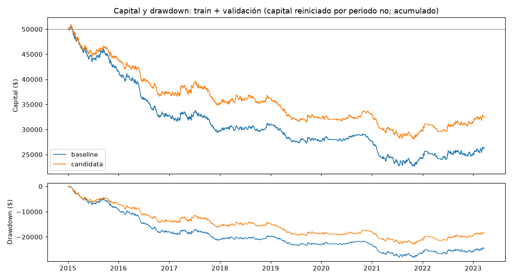

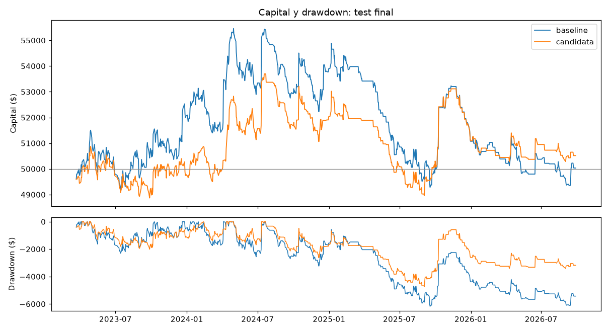

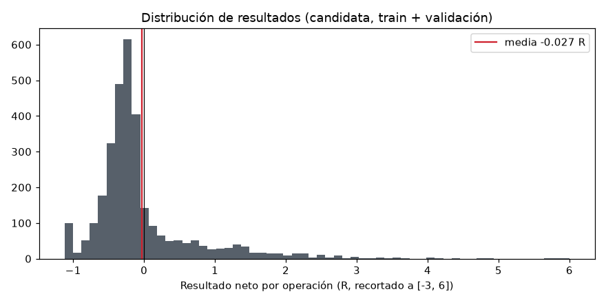

### Referencias
| referencia                                          | periodo    |   operaciones |   expectativa_R |   expectativa_R_bruta |    t_R |   profit_factor |   win_rate_% |   neto_usd |   bruto_usd |   max_dd_usd |   max_dd_% |   sharpe |
|:----------------------------------------------------|:-----------|--------------:|----------------:|----------------------:|-------:|----------------:|-------------:|-----------:|------------:|-------------:|-----------:|---------:|
| dirección aleatoria (mismas horas que la candidata) | train      |          1771 |         -0.1139 |               -0.0517 |  -6.16 |           0.647 |         40.8 |     -29332 |      -13135 |       -30000 |     -60    |    -2.5  |
| comprar 09:30 y vender 15:45 (1 contrato)           | train      |          1494 |        nan      |              nan      | nan    |         nan     |        nan   |       2573 |        6606 |          nan |     nan    |   nan    |
| dirección aleatoria (mismas horas que la candidata) | validación |           496 |         -0.0418 |               -0.0226 |  -1.06 |           0.858 |         45.6 |      -4323 |       -2568 |        -5841 |     -11.68 |    -0.78 |
| comprar 09:30 y vender 15:45 (1 contrato)           | validación |           555 |        nan      |              nan      | nan    |         nan     |        nan   |       2719 |        4218 |          nan |     nan    |   nan    |

Comprar a las 09:30 y vender a las 15:45 en el TEST: 875 sesiones, neto -917 $.

## 5. Comparación de entradas, filtros y salidas (train y validación, nunca test)
### Entradas
| variante                           | periodo    |   operaciones |   expectativa_R |   expectativa_R_bruta |   t_R |   profit_factor |   win_rate_% |   neto_usd |   bruto_usd |   max_dd_usd |   max_dd_% |   sharpe |
|:-----------------------------------|:-----------|--------------:|----------------:|----------------------:|------:|----------------:|-------------:|-----------:|------------:|-------------:|-----------:|---------:|
| A cruce (baseline)                 | train      |          2952 |         -0.0441 |                0.0153 | -3.21 |           0.809 |         25.2 |     -22425 |        4529 |       -23476 |     -46.25 |    -1.34 |
| A cruce (baseline)                 | validación |           894 |          0      |                0.0185 |  0    |           0.972 |         28   |      -1169 |        1801 |        -5001 |      -9.99 |    -0.15 |
| B confirmación                     | train      |          2312 |         -0.0347 |                0.024  | -1.97 |           0.865 |         34   |     -16420 |        6063 |       -21520 |     -41.32 |    -0.87 |
| B confirmación                     | validación |           694 |         -0.0157 |                0.0026 | -0.5  |           0.929 |         36.7 |      -3011 |        -689 |        -5180 |     -10.03 |    -0.46 |
| A cruce con VWAP extendido (18:00) | train      |          2282 |         -0.0845 |               -0.0214 | -5.41 |           0.701 |         22   |     -28241 |       -7006 |       -29422 |     -57.62 |    -2.06 |
| A cruce con VWAP extendido (18:00) | validación |           728 |         -0.0079 |                0.0108 | -0.28 |           0.948 |         26.5 |      -1849 |         651 |        -4627 |      -9.23 |    -0.28 |

### Filtros (uno a uno sobre el baseline)
| variante                         | periodo    |   operaciones |   expectativa_R |   expectativa_R_bruta |   t_R |   profit_factor |   win_rate_% |   neto_usd |   bruto_usd |   max_dd_usd |   max_dd_% |   sharpe |
|:---------------------------------|:-----------|--------------:|----------------:|----------------------:|------:|----------------:|-------------:|-----------:|------------:|-------------:|-----------:|---------:|
| (baseline, sin filtros)          | train      |          2952 |         -0.0441 |                0.0153 | -3.21 |           0.809 |         25.2 |     -22425 |        4529 |       -23476 |     -46.25 |    -1.34 |
| (baseline, sin filtros)          | validación |           894 |          0      |                0.0185 |  0    |           0.972 |         28   |      -1169 |        1801 |        -5001 |      -9.99 |    -0.15 |
| A pendiente VWAP (4 velas)       | train      |          1058 |         -0.056  |                0.0039 | -2.89 |           0.751 |         26.4 |     -12226 |         -14 |       -15554 |     -30.42 |    -1.27 |
| A pendiente VWAP (4 velas)       | validación |           324 |          0.0094 |                0.0284 |  0.28 |           0.995 |         32.1 |        -63 |        1109 |        -1330 |      -2.61 |    -0.01 |
| B EMA 200                        | train      |          1844 |         -0.0349 |                0.0233 | -2.2  |           0.834 |         26.8 |     -14182 |        6152 |       -15297 |     -30.39 |    -1.05 |
| B EMA 200                        | validación |           489 |         -0.0381 |               -0.0186 | -1.29 |           0.866 |         28.6 |      -2994 |       -1287 |        -4342 |      -8.68 |    -0.7  |
| B EMA 50                         | train      |          2014 |         -0.0523 |                0.0073 | -3.39 |           0.796 |         25.8 |     -18940 |        2433 |       -20055 |     -39.66 |    -1.36 |
| B EMA 50                         | validación |           595 |         -0.006  |                0.013  | -0.22 |           0.964 |         30.6 |       -964 |        1098 |        -4577 |      -9.12 |    -0.18 |
| C régimen ATR (p10-p90)          | train      |          2550 |         -0.0469 |                0.0138 | -3.16 |           0.792 |         24.9 |     -21394 |        2631 |       -22266 |     -44.07 |    -1.36 |
| C régimen ATR (p10-p90)          | validación |           807 |         -0.0105 |                0.0077 | -0.42 |           0.94  |         28   |      -2194 |         417 |        -5119 |     -10.23 |    -0.36 |
| D RSI(14) a favor de 50          | train      |          2147 |         -0.0549 |                0.0056 | -3.62 |           0.774 |         26.2 |     -21364 |         382 |       -22699 |     -44.85 |    -1.53 |
| D RSI(14) a favor de 50          | validación |           690 |          0.0264 |                0.0447 |  0.93 |           1.111 |         31.2 |       3634 |        6050 |        -3169 |      -6.28 |     0.62 |
| E rango inicial 15 min estrecho  | train      |          1639 |         -0.0479 |                0.0145 | -2.59 |           0.785 |         25.3 |     -15953 |        1629 |       -16578 |     -33.16 |    -1.13 |
| E rango inicial 15 min estrecho  | validación |           528 |         -0.0233 |               -0.0036 | -0.71 |           0.883 |         26.5 |      -3014 |       -1092 |        -3917 |      -7.81 |    -0.61 |
| E rango inicial 30 min estrecho  | train      |          1708 |         -0.0386 |                0.0236 | -2.01 |           0.825 |         26   |     -14050 |        4632 |       -14824 |     -29.65 |    -0.89 |
| E rango inicial 30 min estrecho  | validación |           544 |         -0.0125 |                0.0074 | -0.37 |           0.935 |         26.7 |      -1755 |         240 |        -3949 |      -7.9  |    -0.31 |
| E rango inicial 60 min estrecho  | train      |          1432 |         -0.0587 |                0.0042 | -3.12 |           0.731 |         24.2 |     -16287 |       -1223 |       -17182 |     -34.22 |    -1.3  |
| E rango inicial 60 min estrecho  | validación |           422 |         -0.0387 |               -0.0194 | -1.32 |           0.855 |         23.5 |      -2609 |       -1127 |        -4115 |      -8.19 |    -0.72 |
| F horario 09:30-11:30            | train      |          1843 |         -0.0348 |                0.0229 | -1.79 |           0.849 |         25.4 |     -14059 |        5228 |       -16841 |     -33.27 |    -0.82 |
| F horario 09:30-11:30            | validación |           487 |          0.0021 |                0.021  |  0.05 |           0.973 |         28.1 |       -702 |         988 |        -4301 |      -8.6  |    -0.11 |
| F horario 09:30-13:00            | train      |          2470 |         -0.0359 |                0.0211 | -2.28 |           0.846 |         24.6 |     -17135 |        7133 |       -19505 |     -38.29 |    -0.96 |
| F horario 09:30-13:00            | validación |           659 |          0.0057 |                0.0242 |  0.18 |           0.986 |         26.7 |       -434 |        1769 |        -4763 |      -9.53 |    -0.05 |
| F horario 13:00-15:45            | train      |          1219 |         -0.0662 |                0.0006 | -3.97 |           0.716 |         28.2 |     -15477 |        -425 |       -16776 |     -32.73 |    -1.65 |
| F horario 13:00-15:45            | validación |           414 |         -0.0082 |                0.0125 | -0.25 |           0.912 |         30.4 |      -1509 |          98 |        -2297 |      -4.56 |    -0.43 |
| G distancia al VWAP 0,25-1,5 ATR | train      |          1981 |         -0.0636 |               -0.0023 | -3.69 |           0.78  |         27.3 |     -21000 |        -467 |       -22728 |     -44.53 |    -1.43 |
| G distancia al VWAP 0,25-1,5 ATR | validación |           673 |          0.0712 |                0.0893 |  2.18 |           1.299 |         34   |      10294 |       12732 |        -1792 |      -3.57 |     1.48 |

Filtros aceptados (mejoran R en train Y validación, ≥150 operaciones en train): **F horario 09:30-11:30, F horario 09:30-13:00**.

### Salidas
| variante                                        | periodo    |   operaciones |   expectativa_R |   expectativa_R_bruta |   t_R |   profit_factor |   win_rate_% |   neto_usd |   bruto_usd |   max_dd_usd |   max_dd_% |   sharpe |
|:------------------------------------------------|:-----------|--------------:|----------------:|----------------------:|------:|----------------:|-------------:|-----------:|------------:|-------------:|-----------:|---------:|
| S0 baseline: contraria+giro, stop 2 ATR         | train      |          2952 |         -0.0441 |                0.0153 | -3.21 |           0.809 |         25.2 |     -22425 |        4529 |       -23476 |     -46.25 |    -1.34 |
| S0 baseline: contraria+giro, stop 2 ATR         | validación |           894 |          0      |                0.0185 |  0    |           0.972 |         28   |      -1169 |        1801 |        -5001 |      -9.99 |    -0.15 |
| S1 solo señal contraria (sin stop)              | train      |          2954 |         -0.0431 |                0.0163 | -3.12 |           0.812 |         25.3 |     -22231 |        4848 |       -23460 |     -46.22 |    -1.32 |
| S1 solo señal contraria (sin stop)              | validación |           907 |         -0.0007 |                0.0176 | -0.03 |           0.965 |         28.1 |      -1500 |        1506 |        -5211 |     -10.41 |    -0.2  |
| S2 stop 1,5 ATR + TP 1R                         | train      |          1905 |         -0.0859 |               -0.012  | -4.08 |           0.814 |         47.7 |     -26105 |       -2783 |       -27476 |     -53.8  |    -1.66 |
| S2 stop 1,5 ATR + TP 1R                         | validación |           680 |         -0.0364 |               -0.0151 | -1.02 |           0.92  |         47.8 |      -4507 |       -1876 |        -7248 |     -14.46 |    -0.65 |
| S3 stop 1,5 ATR + TP 1,5R                       | train      |          1794 |         -0.0755 |               -0.0006 | -3.02 |           0.846 |         42   |     -23473 |        -270 |       -26301 |     -51.24 |    -1.26 |
| S3 stop 1,5 ATR + TP 1,5R                       | validación |           652 |          0.0069 |                0.0284 |  0.16 |           1.024 |         43.6 |       1461 |        4146 |        -3693 |      -7.29 |     0.21 |
| S4 stop 1,5 ATR + TP 2R                         | train      |          1722 |         -0.0859 |               -0.0097 | -3.1  |           0.837 |         38.8 |     -24841 |       -2352 |       -27428 |     -53.58 |    -1.29 |
| S4 stop 1,5 ATR + TP 2R                         | validación |           632 |         -0.0018 |                0.0201 | -0.04 |           1.023 |         40.3 |       1479 |        4175 |        -5178 |      -9.59 |     0.21 |
| S5 stop 1,5 ATR + TP 3R                         | train      |          1664 |         -0.0913 |               -0.013  | -2.97 |           0.833 |         37.4 |     -25076 |       -2927 |       -28114 |     -54.59 |    -1.21 |
| S5 stop 1,5 ATR + TP 3R                         | validación |           622 |          0.0295 |                0.0517 |  0.56 |           1.065 |         40.4 |       4263 |        7025 |        -3898 |      -7.03 |     0.48 |
| S6 stop 1,5 ATR + TP 2R + contraria             | train      |          3012 |         -0.0586 |                0.0181 | -3.78 |           0.807 |         25.4 |     -27608 |        4857 |       -29297 |     -56.96 |    -1.55 |
| S6 stop 1,5 ATR + TP 2R + contraria             | validación |          1137 |          0.0282 |                0.0496 |  1.09 |           1.117 |         28.9 |       8152 |       12959 |        -3821 |      -7.63 |     0.96 |
| S7 trailing 1,5 ATR + contraria                 | train      |          3078 |         -0.0488 |                0.0289 | -2.9  |           0.828 |         27   |     -25135 |        9933 |       -29073 |     -56.15 |    -1.2  |
| S7 trailing 1,5 ATR + contraria                 | validación |          1135 |          0.0227 |                0.0448 |  0.86 |           1.109 |         30.1 |       6919 |       11711 |        -4657 |      -9.3  |     0.81 |
| S8 time stop 8 velas + stop 1,5 ATR + contraria | train      |          3066 |         -0.0598 |                0.0197 | -3.96 |           0.79  |         29.6 |     -28334 |        5038 |       -29927 |     -58.64 |    -1.65 |
| S8 time stop 8 velas + stop 1,5 ATR + contraria | validación |          1146 |          0.011  |                0.033  |  0.45 |           1.061 |         31.8 |       3947 |        8780 |        -4615 |      -9.21 |     0.52 |

Salida elegida: **S0 baseline: contraria+giro, stop 2 ATR**.

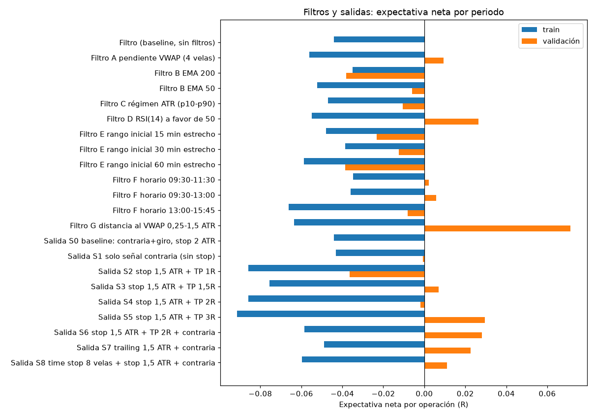

## 6. Optimización, walk-forward y test final
Rejilla de stop × target en train (candidata). Se elige por expectativa suavizada con las vecinas, no por el máximo:
|   sl_atr_mult | tp_r   |   operaciones |   expectativa_R |   t_R |   profit_factor |   neto_usd |   max_dd_usd |
|--------------:|:-------|--------------:|----------------:|------:|----------------:|-----------:|-------------:|
|           1   | 1.0    |          2491 |         -0.111  | -6.6  |           0.717 |     -35777 |       -36004 |
|           1   | 1.5    |          2465 |         -0.1073 | -5.38 |           0.758 |     -35428 |       -35981 |
|           1   | 2.0    |          2512 |         -0.0845 | -3.82 |           0.801 |     -32010 |       -34376 |
|           1   | 3.0    |          2582 |         -0.064  | -2.57 |           0.84  |     -28242 |       -31740 |
|           1   | sin    |          2618 |         -0.0541 | -1.84 |           0.859 |     -25994 |       -29957 |
|           1.5 | 1.0    |          2486 |         -0.0652 | -4.7  |           0.789 |     -26410 |       -27205 |
|           1.5 | 1.5    |          2454 |         -0.0653 | -4.07 |           0.795 |     -26412 |       -28223 |
|           1.5 | 2.0    |          2507 |         -0.0533 | -3.07 |           0.832 |     -23380 |       -25963 |
|           1.5 | 3.0    |          2538 |         -0.0453 | -2.4  |           0.851 |     -21638 |       -25240 |
|           1.5 | sin    |          2528 |         -0.046  | -2.24 |           0.843 |     -21946 |       -24737 |
|           2   | 1.0    |          2419 |         -0.0476 | -4.03 |           0.806 |     -20362 |       -21166 |
|           2   | 1.5    |          2443 |         -0.0423 | -3.19 |           0.831 |     -18533 |       -20037 |
|           2   | 2.0    |          2445 |         -0.0414 | -2.93 |           0.832 |     -18781 |       -20557 |
|           2   | 3.0    |          2475 |         -0.0342 | -2.27 |           0.858 |     -15933 |       -19174 |
|           2   | sin    |          2470 |         -0.0359 | -2.28 |           0.846 |     -17135 |       -19505 |
|           2.5 | 1.0    |          2352 |         -0.04   | -3.89 |           0.807 |     -16920 |       -17685 |
|           2.5 | 1.5    |          2379 |         -0.0347 | -3.05 |           0.835 |     -15091 |       -16236 |
|           2.5 | 2.0    |          2398 |         -0.0297 | -2.47 |           0.857 |     -13258 |       -14845 |
|           2.5 | 3.0    |          2393 |         -0.03   | -2.38 |           0.853 |     -13388 |       -15511 |
|           2.5 | sin    |          2380 |         -0.0329 | -2.56 |           0.837 |     -14622 |       -15866 |

Elección suavizada en train: stop 2.5 ATR, TP sin (R suavizado -0.0333). Solo informativa: la candidata no se cambia con esta rejilla (el walk-forward mide si elegir así funciona fuera de muestra).

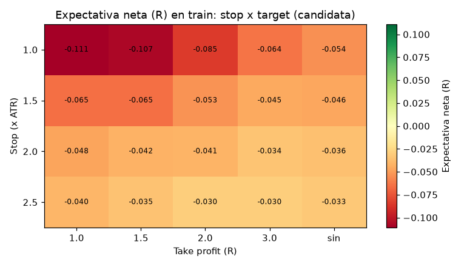

### Walk-forward (optimiza 3 años, prueba el siguiente)
|   test | entrenamiento          |   sl_atr_mult | tp_r   |   R_entrenamiento |   operaciones |   expectativa_R |   t_R |   profit_factor |   neto_usd |
|-------:|:-----------------------|--------------:|:-------|------------------:|--------------:|----------------:|------:|----------------:|-----------:|
|   2018 | 2015-01-01..2017-12-31 |           2.5 | 3.0    |           -0.0455 |           419 |          0.0305 |  0.93 |           1.162 |       2860 |
|   2019 | 2016-01-01..2018-12-31 |           2.5 | sin    |           -0.0242 |           452 |         -0.0489 | -1.94 |           0.735 |      -4796 |
|   2020 | 2017-01-01..2019-12-31 |           2.5 | sin    |           -0.0191 |           328 |          0.0181 |  0.55 |           1.126 |       1440 |
|   2021 | 2018-01-01..2020-12-31 |           2.5 | sin    |           -0.0035 |           319 |         -0.0373 | -1.12 |           0.826 |      -2281 |
|   2022 | 2019-01-01..2021-12-31 |           1   | 2.0    |           -0.0071 |           430 |          0.1034 |  1.88 |           1.272 |      10270 |

Total walk-forward fuera de muestra: 1948 operaciones, expectativa 0.0149 R, t 0.87, neto 7,492 $.

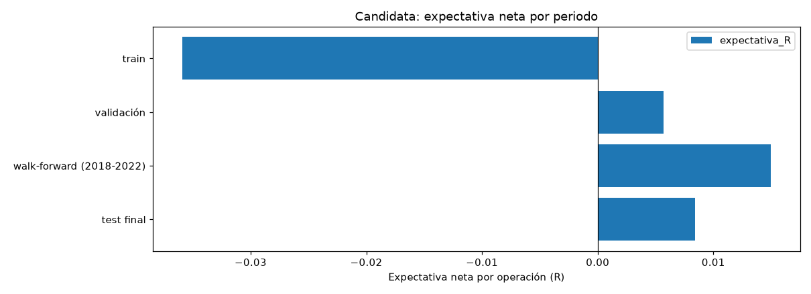

### Test final (una sola ejecución)
- Baseline: validación: R 0.0 (t 0.0, PF 0.972); test: R 0.0079 (t 0.33, PF 1.0).
- Candidata: validación: R 0.0057 (t 0.18, PF 0.986); test: R 0.0084 (t 0.3, PF 1.011).
- Bootstrap de operaciones del test (candidata): {'neto_p5': -7948.9, 'neto_p50': 448.4, 'neto_p95': 8893.4, 'prob_neto_negativo_%': 47.0, 'max_dd_p50': -5332.7, 'max_dd_p5': -10723.2}.

## 7. Sensibilidad y robustez (candidata)
| variante                        | periodo    |   operaciones |   expectativa_R |   expectativa_R_bruta |   t_R |   profit_factor |   win_rate_% |   neto_usd |   bruto_usd |   max_dd_usd |   max_dd_% |   sharpe |
|:--------------------------------|:-----------|--------------:|----------------:|----------------------:|------:|----------------:|-------------:|-----------:|------------:|-------------:|-----------:|---------:|
| ATR 10                          | train      |          2456 |         -0.0327 |                0.0204 | -2.24 |           0.842 |         24.7 |     -16308 |        6418 |       -17508 |     -34.41 |    -1    |
| ATR 10                          | validación |           624 |          0.0098 |                0.0272 |  0.33 |           1.059 |         26.1 |       1631 |        3637 |        -3978 |      -7.96 |     0.32 |
| ATR 20                          | train      |          2488 |         -0.0392 |                0.0225 | -2.31 |           0.854 |         24.7 |     -17703 |        8792 |       -20432 |     -39.86 |    -0.9  |
| ATR 20                          | validación |           779 |          0.0335 |                0.0523 |  1.09 |           1.136 |         28.4 |       5461 |        8223 |        -4202 |      -8.4  |     0.8  |
| cierre forzado 15:30            | train      |          2441 |         -0.0422 |                0.0154 | -2.77 |           0.826 |         24.7 |     -19061 |        5212 |       -20523 |     -40.17 |    -1.17 |
| cierre forzado 15:30            | validación |           649 |          0.0036 |                0.0222 |  0.12 |           0.987 |         26.8 |       -411 |        1762 |        -5134 |     -10.27 |    -0.05 |
| deslizamiento adverso (2 ticks) | train      |          2337 |         -0.064  |                0.0172 | -3.93 |           0.761 |         23.4 |     -24106 |        5065 |       -24973 |     -49.1  |    -1.57 |
| deslizamiento adverso (2 ticks) | validación |           644 |          0.0017 |                0.0272 |  0.05 |           0.974 |         26.6 |       -828 |        2135 |        -5292 |     -10.58 |    -0.11 |

### Escenarios de riesgo por operación (solo investigación, no recomendación)
|   riesgo_% | periodo    |   operaciones |   neto_usd |   max_dd_usd |   max_dd_% |   sharpe |
|-----------:|:-----------|--------------:|-----------:|-------------:|-----------:|---------:|
|       0.25 | train      |          2128 |      -9661 |       -10347 |     -20.51 |    -1.12 |
|       0.25 | validación |           152 |        -69 |        -1413 |      -2.83 |    -0.03 |
|       0.5  | train      |          2470 |     -17135 |       -19505 |     -38.29 |    -0.96 |
|       0.5  | validación |           659 |       -434 |        -4763 |      -9.53 |    -0.05 |
|       1    | train      |          2567 |     -29078 |       -33031 |     -63.43 |    -0.93 |
|       1    | validación |           955 |      10418 |        -8206 |     -16.41 |     0.72 |

Bootstrap (remuestreo de las operaciones de train+validación, 2000 repeticiones, semilla 42): {'neto_p5': -29901.9, 'neto_p50': -17900.8, 'neto_p95': -5174.6, 'prob_neto_negativo_%': 99.0, 'max_dd_p50': -20733.6, 'max_dd_p5': -31737.8}. Limitación: supone operaciones independientes; los periodos malos reales vienen en rachas de régimen y pueden ser peores.

## 8. Dónde gana y dónde pierde (candidata, train + validación)
### Por año
|   entry_time |   operaciones |   neto_usd |   expectativa_R |   win_rate_% |   t_R |
|-------------:|--------------:|-----------:|----------------:|-------------:|------:|
|         2015 |           469 |      -6165 |          -0.059 |         22.4 | -1.91 |
|         2016 |           444 |      -6483 |          -0.078 |         23   | -2.26 |
|         2017 |           452 |      -2171 |          -0.026 |         24.6 | -0.57 |
|         2018 |           402 |       1024 |           0.025 |         27.4 |  0.6  |
|         2019 |           446 |      -3976 |          -0.065 |         25.8 | -2.06 |
|         2020 |           257 |        637 |           0.017 |         25.3 |  0.34 |
|         2021 |           379 |      -3098 |          -0.037 |         25.6 | -1.02 |
|         2022 |           202 |       1704 |           0.058 |         27.7 |  0.85 |
|         2023 |            78 |        961 |           0.08  |         29.5 |  0.83 |

### Por hora NY
|   entry_time |   operaciones |   neto_usd |   expectativa_R |   win_rate_% |   t_R |
|-------------:|--------------:|-----------:|----------------:|-------------:|------:|
|           10 |          1788 |     -13538 |          -0.038 |         26.4 | -1.89 |
|           11 |           877 |      -3223 |          -0.011 |         23.3 | -0.45 |
|           12 |           464 |       -807 |          -0.015 |         23.3 | -0.56 |

### Por dia semana
| entry_time   |   operaciones |   neto_usd |   expectativa_R |   win_rate_% |   t_R |
|:-------------|--------------:|-----------:|----------------:|-------------:|------:|
| jue          |           645 |      -6082 |          -0.051 |         25.3 | -1.87 |
| lun          |           516 |      -2366 |          -0.011 |         25.6 | -0.36 |
| mar          |           682 |      -3140 |          -0.028 |         24.3 | -0.82 |
| mié          |           666 |      -4539 |          -0.031 |         24.8 | -1.04 |
| vie          |           620 |      -1442 |          -0.01  |         25.5 | -0.3  |

### Por mes
|   entry_time |   operaciones |   neto_usd |   expectativa_R |   win_rate_% |   t_R |
|-------------:|--------------:|-----------:|----------------:|-------------:|------:|
|            1 |           271 |       1351 |           0.046 |         28.4 |  0.92 |
|            2 |           275 |      -6554 |          -0.126 |         19.3 | -3.18 |
|            3 |           246 |      -1469 |          -0.022 |         25.2 | -0.37 |
|            4 |           236 |      -1131 |          -0.033 |         24.6 | -0.66 |
|            5 |           247 |      -4742 |          -0.114 |         19.8 | -2.73 |
|            6 |           272 |        414 |           0.021 |         27.9 |  0.36 |
|            7 |           275 |       1043 |           0.038 |         25.8 |  0.75 |
|            8 |           288 |      -1689 |          -0.04  |         25.7 | -0.97 |
|            9 |           253 |      -1066 |          -0.03  |         24.5 | -0.58 |
|           10 |           257 |      -3338 |          -0.064 |         26.5 | -1.44 |
|           11 |           250 |       1164 |           0.027 |         27.2 |  0.52 |
|           12 |           259 |      -1551 |          -0.035 |         25.5 | -0.78 |

### Por direccion
| direction   |   operaciones |   neto_usd |   expectativa_R |   win_rate_% |   t_R |
|:------------|--------------:|-----------:|----------------:|-------------:|------:|
| corto       |          1554 |      -8215 |          -0.028 |         23.2 | -1.31 |
| largo       |          1575 |      -9354 |          -0.026 |         26.9 | -1.43 |

### Por volatilidad
| atr_entry      |   operaciones |   neto_usd |   expectativa_R |   win_rate_% |   t_R |
|:---------------|--------------:|-----------:|----------------:|-------------:|------:|
| ATR bajo       |           784 |     -12713 |          -0.084 |         22.2 | -2.65 |
| ATR medio-bajo |           781 |      -3724 |          -0.023 |         25.2 | -0.86 |
| ATR medio-alto |           782 |      -2944 |          -0.019 |         26   | -0.73 |
| ATR alto       |           782 |       1813 |           0.018 |         26.9 |  0.67 |

### Por motivo salida
| exit_reason     |   operaciones |   neto_usd |   expectativa_R |   win_rate_% |     t_R |
|:----------------|--------------:|-----------:|----------------:|-------------:|--------:|
| fin_de_sesion   |           542 |     113524 |           1.269 |         98.3 |   28.2  |
| senal_contraria |          2489 |    -113740 |          -0.269 |         10.1 |  -48.13 |
| stop            |            98 |     -17352 |          -1.046 |          0   | -351.36 |

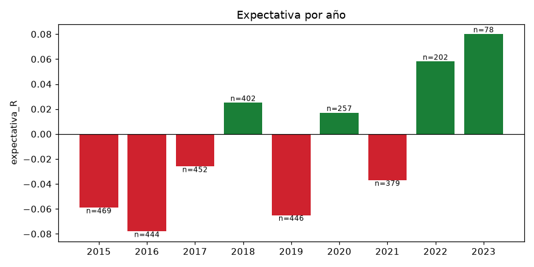

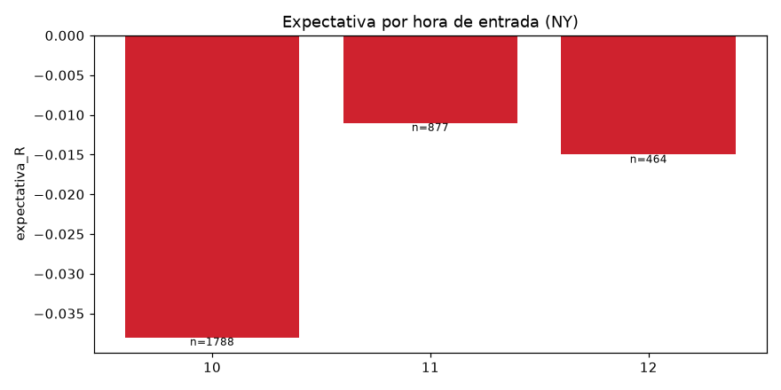

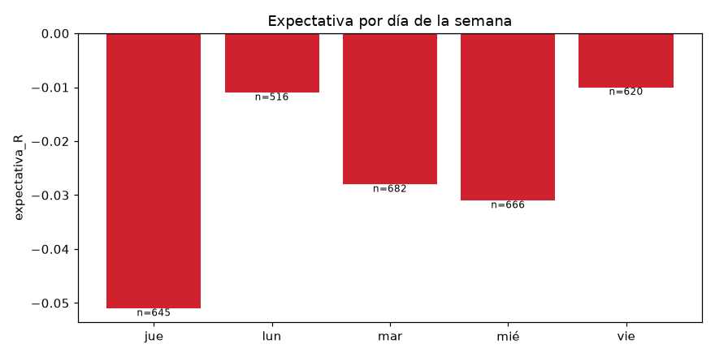

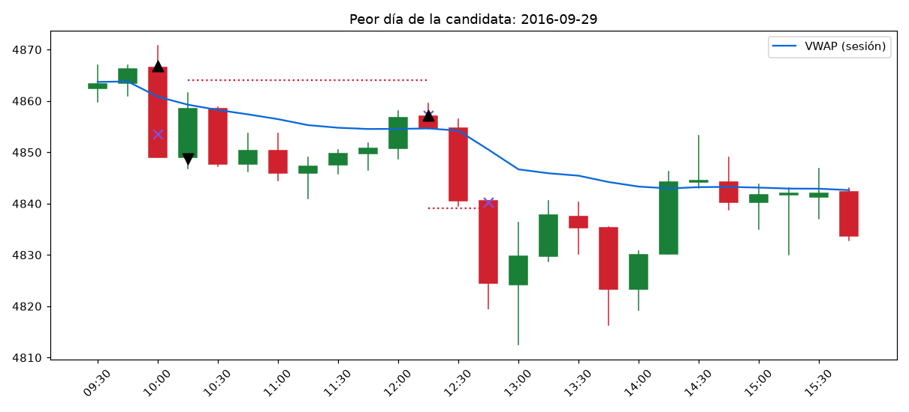

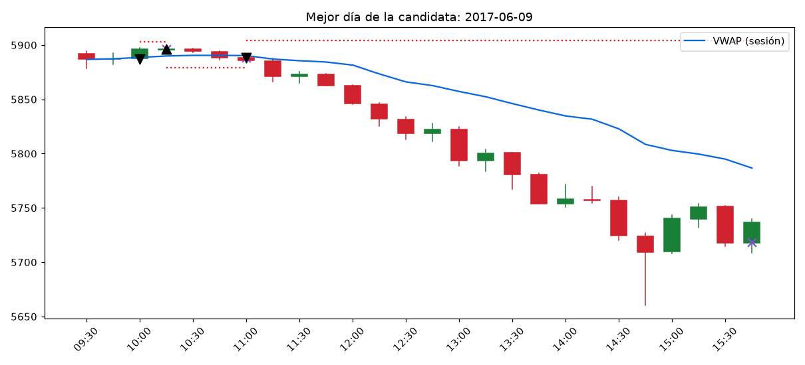

## 9. Diferencias entre el backtest y la ejecución real
- Precio y volumen de NQ como sustituto de MNQ: el MNQ tiene menos liquidez; el deslizamiento real puede ser mayor, sobre todo en noticias (datos macro a las 08:30 y 10:00 NY, FOMC).
- Ejecución parcial: con varios contratos a mercado se suponen llenados completos al precio modelado.
- Stops: se simulan como órdenes stop a mercado; en huecos o movimientos rápidos el llenado real puede ser peor que 1 tick.
- Los datos de 1 min no dicen el orden exacto dentro del minuto: se asume el peor caso cuando stop y target coinciden.
- No se modelan caídas de conexión, rechazos de órdenes, cambios de margen ni horarios festivos del broker.

## 10. Conclusión descriptiva
Variantes evaluadas en total (incluida la rejilla y el walk-forward): **147**. Con tantas pruebas, alguna parecerá buena por azar; por eso la candidata se eligió con reglas fijas y solo cuenta el test final.

- **Hipótesis base (baseline):** NO APOYADA por los datos (validación: R 0.0 (t 0.0, PF 0.972); test: R 0.0079 (t 0.33, PF 1.0)).
- **Candidata:** NO APOYADA por los datos (validación: R 0.0057 (t 0.18, PF 0.986); test: R 0.0084 (t 0.3, PF 1.011)).
- Criterio: expectativa neta en R > 0 con t ≥ 2 y profit factor > 1 en validación y en test.
- Un resultado histórico positivo no convierte la estrategia en rentable ni en lista para operar en real.

## 11. Protocolo de paper trading propuesto
- **Solo si la candidata queda apoyada en validación y test.** Si no, no se recomienda paper trading de esta versión.
- Reglas congeladas: las de la candidata de este informe; cualquier cambio abre una versión nueva con su propio backtest.
- Duración mínima: 3 meses **y** al menos 150 operaciones (lo que llegue más tarde).
- Registrar cada operación: hora de la señal, precio del modelo, precio real, deslizamiento en ticks, resultado.
- Evaluación: deslizamiento medio real ≤ el supuesto; expectativa en R dentro del intervalo p5–p95 del bootstrap de la muestra equivalente; detener si la caída supera el p5 del drawdown del bootstrap.