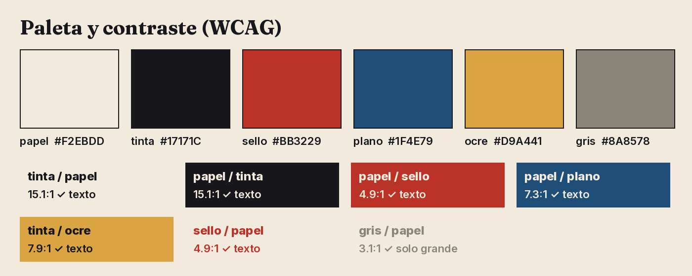
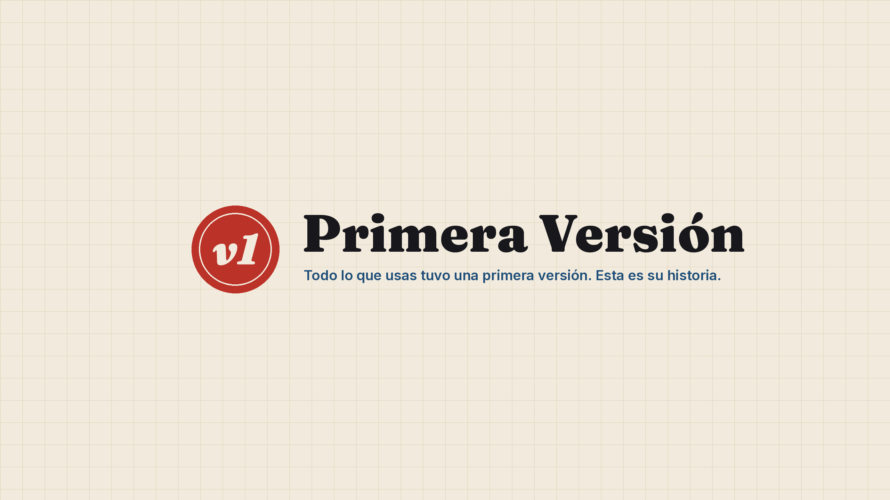
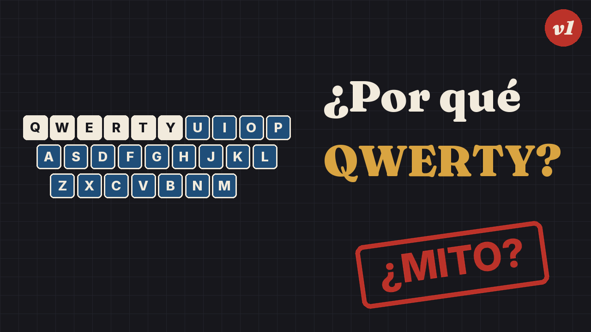

# Fase 2: identidad del canal

*30-sep-2026. Configuración que usa el código: `config/channel.yaml`. Piezas visuales: `python main.py brand-preview`
→ `reports/marca/`.*

## 1. Nombre

La comprobación se hizo con una búsqueda web el 30-sep-2026. **No sustituye a comprobarlo en YouTube** al crear el
canal (tarea manual).

| Opción | Resultado de la búsqueda | Valoración |
|---|---|---|
| **Primera Versión** | No aparece ningún canal con ese nombre | **Recomendado.** Resume el concepto: todo tuvo una versión 1. Es corto y se entiende en cualquier país hispanohablante. |
| Antes de Ser Así | No aparece ningún canal con ese nombre | Buena alternativa, más coloquial; funciona peor como logo. |
| Detrás de las Cosas | No aparece exacto, pero existen "La Historia Detrás" y "Detrás de la Historia" | Riesgo de confusión con esos canales. |
| ~~Patente Pendiente~~ | [Existe un canal con ese nombre](https://www.youtube.com/channel/UCVREEFMKFLh5zTzdRYGHqiA) | Descartado |
| ~~Archivo Curioso~~ | [Existe @ArchivoCuriosoc](https://www.youtube.com/@ArchivoCuriosoc) | Descartado |

## 2. Descripción del canal (borrador)

> Todo lo que usas tuvo una primera versión: torpe, rara o fallida. En **Primera Versión** contamos la historia
> real de inventos y descubrimientos cotidianos a partir de patentes, archivos y documentos de la época, y
> separamos lo que está documentado de lo que solo se repite. Fuentes de cada vídeo en la descripción.

## 3. Posicionamiento

| | |
|---|---|
| **Para** | Hispanohablantes curiosos de 18 a 45 años a los que les gusta entender cómo se llegó a las cosas |
| **Que** | Están cansados de "datos curiosos" sin fuente y de vídeos que exageran |
| **Primera Versión es** | Un canal de documentales cortos de historia de los objetos |
| **Que se diferencia por** | Contarlo con documentos visibles en pantalla y decir con claridad lo que no se sabe |

### Persona de la audiencia: "Lucía, 29, Bogotá"
- **Qué hace:** trabaja en una oficina y ve YouTube en el móvil de camino al trabajo y en la tele por la noche.
- **Qué le gusta:** documentales de 10-15 minutos, y comparte un buen dato en el grupo de amigos.
- **Qué rechaza:** los títulos exagerados y las voces que gritan.
- **Por qué se suscribe:** porque se fía de lo que le cuentan.

## 4. Voz y estilo

- **Personaje del narrador:** una investigadora curiosa que te enseña un documento que acaba de encontrar. Cercana,
  precisa, con humor seco.
- **Frases para escuchar,** no para leer: una idea por frase, con ritmo variado.
- **Trato:** tuteo. Español neutro: sin "vosotros" ni localismos.
- **Prohibido:** "no te lo vas a creer", "impactante", urgencia falsa y citas sin fuente.
- **La duda se dice en voz alta:** "esto es lo que cuenta la leyenda; los documentos dicen otra cosa".

## 5. Firma narrativa (lo que hace reconocible cada vídeo)

1. **Versión 1.0 (apertura):** los primeros 10 segundos enseñan la primera versión del objeto, torpe o fallida, y
   plantean la pregunta.
2. **Ficha de patente:** una tarjeta que aparece en cada hito, con fecha, lugar, persona y fuente. Es la forma visual
   de citar.
3. **Lo que sabemos / lo que no (cierre):** tarjeta final de dos columnas. Es la promesa de honestidad del canal.

## 6. Identidad visual

- **Concepto:** archivo y plano técnico. Papel, tinta, un sello rojo y el azul de los planos.
- **Tipografía (OFL, incluida en `assets/fonts/`):**
  - *Fraunces Black* para titulares: una serif con carácter, de aire editorial;
  - *Inter* para texto y etiquetas.
- **Contraste:** todas las combinaciones de texto cumplen WCAG AA (≥ 4,5:1); el gris, solo en tamaños grandes. Lo
  comprueba un test.
  - El rojo inicial (#C8372D) daba 4,4:1 y se oscureció a #BB3229 (4,9:1).
- **Visuales de los vídeos:** diagramas, líneas de tiempo, mapas y documentos de dominio público con su licencia
  registrada.
  - **Nada de vídeo realista generado por IA:** evita el etiquetado obligatorio y el riesgo de engañar.

### Logo

- **Qué es:** un sello rojo con "v1" en cursiva. Funciona a 48 px (icono en los comentarios) y como marca de agua.
- **Encargo para versión final:** mantener sello + v1; el anillo interior puede llevar texto circular ("PRIMERA
  VERSIÓN · DESDE 2026").

### Banner

- **Tamaño:** 2560×1440, con todo lo importante dentro de la zona segura de 1546×423 centrada.
- **Fondo:** papel con retícula de plano.

### Sistema de miniaturas

| Regla | Por qué |
|---|---|
| **Fondo tinta** con retícula de plano | Se distingue en una página de resultados llena de fotos |
| **Objeto dibujado a la izquierda** (diagrama, no foto) | Se reconoce el tema de un vistazo; sin derechos de imagen |
| **2-4 palabras** en Fraunces, papel + ocre | Legible en el móvil; el tamaño se ajusta solo para no salirse del margen (test) |
| **Un sello rojo** como mucho ("¿MITO?", "1874", "FALLÓ") | Da curiosidad sin mentir: el sello debe responderse en el vídeo |
| **"v1" pequeño**, siempre en la misma esquina | Constancia de marca |
| **Nunca** caras con expresiones exageradas, flechas rojas ni texto que prometa algo que el vídeo no da | Credibilidad; la Fase 6 lo revisa |

## 7. Intro y cierre

- **Intro:**
  - sin cabecera animada larga; la historia empieza en el segundo 0 con la Versión 1.0;
  - el logo aparece 1,5 segundos en la esquina a los ~20 segundos, cuando ya se ha planteado la pregunta.
- **Cierre:**
  - tarjeta de "Lo que sabemos / lo que no" (10-15 segundos);
  - pantalla final de 15-20 segundos con un vídeo relacionado de verdad, no "el último subido";
  - una sola invitación a suscribirse, integrada en la narración.
- **Sonido:**
  - motivo de 3 notas propio o con licencia libre registrada, para la ficha de patente;
  - música de fondo por debajo de la voz (se mide en la Fase 9).

## 8. Pendiente de tu aprobación
1. El nombre **Primera Versión** o una alternativa.
2. El aspecto general: paleta, tipografía, logo y sistema de miniaturas.
3. **Tarea manual:** comprobar en YouTube que el nombre y @primeraversion están libres. Hay que hacerlo al crear el
   canal, porque el identificador no se puede reservar desde aquí.
